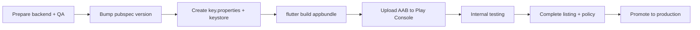

# 20 — App Release & Store Publishing

## Overview

**Build, sign, and publish** the Thinkmay CloudPC Flutter app to app stores.

This spec is based on the [Anything — Submit to Play Store](https://www.anything.com/docs/apps/mobile/publishing-android.md) workflow, then **mapped to the actual repo** (`thinkmay_app`): manual / CI build, no automatic Play Console upload step.

| Platform | Status in repo |
|----------|----------------|
| **Android (Google Play)** | CI release AAB (`.github/workflows/release.yml`) + local script `build_release.ps1` |
| **iOS (App Store)** | `ios/` project exists; no CI / TestFlight spec in repo yet |

**Technical source of truth:** `pubspec.yaml`, `android/app/build.gradle.kts`, `android/app/src/main/AndroidManifest.xml`, `.github/workflows/debug.yml`, `README.md`.

---

## Current status (repo)

| Item | Value / notes |
|------|---------------|
| Package name (Android) | `com.thinkmay.thinkmay_app` — **cannot change after publish** |
| Display name | `Thinkmay Cloud PC` (Android `strings.xml`, iOS `Info.plist`) |
| Current version | `1.2.1+2` (`pubspec.yaml`; `versionCode` / `versionName` from here) |
| Production backend | `Endpoint.baseUrl = https://saigon2.thinkmay.net` (hardcoded) |
| Release signing | `android/key.properties` + keystore (gitignored); `build.gradle.kts` reads when file exists |
| CI debug | `.github/workflows/debug.yml` — push `develop` → debug APK artifact |
| CI release | `.github/workflows/release.yml` — tag `v*` or manual → signed AAB artifact |
| Automatic Play upload | **Optional** — `workflow_dispatch` + `upload_play` + secret `PLAY_STORE_SERVICE_ACCOUNT_JSON` |
| Flavor `dev` | Mentioned in `CLAUDE.md` (`flutter run --flavor dev`) but **`productFlavors` not configured** in Gradle yet |

---

## Before release

### Backend & infrastructure

Same as Anything: if the release includes API / schema / RPC changes, **deploy backend first** before store submission.

| Component | Check |
|-----------|-------|
| PocketBase / worker | `/info`, session SSE, volumes working on `saigon2.thinkmay.net` |
| NextJS RPC | `https://thinkmay.net/api/global_rpc` — payment, subscription, gamification |
| Supabase | Auth + realtime queries (`saigon2.thinkmay.net:445`) |
| Deep link auth | `thinkmay://confirm-reset-password`, `thinkmay://confirm-verification` match email template |

### App & QA

- Run auth checklist: [auth/03-authentication-test-cases.md](./auth/03-authentication-test-cases.md) section **Pre-release QA checklist**.
- Smoke test main flow: login → dashboard → power on VM → remote stream → logout.
- Bump `version` in `pubspec.yaml` (`version: x.y.z+buildNumber`); Play Store **rejects** if `versionCode` duplicates an uploaded build.

### Store assets (prepare outside repo)

| Item | Notes |
|------|-------|
| Commercial app name | e.g. Thinkmay Cloud PC |
| Icon 512×512 | Play Console; currently uses `@mipmap/ic_launcher` |
| Feature graphic | 1024×500 (Play) |
| Screenshots | Phone + tablet (landscape important because of RemoteScreen) |
| Short / full description | VI + EN (app supports `vi`, `en`) |
| Privacy policy URL | Required for Play; app has `/terms` screen but needs **public URL** for form |
| Data safety form | Declare: account, network, usage analytics (Rybbit), etc. |
| Content rating | IARC questionnaire |
| Target audience | Age, distribution countries |

---

## Android — Google Play

Reference Anything workflow, **performed manually** in the Thinkmay repo.



### Step 1 — Create app listing (first time)

1. Go to [Google Play Console](https://play.google.com/console).
2. **Create app** → enter **Package name** exactly: `com.thinkmay.thinkmay_app`.
   - Package name **cannot change** after publish — must match `applicationId` in `android/app/build.gradle.kts`.
3. Fill in basic info (default language, app/game type, free/paid).

### Step 2 — Signing (local)

Create `android/key.properties` (gitignored) — template: `android/key.properties.example`:

```properties
storePassword=<password>
keyPassword=<password>
keyAlias=<alias>
storeFile=upload-keystore.jks
```

`storeFile` relative to `android/app/`. Or run `.\build_release.ps1` (script checks files before build).

`android/app/build.gradle.kts` already wires `signingConfigs.release` when file exists.

**Play App Signing:** Google recommends enabling Play App Signing — upload key can differ from app signing key held by Google.

### Step 3 — Build Android App Bundle (AAB)

From repo root:

```powershell
cd d:/thinkmay/mobile
.\build_release.ps1
# or manually:
flutter pub get
dart run build_runner build --delete-conflicting-outputs   # if @freezed / @injectable changed
flutter build appbundle --release
```

**Output:** `build/app/outputs/bundle/release/app-release.aab`

Optional version override:

```powershell
flutter build appbundle --release --build-name=1.2.2 --build-number=42
```

### Step 4 — Upload to Play Console

Anything uploads to **Internal testing** as draft via service account. Thinkmay currently **uploads manually**:

1. Play Console → app → **Testing** → **Internal testing** (or Closed/Open).
2. **Create new release** → upload `app-release.aab`.
3. Add release notes → **Review release** → **Start rollout to Internal testing**.

Google may take a few minutes to process the AAB before the build appears in the track.

### Step 5 — Complete Google Play requirements

Anything lists items the team must still do on Console (build/upload is the app part; policy is the store part):

| Requirement | Thinkmay status |
|-------------|-----------------|
| App details & short description | Needs drafting |
| Store listing (full description) | Needs drafting |
| Icon, feature graphic, screenshots | Needs assets; capture Remote landscape |
| Privacy policy URL | Needs public URL (outside in-app terms) |
| Data safety | Declare per SDK: PocketBase auth, Supabase, Dio, WebRTC, Rybbit |
| Content rating | Not done in repo |
| Target audience | Not done in repo |
| Testing track + testers | Internal testers (email list / Google Group) |
| Release notes | Per upload |

### Step 6 — Promote to Production

After internal/closed test is stable:

1. Complete **Pre-launch report** (if enabled).
2. Ensure no policy warnings remain.
3. **Promote release** from testing track → **Production** (or create production release with same AAB).
4. Choose % rollout (staged) or full.

---

## Android permissions & declarations (Data safety)

Current permissions (`AndroidManifest.xml`):

| Permission / query | App purpose |
|--------------------|-------------|
| `INTERNET` | API, WebRTC streaming |
| `ACCESS_NETWORK_STATE` | Network check / connectivity |
| `<queries>` http/https/tel/sms/mailto | Open links, dialer, share (plugin / intent) |

**Not declared in manifest (may be needed when enabling features):** camera, mic (WebRTC mic), location — check `flutter_webrtc` plugin and runtime permissions before submit.

Deep links (`thinkmay://`) — Digital Asset Links not needed unless using App Links `https://`.

---

## CI/CD

### Debug (develop)

`.github/workflows/debug.yml` — push `develop` → `flutter build apk --debug` → artifact.

### Release (Play)

`.github/workflows/release.yml`:

| Trigger | Output |
|---------|--------|
| Git tag `v1.2.2` | Signed AAB artifact; `versionName` from tag |
| Manual dispatch | AAB artifact; optional upload Play Internal draft |

**GitHub Secrets:** `ANDROID_KEYSTORE_BASE64`, `ANDROID_KEYSTORE_PASSWORD`, `ANDROID_KEY_PASSWORD`, `ANDROID_KEY_ALIAS`, `PLAY_STORE_SERVICE_ACCOUNT_JSON` (upload).

### Remaining gaps

| Item | Status |
|------|--------|
| Flavor dev/prod + `dart-define` for `baseUrl` | Not done |
| Privacy policy URL + Data safety (Play Console) | Manual outside repo |
| iOS / TestFlight spec | Not done |
| Pre-launch report + ProGuard/R8 | Not done |

---

## iOS — App Store (summary)

No equivalent workflow in repo yet. Minimum checklist when doing iOS:

| Step | Notes |
|------|-------|
| Apple Developer account | Team ID, certificates, provisioning |
| Bundle ID | Match `PRODUCT_BUNDLE_IDENTIFIER` in Xcode |
| `flutter build ipa` | Or archive via Xcode |
| TestFlight | Internal → external testers |
| App Store Connect listing | Screenshots, privacy nutrition labels, review notes (WebRTC background) |
| URL schemes | `thinkmay` deep link in `Info.plist` |

Anything has separate doc [Submit to App Store](https://www.anything.com/docs/apps/mobile/publishing-ios.md) — reference when writing detailed iOS spec.

---

## Troubleshooting

| Symptom | Common cause | Fix |
|---------|--------------|-----|
| **Package name already exists** | Conflicts with another Play app | Use correct `com.thinkmay.thinkmay_app` or create new listing; cannot change after publish |
| **Version code already used** | Forgot to bump build number | Bump number after `+` in `pubspec.yaml` or `--build-number` |
| **Upload signing error** | Missing / wrong `key.properties` | Check keystore path, alias, password; build locally first |
| **Build not showing on Console** | Google processing | Wait 5–15 minutes, refresh Internal testing |
| **Permission / Data safety reject** | Missing SDK declaration | Review Supabase, WebRTC, analytics; update form |
| **App crash on open from store** | Release build differs from debug | Test `flutter run --release` / install AAB via internal track |
| **Auth deep link does not open app** | Intent filter / email link wrong | Match scheme `thinkmay` + host with email template |

---

## Release checklist (abbreviated)

### Before build

- [ ] Production backend deployed
- [ ] New `pubspec.yaml` version + build number
- [ ] `flutter analyze` clean of blocking errors
- [ ] P0 QA auth + dashboard + remote
- [ ] Valid `key.properties` + keystore

### Build & upload

- [ ] `flutter build appbundle --release`
- [ ] Upload AAB → Internal testing
- [ ] Add release notes

### Before production

- [ ] Store listing + screenshots (include remote landscape)
- [ ] Privacy policy URL
- [ ] Data safety + content rating + target audience
- [ ] Internal testers confirm stability
- [ ] Promote / production rollout

---

## Gaps & follow-up research

| # | Item | Status |
|---|------|--------|
| 1 | CI workflow build release AAB | ✅ `release.yml` |
| 2 | Play upload internal track (service account) | ✅ Optional via workflow_dispatch |
| 3 | Local script `build_release.ps1` + `key.properties.example` | ✅ |
| 4 | Display name `Thinkmay Cloud PC` | ✅ |
| 5 | Privacy policy URL + Data safety mapping | 🔴 Play Console — manual |
| 6 | Flavor dev/prod + `dart-define` for `baseUrl` | 🔴 |
| 7 | iOS / TestFlight spec | 🔴 |
| 8 | Pre-launch report + ProGuard/R8 | 🔴 |

---

## Links

| Doc | URL / path |
|-----|------------|
| Anything — Submit to Play Store | https://www.anything.com/docs/apps/mobile/publishing-android.md |
| Anything — docs index | https://www.anything.com/docs/llms.txt |
| Flutter — Android deployment | https://docs.flutter.dev/deployment/android |
| Play Console | https://play.google.com/console |
| Local build | `README.md` (Release app bundle section) |
| Auth QA | [auth/03-authentication-test-cases.md](./auth/03-authentication-test-cases.md) |
| Backend | [18-backend-integration.md](./18-backend-integration.md) |

---

Updated: 2026-05-25 — implement release workflow, build script, store display name.
