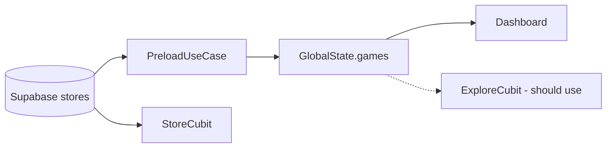

# 12 — Explore, Games & Store

## Overview

Game catalog: Explore tab, separate Store screen, search, game detail. **Real data source** exists in preload/Store; **Explore tab not using it yet**.

---

## API status

> [API-COVERAGE.md](../API-COVERAGE.md)

| Component | Status | Backend |
|-----------|--------|---------|
| **Explore tab** | 🔴 | Mock UI; `FetchStoreUseCase` injected **not called** |
| **Explore search** | 🔴 | Local filter on hardcoded list |
| **Store** `/store` | ✅ | Supabase `stores` + PB `buckets` |
| **Game detail** | 🔴 | No service |
| **Dashboard games** | ✅ | `GlobalState.games` ← `FetchStoreUseCase` (Supabase) in preload |

---

## Mobile — details

### Explore tab (`explore_cubit.dart`)

`init()` emits `ExploreViewModel` with `assets/images/*` — **entirely hardcoded**.

### Store (`store_cubit.dart`)

- `fetchStore(email)` → `StoreService` → Supabase `.from('stores').select(...)`
- `fetchBuckets()` → PocketBase collection `buckets`

`store_screen.dart` calls `fetchStore('')` on build (email from `getIt<User>()` in use case).

### Game detail (`game_detail_cubit.dart`)

Mock FC 26 — no API.

### Data model `Game`

Supabase returns: `name`, `code_name`, `path_full` (mapped from `header_image`), genres, …

---

## Website — comparison

| Mobile | Website |
|--------|---------|
| Explore mock | `/store` SSR + client catalog |
| Store ✅ | `StoreAllGames`, `AppDetail` |
| Dashboard games | `play` page carousel |

---

## Data flow (target)

---

## Links

- [13-banners](../banner/13-banners-marketing.md)
- [04-dashboard](../dashboard/04-dashboard-cloud-pc.md)
- [18-backend-integration](../18-backend-integration.md)
