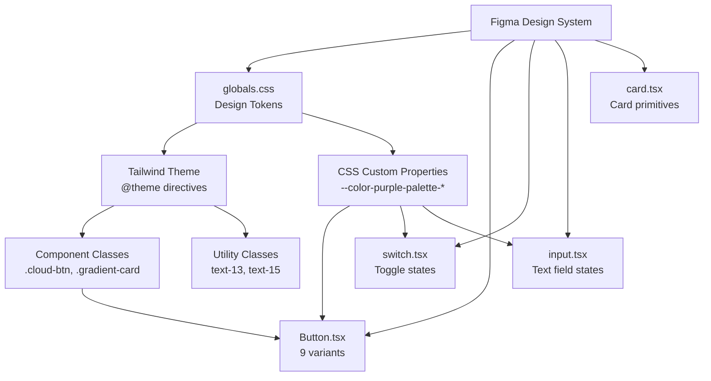

# Thinkmay UI/UX Design Philosophy

> A comprehensive design document mapping the Figma design system to the project's Tailwind CSS configuration.

---

## 1. Design Identity

Thinkmay is a **cloud PC gaming and productivity platform**. The UI embodies a **premium dark-mode-first** aesthetic built around a deep teal/green palette — evoking the feeling of a high-end gaming dashboard while maintaining the clarity and trust required for a SaaS product.

**Core principles:**
- **Dark immersion** — deep backgrounds keep focus on content (game art, desktops, streaming)
- **Teal brand accent** — a 10-shade teal palette (`purple-palette-1` → `purple-palette-10`) provides visual hierarchy
- **Gradient richness** — multi-layer gradients on buttons and cards create depth and premium feel
- **Minimalist chrome** — generous whitespace, subtle borders (`border-white/8`), reduced visual noise

---

## 2. Color System

### 2.1 Brand Palette (Teal / "Purple Palette")

The primary brand scale is a teal-green system, labelled `purple-palette` in the codebase. This maps directly to the Figma color palette (row 2 of swatches):

| Token | Hex | Usage |
|---|---|---|
| `purple-palette-1` | `#ccfbef` | Lightest tint, highlights, badges |
| `purple-palette-2` | `#99f6e0` | Light accent, gradient endpoints |
| `purple-palette-3` | `#5fe9d0` | Active states, progress bars |
| `purple-palette-4` | `#2ed3b7` | **Primary CTA gradient start**, key accent |
| `purple-palette-5` | `#15b79e` | Primary interactive, gradient midpoints |
| `purple-palette-6` | `#0e9384` | **`green-main`** — core brand color |
| `purple-palette-7` | `#107569` | Button hover states |
| `purple-palette-8` | `#125d56` | Card backgrounds (dark) |
| `purple-palette-9` | `#134e48` | **Primary CTA gradient end**, deep accent |
| `purple-palette-10` | `#0a2926` | Deepest background / near-black |

### 2.2 Accent Colors

Four semantic accent colors for status and UI feedback (Figma row 1 — red, cyan, yellow, green):

| Token | Value | Purpose |
|---|---|---|
| `red-accent` | `rgba(221, 45, 74, 1)` | Destructive, danger, errors |
| `blue-accent` | `rgba(12, 188, 212, 1)` | Info, links, secondary highlight |
| `yellow-accent` | `rgba(241, 202, 54, 1)` | Warnings, "HOT" badges |
| `green-accent` | `rgba(51, 190, 63, 1)` | Success, online status |

### 2.3 Neutral Scales

Two neutral scales provide foreground and background tones on the dark theme:

- **`neutral-white-*`** (4 → 100) — white-based scale for text/borders on dark backgrounds
- **`neutral-black-*`** (2 → 100) — dark scale with subtle purple/lavender undertone
- **`white-palette-*`** (5 → 100) — gray-green scale for muted UI elements

### 2.4 Gradient System

Gradients are central to the premium feel. Defined in `globals.css`:

| Gradient | CSS Variable | Application |
|---|---|---|
| **Green gradient** | `green-gradient` | Hero sections, headers |
| **Dark green bg** | `dark-green-bg` | `linear-gradient(180deg, #0f463f → #071f1c)` — page backgrounds |
| **Cloud button** | `.cloud-btn` class | Multi-layer gradient with `soft-light` blend mode + glow shadow |
| **Navbar** | `.navbar-color` | Ultra-subtle white overlay on teal-tinted transparency |
| **Cards** | `.gradient-card` | Subtle white/teal overlay for card surfaces |
| **Cards (blur)** | `.gradient-card-blur` | Dark overlay + `backdrop-filter: blur(40px)` |

---

## 3. Typography

### 3.1 Font Family

**Inter** (Google Fonts) — configured in [layout.tsx](file:///c:/tm/website/app/%5Blocale%5D/layout.tsx#L17-L20) with `display: 'swap'` for performance.

### 3.2 Type Scale (from Figma typography sheet)

The Figma defines a strict heading hierarchy with size, line-height, and weight variants:

| Level | Size | Line Height | Weights |
|---|---|---|---|
| **H1** | 40px | 45px | Light, Regular, Medium, **Bold** |
| **H2** | 32px | 40px | Light, Regular, Medium, **Bold** |
| **H3** | 24px | 30px | Light, Regular, Medium, **Bold** |
| **H4** | 20px | 30px | Light, Regular, Medium, **Bold** |
| **H5** | 16px | 22px | Light, Regular, Medium, **Bold** |
| **H6** | 14px | 18px | Light, Regular, Medium, **Bold** |
| **Title** | 11–13px | varies | Regular, Bold |

Custom text utilities extend Tailwind:
- `text-13` → `0.8125rem` (13px)
- `text-15` → `0.9375rem` (15px)
- `--text-xs` → 13px (theme override)

---

## 4. Component Design Patterns

### 4.1 Buttons (from Figma "Buttons" sheet)

Defined in [Button.tsx](file:///c:/tm/website/components/Button.tsx) with **9 variant × 3 size** combinations:

**Variants:**

| Variant | Visual Style |
|---|---|
| `primary` | `.cloud-btn` — multi-layer teal gradient + glow (`box-shadow: 0 0 16px`) |
| `danger` | Red gradient (`#FF6B7C → #B0132F`) + red glow shadow |
| `secondary` | Transparent + `border-white/20`, hover brightens border |
| `whiteBlur` | Frosted glass — `bg-white/15 + backdrop-blur-md` |
| `ghost` | Fully transparent, border appears on hover |
| `squarePrimary` | Teal gradient, square aspect, compact |
| `squareAccent` | Orange gradient (`#FFA876 → #FF5B2A`) |
| `squareDanger` | Red gradient, square aspect |

**Sizes:** `lg` (52px min-h, `rounded-xl`), `md` (44px min-h, `rounded-full`), `square` (44×44, `rounded-2xl`)

**Disabled state:** `bg-[#1C2A29]`, `text-[#6F7B78]`, no shadow, `cursor-not-allowed`

### 4.2 Toggle / Switch (from Figma "Toggle" sheet)

Implemented via [switch.tsx](file:///c:/tm/website/components/ui/switch.tsx) using Radix UI `@radix-ui/react-switch`:

| State | Track | Thumb |
|---|---|---|
| **On** (checked) | `bg-primary` (teal) | White, translated right |
| **Off** (unchecked) | `bg-white/20` | White, left position |

Supports both **Light** and **Dark** variants as shown in the Figma toggle sheet. Dimensions: `h-5 w-9` track, `h-4 w-4` thumb.

### 4.3 Text Fields / Inputs (from Figma "Text Fields" sheet)

The Figma defines 5 input states on the dark theme:

| State | Visual Treatment |
|---|---|
| **Empty** | Dark fill (`~#163236`), muted label, subtle border |
| **Active** | Teal border highlight, floating label above, white input text |
| **Filled** | Similar to Active but without focus ring |
| **Error** | Red-accent label, red tint on border |
| **Disabled** | Reduced opacity, muted label + text, no interaction |

**Search inputs** feature: teal-filled background with search icon, rounded-full shape, and clear (×) button on filled state.

Implemented in [input.tsx](file:///c:/tm/website/components/ui/input.tsx) and [input-group.tsx](file:///c:/tm/website/components/ui/input-group.tsx).

### 4.4 Cards

[card.tsx](file:///c:/tm/website/components/ui/card.tsx) provides base primitives (`Card`, `CardHeader`, `CardContent`, `CardFooter`). Visually enhanced via CSS classes:

- `.gradient-card` — subtle teal-tinted transparency
- `.gradient-card-blur` — blur-backed glassmorphism
- `.border-primary` — `border: 1px solid #ffffff08` (barely-visible border for depth)

### 4.5 Navigation

- **Desktop:** full sidebar with gradient background (`dark-green-bg`)
- **Mobile:** bottom navbar with `.navbar-color` / `.navbar-active-color` states
- Active items get brighter white overlay (`rgba(255,255,255,0.23)`)

---

## 5. Theming & Dark Mode

The app is **dark-mode-first** with `darkMode: 'class'` in Tailwind config.

- `:root` defines light theme tokens (oklch color space)
- `.dark` overrides with dark semantics
- HeroUI plugin provides additional component-level theming via `@heroui/theme`
- Custom variant: `@custom-variant dark (&:is(.dark *))` for Tailwind v4 compatibility

### Semantic Token System

All colors flow through CSS custom properties for consistency:

```
--background / --foreground
--card / --card-foreground
--primary / --primary-foreground
--muted / --muted-foreground
--destructive
--border / --input / --ring
```

### Border Radius Scale

Derived from a base `--radius: 0.625rem` (10px):

| Token | Value |
|---|---|
| `radius-sm` | 6px |
| `radius-md` | 8px |
| `radius-lg` | 10px (base) |
| `radius-xl` | 14px |
| `radius-2xl` | 18px |
| `radius-3xl` | 22px |
| `radius-4xl` | 26px |

---

## 6. Motion & Animation

### 6.1 Transitions
- All buttons: `transition duration-200` for smooth state changes
- Slide-in/out panels: 0.2–0.4s ease with opacity + translateX

### 6.2 Defined Keyframes

| Animation | Duration | Purpose |
|---|---|---|
| `accordion-down/up` | 0.2s ease-out | Expandable sections (Radix Accordion) |
| `slideIn` / `slideOut` | 0.4s ease | Left-direction panel transitions |
| `slideInRight` / `slideOutRight` | 0.2s ease | Right-side panels |
| Loader spinner | 2s linear (infinite) | Loading indicator with radial-gradient trick |

### 6.3 Framer Motion
`framer-motion` (v12) is used for component-level animations via the [Stagger.tsx](file:///c:/tm/website/components/Stagger.tsx) utility and throughout the app for reveal/mount animations.

---

## 7. Tech Stack Summary

| Layer | Technology |
|---|---|
| Framework | **Next.js 16** (App Router, Turbopack) |
| Styling | **Tailwind CSS v4** + custom theme |
| Component Library | **HeroUI** (via `@heroui/react`) + **Radix UI** primitives |
| Animation | **Framer Motion** v12 |
| State | **Redux Toolkit** + React Redux |
| i18n | **next-intl** (vi, en, id locales) |
| Carousel | **Embla Carousel** |
| Payments | **Stripe** |
| Backend | **Supabase** + **PocketBase** |

---

## 8. Design-to-Code Mapping Summary



---

## 9. Key Design Decisions

1. **Naming: "purple-palette" for teal colors** — this is a legacy naming convention in the codebase; the actual colors are teal/green, matching the Figma swatches.

2. **Multi-layer gradients on CTAs** — the `.cloud-btn` class uses 3 background layers with `soft-light` blending for a unique luminous effect that cannot be achieved with a single gradient.

3. **HeroUI + Radix hybrid** — HeroUI provides high-level themed components while Radix gives unstyled primitives for custom controls (switch, accordion, dialog, etc.).

4. **oklch color space** — semantic tokens (`:root` / `.dark`) use oklch for perceptually uniform color transitions; brand palette uses hex for precision matching with Figma.

5. **Scrollbar styling** — custom Windows 11-style scrollbar with SVG arrow buttons, ensuring visual consistency with the cloud desktop streaming experience.
