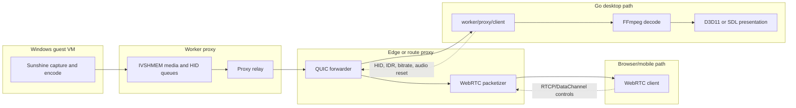

# Go Desktop Client Architecture Deep Dive

This document describes the native Go remote desktop client implemented under `worker/proxy/client` and launched by `worker/proxy/cmd/client`. It is a desktop application for Thinkmay CloudPC that consumes the proxy's internal QUIC media/control relay directly, rather than joining the browser/mobile WebRTC signaling path.

The existing production architecture documentation focuses on browser and Flutter clients using WebRTC. This Go desktop client is architecturally different: it is closer to a native edge relay consumer. It opens QUIC streams to the Thinkmay proxy, receives the same encoded media samples that normally feed the WebRTC packetizer, decodes them locally with FFmpeg/astiav, presents frames through SDL or D3D11, and sends HID/audio/control data back through QUIC datagrams or sample streams.

## Where it fits in Thinkmay CloudPC

Thinkmay CloudPC runs Windows VMs on worker nodes. The guest capture stack writes encoded frames and control queues through IVSHMEM shared memory; the Go proxy reads those queues and routes media through QUIC internally before the public edge normally packetizes them into WebRTC RTP for browser and mobile clients. The platform flow is documented in `docs/product/architecture/technical_doc.md`, especially the IVSHMEM streaming path and cross-node QUIC routing.

The desktop client inserts itself at the QUIC relay layer:

The important consequence is that the Go desktop app does not use Pion WebRTC, SDP, ICE, TURN, RTP, or browser media APIs. It trusts the existing proxy routing/auth layer and receives whole encoded samples over QUIC streams.

## Entrypoint and process model

The executable entrypoint is `worker/proxy/cmd/client/main.go`. It locks the main goroutine to the OS thread before SDL is initialized, parses command-line configuration, constructs `app.App`, and runs it (`worker/proxy/cmd/client/main.go:12`, `worker/proxy/cmd/client/main.go:17`, `worker/proxy/cmd/client/main.go:23`).

`app.App` is the composition root. It owns:

- the mandatory video QUIC client;
- optional audio, microphone, and HID/data QUIC clients;
- the FFmpeg decoder;
- the SDL window;
- the selected presenter;
- optional SDL audio playback and microphone capture;
- a terminal performance tracker;
- controller/gamepad bookkeeping (`worker/proxy/client/app/app.go:27`).

The desktop application is mostly single-window and event-loop driven. Background goroutines read media/control streams and decode audio/video, while the SDL event loop stays on the main thread for windowing, input, and presentation (`worker/proxy/client/app/app.go:233`).

## Configuration and launch contract

Runtime configuration is defined in `client/config.Config` (`worker/proxy/client/config/config.go:25`). The client can be configured with explicit flags or a remote URL:

| Setting | Purpose |
| --- | --- |
| `-url` | Thinkmay remote URL containing target and listener query params. |
| `-addr` | QUIC address override; defaults to remote URL host with port `443`. |
| `-vmid` | Target VM ID. |
| `-token` | Video listener token. |
| `-audio-token` | Optional audio listener token. |
| `-mic-token` | Optional microphone listener token. |
| `-data-token` | Optional HID/data listener token. |
| `-codec` | `h264`, `h265`, or `av1`; defaults to `h264`. |
| `-hwaccel` | Hardware decoder selection; defaults to `auto`. |
| `-present` | Presenter selection; defaults to `d3d11` on Windows and `sdl` on Linux/macOS. |
| `-width`, `-height` | Initial SDL window size. |
| `-fullscreen` | Start in fullscreen desktop mode. |
| `-vsync` | Enable presenter vsync. |
| `-fps`, `-bitrate` | Initial remote encoder controls sent after connect. |
| `-stats` | Enable terminal performance dashboard. |

`applyRemoteURL` extracts `vmid`, `video`, `audio`, `mic`, `data`, `codec`, `vsync`, and `stats` from the URL query string (`worker/proxy/client/config/config.go:69`). This URL shape mirrors the listener-token concept used by web/mobile clients, but the desktop client maps those listener tokens to QUIC `FinalTarget` handshakes rather than WebRTC signaling sessions.

## QUIC transport architecture

The client abstracts transport behind `stream.Client` (`worker/proxy/client/stream/stream.go:5`). The interface exposes inbound sample delivery, close/done signals, outbound samples, and control helpers for IDR, video reset, and audio reset.

The concrete implementation is `quicClient` (`worker/proxy/client/stream/quic_client.go:19`). Each media/control lane creates a `forwarder.FinalTarget` with `{VmID, ListenerID}` and dials the proxy address (`worker/proxy/client/app/app.go:51`). The underlying `forwarder/quic.QUICDialer` performs the actual wire protocol:

1. Dial QUIC with datagrams enabled and ALPN `thinkmay-quic` (`worker/proxy/forwarder/quic/dialer.go:84`).
2. Send a JSON-encoded `FinalTarget` on a unidirectional auth stream (`worker/proxy/forwarder/quic/dialer.go:113`).
3. Use bidirectional QUIC streams for media/sample frames (`worker/proxy/forwarder/quic/dialer.go:125`, `worker/proxy/forwarder/quic/dialer.go:164`).
4. Frame stream payloads as `[4-byte big-endian length][payload]` (`worker/proxy/forwarder/quic/util.go:10`).
5. Use QUIC datagrams for control messages and JSON status envelopes (`worker/proxy/forwarder/quic/dialer.go:77`, `worker/proxy/forwarder/quic/dialer.go:188`).

`quicClient.Start` starts two goroutines: one reads complete sample streams into the client channel, and the other reads datagram control/status messages (`worker/proxy/client/stream/quic_client.go:56`). Status envelopes are parsed but currently discarded (`worker/proxy/client/stream/quic_client.go:126`). That means the desktop client does not yet surface backend health statuses such as `video_stalled`, `backend_disconnected`, or `control_path_blocked`, even though the shared `forwarder.StatusMessage` model supports them (`worker/proxy/forwarder/forwarder.go:33`).

### Logical channels

The desktop client opens up to four independent QUIC clients:

| Channel | Direction | Required | Data carried |
| --- | --- | --- | --- |
| Video | proxy -> client, client -> proxy controls | Yes | Encoded H.264/H.265/AV1 samples plus IDR/FPS/bitrate controls. |
| Audio | proxy -> client, client -> proxy reset controls | No | Opus audio samples. |
| Microphone | client -> proxy | No | Opus microphone packets with session/timestamp headers. |
| HID/data | client -> proxy controls | No | Mouse, keyboard, wheel, and gamepad HID packets. |

The optional clients are disabled independently if their token is absent or if initialization fails (`worker/proxy/client/app/app.go:57`, `worker/proxy/client/app/app.go:66`, `worker/proxy/client/app/app.go:75`).

## Application startup sequence

`NewApp` wires components in dependency order:

1. Create the video QUIC client using the video listener token (`worker/proxy/client/app/app.go:51`).
2. Optionally create audio, microphone, and HID/data QUIC clients (`worker/proxy/client/app/app.go:57`, `worker/proxy/client/app/app.go:66`, `worker/proxy/client/app/app.go:75`).
3. Create the hardware decoder with codec, hardware acceleration, and presenter constraints (`worker/proxy/client/app/app.go:84`).
4. Initialize SDL video, events, game controller, and audio subsystems (`worker/proxy/client/app/app.go:100`).
5. Create the SDL window and set fullscreen flags if requested (`worker/proxy/client/app/app.go:118`).
6. Create and initialize the selected presenter, passing the decoder hardware device context when available (`worker/proxy/client/app/app.go:153`, `worker/proxy/client/app/app.go:158`).
7. Create the performance tracker (`worker/proxy/client/app/app.go:174`).
8. Optionally create SDL/Opus audio playback and SDL/FFmpeg microphone capture (`worker/proxy/client/app/app.go:176`, `worker/proxy/client/app/app.go:186`).

`Run` then starts the active streams, immediately requests an IDR frame, starts audio/mic/decode loops, synchronizes cursor/fullscreen state, sends initial pointer/FPS/bitrate controls, and enters the SDL event loop (`worker/proxy/client/app/app.go:233`).

## Video sample format and decode pipeline

Inbound video and audio packets are parsed by `client/sample.Parse`. The wire envelope is a 17-byte little-endian header followed by codec payload (`worker/proxy/client/sample/sample.go:8`):

| Bytes | Field | Meaning |
| --- | --- | --- |
| `0..7` | `Header0` | Upstream metadata/reserved field. |
| `8..15` | `Timestamp` | Media timestamp used as FFmpeg PTS/DTS. |
| `16` | `Flag` | Per-sample flag byte. |
| `17..` | `Payload` | Encoded video NAL units or Opus audio payload. |

The decode loop consumes raw samples from the video QUIC client, parses them, decodes them, records metrics, and pushes decoded frames into a bounded presentation queue (`worker/proxy/client/app/app.go:455`). The presentation queue intentionally keeps only the newest frame; if the renderer falls behind, older decoded frames are freed instead of accumulating latency (`worker/proxy/client/app/app.go:561`).

### Bitstream normalization

Before sending packets to FFmpeg, the decoder normalizes H.264/H.265 bitstreams (`worker/proxy/client/decoder/bitstream.go:20`). It supports:

- 4-byte length-prefixed NAL units;
- 2-byte length-prefixed NAL units;
- Annex B start-code-delimited NAL units;
- parameter-set caching;
- prepending cached parameter sets before keyframes when needed (`worker/proxy/client/decoder/bitstream.go:44`).

This matters because upstream samples may not always carry SPS/PPS/VPS with every keyframe, and hardware decoders are sensitive to missing parameter sets after stream reset or packetization boundary changes.

### Hardware decoder selection

Decoder selection is centralized in `decoder.Select` (`worker/proxy/client/decoder/decoder.go:66`). It maps the configured codec to an FFmpeg codec ID, enumerates hardware configs exposed by FFmpeg, filters them through presenter compatibility, and chooses from this preference order:

1. D3D11VA
2. DXVA2
3. CUDA
4. QSV
5. VideoToolbox
6. VAAPI
7. VDPAU
8. Vulkan

Presenter compatibility is explicit: the D3D11 presenter accepts D3D11VA frames and CUDA frames that can be mapped to D3D11, while the SDL presenter is allowed to render CPU-transferred frames (`worker/proxy/client/decoder/decoder.go:146`). Software decode is intentionally rejected for the normal zero-copy path; `software-debug` is the diagnostic escape hatch (`worker/proxy/client/decoder/decoder.go:95`).

### Windows decode path

On Windows with cgo, `decoder/astiav_d3d11va_windows.go` is the optimized path. It can create D3D11VA hardware contexts, derive CUDA from D3D11 when CUDA is selected, decode into hardware frames, and map CUDA frames back to D3D11 when possible (`worker/proxy/client/decoder/astiav_d3d11va_windows.go:31`, `worker/proxy/client/decoder/astiav_d3d11va_windows.go:45`, `worker/proxy/client/decoder/astiav_d3d11va_windows.go:212`).

The decoder tracks how many frames stayed D3D11-native, how many CUDA frames mapped to D3D11, and how many fell back to CPU transfer (`worker/proxy/client/decoder/astiav_d3d11va_windows.go:147`). These counters feed the terminal zero-copy dashboard.

### Unix/macOS decode path

On non-Windows cgo builds, `decoder/astiav_unix.go` initializes the selected FFmpeg hardware device and decodes with the same normalized packet flow (`worker/proxy/client/decoder/astiav_unix.go:26`). Hardware frames are transferred back to software frames before presentation (`worker/proxy/client/decoder/astiav_unix.go:205`), so this path is hardware-accelerated decode but not zero-copy presentation.

## Presentation layer

Presentation is abstracted behind `presenter.Presenter` (`worker/proxy/client/presenter/presenter.go:21`). Implementations register themselves by name and are selected through the `-present` config flag (`worker/proxy/client/presenter/presenter.go:30`).

### SDL presenter

The SDL presenter is the cross-platform copy-based renderer (`worker/proxy/client/presenter/sdl.go:14`). It creates an accelerated SDL renderer, optionally with vsync (`worker/proxy/client/presenter/sdl.go:26`). It supports NV12 and YUV420P frames by copying FFmpeg frame data into SDL streaming textures and rendering them to the window (`worker/proxy/client/presenter/sdl.go:73`). `ZeroCopy` returns false (`worker/proxy/client/presenter/sdl.go:148`).

### D3D11 presenter

The D3D11 presenter is the Windows zero-copy renderer (`worker/proxy/client/presenter/d3d11_windows.go:1`). It uses the SDL window's native HWND, creates or reuses a D3D11 device, creates a DXGI swap chain, configures D3D11 video processing, and presents decoded frames with `VideoProcessorBlt` and swap-chain present (`worker/proxy/client/presenter/d3d11_windows.go:114`, `worker/proxy/client/presenter/d3d11_windows.go:283`).

If the decoder passed a D3D11VA hardware device context, the presenter reuses that device so decoded hardware textures can be presented without a CPU readback (`worker/proxy/client/presenter/d3d11_windows.go:135`). It also supports CPU NV12 frames by uploading them into a D3D11 texture as a fallback (`worker/proxy/client/presenter/d3d11_windows.go:293`). Runtime stats expose D3D11 frames, NV12 uploads, processor recreations, and input-view cache activity (`worker/proxy/client/presenter/d3d11_windows.go:369`).

## Input and HID pipeline

The HID client is optional and exists only when a data listener token is provided. SDL input events are translated to the Thinkmay HID binary protocol by `hid.TranslateEvent` (`worker/proxy/client/hid/hid.go:49`). Each HID message is a 16-byte little-endian packet of four `uint32` values: event type, first argument, second argument, and third argument (`worker/proxy/client/hid/hid.go:167`).

Supported outbound event groups include:

| Input | Encoding behavior |
| --- | --- |
| Mouse motion | Absolute coordinates scaled to `uint32` range, or relative deltas offset by `16384` when SDL relative mouse mode is enabled. |
| Mouse buttons | SDL buttons mapped to Thinkmay button indices: left, middle, right, X1, X2. |
| Mouse wheel | X/Y wheel deltas offset by `2048`. |
| Keyboard | SDL scancodes mapped to Windows virtual-key/scancode values, then sent as key-up/key-down scancode events. |
| Gamepad connect/disconnect | SDL controller device events mapped to per-session gamepad IDs. |
| Gamepad axes/triggers/buttons | SDL controller axes normalized to the HTML5/gamepad-like numeric range used by the existing HID protocol. |

The app handles ESC specially before HID translation. ESC toggles fullscreen after guard intervals, updates cursor state, and sends a pointer-mode control to the video channel (`worker/proxy/client/app/app.go:289`). On macOS, fullscreen also enables SDL relative mouse mode; fullscreen hides the local cursor on all platforms (`worker/proxy/client/app/app.go:215`).

Key mapping is explicit in `client/hid/keycode.go`, which maps SDL scancodes to Windows virtual key values for alphanumeric keys, punctuation, function keys, navigation keys, and keypad keys (`worker/proxy/client/hid/keycode.go:1`).

## Audio playback

Audio playback is optional and uses a separate QUIC listener token. `audio.NewPlayer` creates a Pion Opus decoder and opens an SDL playback device at 48 kHz stereo S16 (`worker/proxy/client/audio/player.go:30`).

The audio loop reads sample envelopes from the audio QUIC channel, decodes Opus into `int16` PCM, converts samples to little-endian bytes, and queues them into SDL (`worker/proxy/client/audio/player.go:86`). If the SDL queue exceeds roughly 200 ms, it is cleared to favor low latency over perfect continuity (`worker/proxy/client/audio/player.go:19`, `worker/proxy/client/audio/player.go:86`). Decode or queue errors trigger a rate-limited audio reset control (`worker/proxy/client/app/app.go:501`).

## Microphone capture

Microphone support is optional and uses a client-to-proxy sample stream. `audio.NewMic` opens an SDL capture device at 48 kHz stereo, creates an FFmpeg Opus encoder, and configures S16-to-FLTP resampling (`worker/proxy/client/audio/mic.go:23`). The capture frame size is 480 samples, matching a 10 ms Opus frame at 48 kHz (`worker/proxy/client/audio/mic.go:11`).

The mic loop generates a UUID session ID, dequeues captured SDL audio, encodes Opus packets, and wraps each payload with a 32-byte header before sending it via `SendSample` (`worker/proxy/client/app/app.go:520`):

| Bytes | Field |
| --- | --- |
| `0..15` | Mic session UUID. |
| `16..23` | Local capture timestamp in Unix nanoseconds. |
| `24..27` | RTP-style timestamp. |
| `28..29` | Sequence number. |
| `30..31` | Reserved/padding. |
| `32..` | Opus payload. |

## Control messages and recovery behavior

The desktop client sends binary control datagrams through the QUIC dialer. Helpers in `stream.Client` wrap common IVSHMEM control messages: IDR request, video reset, and audio reset (`worker/proxy/client/stream/quic_client.go:65`). During startup the client sends:

- IDR request, rate-limited to avoid storms;
- pointer/fullscreen state;
- target FPS;
- target bitrate (`worker/proxy/client/app/app.go:236`, `worker/proxy/client/app/app.go:270`).

During playback:

- presentation errors request a fresh IDR frame (`worker/proxy/client/app/app.go:385`);
- audio decode/playback errors request an audio reset (`worker/proxy/client/app/app.go:512`);
- QUIC stream write failures inside the shared dialer also request IDR (`worker/proxy/forwarder/quic/dialer.go:155`).

The app currently does not implement automatic reconnection, route switching, or user-facing backend health reporting. Stream closure ends the relevant loop, and the main video stream closure eventually stops decode/presentation progress.

## Performance instrumentation

`perf.Tracker` collects a one-second rolling dashboard when `-stats` is enabled (`worker/proxy/client/perf/perf.go:84`). It records:

- presented FPS;
- frame interval and jitter;
- decode duration;
- present duration;
- packet count, bytes, and estimated bandwidth;
- last packet size and whether an IDR frame was seen;
- zero-copy counters from decoder and presenter (`worker/proxy/client/perf/perf.go:37`).

The app updates decode metrics in the decode loop and present/zero-copy metrics after each successful frame presentation (`worker/proxy/client/app/app.go:489`, `worker/proxy/client/app/app.go:391`).

## Source map

| Area | Key files |
| --- | --- |
| Entrypoint | `worker/proxy/cmd/client/main.go` |
| App orchestration | `worker/proxy/client/app/app.go` |
| CLI/URL config | `worker/proxy/client/config/config.go` |
| QUIC client wrapper | `worker/proxy/client/stream/stream.go`, `worker/proxy/client/stream/quic_client.go` |
| Shared QUIC wire protocol | `worker/proxy/forwarder/quic/dialer.go`, `worker/proxy/forwarder/quic/util.go` |
| Sample envelope | `worker/proxy/client/sample/sample.go` |
| Decode selection and frame model | `worker/proxy/client/decoder/decoder.go` |
| Bitstream normalization | `worker/proxy/client/decoder/bitstream.go` |
| Platform decoders | `worker/proxy/client/decoder/astiav_d3d11va_windows.go`, `worker/proxy/client/decoder/astiav_unix.go`, `worker/proxy/client/decoder/cuda_windows.go` |
| Presentation | `worker/proxy/client/presenter/presenter.go`, `worker/proxy/client/presenter/sdl.go`, `worker/proxy/client/presenter/d3d11_windows.go` |
| HID/input | `worker/proxy/client/hid/hid.go`, `worker/proxy/client/hid/keycode.go` |
| Audio playback/capture | `worker/proxy/client/audio/player.go`, `worker/proxy/client/audio/mic.go` |
| Metrics | `worker/proxy/client/perf/perf.go` |
| Tests | `worker/proxy/client/config/config_test.go`, `worker/proxy/client/decoder/bitstream_test.go` |

## Implementation constraints and caveats

- **Native dependencies:** the useful builds require cgo, SDL2, FFmpeg/astiav, Opus, and platform graphics APIs. Stub files exist for unsupported builds, but they are not functional desktop clients.
- **Windows is the primary zero-copy target:** D3D11VA/D3D11 has the deepest integration. Linux/macOS can use hardware decode but currently transfer frames to CPU memory for SDL presentation.
- **The transport bypasses WebRTC features:** there is no ICE/TURN/NACK/FEC/GCC client-side behavior here. Congestion adaptation depends on explicit bitrate controls and proxy/backend behavior, not browser WebRTC feedback.
- **Health statuses are not surfaced:** QUIC JSON status envelopes are parsed and discarded in the client transport wrapper.
- **Frame dropping is deliberate:** the presentation queue keeps the newest decoded frame to minimize latency; this sacrifices visual continuity under load.
- **Limited automated tests:** tests currently cover config parsing and bitstream normalization. App orchestration, QUIC transport behavior, HID translation, audio, mic, and presenters rely on manual/runtime validation.

## Practical mental model

Think of the Go desktop client as a native QUIC terminal for Thinkmay's internal streaming fabric:

1. It authenticates to a specific VM listener by sending `{vmid, listenerID}` over QUIC.
2. It receives complete encoded samples instead of RTP packets.
3. It normalizes and decodes those samples with FFmpeg.
4. It presents frames through SDL or zero-copy D3D11.
5. It sends HID, microphone, and encoder controls back through the same proxy routing layer.

This makes the client much closer to the proxy's media internals than the browser/mobile clients. The benefit is native decode/presentation control and potential Windows zero-copy latency improvements; the cost is that reliability features normally provided by WebRTC and the website's health UI must be reimplemented explicitly if this client becomes a production-supported access path.
