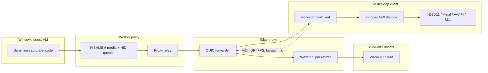
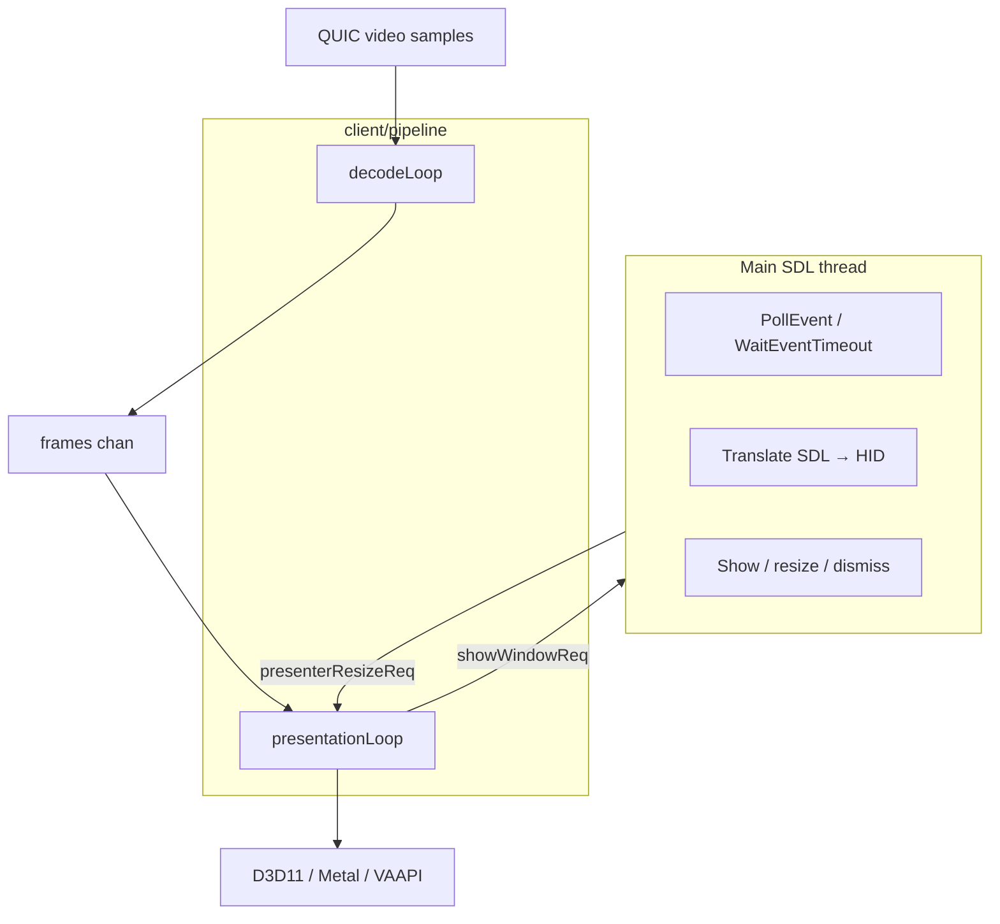
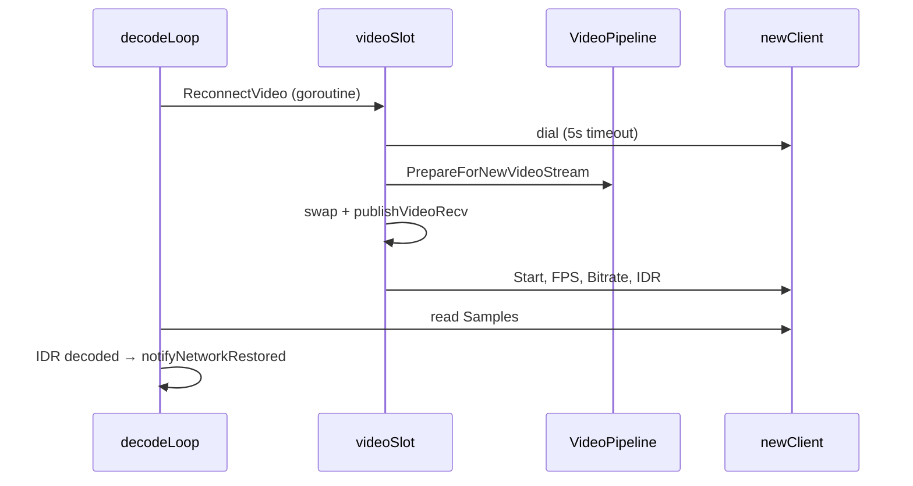

# Desktop client architecture

The native Go remote desktop client lives under [`worker/proxy/client`](../worker/proxy/client) and is built from [`worker/proxy/cmd/client`](../worker/proxy/cmd/client). It connects to Thinkmay CloudPC over **QUIC** (not WebRTC), decodes H.264/H.265/AV1 locally with FFmpeg/astiav, presents through platform GPU paths, and sends HID/audio/control traffic back to the proxy.

Browser and Flutter clients use WebRTC signaling, ICE, and RTP. The desktop client is a **QUIC relay consumer**: it dials the same proxy forwarder, authenticates with `{vmid, listenerID}`, and receives whole encoded samples on bidirectional streams.

## Platform context



See also [`docs/product/architecture/technical_doc.md`](product/architecture/technical_doc.md) for the full CloudPC stack.

## Package layout

| Package | Role |
|---------|------|
| [`cmd/client`](../worker/proxy/cmd/client) | Entrypoint: config parse, connect UI, `app.NewApp`, SDL main loop |
| [`client/app`](../worker/proxy/client/app) | Composition root, SDL event loop, reconnect, window/cursor/HID wiring |
| [`client/pipeline`](../worker/proxy/client/pipeline) | Decode + present orchestration (`pipeline.Host` interface) |
| [`client/decoder`](../worker/proxy/client/decoder) | FFmpeg/astiav HW decode, bitstream normalization, runtime fallback |
| [`client/presenter`](../worker/proxy/client/presenter) | GPU presentation backends (D3D11, Metal, VAAPI-EGL, SDL, software-debug) |
| [`client/stream`](../worker/proxy/client/stream) | QUIC `Client` abstraction over `forwarder/quic` |
| [`client/sample`](../worker/proxy/client/sample) | 17-byte sample envelope parser |
| [`client/hid`](../worker/proxy/client/hid) | SDL → Thinkmay HID binary protocol |
| [`client/audio`](../worker/proxy/client/audio) | Opus playback (SDL) and mic capture (FFmpeg encoder) |
| [`client/connectui`](../worker/proxy/client/connectui) | Local HTTP progress page + browser open during connect |
| [`client/config`](../worker/proxy/client/config) | CLI flags and `thinkmay://` URL parsing |
| [`client/perf`](../worker/proxy/client/perf) | Metrics tracker + optional HTTP stats dashboard |
| [`client/update`](../worker/proxy/client/update) | Cross-platform auto-update (Windows/macOS/Linux) via the PocketBase binaries collection |
| [`client/usb`](../worker/proxy/client/usb) | Optional USB device forwarding over HID data channel |
| [`client/bootlog`](../worker/proxy/client/bootlog) | Structured startup step logging |

Detailed video pipeline behavior: [`worker/proxy/client/docs/pipeline.md`](../worker/proxy/client/docs/pipeline.md).

## Process and thread model

`cmd/client/main.go` calls `runtime.LockOSThread()` before SDL init so the **main goroutine owns the SDL window and input loop**.

| Thread | Priority | Responsibility |
|--------|----------|----------------|
| **Main (SDL)** | Normal | Window events, HID capture, show/dismiss window, resize requests, clipboard |
| **Decode** | Time-critical | QUIC samples → parse → FFmpeg decode → frame channel |
| **Presentation** | Highest | Frame pacer → `WaitToRender` → GPU present |
| **Cursor** | Normal | Fullscreen composited cursor state (position polled at display Hz) |
| **Per QUIC client** | Normal | Sample reader + control/status reader |
| **Audio / mic** | Normal | Opus decode/encode loops when tokens provided |
| **HID writer** | Normal | Batches pending HID payloads at video FPS |
| **Gamepad poll** | Normal | Periodic controller state sync |

Cross-thread coordination uses buffered channels (`showWindowReq`, `presenterResizeReq`, `dismissWindowReq`) plus SDL **user events** to wake the main thread without blocking decode/present loops.



The app implements `pipeline.Host` in [`client/app/pipeline_host.go`](../worker/proxy/client/app/pipeline_host.go) so the pipeline package stays free of SDL imports.

## Startup lifecycle

### `main`

1. Parse config (`config.Parse`) from flags or `thinkmay://host/path?vmid=…&video=…`.
2. Optional auto-update check (`update.Start`) — Windows, macOS, and Linux.
3. Optional connect UI HTTP server + browser open (`connectui.Start`).
4. `app.NewApp(cfg)` — blocking initialization.
5. `app.Run()` — SDL event loop until quit.

### `NewApp`

Parallel QUIC dials for video (required) and optional audio, mic, HID channels (`connect_streams.go`). Then, in order:

1. Open FFmpeg hardware decoder (`decoder.New`).
2. Init SDL subsystems; create **hidden** resizable window.
3. Create and init presenter, sharing decoder HW device context when available.
4. Optional stats HTTP server, SDL audio player, mic capture, USB forwarder.

Failure on required video dial or decoder init aborts startup and reports through connect UI.

### `Run`

1. Start QUIC clients; request IDR on video.
2. Start audio/mic loops, data receiver, HID writer, gamepad poll.
3. `pipeline.New(a).Start()` — decode + presentation threads.
4. Send initial FPS, bitrate, pointer-mode controls.
5. Enter SDL event loop (`run.go`).

First visible frame: presentation thread calls `EnsureStreamWindowShown()` → main thread handles `showWindowReq` → `connectui.Ready()`.

## QUIC transport

Each media lane is an independent `stream.Client` (`quicClient`) dialing `{Addr}` with `forwarder.FinalTarget{VmID, ListenerID}`.

| Channel | Token flag | Buffer | Direction |
|---------|------------|--------|-----------|
| Video | `-token` | 8 | Proxy → client (+ control datagrams) |
| Audio | `-audio-token` | 64 | Proxy → client |
| Microphone | `-mic-token` | 64 | Client → proxy |
| HID/data | `-data-token` | 8 | Bidirectional (HID out, cursor/rumble/clipboard/USB in) |

Wire protocol (see `forwarder/quic`):

1. QUIC dial with ALPN `thinkmay-quic`, datagrams enabled.
2. JSON `FinalTarget` on a unidirectional auth stream.
3. Length-prefixed samples on bidirectional streams: `[4-byte BE len][payload]`.
4. IVSHMEM-style control messages and JSON status envelopes on datagrams.

`quicClient.Start` runs sample and control readers. Video control helpers send IDR (`SendIDR`), FPS/bitrate/pointer via `SendControl`, and audio reset on the audio channel only (`SendAudioReset`). The client never sends `ivshmem.VideoReset`; the proxy IVSHMEM forwarder sends that to the guest encoder when the listener stalls.

### Reconnection

The desktop client implements **per-channel** automatic reconnection to survive transient network failures, proxy restarts, and VM migrations without freezing the UI or crashing. Each QUIC channel (video, audio, mic, data) owns an independent lifecycle via [`clientSlot`](../worker/proxy/client/app/channel.go): lock-free reads, per-channel reconnect mutex, debounce, and exponential backoff. Reconnection I/O never blocks the SDL main thread or decode/present loops.

#### Triggers

| Trigger | Source | Channel |
|---------|--------|---------|
| **Video stream close / stall** | `decodeLoop` in [`decode_stage.go`](../worker/proxy/client/pipeline/decode_stage.go) | Video only — `ReconnectVideo()` |
| **Video status** | [`status.go`](../worker/proxy/client/app/status.go) | `video_stalled`, `encoder_stalled` → reconnect; `waiting_for_keyframe` → IDR only (forwarder already sent `VideoReset`) |
| **Audio/mic/data close** | [`stream_watch.go`](../worker/proxy/client/app/stream_watch.go) `onClientDone` | Matching channel only |
| **Audio status** | [`status.go`](../worker/proxy/client/app/status.go) | `audio_stalled` |
| **Backend disconnected** | QUIC status datagram | Routed by `ListenerID` / content token |
| **Control path blocked** | QUIC status datagram | Data channel |

Video reconnect updates the window title via `notifyVideoNetworkDrop()`. Title restore waits for the first post-reconnect keyframe (`onVideoKeyframeAfterReconnect` → `notifyNetworkRestored()`), not `StatusBackendReconnected`.

#### Guard: `canReconnect()`

[`canReconnect()`](../worker/proxy/client/app/shutdown.go) must be true at every step. Per-channel `reconnect.TryLock()` coalesces duplicate triggers for that channel; video failure does not close audio/mic/data.

#### Video reconnect (make-before-break)

[`reconnectVideo()`](../worker/proxy/client/app/channel.go):

1. **TryLock** video slot reconnect mutex (skip if another video reconnect is in progress).
2. **Dial** new video QUIC client (5 s timeout; exponential backoff on failure).
3. **`PrepareForNewVideoStream()`** synchronously — set `waitingForIDR`, drain frames, `ResetStreamState()` (no decoder `Flush()`).
4. **Atomic swap** + `publishVideoRecv(newClient)`.
5. **Start**, send FPS/Bitrate/IDR on the new client.
6. **Close old client** asynchronously.

Audio, mic, and data use close-then-dial with channel-specific recovery ([`reconnectAudio`](../worker/proxy/client/app/channel.go), `reconnectMic`, `reconnectData`).



#### Per-channel recovery

| Channel | Recovery |
|---------|----------|
| **Video** | `PrepareForNewVideoStream`, swap, IDR/FPS/bitrate, 90 s keyframe stall timer |
| **Audio** | `audioPlayer.Reset()`, new `audioLoop` |
| **Mic** | New `micLoop` with stable session UUID from app init |
| **Data** | Cancel old receiver, `applyDataClient()` (USB, stuck inputs, gamepad sync) |

#### Video pipeline reset (`PrepareForNewVideoStream`)

[`recovery.go`](../worker/proxy/client/pipeline/recovery.go):

1. Set `waitingForIDR = true`.
2. `DrainFrames()`.
3. `dec.ResetStreamState()` — clear parameter-set cache and unit queue.

#### Stream handoff detection

[`videoStreamHandedOff()`](../worker/proxy/client/pipeline/decode_stage.go) prevents duplicate video reconnects when the old stream's `Done` fires during an in-progress make-before-break swap.

#### Auth failure handling

Auth failures are terminal on any channel — no retry. Detected via dial errors, `CloseCause()`, or unauthorized status datagrams.

#### User-visible feedback during reconnect

- **Window title** changes to `"Thinkmay Remote Desktop — Đang kết nối lại…"` on video reconnect; restores on first post-reconnect keyframe.
- The SDL window remains visible and responsive throughout.


## Video pipeline

Orchestration is in [`client/pipeline`](../worker/proxy/client/pipeline):

- **`decodeLoop`** — reads QUIC samples, parses envelope, decodes, pushes `*decoder.Frame` to channel.
- **`presentationLoop`** — pacer (optional), `presentFrame`, resize handling, metrics.

### Sample envelope

[`client/sample`](../worker/proxy/client/sample): 17-byte LE header + codec payload.

| Offset | Field |
|--------|-------|
| 0–7 | Header0 (upstream metadata) |
| 8–15 | Timestamp → FFmpeg PTS/DTS |
| 16 | Flag byte |
| 17+ | Encoded NAL/OBU data |

### Bitstream normalization

[`decoder/bitstream.go`](../worker/proxy/client/decoder/bitstream.go) handles length-prefixed and Annex B H.264/H.265, parameter-set caching, and keyframe prepending. AV1 OBU keyframe detection lives in `bitstream_av1.go`.

### Hardware decode selection

`decoder.Select` enumerates FFmpeg HW configs, filters by presenter compatibility, and applies platform preference order.

**Windows + D3D11 presenter + HEVC/AV1 + `-hwaccel=auto`:** CUDA (NVDEC → D3D11 map) is tried **before** D3D11VA because native D3D11VA HEVC is unreliable on many NVIDIA GPUs.

**Runtime fallback** (`hwaccel=auto` only): after 8 consecutive decode errors, `TryDecoderFallback()` swaps to the next compatible device (e.g. CUDA → D3D11VA → DXVA2 → QSV → Vulkan → AMF) without restarting the app.

**QSV and AMF on Windows:** `-hwaccel=qsv` and `-hwaccel=amf` create a D3D11VA parent device, then derive the Intel/AMD decode device from it (same pattern as CUDA). Decoded frames are mapped to D3D11 when possible; otherwise they take the CPU NV12 upload path.

Presenters and zero-copy paths:

| OS / GPU | `-present` default | Auto decoder order | Zero-copy path |
|----------|-------------------|-------------------|----------------|
| Windows NVIDIA (HEVC/AV1) | `d3d11` | CUDA → D3D11VA → … | CUDA NVDEC → D3D11 map, or native D3D11VA |
| Windows Intel/AMD (H.264) | `d3d11` | D3D11VA → DXVA2 → QSV → … | D3D11VA textures (QSV/AMF fallback may CPU-upload) |
| Windows (forced QSV/AMF) | `d3d11` | user override | D3D11 map when supported, else NV12 upload |
| macOS | `metal` | VideoToolbox | CVPixelBuffer → Metal |
| Linux Intel/AMD | `vaapi-egl` | VAAPI | EGL import (QSV device not used; VAAPI is the Intel path) |
| Any diagnostics | `sdl` / `software-debug` | any compatible | CPU transfer → SDL |

### Backpressure

- QUIC video samples: buffer **8**
- Decoded frames: **1** with `-vsync` (no frame-pacing), else **5**
- Queue push drops oldest frame when presentation is blocked

### Recovery

See [`client/docs/pipeline.md`](../worker/proxy/client/docs/pipeline.md) for the full matrix. Highlights:

- Decode error → flush, 50 ms backoff, IDR, skip non-keyframes
- Decode stall **15 s** without samples (after first frame), **20 s** before first frame → async video reconnect
- Resolution change → `Resolution` control + IDR, flush presentation queues
- Window resize → presentation thread drains GPU, resizes swapchain
- D3D11 device lost → swapchain recreate + IDR

## Presentation

`presenter.Presenter` interface: `Init`, `WaitToRender`, `Present`, cursor overlay hooks, `Resize`, `Capabilities`.

Registered backends:

| Name | Platform | Zero-copy |
|------|----------|-----------|
| `d3d11` | Windows | Yes (D3D11VA/CUDA frames) |
| `metal` | macOS | Yes (VideoToolbox) |
| `vaapi-egl` | Linux | Yes (VAAPI EGL) |
| `sdl` | Cross-platform | No |
| `software-debug` | Cross-platform | No (CPU upload diagnostic path) |

**VSync** (`-vsync`): present tied to display refresh; decode buffer depth = 1.

**Frame pacing** (`-frame-pacing`, requires `-vsync`): Moonlight-style dual-queue pacer for smoother cadence.

**Cursor:** In windowed mode, remote cursor sprites are drawn as SDL client cursors. In fullscreen, cursor position is composited onto the video frame by the presenter (one present path; avoids a second DXGI present that stalls video).

Video is stretch-scaled to the window (no letterboxing).

## Input, HID, and clipboard

SDL events on the main thread are translated by [`client/hid`](../worker/proxy/client/hid) into 16-byte LE packets (type + three `uint32` args). Keyboard scancodes map to Windows virtual keys (`keycode.go`).

HID outbound path:

1. Main loop collects translated payloads.
2. `appendHIDPending` coalesces into a batch buffer.
3. `startHIDWriter` flushes batches at ~video FPS over the data QUIC client.

Inbound on the data channel (`data_receiver.go`):

- Gamepad rumble (`grum`)
- Remote cursor position/update (`cp` / `cu`)
- Clipboard sync
- USB forwarding payloads (when `-usb` enabled)

Hotkeys: double-Esc toggles fullscreen; focus loss releases stuck keys/buttons.

## Audio and microphone

**Playback** (optional): Pion Opus decoder → SDL 48 kHz stereo. Queue capped ~200 ms; overflow clears for low latency. Errors trigger rate-limited audio reset.

**Microphone** (optional): SDL capture → FFmpeg Opus encoder → 32-byte header (session UUID, timestamp, RTP ts, seq) → `SendSample` on mic QUIC stream.

## Connect UI, bootlog, and stats

**Connect UI** (`-connect-ui`, default on): local HTTP server (`-connect-ui-addr`, default `127.0.0.1:8766`) showing dial/decoder/display/first-frame progress. Browser opens automatically; user can abort from the page.

**Bootlog**: structured step/OK/Fail logging through startup for packaged builds and CI artifacts.

**Stats** (`-stats`): terminal metrics via `perf.Tracker` plus optional HTTP dashboard (`-stats-addr`, default `127.0.0.1:8765`) with decode/present FPS, jitter, bandwidth, and zero-copy counters.

## Auto-update

[`client/update`](../worker/proxy/client/update) implements **cross-platform** self-update for all three desktop OSes (not Windows-only). It runs at startup via `update.Start(cfg)` (enabled by default; disable with `-update-check=false`) and gates streaming through `update.WaitBeforeStream` / `BlocksStreaming` so the connect UI stays visible while an update is checked, downloaded, or applied.

### Release source

`update.Start` queries the PocketBase **binaries** collection (`-update-base-url`, default `https://saigon2.thinkmay.net`) for the latest record matching a per-platform name and compares its `md5sum` against local state (`state.json` in the OS cache/`%LOCALAPPDATA%`). There is no semantic version ordering — the most recently created `*_verified` record is treated as the newest. The artifact is downloaded, MD5-verified, then applied.

The updater reads a curated **`*_verified` channel**, which is **promoted manually** from the raw builds that CI (`.github/workflows/client-package.yml`) publishes. CI uploads `thinkmay_client_window`, `thinkmay_client_linux_{deb,tar}_{amd64,arm64}`, and `thinkmay_client_macos_{zip,dmg}`; a human gate copies a vetted build to the matching `*_verified` name. The website download page (`website/backend/ssr/downloads.ts`) consumes the same `*_verified` channel.

### Per-platform apply

| OS | Binary name(s) read | Artifact | Apply behavior |
|----|---------------------|----------|----------------|
| Windows (`run_windows.go`) | `thinkmay_client_window_verified` | NSIS `.exe` | Prompt, launch installer, exit so it can replace the binary |
| macOS (`run_darwin.go`) | `thinkmay_client_macos_zip_verified`, `thinkmay_client_macos_dmg_verified` | `.zip` / `.dmg` | Extract/mount, replace the running `.app` bundle (`ditto`), relaunch via `open` |
| Linux (`run_linux.go`, `install_linux.go`) | `thinkmay_client_linux_deb_{amd64,arm64}_verified`, `..._tar_..._verified` | `.deb` / `.tar.gz` | `.deb` via `pkexec`/`sudo dpkg -i` for package installs; tarball replaces files in the portable install dir |

Linux detects its install mode (deb vs portable tarball vs Homebrew). **Homebrew installs disable auto-update** and direct the user to `brew upgrade thinkmay-client`.

### Out of scope

Mobile (Android/iOS) is store-driven and has no in-app updater. Worker host nodes (daemon/sunshine) have no self-update path.

## Configuration reference

| Flag | Purpose |
|------|---------|
| `-url` | `thinkmay://host/path?vmid=&video=&…` |
| `-addr` | QUIC server (default from URL host:443) |
| `-vmid`, `-token` | Target VM and video listener (required) |
| `-audio-token`, `-mic-token`, `-data-token` | Optional channels |
| `-codec` | `h264`, `h265`, `av1` (default `h264`) |
| `-hwaccel` | `auto`, `cuda`, `d3d11va`, `dxva2`, `qsv`, `amf`, `videotoolbox`, `vaapi`, … |
| `-present` | `d3d11`, `metal`, `vaapi-egl`, `sdl`, `software-debug` |
| `-fullscreen` | Start fullscreen desktop (default true) |
| `-vsync` | Tear-free present tied to display refresh |
| `-frame-pacing` | Moonlight pacer (requires `-vsync`) |
| `-fps`, `-bitrate` | Initial IVSHMEM controls sent after connect |
| `-connect-ui`, `-connect-ui-addr` | Browser progress page |
| `-update-check`, `-update-base-url` | Auto-update check (Windows/macOS/Linux) |
| `-stats`, `-stats-addr` | Metrics dashboard |
| `-usb`, `-usb-all`, `-usb-vidpid` | USB forwarding over data channel |

Platform defaults for `-present`: `d3d11` (Windows), `metal` (macOS), `vaapi-egl` (Linux).

Build and test:

```bash
cd worker/proxy
go build -o client ./cmd/client/
go test ./client/...
```

## Source map

| Concern | Primary files |
|---------|---------------|
| Entry | `cmd/client/main.go` |
| App lifecycle | `client/app/app_new.go`, `run.go`, `lifecycle.go`, `shutdown.go` |
| Pipeline host | `client/app/pipeline_host.go`, `decoder_fallback.go`, `main_thread_wake.go` |
| QUIC connect/reconnect | `client/app/connect_streams.go`, `stream/quic_client.go` |
| Video pipeline | `client/pipeline/*.go` |
| Decode | `client/decoder/decoder.go`, `astiav_d3d11va_windows.go`, `astiav_unix.go`, `fallback.go` |
| Present | `client/presenter/d3d11_windows.go`, `metal_darwin.go`, `vaapi_egl_linux.go`, `sdl.go` |
| HID / cursor | `client/app/input.go`, `hid_writer.go`, `cursor*.go`, `client/hid/` |
| Audio / mic | `client/app/media_loops.go`, `client/audio/` |
| Config | `client/config/config.go` |

## Constraints and caveats

- **Native deps:** production builds need cgo, SDL2, FFmpeg/astiav, Opus, and platform graphics APIs.
- **No WebRTC client features:** no ICE/TURN, NACK/FEC, or browser GCC — bitrate adaptation uses explicit IVSHMEM controls and proxy-side behavior.
- **QUIC status envelopes** are read but not yet surfaced in UI.
- **Frame dropping is intentional** under load to minimize latency.
- **Linux host networking APIs** in the wider proxy module do not affect the desktop client build target; client CI builds native binaries per OS.

## Mental model

1. Authenticate to a VM listener over QUIC with `{vmid, listenerID}`.
2. Receive complete encoded samples (not RTP).
3. Normalize bitstreams and decode with FFmpeg hardware paths.
4. Present through the platform zero-copy backend when available.
5. Send HID, mic, and encoder controls on parallel QUIC channels.
6. Recover from errors without freezing the SDL main thread — reconnect, IDR, and decoder fallback keep the window responsive.
