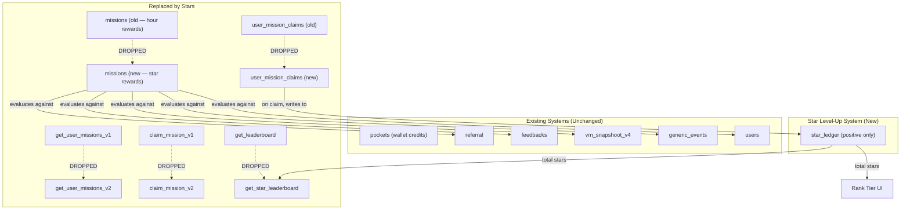

# Thinkmay Gamification System — ⭐ Thinkmay Stars

> A comprehensive design document for the Star-based gamification layer that drives retention, community engagement, and organic growth on the Thinkmay CloudPC platform.

---

## 1. Overview & Philosophy

**Thinkmay Stars** are a non-transferable, non-purchasable progression metric (XP) earned exclusively through meaningful platform engagement. Stars serve two strategic purposes:

1. **Retention Loop** — Users earn Stars by playing regularly, giving feedback, and exploring features. Stars accumulate to unlock higher rank tiers, creating a self-reinforcing engagement cycle.
2. **Growth Engine** — Referral missions, community contributions, and Discord participation turn loyal users into organic ambassadors.

Stars are a **pure level-up metric** — they can only be earned, never spent, sold, or transferred. Total accumulated Stars determine the user's rank, and ranks unlock perks (coming soon).

---

## 2. Core Concepts

### 2.1 Thinkmay Star (⭐)

| Property | Detail |
|---|---|
| **Type** | Non-transferable progression metric (XP) |
| **Acquisition** | Completing missions / events only |
| **Purchasing** | ❌ Cannot be bought with real money or pocket credits |
| **Transferring** | ❌ Cannot be sent to other users |
| **Spending** | ❌ Stars cannot be spent or redeemed — they only accumulate |
| **Expiration** | Stars do not expire |
| **Purpose** | Determines rank tier; higher ranks unlock perks (coming soon) |

### 2.2 Leaderboard

A public ranking of the top users by **total accumulated Stars (lifetime)**. Replaces the existing 7-day playtime leaderboard on the Profile page.

| Field | Source |
|---|---|
| `rank` | Derived from total stars descending |
| `name` | `users.metadata->>'name'` with email fallback |
| `avatar` | `users.metadata->>'avatar'` with DiceBear fallback |
| `total_stars` | Aggregated from `star_ledger` (positive entries only) |
| `email` | `users.email` (hidden from public, used internally) |

Admin emails (from `constant` table where `name = 'admin'`) are excluded from the leaderboard, consistent with the existing `get_leaderboard` function.

### 2.3 Rank Tiers (Level-Up System)

Users progress through 7 rank tiers based on total accumulated Stars. Rank never decreases — once you reach a tier, you keep it.

| Rank | Vietnamese | Stars Required | Planned Perks (coming soon) |
|---|---|---|---|
| Thành Viên | Member | 0 ⭐ | — |
| Người Đồng Hành | Companion | 50 ⭐ | +1 bonus hour/week |
| Người Đóng Góp | Contributor | 200 ⭐ | +2 bonus hours/week, 10% renewal discount |
| Người Tiên Phong | Pioneer | 500 ⭐ | +3 bonus hours/week, 15% renewal discount |
| Đại Sứ | Ambassador | 1000 ⭐ | +3 bonus hours/week, 15% discount, more quests |
| Đối Tác | Partner | 2500 ⭐ | +3 bonus hours/week, 20% discount, more quests |
| Người Kiến Tạo | Visionary | 5000 ⭐ | +3 bonus hours/week, 20% discount, more quests, priority queue |

> [!NOTE]
> Rank perks are displayed in the UI as "coming soon" and are not yet enforced server-side. The reward mechanism will be implemented in a future phase.

### 2.4 Discord Account Linking

User accounts are linked with Discord via OAuth2. The `users.metadata` JSONB column stores Discord identity:

```jsonc
{
  "name": "PlayerOne",
  "avatar": "https://cdn.discordapp.com/avatars/...",
  "discord_id": "123456789012345678",       // Discord snowflake ID
  "discord_username": "playerone",          // Discord handle
  "discord_linked_at": "2026-04-20T10:00:00Z"
}
```

Discord linking is **required** for community-type missions (Discord reviews, helping users). A Discord bot verifies actions on the Thinkmay Discord server and writes events to `generic_events`.

---

## 3. Database Schema

> [!IMPORTANT]
> The Star system **fully replaces** the legacy hour-based mission system (`missions`, `user_mission_claims`, `get_user_missions_v1`, `claim_mission_v1`). The old tables are migrated and dropped. See §9 for migration details.

### 3.1 Modified & New Tables

#### `star_ledger` *(NEW)*
An append-only log of Stars earned through missions and events. Only positive entries exist — Stars are never spent.

```sql
CREATE TABLE IF NOT EXISTS public.star_ledger (
    id bigint GENERATED BY DEFAULT AS IDENTITY PRIMARY KEY,
    created_at timestamptz DEFAULT now() NOT NULL,
    email text NOT NULL,
    amount integer NOT NULL,         -- always positive (earned stars)
    source_type text NOT NULL,       -- 'MISSION_CLAIM', 'EVENT_REWARD'
    source_ref text,                 -- mission code or event code
    metadata jsonb DEFAULT '{}'      -- extra context (e.g. referred user email)
);

CREATE INDEX idx_star_ledger_email ON public.star_ledger(email);
```

#### `missions` *(REPLACE — drop & recreate)*
Replaces the old `missions` table. Now rewards Stars instead of hours and supports categories, i18n keys, repeatability, and cooldowns.

```sql
DROP TABLE IF EXISTS public.user_mission_claims;
DROP TABLE IF EXISTS public.missions;

CREATE TABLE IF NOT EXISTS public.missions (
    id integer GENERATED BY DEFAULT AS IDENTITY PRIMARY KEY,
    code text UNIQUE NOT NULL,
    category text NOT NULL,           -- 'RETENTION', 'COMMUNITY', 'GROWTH', 'EXPLORATION', 'CONTENT'
    type text NOT NULL,               -- evaluation type (see §4)
    target_value integer NOT NULL,
    reward_stars integer NOT NULL,
    title_key text NOT NULL,          -- i18n key for display title
    description_key text NOT NULL,    -- i18n key for description
    icon text,                        -- emoji or icon identifier
    is_repeatable boolean DEFAULT false,
    cooldown_days integer,            -- for repeatable missions, min days between claims
    is_active boolean DEFAULT true,
    sort_order integer DEFAULT 0
);
```

#### `user_mission_claims` *(REPLACE — drop & recreate)*
Replaces the old claims table. Now supports repeatable missions (multiple rows per user+mission).

```sql
CREATE TABLE IF NOT EXISTS public.user_mission_claims (
    id bigint GENERATED BY DEFAULT AS IDENTITY PRIMARY KEY,
    email text NOT NULL,
    mission_id integer REFERENCES public.missions(id),
    claimed_at timestamptz DEFAULT now()
);

-- For non-repeatable missions, enforce uniqueness
CREATE UNIQUE INDEX idx_claims_unique_non_repeatable
ON public.user_mission_claims(email, mission_id)
WHERE (SELECT NOT is_repeatable FROM public.missions WHERE id = mission_id);
```


### 3.2 Key Design Decisions

1. **Ledger pattern** (not a running balance column) — makes auditing trivial and prevents race conditions on concurrent claims.
2. **Level-up only** — Stars are a pure progression metric. They are never spent, so rank can never decrease. The `star_redemptions` table and `redeem_stars_v1` RPC have been dropped.
3. **Replaces, not extends** — the old `missions` + `user_mission_claims` tables and their `get_user_missions_v1` / `claim_mission_v1` RPCs are dropped entirely. Stars are the single progression metric for all missions going forward.
4. **`generic_events` reuse** — Discord bot actions and client-side telemetry events write to the existing `generic_events` table. Mission evaluation reads from it.

---

## 4. Mission Catalog

All missions are categorized by the business incentive they serve. Each mission type maps to a SQL evaluation strategy.

### 4.1 🔄 RETENTION — Play Regularly

> **Incentive**: Make Thinkmay usage a daily habit.

| Code | Title | Type | Target | Stars | Repeatable |
|---|---|---|---|---|---|
| `DAILY_LOGIN` | Log in today | `DAILY_SESSION` | 1 session | 1 ⭐ | ✅ (daily) |
| `PLAY_3_DAYS_STREAK` | 3-day play streak | `PLAY_STREAK` | 3 days | 5 ⭐ | ✅ (weekly) |
| `PLAY_7_DAYS_STREAK` | 7-day play streak | `PLAY_STREAK` | 7 days | 15 ⭐ | ✅ (weekly) |
| `PLAY_30_DAYS_STREAK` | 30-day play streak | `PLAY_STREAK` | 30 days | 50 ⭐ | ✅ (monthly) |
| `PLAY_TOTAL_50H` | Reach 50 hours total | `PLAYTIME_MILESTONE` | 50 | 50 ⭐ | ❌ |
| `PLAY_TOTAL_200H` | Reach 200 hours total | `PLAYTIME_MILESTONE` | 200 | 200 ⭐ | ❌ |
| `PLAY_TOTAL_500H` | Reach 500 hours total | `PLAYTIME_MILESTONE` | 500 | 500 ⭐ | ❌ |

**Evaluation (`DAILY_SESSION`)**: Count rows in `vm_snapshoot_v4` for today where `email = p_email`.

**Evaluation (`PLAY_STREAK`)**: Count consecutive calendar days (backwards from today) where at least one `vm_snapshoot_v4` row exists for the user. Derived from the existing `get_user_heatmap` query pattern.

**Evaluation (`PLAYTIME_MILESTONE`)**: Reuses existing `SUM(total_usage) / 60` from `subscriptions`.

---

### 4.2 🤝 COMMUNITY — Help Other Users

> **Incentive**: Build a self-sustaining support community on Discord.

| Code | Title | Type | Target | Stars | Repeatable |
|---|---|---|---|---|---|
| `HELP_ANSWER_1` | Answer a question on Discord | `DISCORD_EVENT` | 1 | 2 ⭐ | ✅ (daily) |
| `HELP_ANSWER_10` | Answer 10 questions total | `DISCORD_MILESTONE` | 10 | 20 ⭐ | ❌ |
| `HELP_ANSWER_50` | Answer 50 questions total | `DISCORD_MILESTONE` | 50 | 100 ⭐ | ❌ |

**How it works**: Evaluated dynamically from the `discord_events` table. A help answer counts when a user posts a message that tags another user (`recipients` is not empty) and subsequently receives a reaction from a non-self user.

**Evaluation (`DISCORD_EVENT`)**: Count distinct `message_id` from `discord_events` (name='message_create') with non-empty recipients where a `reaction_add` exists from a user other than the author, for today.
**Evaluation (`DISCORD_MILESTONE`)**: Same as above, but lifetime count.

---

### 4.3 📝 FEEDBACK — Product Feedback Regularly

> **Incentive**: Drive consistent, high-quality product feedback after sessions.

| Code | Title | Type | Target | Stars | Repeatable |
|---|---|---|---|---|---|
| `FEEDBACK_SUBMIT_1` | Submit session feedback | `FEEDBACK_COUNT` | 1 | 2 ⭐ | ✅ (daily) |
| `FEEDBACK_SUBMIT_10` | Submit 10 feedbacks total | `FEEDBACK_MILESTONE` | 10 | 20 ⭐ | ❌ |
| `FEEDBACK_SUBMIT_50` | Submit 50 feedbacks total | `FEEDBACK_MILESTONE` | 50 | 100 ⭐ | ❌ |

**Evaluation**: Evaluated dynamically from `discord_events`. Count distinct `message_create` events in the `feedback` channel where an admin has added a reaction (any emoji) to the message. For daily repeatable, count today's approved messages.

---

### 4.4 💬 COMMUNITY — Discord Reviews & Feature Requests

> **Incentive**: Generate public social proof and actionable product insights.

| Code | Title | Type | Target | Stars | Repeatable |
|---|---|---|---|---|---|
| `DISCORD_REVIEW` | Post a bug report on Discord | `DISCORD_EVENT` | 1 | 30 ⭐ | ❌ (Milestone) |
| `DISCORD_FEATURE_REQ` | Submit a feature request on Discord | `DISCORD_EVENT` | 1 | 10 ⭐ | ❌ (Milestone) |

**How it works**: Evaluated dynamically from `discord_events`. Bug reports (`bug_report_create`) and feature requests (`feature_request_create`) count when an admin adds a reaction (any emoji) to the corresponding thread.

---

### 4.5 📱 EXPLORATION — Try Multiple Devices & Features

> **Incentive**: Increase cross-device adoption and feature discovery.

| Code | Title | Type | Target | Stars | Repeatable |
|---|---|---|---|---|---|
| `TRY_MOBILE` | Play on a mobile device | `DEVICE_TYPE` | 1 mobile session | 10 ⭐ | ❌ |
| `TRY_DESKTOP` | Play on a desktop browser | `DEVICE_TYPE` | 1 desktop session | 10 ⭐ | ❌ |
| `TRY_BOTH_DEVICES` | Play on both mobile & desktop | `DEVICE_TYPE` | 2 device types | 50 ⭐ | ❌ |
| `TRY_AI_SEARCH` | Use the AI search feature | `FEATURE_EVENT` | 1 | 5 ⭐ | ❌ |

**Evaluation (`DEVICE_TYPE`)**: The frontend writes a `generic_events` row with `name = 'session_device'` and `value = {"email": "...", "device": "mobile"|"desktop"}` on each streaming session start. Evaluation counts distinct device types.

**Evaluation (`FEATURE_EVENT`)**: The frontend writes `generic_events` with `name = 'ai_search_used'` when the user triggers the AI search in the store. Evaluation checks existence.

---

### 4.6 🚀 GROWTH — Referrals

> **Incentive**: Organic user acquisition and revenue growth.

| Code | Title | Type | Target | Stars | Repeatable |
|---|---|---|---|---|---|
| `REFER_SIGNUP_1` | Refer a friend who signs up | `REFERRAL_SIGNUP` | 1 | 10 ⭐ | ✅ (per referral) |
| `REFER_SIGNUP_5` | Refer 5 friends who sign up | `REFERRAL_SIGNUP` | 5 | 30 ⭐ | ❌ |
| `REFER_PAID_1` | Refer a friend who subscribes | `REFERRAL_PAYMENT` | 1 | 300 ⭐ | ✅ (per referral) |
| `REFER_PAID_3` | Refer 3 paying friends | `REFERRAL_PAYMENT` | 3 | 1000 ⭐ | ❌ |

**Evaluation (`REFERRAL_SIGNUP`)**: Count rows in `referral` where `"from" = p_email`.

**Evaluation (`REFERRAL_PAYMENT`)**: Reuses existing pattern — count `DISTINCT referral."to"` joined against `payment_request.verified_at IS NOT NULL`.

---

### 4.7 🎬 CONTENT — Game Benchmark Contributions

> **Incentive**: Build a crowdsourced benchmark library to drive store conversions.

| Code | Title | Type | Target | Stars | Repeatable |
|---|---|---|---|---|---|
| `BENCHMARK_SUBMIT_1` | Upload a game benchmark video | `BENCHMARK_EVENT` | 1 | 100 ⭐ | ✅ (per game) |
| `BENCHMARK_SUBMIT_5` | Contribute 5 benchmark videos | `BENCHMARK_EVENT` | 5 | 300 ⭐ | ❌ |

**How it works**: Users record gameplay, upload to YouTube, and submit the link through a form on the game detail page. The submission is stored in `generic_events`:

```jsonc
{
  "name": "benchmark_submission",
  "type": "STAR_EVENT",
  "value": {
    "email": "user@gmail.com",
    "store_id": 42,
    "game_name": "GTA V",
    "youtube_url": "https://youtube.com/watch?v=...",
    "approved": false    // set to true by admin review
  }
}
```

Stars are only granted after admin approval (`approved = true`). This prevents spam submissions.

---

## 5. RPC Functions

> [!NOTE]
> These RPCs **replace** the legacy `get_user_missions_v1` and `claim_mission_v1` functions, which are dropped during migration.

### 5.1 `get_star_balance(p_email text) → integer`

```sql
-- Total accumulated stars (positive entries only — stars are never spent)
SELECT COALESCE(SUM(amount), 0) FROM public.star_ledger WHERE email = p_email AND amount > 0;
```

### 5.2 `get_user_missions_v2(p_email text) → TABLE`

Replaces `get_user_missions_v1`. Follows the same **Lazy Evaluation** pattern. Pre-calculates all baseline metrics, then evaluates each active `missions` row against them. Returns `id, code, category, title_key, description_key, icon, target_value, reward_stars, progress, status, is_repeatable`.

Status resolution: `claimed` → `completed` → `in_progress` → `locked` (if prerequisites not met).

### 5.3 `claim_mission_v2(p_email text, p_mission_code text) → boolean`

Replaces `claim_mission_v1`. Now grants Stars instead of hours.

1. Fetch mission by code, verify active.
2. Check claim history (for non-repeatable: block if already claimed; for repeatable: check cooldown).
3. Recalculate progress dynamically. Abort if target not met.
4. Insert into `user_mission_claims`.
5. Insert positive entry into `star_ledger` (source_type = `MISSION_CLAIM`, source_ref = mission code).
6. Return `true`.

### 5.4 `get_star_leaderboard(limit_count int DEFAULT 20) → TABLE`

Replaces the existing `get_leaderboard` function (which ranked by 7-day playtime). Now ranks by total earned Stars.

```sql
WITH star_totals AS (
  SELECT email, SUM(amount) AS total_stars
  FROM public.star_ledger
  WHERE amount > 0   -- only count earned stars, not spent
  GROUP BY email
)
SELECT
  ROW_NUMBER() OVER(ORDER BY total_stars DESC)::bigint AS rank,
  COALESCE(u.metadata->>'name', SPLIT_PART(u.email, '@', 1)) AS name,
  COALESCE(u.metadata->>'avatar', 'https://api.dicebear.com/9.x/thumbs/svg?seed=' || u.email) AS avatar,
  st.total_stars::bigint,
  u.email
FROM star_totals st
INNER JOIN public.users u ON u.email = st.email
WHERE st.total_stars > 0
  AND u.email NOT IN (
    SELECT jsonb_array_elements_text(value::jsonb)
    FROM public.constant WHERE name = 'admin'
  )
ORDER BY total_stars DESC
LIMIT limit_count;
```

---

## 6. Discord Bot Integration

The Discord bot bridges community actions into the database via `generic_events`.

### 6.1 Required Bot Capabilities

| Action | Channel | Event Name | Trigger |
|---|---|---|---|
| Help answer verified | `#support` | `discord_help_answer` | Mod reacts ✅ to a reply |
| Product review posted | `#reviews` | `discord_review` | Message ≥ 50 chars posted |
| Feature request posted | `#feature-requests` | `discord_feature_request` | Message ≥ 50 chars posted |

### 6.2 Account Linking Flow

1. User clicks "Link Discord" on their Thinkmay Profile page.
2. OAuth2 redirect to Discord → user authorizes → callback with Discord ID.
3. Frontend calls an RPC to update `users.metadata` with `discord_id`, `discord_username`, and `discord_linked_at`.
4. The Discord bot uses the `discord_id` to resolve the user's Thinkmay `email` from the `users` table when logging events.

### 6.3 Anti-Abuse Safeguards

- **Cooldowns**: Repeatable missions enforce `cooldown_days` between claims.
- **Mod verification**: Help answers require moderator ✅ reaction, not self-validation.
- **Benchmark approval**: Benchmark submissions require admin approval before Stars are granted.
- **Rate limits**: The Discord bot rate-limits event writes to 1 per user per event type per hour.

---

## 7. Frontend Integration Points

| Page | Component | Data Source |
|---|---|---|
| **Profile** | Star Balance badge | `get_star_balance` RPC |
| **Profile** | Missions list (Quest panel) | `get_user_missions_v2` RPC |
| **Profile** | Star Leaderboard (sidebar) | `get_star_leaderboard` RPC |
| **Profile** | Rank Tier + Perks (coming soon) | Determined by `get_star_balance` → rank lookup |
| **Profile** | "Link Discord" button | OAuth2 flow → `users.metadata` update |
| **Store Detail** | "Submit Benchmark" form | Writes to `generic_events` |
| **Post-Session** | Feedback form (existing) | Already writes to `feedbacks` — no change needed |
| **Streaming** | Device type telemetry | Writes `session_device` event to `generic_events` on connect |
| **Store** | AI search telemetry | Writes `ai_search_used` event to `generic_events` |

All data fetching should be integrated into the Redux store via `createAsyncThunk`, following the established pattern in the `user` reducer. The `preloadSilent` flow should fetch star balance alongside existing user data.

> [!WARNING]
> The existing Redux thunks calling `get_user_missions_v1` and `claim_mission_v1` must be updated to call `get_user_missions_v2` and `claim_mission_v2` respectively. The response shape changes — `reward_amount` → `reward_stars`, and the new `category`, `title_key`, `description_key`, `icon`, `is_repeatable` fields are added.

---

## 8. Relationship to Existing Systems



> [!CAUTION]
> The legacy hour-based mission system is **fully removed**. The `star_redemptions` table and `redeem_stars_v1` RPC have been dropped — Stars are a pure level-up metric that can never be spent. The old RPCs `get_user_missions_v1`, `claim_mission_v1`, and `get_leaderboard` are replaced by `get_user_missions_v2`, `claim_mission_v2`, and `get_star_leaderboard`.

---

## 9. Migration & Rollout Plan

### Phase 0 — Legacy Removal (Pre-requisite)
- [ ] Drop old RPCs: `get_user_missions_v1`, `claim_mission_v1`, `get_leaderboard`
- [ ] Drop old tables: `user_mission_claims`, then `missions`
- [ ] Drop legacy referral trigger/function (if not already done): `on_referral_added`, `apply_referral_reward`
- [ ] Update frontend Redux thunks to remove calls to old RPCs (will temporarily disable quest UI)
- [ ] Remove `reward_mission.md` doc (replaced by this document)
- [ ] Remove `missions.sql` and `leaderboard.sql` from `docs/db/` (replaced by new schemas below)

> [!WARNING]
> **Data loss**: All existing `user_mission_claims` rows (users who claimed old hour-based missions) will be lost. Since those rewards were already applied to `subscriptions.usage_limit`, no rollback is needed — the hours are already granted. Consider archiving the old table before dropping if audit trail is desired.

### Phase 1 — Foundation (Week 1-2)
- [ ] Create new `star_ledger` table
- [ ] Recreate `missions` table with new Star schema
- [ ] Recreate `user_mission_claims` table with repeatable support
- [ ] Create `star_redemptions` table and seed exchange rates
- [ ] Implement `get_star_balance`, `get_user_missions_v2`, `claim_mission_v2`, `redeem_stars_v1`, `get_star_leaderboard` RPCs
- [ ] Seed initial missions (RETENTION + EXPLORATION categories)
- [ ] Update frontend: Star Balance badge, mission panel, redemption modal on Profile
- [ ] Update Redux thunks to call new v2 RPCs

### Phase 2 — Community & Growth (Week 3-4)
- [ ] Implement Discord account linking (OAuth2 flow + metadata storage)
- [ ] Deploy Discord bot with `#support`, `#reviews`, `#feature-requests` monitoring
- [ ] Activate COMMUNITY and GROWTH category missions
- [ ] Replace existing playtime leaderboard with Star Leaderboard
- [ ] Add device type and AI search telemetry events

### Phase 3 — Content & Polish (Week 5-6)
- [ ] Build benchmark submission form on game detail pages
- [ ] Add admin approval UI for benchmark submissions
- [ ] Activate CONTENT category missions
- [ ] Localize all mission titles/descriptions (vi, en, id)
- [ ] Performance testing and index optimization on `star_ledger`
