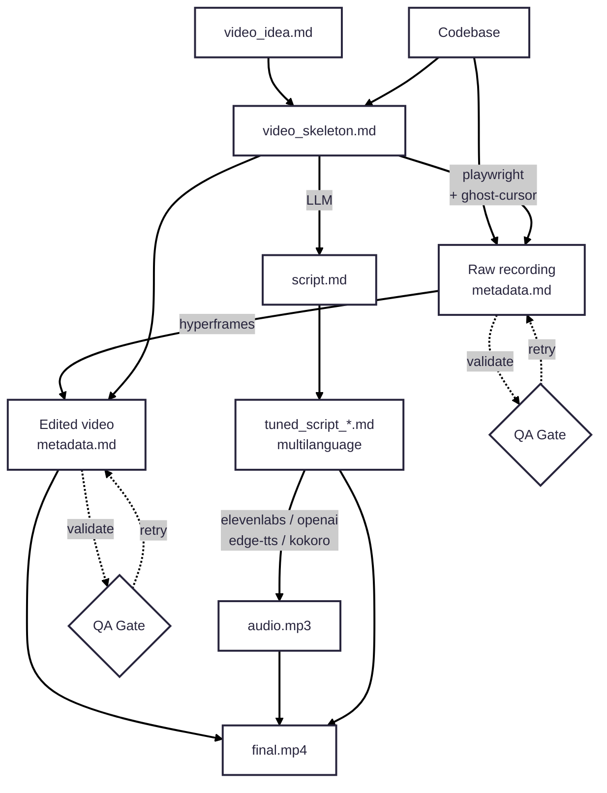

# Video Creation AI Agent — Instruction Skeleton

This document defines the autonomous video creation pipeline for marketing content.
The agent orchestrates the full workflow: idea → skeleton → recording → editing → voiceover → final output.

## Toolchain

| Tool | Role |
|------|------|
| **Antigravity** | Coding agent, orchestration, decision-making |
| **Playwright** | Browser automation for screen recording |
| **Ghost-cursor** | Human-like cursor movement during recording (⚠ version-fragile — see Lessons Learned) |
| **HyperFrames** | Video editing, captions, motion graphics, transitions |
| **ElevenLabs / OpenAI** | High-quality cloud voiceovers (ElevenLabs / OpenAI Audio API) |
| **edge-tts / Kokoro** | Local/free text-to-speech fallbacks (via edge-tts or `hyperframes tts`; ⚠ requires Python ≥3.10 — see Lessons Learned) |
| **Whisper** | Audio transcription for caption timing (via `hyperframes transcribe`) |
| **ffmpeg** | Video + audio mixing, frame extraction, format conversion |

### Environment Variables & Secrets

The pipeline tools and agents require various API keys and access credentials (e.g., ElevenLabs API keys for voiceover, target application login credentials like `TM_USERNAME` and `TM_PASSWORD` for automated test recording walkthroughs).

All secrets **must** be stored in:
👉 **File Location:** `marketing/video/.env`

Example `marketing/video/.env` content:
```env
TM_USERNAME="thinkmay@dev.net"
TM_PASSWORD="your_password"
ELEVEN_LABS_API_KEY="your_elevenlabs_key"
OPENAI_API_KEY="your_openai_key"
```

> [!WARNING]
> Never commit `marketing/video/.env` to the repository. It is included in `.gitignore` to prevent leaks.

## Pipeline Overview



---

## Agent Roles

The orchestrating agent decomposes the pipeline into specialized sub-agents:

### 1. Research Agent
**Input:** `video_idea.md`
**Output:** `research_brief.md`

The Research Agent conducts deep research **before any creative work begins**. Every video must be grounded in thorough understanding of the product, its philosophy, architecture, and market position. Skipping or rushing this step produces generic content that misrepresents the product.

#### Research Scope

The agent must systematically investigate these domains:

**A. Product Identity & Philosophy**
- Read `CLAUDE.md` (repo root) — repository overview, architecture, component descriptions
- Read `docs/product/README.md` — product summary and structure
- Read `docs/marketing/strategy/thinkmay_founder_marketing_strategy_notes.md` — founder's vision, positioning philosophy, brand voice
- Read `docs/marketing/strategy/marketing_doc.md` — marketing playbook and messaging guidelines
- Read `docs/marketing/research/thinkmay_cloudpc_brand_research.md` — brand identity, emotional positioning
- Extract: core mission, value proposition, brand personality, key messaging pillars

**B. Target Audience & User Context**
- Read `docs/marketing/research/user_persona.md` — user profiles, pain points, motivations
- Read `docs/marketing/research/thinkmay_cloudpc_deep_research.md` — market context, user behavior patterns
- Read `docs/marketing/research/thinkmay_cloudpc_web_research.md` — web presence, user-facing content
- Extract: who watches this video, what problems they have, what language they use, what motivates them

**C. Competitive Landscape**
- Read `docs/marketing/strategy/thinkmay_competitor_positioning_memo.md` — positioning vs competitors
- Read `docs/marketing/research/local_competitors_research_summary.md` — local market competitors
- Read `docs/marketing/research/oneplay_seo_competitiveness_summary.md` — direct competitor analysis
- Scan `docs/marketing/research/competitor_analysis/` — detailed competitor breakdowns
- Extract: what differentiates us, competitor weaknesses we can highlight, claims we can make vs. can't

**D. Product Features & UX**
- Read `docs/product/features/` — gamification, reward/mission systems
- Read `docs/product/design/thinkmay_design_language.md` — design system, visual language, UI philosophy
- Read `docs/product/design/thinkmay_landing_page_design.md` — landing page structure and messaging
- Read `docs/product/design/thinkmay_desktop_design.md` — desktop client UX
- Read `docs/product/design/thinkmay_mobile_design.md` — mobile client UX
- Read `docs/product/architecture/client_user_flow_contract.md` — user journey flows
- Extract: features worth showcasing, UX flows that demo well, visual highlights

**E. Technical Architecture** (for technical/developer-audience videos)
- Read `docs/product/architecture/technical_doc.md` — full technical documentation
- Read `docs/product/architecture/client_protocol_contract.md` — streaming protocol details
- Read `docs/desktop_client_architecture.md` — client-side architecture
- Read `docs/pipeline.md` — infrastructure pipeline
- Browse `website/` source — actual UI components, pages, routes
- Extract: technical differentiators, architecture highlights, performance claims with evidence

**F. Codebase Exploration** (for product demo videos)
- Browse the live application or website source to understand actual UI
- Identify available pages, flows, and interactive elements for recording
- Find brand assets: logos (`website/public/`), icons, images, screenshots
- Check for feature flags, demo modes, or showcase-friendly states
- Extract: recordable user flows, visual assets to use, UI elements to highlight

#### Research Output

The agent produces `research_brief.md` — a structured synthesis of all findings, organized by the video's needs. This document becomes the **primary input** for the Planner Agent. It must include:

1. **Product summary** — what the product is, in language appropriate for the video's audience
2. **Key claims** — provable statements about the product (with source references)
3. **Differentiators** — what sets us apart from competitors (with evidence)
4. **Target audience profile** — who's watching, what they care about
5. **Feature inventory** — features relevant to this video's topic, with UX flow descriptions
6. **Visual assets** — list of available logos, images, screenshots with file paths
7. **Tone & voice guidelines** — how we talk based on brand research
8. **Things to avoid** — competitor claims we can't make, sensitive topics, outdated info

> **Rule:** The research brief must cite source files for every claim. No invented facts.
> The agent must read actual files — not guess based on file names.

---

### 2. Planner Agent
**Input:** `video_idea.md`, `research_brief.md`
**Output:** `video_skeleton_<lang>.md`, `script_<lang>.md` (one per target language)

The Planner Agent works **only from the research brief** — it does not re-research the codebase.

Responsibilities:
- Read `research_brief.md` to ground all creative decisions in product reality
- Cross-reference `video_idea.md` goals with research findings
- **Verify configuration parameters:**
  - Starting Scene (default: `/`)
  - Ending Scene (default: `/play`)
  - Target Output Languages (default: English and Vietnamese - generating one final video version for each language)
  - **Clarification Rule:** If starting scene, ending scene, or target languages are not specified in the input prompt/concept, the agent **MUST** clarify this with the user before planning.
- Generate a localized `video_skeleton_<lang>.md` starting from the Starting Scene and concluding at the Ending Scene for each language, customizing actions (e.g. typing, clicking) to the target language UI.
- Generate `script_<lang>.md` containing voiceover narration for each target language version (e.g. English and Vietnamese) aligned to skeleton timestamps.
- Ensure every claim in the script is backed by a finding in the research brief.
- Determine target video length, pacing, and platform constraints. **Target length is a guideline** (e.g. 30s, 40s, 60s) — the Editor may extend duration to fit all required scenes; never drop Settings/advanced/toggle steps to hit a shorter runtime.
- Select features to showcase based on research-identified differentiators.
- Choose recording flows based on research-identified UX paths starting and ending at the designated screens.
- Identify required assets from the research brief's visual asset inventory.

### 3. Recorder Agent
**Input:** `video_skeleton_<lang>.md`, codebase, target application URL
**Output:** Localized raw recordings (`recording/artifacts/output/<lang>/raw_recording.webm`, `recording/artifacts/output/<lang>/recording_metadata.md`)

Responsibilities:
- Launch Playwright with recording context (1920×1080, matched viewport/video size) configured for the target language locale (ensuring the app UI renders in the correct language).
- Install ghost-cursor for human-like mouse movements.
- Execute skeleton steps starting from the designated Starting Scene (default: `/`) and ending at the Ending Scene (default: `/play`), typing/clicking localized elements as specified in `video_skeleton_<lang>.md`.
- Generate localized `recording_metadata.md` — timestamp + on-screen description for every action.
- Handle recording padding (2s start/end buffer).
- Hide automation artifacts (dev icons, personal info, infobars).

Skills used: `playwright`, `playwright-video`, `ghost-cursor`

### 4. Editor Agent
**Input:** Localized raw recording, `video_skeleton_<lang>.md`, `recording_metadata.md`, brand assets
**Output:** Localized edited video compositions (`editing/artifacts/output/<lang>/index.html`), `editing_metadata.md`

Responsibilities:
- Initialize HyperFrames project (`npx hyperframes init`) for each target language version.
- Compose the final video for each language version independently: trim, reorder, and pace localized raw clips (each step ≤ 3s).
- Add motion graphics, title cards, captions, and transitions for each language version.
- Apply brand guidelines from `design.md` (colors, fonts, motion style).
- Run validation independently: `hyperframes lint`, `hyperframes validate`, `hyperframes inspect`.
- Generate localized `editing_metadata.md` with final timestamp-to-content mapping.

Skills used: `hyperframes`, `hyperframes-cli`

### 5. Voice Agent
**Input:** Localized script `script_<lang>.md`
**Output:** Localized voice narration and transcripts (`voice/artifacts/output/<lang>/narration.mp3`, `voice/artifacts/output/<lang>/transcript.json`)

Responsibilities:
- Generate voiceover for each localized script via ElevenLabs API, OpenAI Audio API, or edge-tts CLI (falling back to local Kokoro TTS if configured).
- Transcribe generated audio for caption timing (`npx hyperframes transcribe`) per language.
- Validate transcript quality (word-level timestamps, no hallucinated words).

Skills used: `hyperframes-media`

### 6. Assembler Agent
**Input:** Localized edited video compositions, audio files, transcripts
**Output:** Final videos (one independent native version per target language, e.g. `final_en.mp4`, `final_vi.mp4`)

Responsibilities:
- Sync audio track with video composition for each language version.
- Add captions from transcript data for each language version.
- Render final output for each target language version (`npx hyperframes render --quality high --output final_<lang>.mp4`).
- Mix audio with ffmpeg if needed (`ffmpeg -i video.mp4 -i audio_<lang>.mp3 -c:v copy -c:a aac final_<lang>.mp4`).
- Validate final output quality for all target languages.

### 7. QA Agent
**Input:** Any pipeline artifact + its metadata
**Output:** Pass/fail report, retry instructions

Responsibilities:
- Extract keyframes at each metadata timestamp (`ffmpeg -ss <timestamp> -i video.mp4 -vframes 1 frame.png`)
- Use VLM to audit each keyframe against its description in metadata
- Summarize what's correct and what's wrong per keyframe
- Determine pass/fail and generate retry instructions if quality is insufficient

---

## File Artifacts

### Input Artifacts

| File | Description | Author |
|------|-------------|--------|
| `video_idea.md` | High-level concept, target audience, platform, goals | Human |
| `design.md` | Brand guidelines — colors, fonts, motion style | Human / Agent |
| Codebase assets | Logos, icons, images, screenshots from the product | Copied from source |

### Pipeline Artifacts

| File | Description | Stage |
|------|-------------|-------|
| `research_brief.md` | Deep research synthesis — product, audience, competitors, features, assets | Research |
| `video_skeleton.md` | Scene-by-scene breakdown with timestamps, actions, and visual descriptions | Planning |
| `script.md` | Voiceover narration script aligned to skeleton timestamps | Planning |
| `recording_metadata.md` | Timestamp + screen content description for raw recording | Recording |
| `tuned_script_*.md` | Per-language adapted scripts | Voice |
| `editing_metadata.md` | Timestamp + content description for edited video | Editing |
| `sync-timing.json` | Caption + narration composition times derived from `recording_metadata.md` | Editing |
| `transcript.json` | Word-level timestamps for captions | Voice |

### Output Artifacts

| File | Description |
|------|-------------|
| `final.mp4` | Rendered video at the **video project root** (`marketing/video/<project_name>_v<version>/final.mp4`) — primary distribution copy |
| `assembly/artifacts/output/final.mp4` | Pipeline mirror of the same file (optional archive) |
| `final_<lang>.mp4` | Localized variants at project root (e.g. `final_vi.mp4`) |

---

## Workspace Structure

The pipeline is organized into versioned project directories under `marketing/video/` to support multiple iterations or variants of the same concept.

### Project Naming & Versioning Standard
Each project folder **must** follow the format: `<project_name>_v<version_number>/`
*   Example: `download_app_v1/`, `desktop_pwa_v2/`

### Independent Native Language Pipeline Rule
For each target output language (e.g., English, Vietnamese, Indonesian), the video **must** be produced natively and independently from end to end. 
*   **No simple dubbing:** The Vietnamese video must be based on a Vietnamese recording (capturing the app running in Vietnamese localization, with Vietnamese typed inputs and labels), using a Vietnamese script, Vietnamese voiceover narration, and a Vietnamese-specific HyperFrames composition.
*   **Natively generated:** Under no circumstances should a single recording in one language simply be dubbed or subtitled for other languages.

### Directory Tree
```
marketing/video/
├── .env                             # Global secrets (shared across projects, e.g. TM_USERNAME, API keys)
├── instruction.md                   # Global pipeline specification (this file)
│
└── <project_name>_v<version>/        # E.g. download_app_v1/
    ├── final_en.mp4                 # ← Final rendered English video (native recording + voice)
    ├── final_vi.mp4                 # ← Final rendered Vietnamese video (native recording + voice)
    ├── final_id.mp4                 # ← Final rendered Indonesian video (native recording + voice)
    ├── goal.md                      # Readonly: task description for this version
    ├── taskchecklist.md             # Progress checklist for this version
    ├── README.md                    # Project readme and rerun commands
    │
    ├── research/
    │   ├── artifacts/
    │   │   └── output/
    │   │       └── research_brief.md # Shared research (app behaviors, specs, assets)
    │   └── temp/                    # .gitignore
    │
    ├── planning/
    │   ├── artifacts/
    │   │   ├── input/               # Copied from research/output
    │   │   │   └── research_brief.md
    │   │   └── output/
    │   │       ├── video_skeleton_en.md # Localized skeletons
    │   │       ├── video_skeleton_vi.md
    │   │       ├── script_en.md        # Localized scripts
    │   │       └── script_vi.md
    │   └── temp/                    # .gitignore
    │
    ├── recording/
    │   ├── artifacts/
    │   │   ├── input/               # Localized skeletons (copied from planning/output)
    │   │   └── output/
    │   │       ├── en/
    │   │       │   ├── raw_recording.webm
    │   │       │   └── recording_metadata.md
    │   │       └── vi/
    │   │           ├── raw_recording.webm
    │   │           └── recording_metadata.md
    │   ├── scripts/
    │   │   ├── record_en.mjs        # Localized playwright scripts (e.g. settings/typing in lang)
    │   │   └── record_vi.mjs
    │   └── temp/                    # .gitignore
    │
    ├── editing/
    │   ├── artifacts/
    │   │   ├── input/
    │   │   │   ├── en/              # Copied raw_recording and metadata for English
    │   │   │   └── vi/              # Copied raw_recording and metadata for Vietnamese
    │   │   └── output/
    │   │       ├── en/
    │   │       │   ├── index.html   # HyperFrames composition (English)
    │   │       │   └── editing_metadata.md
    │   │       └── vi/
    │   │           ├── index.html   # HyperFrames composition (Vietnamese)
    │   │           └── editing_metadata.md
    │   └── temp/                    # .gitignore
    │
    ├── voice/
    │   ├── artifacts/
    │   │   ├── input/
    │   │   │   ├── en/              # Copied script_en.md
    │   │   │   └── vi/              # Copied script_vi.md
    │   │   └── output/
    │   │       ├── en/
    │   │       │   ├── narration.mp3
    │   │       │   └── transcript.json
    │   │       └── vi/
    │   │           ├── narration.mp3
    │   │           └── transcript.json
    │   └── temp/                    # .gitignore
    │
    ├── assembly/
    │   ├── artifacts/
    │   │   ├── input/
    │   │   │   ├── en/
    │   │   │   └── vi/
    │   │   └── output/
    │   │       ├── en/
    │   │       │   └── final.mp4
    │   │       └── vi/
    │   │           └── final.mp4
    │   └── temp/                    # .gitignore
    │
    └── assets/                      # Brand assets for this video
        └── ...
```

**Rules:**
- Each pipeline step gets its own folder inside the versioned project directory.
- All temp files go in `<step>/temp/` and are added to `.gitignore`.
- All outputs go in `<step>/artifacts/output/`.
- Each step copies required dependencies to `<step>/artifacts/input/`.
- `goal.md` is readonly — describes the current task for this version.
- `taskchecklist.md` is updated after each step completes; bottlenecks are noted.

---

## Quality Gates

Every recording and editing step passes through a validation loop before proceeding.

### Validation Process

```
1. Extract keyframe from each timestamp in the metadata file
   → ffmpeg -ss <timestamp> -i <video> -vframes 1 -q:v 2 keyframe_<N>.png

2. Send keyframe + metadata description to VLM for audit
   → "Does this frame match the description: '<description>'?"

3. Summarize per-keyframe results:
   ✅ Frame 0:03 — "Login page with cursor on email field" — MATCH
   ❌ Frame 0:07 — "Dashboard with analytics chart" — MISMATCH: chart not loaded

4. If any MISMATCH → retry the step with error context
```

### Recording Quality Requirements

- [ ] Cursor uses a realistic pointer image (PNG/SVG cursor sprite, not a CSS circle)
  - Use a standard arrow pointer image (e.g., `cursor-arrow.png` — a 48×48 or 64×64 pointer sprite with the hotspot at top-left)
  - Place the image file at `recording/scripts/cursor-arrow.png` in the project
  - Inject it as an `` element that tracks `mousemove`, not a CSS shape
  - The cursor must be large enough to be clearly visible at 1920×1080 — minimum 40×40px rendered size, recommended 48×48px
  - Position the image so its hotspot (typically top-left corner for an arrow) aligns with the actual mouse coordinates
- [ ] Cursor movement is smooth and human-like (Bezier interpolation with ≥25 steps, 8-15ms per step, slight random jitter on control points)
  - Never teleport the cursor — always animate through intermediate points
  - Use quadratic Bezier curves with randomized control points for natural-looking paths
  - Add small random delays (100-300ms) before clicks after arriving at the target
- [ ] No obvious visual issues (rendering glitches, loading spinners stuck)
- [ ] No automation residuals (Next.js dev icon, "Chrome is being controlled" bar)
- [ ] All personal information hidden (emails, names, account details)
- [ ] High resolution and sharpness maintained (1920×1080, deviceScaleFactor: 2)
- [ ] 2s padding at start and end of recording

### Editing Quality Requirements

- [ ] Final duration fits all required scenes (see [Required scenes gate](#required-scenes-gate) below) — **extend length as needed** rather than compressing past recognition
- [ ] High pace — each navigation step ≤ 3s on screen; hero step (e.g. desktop toggle) gets 4–6s
- [ ] No obvious visual flaws (jump cuts without transitions, text overflow)
- [ ] All scenes have entrance animations (no elements appearing fully-formed)
- [ ] Transitions between every scene (no raw jump cuts)
- [ ] Brand guidelines followed (colors, fonts, motion from `design.md`)
- [ ] `npx hyperframes lint` passes
- [ ] `npx hyperframes validate` passes (including contrast audit)
- [ ] `npx hyperframes inspect` passes (no text overflow)
- [ ] Caption `GROUPS` derived from `recording_metadata.md` via `sync-timing.json` (not script-only or uniform time blocks)
- [ ] Each narration clip `data-start` matches its caption window and the corresponding recording event
- [ ] Each narration clip `data-duration` ≥ actual MP3 length from `ffprobe` (never truncate TTS)
- [ ] **Required scenes gate** passes — Settings → Advanced → toggle → Save must all appear on screen at their caption times (see below)

### Audio Quality Requirements

- [ ] Voiceover matches script content
- [ ] Audio levels are consistent
- [ ] Word-level transcript timestamps are accurate
- [ ] Caption timing syncs with spoken words
- [ ] Walkthrough videos use per-scene audio clips (not one monolithic file timed only to the script skeleton)
- [ ] Spoken lines describe what is on screen within ~2s (sync QA at download, settings, hero toggle, connect)
- [ ] No narration clip uses `data-duration` shorter than the source MP3 — clipped voice is a render failure

---

## Research Brief Format — `research_brief.md`

The research brief is the **sole source of truth** for the Planner Agent.
Every claim must cite the source file it came from. No invented facts allowed.

```markdown
# Research Brief: <Video Title / Topic>

## Meta
- **Video idea:** <link to video_idea.md>
- **Researched:** <date>
- **Agent:** Research Agent

---

## 1. Product Summary

<2-3 paragraph summary of the product, written in language appropriate for
the video's target audience. Not a technical spec — a story-ready description.>

**Source:** `CLAUDE.md`, `docs/product/README.md`

## 2. Key Claims (Provable)

Claims we can confidently make in the video, with evidence:

| # | Claim | Evidence | Source |
|---|-------|----------|--------|
| 1 | "Cloud PC in seconds" | Signup → VM provisioned in under 60s | `docs/product/architecture/client_user_flow_contract.md` |
| 2 | "No download required" | Browser-based WebRTC streaming | `docs/product/architecture/technical_doc.md` |
| 3 | "Run AAA games" | GPU passthrough with VFIO, RTX support | `docs/product/architecture/technical_doc.md` |

## 3. Differentiators vs Competitors

| Differentiator | Us | Competitors | Source |
|----------------|-----|-------------|--------|
| Persistent PC | Saved data, installed games persist | GeForce NOW: session-based, no save | `docs/marketing/strategy/thinkmay_competitor_positioning_memo.md` |
| Install anything | Full Windows desktop | Xbox Cloud: catalog-only | `docs/marketing/research/thinkmay_cloudpc_brand_research.md` |

## 4. Target Audience Profile

- **Primary:** <demographic, behavior, pain points>
- **Secondary:** <if applicable>
- **Language/tone:** <how they talk about their problems>
- **What they care about:** <key motivations>
- **What they fear:** <objections to address>

**Source:** `docs/marketing/research/user_persona.md`

## 5. Feature Inventory (Relevant to This Video)

Features worth showcasing, with UX flow descriptions:

### Feature: <Name>
- **What it does:** <description>
- **UX flow:** <step-by-step user journey>
- **Recordable path:** `goto(URL) → click(selector) → ...`
- **Visual highlight:** <what makes this look good on screen>
- **Source:** `docs/product/features/<file>.md`

### Feature: <Name>
...

## 6. Visual Assets Available

| Asset | Path | Description |
|-------|------|-------------|
| Logo (dark) | `website/public/logo-dark.svg` | Primary logo for dark backgrounds |
| Logo (light) | `website/public/logo-light.svg` | Primary logo for light backgrounds |
| App screenshot | `website/public/og-image.png` | OG image with app preview |

## 7. Tone & Voice Guidelines

- **Brand voice:** <description from brand research>
- **Positioning language:** <three-layer system or equivalent>
- **Emotional register:** <how the video should feel>
- **Do say:** <approved phrasings>
- **Don't say:** <terms to avoid>

**Source:** `docs/marketing/strategy/thinkmay_founder_marketing_strategy_notes.md`,
`docs/marketing/research/thinkmay_cloudpc_brand_research.md`

## 8. Things to Avoid

- [ ] <Competitor claim we can't substantiate>
- [ ] <Outdated feature or pricing>
- [ ] <Sensitive topic>
- [ ] <Technical limitation not to expose>

**Source:** `docs/marketing/strategy/thinkmay_competitor_positioning_memo.md`

## 9. Raw Notes

<Any additional findings, open questions, or context that didn't fit above.
Include links to files that the Planner Agent might want to deep-dive into.>
```

---

## Skeleton File Format — `video_skeleton.md`

The skeleton is the primary contract between planning and all downstream agents.

```markdown
# Video: <Title>

## Meta
- **Platform:** YouTube / TikTok / LinkedIn / Website
- **Target length:** 60s
- **Aspect ratio:** 16:9 (1920×1080) | 9:16 (1080×1920)
- **Audience:** Developers / General consumers / Enterprise
- **Tone:** Professional / Casual / Energetic

## Scenes

### Scene 1: Intro (0:00 – 0:05)
**Visual:** Title card with logo, tagline fade-in
**Narration:** "Meet Thinkmay — your cloud PC in seconds."
**Action:** None (motion graphic only)
**Transition:** Crossfade to Scene 2

### Scene 2: Product Demo (0:05 – 0:15)
**Visual:** Browser navigating to thinkmay.net, cursor clicks "Get Started"
**Narration:** "Just click Get Started and you're in."
**Action:** goto(thinkmay.net) → click("Get Started") → waitForNavigation
**Transition:** Slide wipe to Scene 3

### Scene 3: Feature Showcase (0:15 – 0:35)
**Visual:** Dashboard view, cursor interacts with settings
**Narration:** "Customize your cloud PC with the hardware you need."
**Action:** click("Settings") → select(GPU: RTX 4090) → click("Apply")
**Transition:** Crossfade to Scene 4

### Scene 4: CTA / Outro (0:35 – 0:45)
**Visual:** CTA card with "Try Free" button, social links
**Narration:** "Start your free trial today."
**Action:** None (motion graphic only)
**Transition:** Fade to black
```

---

## Metadata File Format — `recording_metadata.md` / `editing_metadata.md`

Metadata files describe what's on screen at each timestamp. They are the **ground truth**
for QA validation — every frame can be audited against its description.

```markdown
# Recording Metadata

## Source
- **File:** raw_recording.webm
- **Resolution:** 1920×1080
- **Duration:** 47s
- **Recorded:** 2026-06-11T11:00:00Z

## Timestamps

| Timestamp | Description | Expected (from skeleton) |
|-----------|-------------|--------------------------|
| 0:00 | Black screen, recording padding | — |
| 0:02 | Browser opens, navigating to thinkmay.net | Scene 2 start |
| 0:04 | Homepage loaded, cursor moving toward "Get Started" button | Scene 2 |
| 0:06 | Cursor clicks "Get Started", page transitions | Scene 2 |
| 0:08 | Sign-up page loaded, form visible | Scene 2 |
| ... | ... | ... |
```

---

## Sync Timing — `sync_timing.md` / `sync-timing.json`

For **screen-recording walkthroughs**, caption and narration times must be derived from
`recording_metadata.md`, not copied from `video_skeleton.md` or uniform 4-second blocks.

### Composition ↔ recording mapping

When the A-roll uses `data-start="V"`, `data-media-start="M"`, and `data-playback-rate="R"`:

```
compositionTime = V + (recordingTimestamp - M) / R
```

When `V=4`, `M=2`, `R=1` (default): **`compositionTime = recordingTimestamp + 2`**

Example (`pwa-desktop-60s`):

| Recording (s) | On screen              | Composition (s) |
|---------------|------------------------|-------------------|
| 18.91         | Typing email           | ~20.9             |
| 28.26         | Click Settings         | ~30.3             |
| 34.37         | Toggle desktop app     | ~36.4             |

### Rules

1. **Never** assign caption `GROUPS` from `script.md` scene ranges or equal-width time blocks alone.
2. **Never** copy composition `start` times from a prior video when `playbackRate`, `videoDataStart`, or total duration differ — recompute every timestamp with the formula below.
3. After every recording, produce `editing/sync-timing.json` mapping each caption line and
   narration clip to composition `start`/`end` from metadata events.
4. Lead-in captions ~0.3–0.5s before the recorded action; the hero step (e.g. toggle) gets the longest window.
5. **Voice:** one `<audio>` clip per script beat, each with `data-start` from `sync-timing.json`.
   Set `data-duration` from `ffprobe` on the MP3 file — do **not** shorten to fit a target video length.
   Do **not** use a single monolithic `narration.mp3` from one `data-start` for walkthroughs.
6. **QA:** at each caption `start` in `sync-timing.json`, extract a frame and confirm the metadata
   description matches (e.g. settings UI vs login form).
7. **Duration is an output, not a hard constraint.** If required scenes do not fit at the chosen
   `playbackRate`, extend total duration (e.g. 48–60s) instead of raising playback rate above ~1.2×
   or dropping steps.

### Required scenes gate

For **desktop-app / PWA install tutorials**, the editor **must not omit** these on-screen steps.
Extract a keyframe at each caption `start` and verify before render:

| Checkpoint | Caption / narration topic | Must show on screen | Fail if shows |
|------------|---------------------------|---------------------|---------------|
| Download | Landing / Download page | `/download`, Windows card | Login form |
| Settings | Open Settings | Settings sidebar or settings page | Login form |
| Advanced | Advanced Settings | Advanced settings panel | Dashboard only |
| Toggle | Desktop app launch | Toggle label visible, cursor on toggle | — |
| Save | Save changes | Save button click or confirmation | — |
| Connect | Dashboard payoff | `/play` dashboard, Connect button | Settings page |

If any checkpoint fails, **do not render** — rebuild `sync-timing.json`, lower `playbackRate`, extend
duration, or jump-cut optional segments (see Lessons Learned §27) until all checkpoints pass.

### Optional: jump-cut login

Login is **not required** in desktop-install tutorials when auth is not the teaching goal. The
recording may include login for pipeline convenience, but the composition may **omit** the login
segment via:

- **ffmpeg splice** before import (keep pre-login download + post-login dashboard segments), or
- **Two A-roll clips** on the same track (download clip, then settings/dashboard clip)

When login is cut, remove sign-in narration/captions and remap `sync-timing.json` with a splice
offset so remaining events align correctly. Do **not** leave settings voice/captions scheduled
while login visuals are still on screen.

### `sync-timing.json` shape

```json
{
  "mediaOffset": 2,
  "videoDataStart": 4,
  "mediaStart": 2,
  "playbackRate": 1,
  "captions": [
    {
      "start": 8.5,
      "end": 11.8,
      "text": "Click Download on the Windows card",
      "recordingEvent": "9.58s Hovering Windows Download button"
    }
  ],
  "narration": [
    {
      "start": 8.5,
      "file": "assets/narration-scenes/scene-02.mp3",
      "text": "Click Download on the Windows card."
    }
  ]
}
```

> **Failure example (uniform blocks):** captions at composition 0:21 said "Open Settings" while the recording
> still showed the login form until ~0:30 (`marketing/video/pwa-desktop-60s`). Cause: uniform
> 4s caption blocks + monolithic TTS aligned to the script skeleton, not `recording_metadata.md`.

> **Failure example (copied timings + high playback rate):** at 0:23 voice and captions said
> "Open Settings" while login was still visible; from 0:33 the settings page appeared skipped
> (`marketing/video/windows-desktop-pwa-30s_v1`). Cause: composition times copied from the 60s project
> while `playbackRate` was raised to 1.65× and total duration capped at 40s — settings/advanced/toggle/save
> compressed to ~5s of screen time and audio `data-duration` values truncated below MP3 length.
> **Fix:** recompute all times from metadata; extend to ~48–52s at ~1.1× playback; run required-scenes gate.

---

## Script File Format — `script.md`

```markdown
# Video Script: <Title>

## Meta
- **Voice:** ElevenLabs voice ID / OpenAI voice (alloy, onyx, etc.) / edge-tts voice (en-US-AriaNeural, etc.) / Kokoro voice (af_heart)
- **Speed:** 1.0
- **Language:** en-us

## Script

### Scene 1 (0:00 – 0:05)
Meet Thinkmay — your cloud PC in seconds.

### Scene 2 (0:05 – 0:15)
Just click Get Started and you're in. No downloads, no installations.

### Scene 3 (0:15 – 0:35)
Customize your cloud PC with the hardware you need.
Pick your GPU, set your RAM, and you're ready to work.

### Scene 4 (0:35 – 0:45)
Start your free trial today at thinkmay.net.
```

---

## Execution Protocol

### Step 1: Initialize Workspace

Define your project folder name using the versioning standard: `<project_name>_v<version>` (e.g. `download_app_v1`).

```bash
# Set your project name variable matching the versioning standard
export PROJECT_DIR="marketing/video/download_app_v1"

# Create workspace structure for each target language (e.g., en, vi)
for lang in en vi; do
  mkdir -p $PROJECT_DIR/{recording,editing,voice,assembly}/artifacts/{input,output}/$lang
  mkdir -p $PROJECT_DIR/{recording,editing,voice,assembly}/temp/$lang
done

# Create shared directories
mkdir -p $PROJECT_DIR/{research,planning}/{artifacts/{input,output},temp}
mkdir -p $PROJECT_DIR/assets

# Initialize tracking files
echo "# Goal: <description>" > $PROJECT_DIR/goal.md
echo "# Task Checklist\n- [ ] Research\n- [ ] Planning\n- [ ] Recording\n- [ ] Editing\n- [ ] Voice\n- [ ] Assembly\n- [ ] QA Final" > $PROJECT_DIR/taskchecklist.md

# Add temp dirs to gitignore inside the project
echo "temp/" >> $PROJECT_DIR/.gitignore
```

Ensure the environment file `marketing/video/.env` is set up with all required secrets and API credentials:
```env
TM_USERNAME="thinkmay@dev.net"
TM_PASSWORD="your_password"
# ELEVEN_LABS_API_KEY="your_eleven_labs_api_key"
# OPENAI_API_KEY="your_openai_api_key"
```

### Step 2: Deep Research
1. Read `video_idea.md` to understand the video's goal, audience, and platform.
   - **Determine Pipeline Parameters:** Check the input/prompt for specific configuration settings:
     - **Starting Scene:** Where the walkthrough begins (default: Landing Page `/`)
     - **Ending Scene:** Where the walkthrough concludes (default: Dashboard `/play`)
     - **Output Languages:** Target languages for voiceover and subtitles (default: English and Vietnamese - generating one independent native video version for each language).
   - **Clarification Gate:** If the user has not provided the starting scene, ending scene, or target languages, the agent **MUST ask and clarify** this information with the user before proceeding to planning/recording.
2. **Product identity:** Read `CLAUDE.md`, `docs/product/README.md`, founder strategy notes, marketing playbook
3. **Audience:** Read user personas, brand research, deep research, web research
4. **Competition:** Read competitor positioning memo, local competitors, competitor analysis folder
5. **Features & UX:** Read product features, design language, landing page design, user flow contracts
6. **Technical depth:** (if needed) Read technical docs, architecture docs, protocol contracts
7. **Codebase:** Browse live app source, identify recordable flows, locate brand assets
8. Synthesize all findings into `research_brief.md` with cited sources
9. Update `taskchecklist.md`: ✅ Research

### Step 3: Planning
1. Read `research_brief.md` — this is the **sole source of truth** for creative decisions
2. Cross-reference with `video_idea.md` goals
3. For each target output language (e.g. English, Vietnamese, Indonesian), generate:
   - A localized `video_skeleton_<lang>.md` starting from the Starting Scene (default: `/`) and ending at the Ending Scene (default: `/play`). The action steps must be localized to match the UI language of the app for that language (e.g. typing localized inputs, clicking localized buttons).
   - A localized `script_<lang>.md` containing the voiceover narration for that target language.
4. Copy required assets from codebase to `marketing/video/assets/` (paths from research brief)
5. Update `taskchecklist.md`: ✅ Planning

### Step 4: Recording
For each target language independently:
1. Copy `video_skeleton_<lang>.md` to `recording/artifacts/input/`.
2. Generate a localized Playwright script for each language (e.g., `record_en.mjs`, `record_vi.mjs`).
3. Configure the Playwright browser context:
   - Set viewport size to 1920×1080, `deviceScaleFactor: 2`, custom Bezier cursor movement (≥25 steps), and real cursor image injection.
   - **Configure the correct language locale** (e.g. setting navigator languages or query parameters to load the target localized version of the app).
4. Execute recording for each language independently → output `recording/artifacts/output/<lang>/raw_recording.webm`.
5. **Login verification gate:** After every login/authentication step, assert that the expected post-login element is visible (e.g., dashboard card, navigation sidebar, user avatar). If the assertion fails:
   - Log the failure timestamp and page state to `recording/artifacts/output/<lang>/recording_metadata.md`
   - **Halt the recording immediately** — do not continue.
   - Example assertion:
     ```js
     // After login, verify we actually reached the dashboard
     try {
       await page.waitForSelector('[data-testid="dashboard"], .volume-card, nav', { timeout: 10000, state: 'visible' });
       mark('Login successful — dashboard visible');
     } catch (e) {
       mark('LOGIN FAILED — dashboard not visible after login attempt');
       // Write failure to metadata and STOP
       await writeMetadata({ loginFailed: true, failureTimestamp: elapsed });
       throw new Error('Login verification failed — halting recording');
     }
     ```
6. Generate localized `recording_metadata.md` with **per-action timestamps** (every navigation, click, hover, type).
7. **QA Gate:** Extract keyframes → VLM audit → pass/retry on the recording of each language version.
8. Update `taskchecklist.md`: ✅ Recording

### Step 5: Editing
For each target language independently:
1. Copy the language-specific raw recording and recording metadata to `editing/artifacts/input/<lang>/`.
2. Initialize the HyperFrames project for this language: `npx hyperframes init` inside `editing/artifacts/output/<lang>/`.
3. **Build sync timing from the language-specific recording:**
   - Read `recording/artifacts/output/<lang>/recording_metadata.md`.
   - Compute composition times (see [Sync Timing](#sync-timing--sync_timingmd--sync-timingjson)).
   - **Recompute every timestamp** — do not copy times from a prior project with different `playbackRate` or duration.
   - Write `editing/sync-timing.json` and caption `GROUPS` in `editing/artifacts/output/<lang>/index.html` from it.
4. Compose the video: trim clips, add motion graphics, transitions, and localized captions from `sync-timing.json`. Extend total duration if required scenes do not fit — do not force 30–40s by over-compressing.
5. Run validation: `lint` → `validate` → `inspect`.
6. Generate `editing/artifacts/output/<lang>/editing_metadata.md`.
7. **Required scenes gate:** Extract keyframes at each checkpoint in [Required scenes gate](#required-scenes-gate) → verify Settings/Advanced/toggle/Save/Connect visible at caption times → pass/retry before render.
8. **QA Gate:** Extract keyframes at `sync-timing.json` caption starts → VLM audit → pass/retry.
9. Update `taskchecklist.md`: ✅ Editing (when all languages are edited)

### Step 6: Voice
For each target language independently:
1. Copy `script_<lang>.md` to `voice/artifacts/input/`.
2. **Per-scene audio (mandatory for walkthroughs).** Generate one audio file per narration line in `editing/sync-timing.json` using the target language's voice (e.g., edge-tts voice "vi-VN-HoaiMyNeural" for Vietnamese):
   ```bash
   edge-tts --voice "vi-VN-HoaiMyNeural" --text "Nhấp vào Tải xuống trên thẻ Windows." \
     --write-media editing/artifacts/output/vi/assets/narration-scenes/scene-02.mp3
   ```
   Wire each localized clip in `index.html` with `data-start` from the language's `sync-timing.json`.
   Set `data-duration` from `ffprobe` on each MP3 — never truncate to fit a target runtime.
3. Generate voiceover using one of these options (using the localized script and correct language voice):
   - **Option A: ElevenLabs API (Cloud, Premium)**
     Ensure `ELEVEN_LABS_API_KEY` is in `.env`.
   - **Option B: OpenAI TTS API (Cloud, High Quality, Easy Setup)**
     Ensure `OPENAI_API_KEY` is in `.env`, and request generation:
     ```bash
     curl https://api.openai.com/v1/audio/speech \
       -H "Authorization: Bearer $OPENAI_API_KEY" \
       -H "Content-Type: application/json" \
       -d '{"model": "tts-1", "input": "'"$(cat voice/artifacts/input/script_<lang>.md)"'", "voice": "alloy"}' \
       --output voice/artifacts/output/<lang>/narration.mp3
     ```
   - **Option C: edge-tts CLI (Free, Local, Simple Python setup)**
     Install via `pip install edge-tts`, then generate:
     ```bash
     edge-tts --voice "en-US-AriaNeural" --text "$(cat voice/artifacts/input/script_<lang>.md)" --write-media voice/artifacts/output/<lang>/narration.mp3
     ```
   - **Option D: Kokoro TTS (Free, Local Offline, via HyperFrames)**
     If Kokoro is successfully set up locally, run:
     ```bash
     npx hyperframes tts voice/artifacts/input/script_<lang>.md --voice af_heart --output voice/artifacts/output/<lang>/narration.wav
     ```
4. Transcribe per-scene clips or combined output: `npx hyperframes transcribe ...` → `voice/artifacts/output/<lang>/transcript.json`.
5. Validate transcript quality for each target language.
6. Update `taskchecklist.md`: ✅ Voice

### Step 7: Assembly
For each target language independently:
1. Copy the language-specific edited composition, audio assets, and transcripts to `assembly/artifacts/input/<lang>/`.
2. Add per-scene audio tracks to the HyperFrames composition.
3. Set captions from `sync-timing.json` `GROUPS` (walkthroughs) or `transcript.json` word-level timing.
4. Render the language version:
   - For English: `npx hyperframes render --quality high --output final_en.mp4`
   - For Vietnamese: `npx hyperframes render --quality high --output final_vi.mp4`
5. **Finalize output to project root (mandatory).** Copy the rendered output of each language to the project root:
   - `cp assembly/artifacts/output/en/final.mp4 ./final_en.mp4`
   - `cp assembly/artifacts/output/vi/final.mp4 ./final_vi.mp4`
6. **Sync QA Gate:** Verify at 3+ checkpoints (download, settings, hero toggle, connect) that the frame content, caption text, and spoken line match for each language version. **Settings → Advanced → toggle → Save must all pass** — never ship if any are missing on screen.
7. **QA Gate:** Final validation on all generated language versions.
8. Update `taskchecklist.md`: ✅ Assembly, ✅ QA Final

---

## Error Recovery

| Failure | Recovery |
|---------|----------|
| Recording fails mid-script | Retry from last successful checkpoint; Playwright scripts are idempotent |
| Login fails during recording | **HALT immediately.** Do not navigate past the login to authenticated pages. Log the failure, check credentials in `.env`, verify the site is accessible, and re-run the recording from the login step. Continuing past a failed login produces a misleading video where the viewer sees a login form then suddenly an authenticated dashboard with no visual connection. |
| QA rejects recording | Read error report → adjust Playwright script → re-record |
| QA rejects editing | Read error report → fix HyperFrames composition → re-render |
| TTS produces poor quality | Switch voice, adjust speed, or fall back to ElevenLabs API |
| Transcript has bad timing | Re-transcribe with larger Whisper model (`medium` or `large-v3`) |
| ffmpeg mixing fails | Check codec compatibility, re-encode source if needed |
| HyperFrames lint fails | Fix reported errors in composition HTML |
| HyperFrames inspect fails | Fix text overflow / container sizing issues |
| Voice/captions ahead of recording (sync drift) | Rebuild `sync-timing.json` from `recording_metadata.md`; regenerate per-scene audio; update `GROUPS` and `<audio data-start>` in `index.html`; re-run sync QA gate before render |
| Settings page missing or flashed too briefly | Lower `playbackRate` (≤1.2×), extend total duration, run [required scenes gate](#required-scenes-gate); do not cap at 30–40s if steps are dropped |
| Voice clipped mid-sentence | Set each `<audio data-duration>` from `ffprobe`; never hard-code shorter values to avoid track overlap — use separate `data-track-index` instead |

---

## Brand & Design Rules

- Video effects must follow brand guidelines from `design.md`
- If no `design.md` exists, use HyperFrames house-style defaults
- Copy necessary assets (images, logo, icon) from frontend codebase to `marketing/video/assets/`
- Maintain high video quality and sharpness throughout the pipeline
- All font, color, and motion choices must be intentional — no lazy defaults

---

## Lessons Learned

Practical findings from pipeline runs. Update this section after each completed video to capture what worked, what broke, and what to do differently next time.

### Recording

1. **Ghost-cursor is version-fragile.** The npm package breaks with newer Playwright versions — `page.browser()` and `installMouseHelper()` have both failed across different combinations. **Fallback:** write a custom Bezier interpolation over Playwright's native `page.mouse.move()`. It is more reliable and produces comparable human-like movement. Only use ghost-cursor if you've verified the exact `ghost-cursor@X` + `playwright@Y` pair works. For smooth cursor movement without ghost-cursor, use quadratic Bezier with ≥25 interpolation steps and 8-15ms per step, plus randomized control-point jitter (±50-100px) for natural-looking paths.

2. **Inject a realistic cursor image for recordings.** Playwright headless has no visible cursor. Do NOT use a CSS circle — it looks artificial and doesn't match what viewers expect. Instead, inject a real pointer arrow image:
   - Use a standard arrow cursor PNG (48×48px or 64×64px) with the hotspot at the top-left corner
   - Store the image at `recording/scripts/cursor-arrow.png`
   - Inject as `` that tracks `mousemove` events:
     ```js
     const CURSOR_SCRIPT = `
       (function() {
         if (document.getElementById('__rec_cursor')) return;
         var el = document.createElement('img');
         el.id = '__rec_cursor';
         el.src = 'cursor-arrow.png'; // or inline as data URI
         el.style.cssText = 'position:fixed;pointer-events:none;z-index:99999;width:48px;height:48px;image-rendering:crisp-edges;transition:left 0.06s ease-out,top 0.06s ease-out;';
         document.body.appendChild(el);
         document.addEventListener('mousemove', function(e) {
           el.style.left = e.clientX + 'px';
           el.style.top = e.clientY + 'px';
         });
       })();
     `;
     ```
   - For the `src`, either use a `file://` path to the local PNG, or encode it as a base64 data URI (`data:image/png;base64,...`) so it survives page navigations without needing to re-inject the image
   - Re-inject the cursor script after every `page.on("load")` because navigation clears injected DOM
   - The cursor must be at least 40×40px rendered size to be clearly visible in the final video

3. **Playwright WebM recordings have sparse keyframes.** The default WebM encoder uses ~5s keyframe intervals, which causes seek failures when HyperFrames extracts frames. **Fix:** re-encode the raw recording before importing:
   ```bash
   ffmpeg -i raw_recording.webm -c:v libx264 -r 30 -g 30 -keyint_min 30 -movflags +faststart raw_recording.mp4
   ```
   The render pipeline still works without this step, but re-encoding avoids frame-freeze risk.

4. **Record at natural speed, compress in composition.** Don't try to hit exact timing during recording — record at normal pace with generous waits, then use HyperFrames `data-playback-rate` and `data-media-start` to trim and speed up the clip in the composition. This produces smoother results than rushing actions during recording.

5. **Don't click real download buttons during recording.** Clicking a download button triggers an actual file download, which stalls the browser. Instead, hover over the button to highlight it and let the caption explain the action. The viewer understands the step without the download dialog.

6. **Inline SVG pointer is a valid alternative to `cursor-arrow.png`.** Injecting a pointer via `page.addInitScript()` with an inline SVG (as in `marketing/video/records/demo/record.spec.js`) survives navigation without a separate asset file and avoids CSP issues with `data:` URI backgrounds. Pair it with `page.mouse.move` monkey-patching so the overlay updates on programmatic moves, not only `mousemove` events. Size the SVG at 48×48px minimum.

7. **Use `records/demo/record.spec.js` when ghost-cursor is skipped.** That script is the canonical reference for: Next.js dev overlay hiding, credential masking, login verification, stable selectors (`#desktop-setting`, `#advance`, exact toggle labels), and download-button hover-only interaction. Prefer copying its patterns over writing selectors from scratch.

8. **Production URL recording works when credentials and site are stable.** Recording against `https://thinkmay.net` (with `/en/` locale paths) is fine for marketing walkthroughs. Local `webServer` + `localhost:3000` (as in `records/demo/playwright.config.js`) is better when UI is in flux or auth depends on dev fixtures.

### Editing (HyperFrames)

9. **Videos cannot be nested inside timed elements.** A `<video>` with `data-start` must be a direct child of the root composition `<div>`, not inside another `<div>` that also has `data-start`. The HyperFrames framework cannot manage playback of nested media — the video will be FROZEN in renders. Use `data-track-index` to separate scenes on different tracks instead.

10. **Caption pills with initial `opacity:0` fail WCAG contrast checks.** HyperFrames `validate` samples timestamps where captions haven't animated in yet, producing 1:1 contrast ratios. Use `--no-contrast` during iteration; the actual visible state (white text on dark pill) is fine. Only run full contrast audit on the final composition.

11. **The hero step should get the longest caption window.** In tutorial videos, the key action (e.g., toggling the Desktop Launch setting) deserves 4-5 seconds of caption time, while navigation steps (click Settings, click Advanced) only need 3 seconds. Spread time budget toward the instructional payoff moment.

12. **Thinkmay's download page records well.** The Windows card with "Recommended" badge, dark-themed platform grid, and the desktop tutorial section with toggle preview are visually rich and look great on camera. Prioritize recording these sections for desktop-app tutorial content.

13. **`caption-overrides.json` may be required for validate.** HyperFrames `validate` can 404 without this file. Add an empty `{}` at the editing project root (alongside `index.html`) before running `npm run check`.

14. **Duplicate logo assets trigger lint warnings.** Reusing the same `img` src in intro and outro title cards produces `duplicate_media_discovery_risk`. Safe to ignore for render, or use distinct asset paths if `--strict` is enabled.

### Voice (TTS)

15. **Kokoro TTS requires Python ≥3.10.** `kokoro-onnx` depends on `onnxruntime>=1.20.1`, which has no wheels for Python 3.9 (the macOS system default). **Fix:** install a newer Python via Homebrew (`brew install python@3.12`) and use it explicitly, or create a venv:
    ```bash
    python3.12 -m venv .venv
    source .venv/bin/activate
    pip install kokoro-onnx soundfile
    ```
    Alternatively, fall back to `edge-tts` (free, no Python version constraint) or ElevenLabs/OpenAI cloud TTS.

16. **edge-tts CLI may not be on PATH after pip install (macOS).** `pip install edge-tts` often installs scripts to `~/Library/Python/3.x/bin`, which is not on PATH by default. Use the module invocation instead:
    ```bash
    python3 -m edge_tts --voice "en-US-AriaNeural" --text "..." --write-media narration.mp3
    ```

17. **Walkthrough sync: recording metadata is the timeline ground truth.** `video_skeleton.md` and `script.md` describe intent; `recording_metadata.md` describes what was actually captured. Captions and voice must be scheduled from metadata-mapped composition times. Equal 4s caption blocks or one continuous TTS file causes drift (e.g. "Open Settings" at 0:21 while login stays on screen until 0:30 in `pwa-desktop-60s`). **Fix:** `sync-timing.json` + per-scene audio clips. See [Sync Timing](#sync-timing--sync_timingmd--sync-timingjson). A single TTS pass also yields audio shorter than a 60s composition — per-scene clips solve both problems.

### General Pipeline

18. **The QA keyframe extraction pattern works reliably.** Extract frames at metadata timestamps with `ffmpeg -ss <timestamp> -i video.mp4 -vframes 1 -q:v 2 frame.png`, then audit against the scene description. File size variance between frames is a quick sanity check — dark/flat scenes produce small PNGs (60-120KB), complex UI scenes produce large ones (500-800KB).

19. **Separate video tracks avoid overlap conflicts.** When the intro title card and the video recording share the same timeline, use different `data-track-index` values (e.g., intro on track 0, video on track 1, outro on track 2). This prevents the "overlapping clips on same track" lint error and allows push-slide transitions between scenes.

20. **The pipeline must halt on failed login — never silently continue.** If a login step fails (wrong credentials, CAPTCHA, MFA prompt, session expiry), the recording script must stop immediately rather than navigating directly to authenticated pages like `/play` or `/setting` as if login succeeded. Continuing past a failed login produces a disconnected video where the user appears to teleport into authenticated screens without explanation — the viewer sees a login form, then suddenly the dashboard, with no visual connection. This makes the tutorial misleading and confusing. **Rule:** after every authentication action, assert the expected post-login state is visible. If the assertion fails, throw an error to halt the recording and report the failure. The QA gate should also catch this by verifying that keyframes at post-login timestamps show authenticated UI, not a login page.

21. **Per-video project folders scale better than one shared pipeline tree.** For each new video, create `marketing/video/<project_name>_v<version>/` with its own research → assembly stages (see [Workspace Structure](#workspace-structure) above). Reference prior projects (`desktop-pwa-tutorial`, `pwa-desktop-60s`, `records/demo`) instead of reinventing scripts. Add a project `README.md` with re-run commands.

22. **Final video must land at the project root after pipeline completion.** Do not leave the only copy buried in `editing/renders/` or `assembly/artifacts/output/`. Always copy the latest render to `<project_name>_v<version>/final.mp4` via `scripts/finalize-output.mjs` (chained after `npm run render`). Viewers and marketers expect `final.mp4` beside `goal.md`, not deep in artifact folders.

23. **Login and typing segments run longer in recording than in the script.** Human-like typing delays (80–120ms/char) and login waits easily add 5–10s vs skeleton estimates. Extend caption and voice windows to cover the full metadata span (e.g. `Typed: Email` through `Login verified — dashboard visible`), not a fixed script block like "Scene 3: 0:14–0:22".

24. **Never copy composition times across projects with different playback rates.** Timestamps from a 60s / 1.08× edit cannot be pasted into a 40s / 1.65× edit. Always recompute: `compositionTime = videoDataStart + (recordingTimestamp - mediaStart) / playbackRate`. Mismatch causes voice/captions to describe Settings while login is still visible (`windows-desktop-pwa-30s_v1` at ~0:23).

25. **Target duration is a budget output, not a hard cap.** Planner/skeleton may suggest 30s or 40s for platform fit, but the editor must extend to 48–60s when required scenes (especially Settings → Advanced → toggle → Save) do not fit. Raising `playbackRate` above ~1.2× to force a short runtime drops instructional steps off screen.

26. **Never truncate narration `data-duration` below MP3 length.** HyperFrames clips audio at `data-duration`. Values copied from lint overlap fixes (e.g. 1.9s for a 4s clip) cut off mid-sentence. Use `ffprobe` for each scene MP3; separate overlapping clips onto different `data-track-index` values instead of shortening duration.

27. **Login may be jump-cut in desktop-install tutorials.** When auth is not the teaching goal, omit the login segment from the composition (ffmpeg splice or two A-roll clips: download → post-login settings). Remove sign-in narration/captions; remap splice-adjusted metadata for sync. Recording still performs login for authenticated pages — only the edit omits it.

28. **Required scenes gate is mandatory for settings-heavy walkthroughs.** Before render, extract keyframes at caption starts for: Download, Settings, Advanced, toggle, Save, Connect. Fail if Settings/Advanced/toggle/Save never appear or appear for less than ~3s combined due to over-compression. See [Required scenes gate](#required-scenes-gate).
