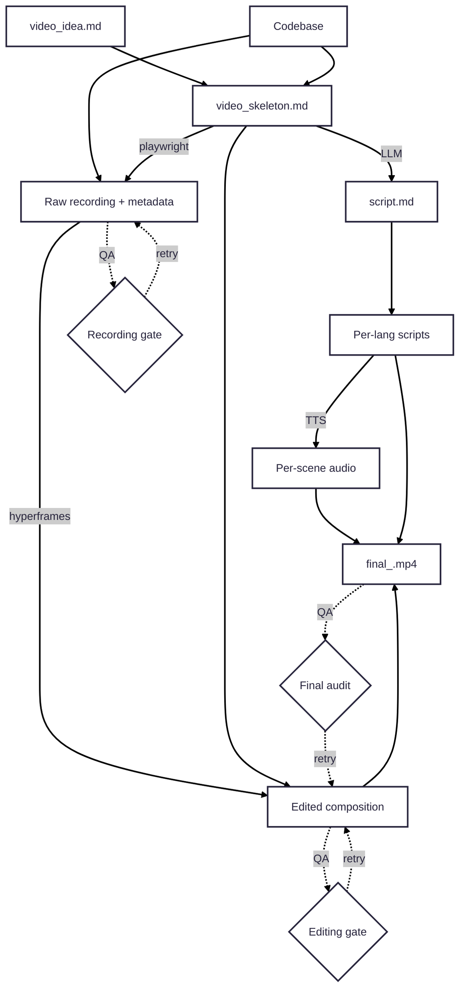

# Pipeline Overview

The orchestrating agent runs: **idea → skeleton → recording → editing → voiceover → final output**, with QA gates after recording, editing, and assembly.

## Toolchain

| Tool | Role |
|------|------|
| **Coding agent** | Orchestration, decision-making |
| **Playwright** | Browser automation for screen recording |
| **Ghost-cursor** | Human-like cursor (version-fragile — see [lessons-learned.md](./lessons-learned.md)) |
| **HyperFrames** | Editing, captions, motion graphics, render |
| **ElevenLabs / OpenAI** | Cloud TTS |
| **edge-tts / Kokoro** | Local TTS fallbacks |
| **Whisper** | Transcription (`hyperframes transcribe`) |
| **ffmpeg** | Re-encode, keyframe extraction, audio mix |

## Pipeline diagram



## Environment variables & secrets

Store all credentials in **`marketing/video/.env`** (gitignored):

```env
TM_USERNAME="demo@example.com"
TM_PASSWORD="your_password"
# ELEVEN_LABS_API_KEY="..."
# OPENAI_API_KEY="..."
```

Never commit `.env`. Prefer a **marketing demo account** with generic display name and healthy dashboard state — see [agents/recording.md](./agents/recording.md#account-pre-flight).
