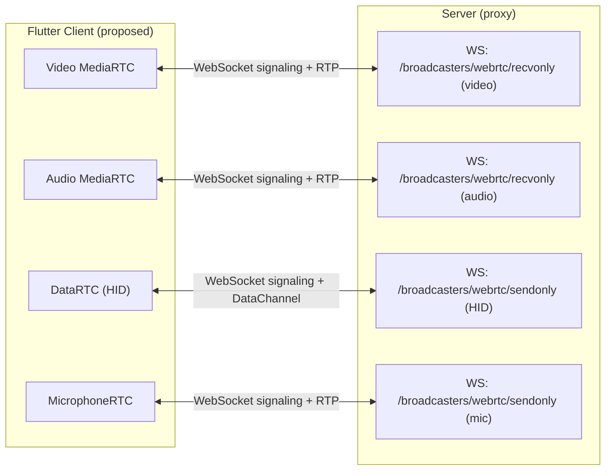
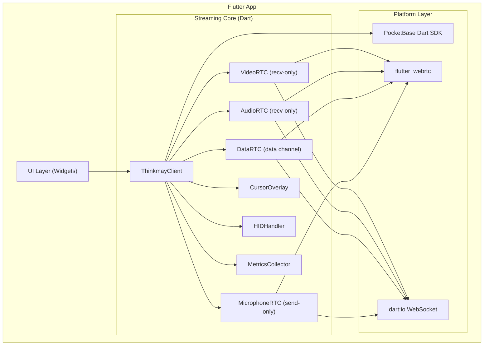

# Flutter Streaming Client — Feasibility Analysis

## Product Overview

Thinkmay CloudPC is a cloud gaming/desktop service streaming Windows 11 VMs at up to 4K/240fps via WebRTC. The current client is **browser-only** (React/Next.js PWA). This document analyzes whether we can build a **native Flutter client** that replicates the full streaming protocol.

---

## Current Streaming Protocol Architecture

The client establishes **4 independent WebRTC connections** via WebSocket signaling, each serving a distinct purpose:



### Signaling Protocol (all 4 connections share this)

Every WebRTC connection follows an identical WebSocket-based signaling flow:

1. **Client → WS connect** to `wss://{host}:444/broadcasters/webrtc/{recvonly|sendonly}?token={id}&vmid={vmid}&...`
2. **Server → `open` event** with `{username, password}` — TURN/STUN credentials
3. **Client creates `RTCPeerConnection`** with `{turn:{host}:3478, stun:{host}:3478}`
4. **SDP exchange**: Server sends `offer` → Client responds with `answer` (for video/audio). For HID/mic: Client sends `offer` → Server responds with `answer`.
5. **ICE candidate trickle**: Both sides exchange `ice` events via WebSocket
6. **Binary control messages**: Client sends `Uint8Array([type, ...data])` via WS for framerate/bitrate/IDR/pointer commands (defined by `MessageType` enum)

### URL Query Parameters

| Param           | Values         | Purpose                          |
| --------------- | -------------- | -------------------------------- |
| `token`       | UUID           | Session auth token (5s TTL)      |
| `vmid`        | UUID           | Target VM identifier             |
| `mtu`         | `1200`       | RTP packet MTU                   |
| `fec`         | `true/false` | FlexFEC-03 enable                |
| `gcc`         | `true/false` | Google Congestion Control enable |
| `codec`       | `h264/h265`  | Preferred video codec            |
| `max_bitrate` | number (bps)   | GCC upper bound                  |
| `min_bitrate` | number (bps)   | GCC lower bound                  |
| `bitrate`     | number (bps)   | Fixed bitrate (when gcc=false)   |

---

## Component-by-Component Analysis

### 1. Video Connection (`MediaRTC` — recv-only)

**Current behavior** ([media.ts](file:///c:/tm/website/core/core/webrtc/media.ts)):

- Receives server SDP offer, applies codec preferences via `setCodecPreferences()` (H264/H265 + RTX + FlexFEC-03)
- Sets `playoutDelayHint` on receiver (0.015s HQ / 0.07s stability)
- Uses `encodedInsertableStreams` for frame watchdog (non-Safari)
- Collects `RTCStatsReport` every 1s for metrics (FPS, bitrate, packetloss, jitter, decode time, etc.)
- Sends binary control messages via WS: `[MessageType, value]` for Framerate/Bitrate/IDR/Pointer

**Flutter feasibility:**

| Feature                             | `flutter_webrtc` Support                       | Risk                                   |
| ----------------------------------- | ------------------------------------------------ | -------------------------------------- |
| WebSocket signaling                 | ✅ Native `dart:io` WebSocket                  | None                                   |
| RTCPeerConnection + SDP             | ✅ Full support                                  | None                                   |
| TURN/STUN                           | ✅ Full support                                  | None                                   |
| ICE candidate trickle               | ✅ Full support                                  | None                                   |
| `setCodecPreferences()`           | ✅ Supported via transceivers                    | Low                                    |
| H.264 hardware decode               | ✅ Native on all platforms                       | None                                   |
| H.265/HEVC hardware decode          | ⚠️ Supported on iOS/Android (device-dependent) | Medium — varies by chipset            |
| FlexFEC-03 negotiation              | ⚠️ Inherited from libwebrtc                    | Medium — needs SDP verification       |
| `playoutDelayHint`                | ⚠️ Partial — may need native code             | High — critical for latency           |
| Insertable Streams (frame watchdog) | ❌ Not supported on mobile                       | Medium — can use alternative watchdog |
| `getStats()` metrics              | ✅ Supported                                     | Low                                    |
| Binary WS control messages          | ✅ Native WebSocket binary frames                | None                                   |

### 2. Audio Connection (`MediaRTC` — recv-only)

**Current behavior**: Same `MediaRTC` class as video, but assigns stream to `HTMLAudioElement`.

**Flutter feasibility:**

| Feature                | `flutter_webrtc` Support              | Risk   |
| ---------------------- | --------------------------------------- | ------ |
| Opus audio decode      | ✅ Standard                             | None   |
| Audio playback routing | ✅ Via `RTCVideoRenderer` audio track | Low    |
| `playoutDelayHint`   | ⚠️ Same concern as video              | Medium |

### 3. HID / Data Channel (`DataRTC`)

**Current behavior** ([data.ts](file:///c:/tm/website/core/core/webrtc/data.ts)):

- Client creates `RTCDataChannel("data", {ordered: true, maxRetransmits: 3})`
- Client creates SDP offer → sends to server → receives answer
- **Send**: HID events as `Uint32Array` binary — each event is `[EventCode, param1, param2, param3]`
- **Receive**: Binary messages for gamepad rumble, cursor updates, notifications, ping

**HID Event Protocol** ([keys.model.ts](file:///c:/tm/website/core/core/models/keys.model.ts)):

| Code      | Event              | Data                                                              |
| --------- | ------------------ | ----------------------------------------------------------------- |
| `0`     | ping               | —                                                                |
| `1`     | mouse_move_abs     | `(x * 2^32, y * 2^32, 0)`                                       |
| `2`     | mouse_move_rel     | `(dX + 16384, dY + 16384, 0)`                                   |
| `3`     | mouse_wheel        | `(deltaY + 2048, deltaX + 2048, 0)`                             |
| `4`     | mouse_up           | `(button, 0, 0)`                                                |
| `5`     | mouse_down         | `(button, 0, 0)`                                                |
| `6`     | key_up             | `(keycode, 0, 0)`                                               |
| `7`     | key_down           | `(keycode, 0, 0)`                                               |
| `8`     | key_up_scancode    | `(keycode, 0, 0)`                                               |
| `9`     | key_down_scancode  | `(keycode, 0, 0)`                                               |
| `10`    | key_reset          | `(0, 0, 0)`                                                     |
| `11`    | gamepad_connect    | `(gid, 0, 0)`                                                   |
| `12`    | gamepad_disconnect | `(gid, 0, 0)`                                                   |
| `13`    | gamepad_slider     | `(gid, index, val_normalized)`                                  |
| `14`    | gamepad_axis       | `(gid, index, val_normalized)`                                  |
| `15`    | gamepad_button     | `(gid, index, pressed)`                                         |
| `16`    | gamepad_rumble     | `(gid, weak, strong)` — **incoming**                     |
| `17`    | clipboard_set      | `[EventCode.cs, 0, 0, 0, ...utf8bytes]` — **Uint8Array** |
| `18`    | notification       | text —**incoming**                                         |
| `19-21` | touch_down/move/up | `(id, x * 2^32, y * 2^32)`                                      |
| `22`    | cursor_update      | binary PNG + metadata —**incoming**                        |
| `23`    | cursor_position    | x,y,visible,id,timestamp —**incoming**                     |

**Flutter feasibility:**

| Feature               | `flutter_webrtc` Support               | Risk   |
| --------------------- | ---------------------------------------- | ------ |
| DataChannel creation  | ✅ Full support                          | None   |
| Binary send/receive   | ✅`RTCDataChannelMessage.fromBinary()` | None   |
| Uint32Array encoding  | ✅`ByteData` / `Uint32List` in Dart  | None   |
| Keyboard input events | ⚠️ Needs platform-specific handling    | Medium |
| Touch input mapping   | ✅ Flutter gesture system                | None   |
| Gamepad input         | ⚠️ Needs platform plugin               | Medium |
| Clipboard sync        | ✅`flutter/services` clipboard         | Low    |

### 4. Microphone Connection (`MicrophoneRTC`)

**Current behavior** ([microphone.ts](file:///c:/tm/website/core/core/webrtc/microphone.ts)):

- Client captures local mic via `getUserMedia({audio: true})`
- Adds audio track to PeerConnection
- Sets codec preference to `audio/opus` (48000Hz, 2ch)
- Creates SDP offer → sends to server → receives answer

**Flutter feasibility:**

| Feature           | `flutter_webrtc` Support                           | Risk |
| ----------------- | ---------------------------------------------------- | ---- |
| Mic capture       | ✅`navigator.mediaDevices.getUserMedia` equivalent | None |
| Opus codec        | ✅ Standard                                          | None |
| Codec preferences | ✅ Via transceiver                                   | Low  |

### 5. Cursor System

**Current behavior** ([cursor.ts](file:///c:/tm/website/core/core/cursor.ts)):

- Receives binary cursor data via DataChannel (position + PNG image)
- Implements **motion interpolation** with 32ms glide paths
- Smooths clock drift between server/client using exponential moving average
- Tracks hotspot, width, height for proper positioning
- Two modes: `client_cursor` (overlay ``) vs CSS `cursor: url()` native

**Flutter replication:**

- ✅ Can render cursor as `Positioned` widget over video
- ✅ Can decode PNG from binary data
- ✅ Can implement interpolation with `Ticker`/`AnimationController`
- ✅ BigInt nanosecond timestamps available in Dart
- ⚠️ Native cursor style manipulation is N/A (overlay approach only)

### 6. Video Sink (VSync Pipeline)

**Current behavior** ([video/wrapper.ts](file:///c:/tm/website/core/core/sink/video/wrapper.ts)):

- VSync mode: Uses `MediaStreamTrackProcessor` + `MediaStreamTrackGenerator` to extract frames, buffer 2 frames max, and render via `requestAnimationFrame`
- Non-VSync: Direct `srcObject` assignment

**Flutter replication:**

- `flutter_webrtc` provides `RTCVideoRenderer` which handles native rendering
- VSync frame pacing is handled by the native rendering pipeline
- ⚠️ No equivalent of `MediaStreamTrackProcessor` — but not needed since Flutter's rendering engine handles frame pacing natively

### 7. API / Session Management

**Current behavior** ([api/index.ts](file:///c:/tm/website/core/api/index.ts)):

- Auth via PocketBase SDK
- `StartThinkmay()` → SSE-based deployment with queue position updates
- `ParseRequest()` → constructs WebSocket URLs from listener tokens
- Session lifecycle: `GetInfo()` → `StartThinkmay()` → `ParseRequest()` → connect

**Flutter replication:**

- ✅ PocketBase has a Dart SDK ([`pocketbase`](https://pub.dev/packages/pocketbase))
- ✅ SSE via `dart:io` HttpClient or `eventsource` package
- ✅ URL construction is trivial string manipulation

---

## Risk Matrix Summary

| Risk Level         | Component            | Issue                                            | Mitigation                                                                                  |
| ------------------ | -------------------- | ------------------------------------------------ | ------------------------------------------------------------------------------------------- |
| 🔴**High**   | `playoutDelayHint` | Not exposed in flutter_webrtc on mobile          | Fork flutter_webrtc to add native binding; or accept slightly higher baseline latency       |
| 🟡**Medium** | H.265 HEVC           | Device-dependent hardware support                | Fallback to H.264; detect capabilities at runtime                                           |
| 🟡**Medium** | FlexFEC              | Inherited from libwebrtc, needs SDP verification | Test on target devices; fallback to NACK-only                                               |
| 🟡**Medium** | Insertable Streams   | Not available on mobile                          | Replace with timeout-based frame watchdog (already a fallback in the web client for Safari) |
| 🟡**Medium** | Gamepad support      | No built-in Flutter gamepad API                  | Use `gamepads` package or platform channels                                               |
| 🟡**Medium** | Physical keyboard    | Platform-specific key events + scancode mode     | Use `RawKeyboardListener` + `HardwareKeyboard`                                          |
| 🟢**Low**    | Everything else      | Full compatibility                               | —                                                                                          |

---

## Proposed Flutter Architecture



### Key Files to Create

| File                                    | Purpose                        | Based on                                                                 |
| --------------------------------------- | ------------------------------ | ------------------------------------------------------------------------ |
| `lib/core/thinkmay_client.dart`       | Main orchestrator              | [index.ts](file:///c:/tm/website/core/core/index.ts)                        |
| `lib/core/webrtc/media_rtc.dart`      | WebRTC media signaling         | [media.ts](file:///c:/tm/website/core/core/webrtc/media.ts)                 |
| `lib/core/webrtc/data_rtc.dart`       | WebRTC data channel            | [data.ts](file:///c:/tm/website/core/core/webrtc/data.ts)                   |
| `lib/core/webrtc/microphone_rtc.dart` | Microphone sender              | [microphone.ts](file:///c:/tm/website/core/core/webrtc/microphone.ts)       |
| `lib/core/hid/hid_handler.dart`       | Keyboard/mouse input           | [hid.ts](file:///c:/tm/website/core/core/hid/hid.ts)                        |
| `lib/core/hid/touch_handler.dart`     | Touch input → trackpad/native | [touch.ts](file:///c:/tm/website/core/core/hid/touch.ts)                    |
| `lib/core/models/hid_msg.dart`        | HID binary protocol            | [keys.model.ts](file:///c:/tm/website/core/core/models/keys.model.ts)       |
| `lib/core/models/metrics.dart`        | Streaming metrics              | [metrics.model.ts](file:///c:/tm/website/core/core/models/metrics.model.ts) |
| `lib/core/cursor/cursor_overlay.dart` | Interpolated cursor rendering  | [cursor.ts](file:///c:/tm/website/core/core/cursor.ts)                      |
| `lib/core/api/session.dart`           | PocketBase auth + session mgmt | [api/index.ts](file:///c:/tm/website/core/api/index.ts)                     |
| `lib/core/utils/platform.dart`        | Platform detection             | [platform.ts](file:///c:/tm/website/core/core/utils/platform.ts)            |
| `lib/core/utils/keymap.dart`          | JS key → scancode conversion  | [convert.ts](file:///c:/tm/website/core/core/utils/convert.ts)              |

### Flutter Dependencies

```yaml
dependencies:
  flutter_webrtc: ^0.12.x       # Core WebRTC
  pocketbase: ^0.x.x             # Auth + API
  web_socket_channel: ^3.x       # WebSocket signaling  
  gamepads: ^0.x.x               # Gamepad input (optional)
```

---

## Open Questions

> [!IMPORTANT]
> **Target Platforms**: Which platforms should the Flutter app target? Android + iOS only, or also Desktop (Windows/macOS/Linux)?
> Desktop targets would give us keyboard/mouse for free but add scope. Mobile-only would focus on touch/gamepad.

> [!IMPORTANT]
> **playoutDelayHint Priority**: The browser client sets this to 15ms (HQ) / 70ms (stability). If flutter_webrtc doesn't expose this natively, are we willing to fork the package or accept ~50-100ms additional baseline latency?

> [!WARNING]
> **Gamepad Rumble**: The web client uses `navigator.vibrate()` as a fallback when no gamepad is connected. Flutter can vibrate on mobile via `HapticFeedback`, but full dual-motor rumble requires native gamepad APIs which are limited on iOS.

> [!NOTE]
> **Scope**: Should the Flutter app include the full dashboard (payment, store, settings, storage), or only the streaming view? A streaming-only client would be significantly smaller in scope while still proving the core protocol works.

## Verification Plan

### Automated Tests

- Unit test the HID binary encoding (`HIDMsg.buffer()`) against the TypeScript reference
- Unit test the cursor interpolation math
- Integration test WebSocket signaling flow against a mock server

### Manual Verification

- Connect to a live Thinkmay deployment and verify video/audio/input end-to-end
- Measure latency with on-screen timer comparison
- Test H.264 and H.265 codec negotiation on multiple devices
- Verify gamepad input and rumble feedback
