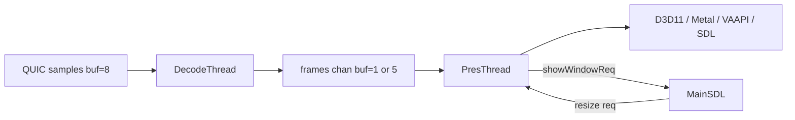

# Desktop client video pipeline

This document describes the decode → present path in `worker/proxy/client`.

## Thread model

| Thread | Priority | Role |
|--------|----------|------|
| Decode | Time-critical | QUIC samples → FFmpeg HW decode → frame channel |
| Presentation | Highest | Pacer → `WaitToRender` → GPU present |
| Main (SDL) | Normal | Window show, resize requests, HID input |
| Cursor | Normal | Fullscreen composited cursor GPU state |

Orchestration lives in [`pipeline/`](../pipeline/). The app implements `pipeline.Host` via [`app/pipeline_host.go`](../app/pipeline_host.go).



## Backpressure

- QUIC video samples channel: buffer **8**
- Decoded frames channel: **1** with `-vsync` (no frame-pacing), else **5**
- Push uses drop-oldest when the presentation thread is blocked

## Zero-copy paths

| OS | Presenter | Decoder | Path |
|----|-----------|---------|------|
| Windows | `d3d11` | D3D11VA or CUDA | HW texture → VideoProcessorBlt → swapchain |
| Windows | `d3d11` | CUDA (HEVC/AV1 auto) | NVDEC → map to D3D11 → present |
| macOS | `metal` | VideoToolbox | CVPixelBuffer → Metal |
| Linux | `vaapi-egl` | VAAPI | EGL import |
| Any | `sdl` / `software-debug` | Any compatible HW | CPU transfer → SDL upload |

Windows HEVC/AV1 with `-hwaccel=auto` prefers **CUDA before D3D11VA** (see `decoder/preferredHardwareDevices`).

## Config matrix

| Flag | Effect |
|------|--------|
| `-vsync` | Present tied to display refresh; decode buffer = 1 |
| `-frame-pacing` | Requires `-vsync`; Moonlight dual-queue pacer |
| `-hwaccel=auto` | Platform preference order with fallbacks |
| `-hwaccel=cuda` | Force CUDA (Windows) |
| `-present=software-debug` | SDL CPU upload path for diagnostics; `-hwaccel=none` maps to auto + copy path |

## Recovery flows

1. **Decode error** → set `waitingForIDR`, request IDR, skip non-keyframes
2. **Decode stall (8s without QUIC samples after first frame, 20s before)** → `[boot]` log, async reconnect all QUIC channels
3. **Stream close** → reconnect; on success `ResetAfterReconnect()` flushes decoder + frame queue + IDR
4. **Resolution change** → `Resolution` control + IDR, flush presentation queues, `NotifyStreamSize`
5. **Window resize** → main thread queues resize; presentation thread drains GPU then `ResizeBuffers` (never during `Present`)
6. **D3D11 device removed** → recreate swapchain, log, request IDR

## First frame

1. Window created hidden in `NewApp`
2. First `presentFrame` calls `ensureStreamWindowShown()` before `WaitToRender`
3. Main thread handles `showWindowReq` → `Show()` / `Raise()`
4. `connectui.Ready()` after first successful present

## Known limitations

- Video is stretch-scaled to the window (no letterboxing)
- Fullscreen cursor updates at display Hz but only appears on screen with the next video frame (avoids a second DXGI present that stalls video)
- `-frame-pacing` alone has no effect without `-vsync`

## Windows validation checklist

Run on a discrete GPU machine (e.g. RTX 3060 Ti):

- [ ] HEVC `-hwaccel=auto` selects CUDA, video plays
- [ ] Connect UI → stream window within 20s
- [ ] Esc×2 fullscreen toggle — no crash / exit status 5
- [ ] Window resize during stream — no permanent black screen
- [ ] Network drop → reconnect → video resumes after IDR
- [ ] Pause encode 10s → decode stall triggers reconnect

## Tests

```bash
cd worker/proxy
go test ./client/pipeline/... ./client/decoder/... ./client/app/...
```
