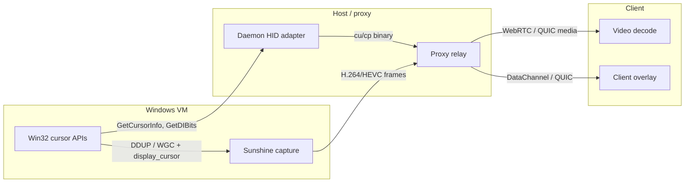
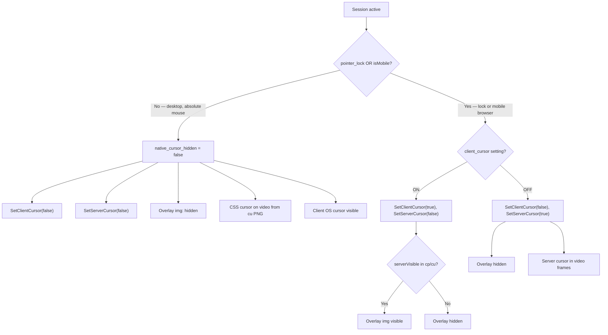
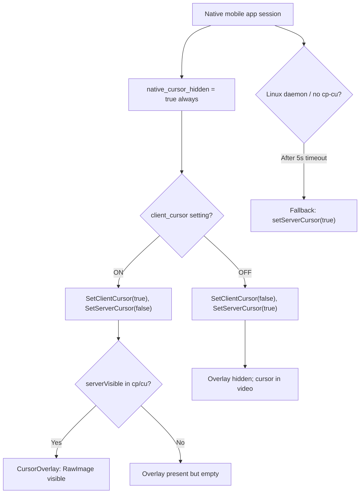
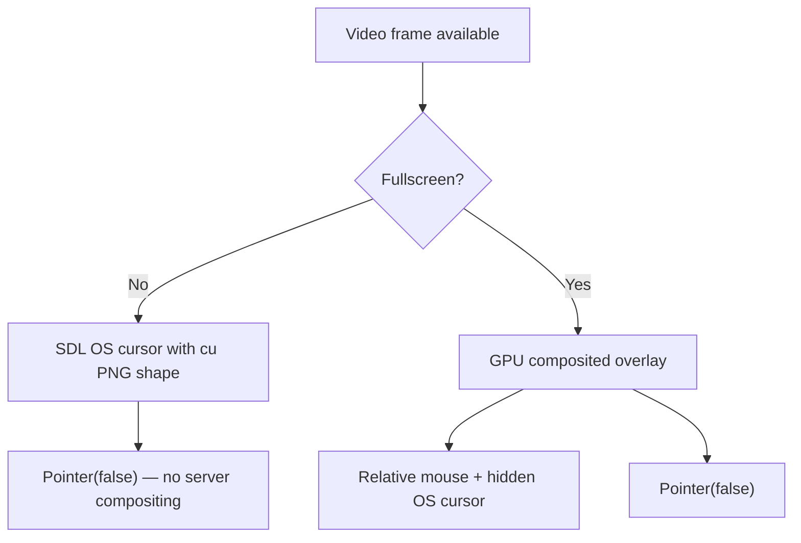

# Cursor Render Behavior

Canonical reference for how the remote cursor is produced on the server, transported to clients, and displayed on screen. This document supersedes scattered notes in `input_mode_controls.md` §2 and §4.1 where they conflict with PWA implementation.

**Scope:** PWA (`website/`), native mobile app (`mobile/`), desktop Go client (`worker/proxy/client/`), and server-side producers (Sunshine + daemon HID).

**Related docs:**
- [Input mode controls](./input_mode_controls.md) — user-facing toggles (gaming mode, client cursor, native touch)
- [Client protocol contract](./client_protocol_contract.md) — §5 `cp`/`cu` wire format, §3 `Pointer` control message
- [Client platform divergence](./client_platform_divergence.md) — platform-specific deltas
- [Desktop client architecture](../../../desktop_client_architecture.md) — Go client presentation pipeline

---

## 1. Terminology

Three distinct concepts appear in code and settings. They must not be conflated.

### 1.1 Server cursor (composited in video)

| Attribute | Detail |
|-----------|--------|
| **What** | The Windows guest cursor is **drawn into the encoded video frames** before they reach the client. The user sees the pointer as part of the decoded video texture. |
| **Producer** | **Sunshine** (guest capture/encode), not the daemon HID adapter. |
| **Control** | Client sends **`MessageType.Pointer`** (`[0, 0\|1]`) on the **video** signaling/WebRTC channel → IVSHMEM media control → Sunshine sets global `display_cursor`. |
| **Default** | `display_cursor = false` in Sunshine until the client explicitly enables it. |
| **Latency** | Lowest perceived latency for cursor position (baked into the same frame as desktop content), but cursor edges can look soft after video compression. |
| **Aliases in code** | `SetServerCursor`, `server_cursor`, `serverVisible` (server-side visibility in packets is a different field — see §1.2), `ivshmem.Pointer`, composited / baked-in cursor |

### 1.2 Client cursor overlay (client-rendered PNG overlay)

| Attribute | Detail |
|-----------|--------|
| **What** | The client decodes **`cu`** PNG bytes and draws a **separate cursor image on top of the video**, positioned from **`cp`/`cu`** coordinates with 32 ms interpolation. |
| **Producer (packets)** | **Daemon HID adapter** (Windows only): polls `getCursor()` → emits `cu` (~10 Hz) and `cp` (on mouse feedback). **Not produced by Sunshine.** Linux daemon stub returns `"not implemented"` — no packets. |
| **Transport** | IVSHMEM data queue → proxy → WebRTC DataChannel (PWA/mobile) or QUIC data stream (desktop). |
| **User setting** | **`client_cursor`** toggle (Advanced Settings / control panel). Controls whether this overlay is *allowed* to show when the OS cursor is hidden. |
| **Final visibility** | `serverVisible_from_packet && client_cursor_effective` — both must be true. `serverVisible` comes from the `visible` byte in the latest `cp`/`cu` packet (e.g. hidden during fullscreen video playback on guest). |
| **Aliases in code** | `SetClientCursor`, `_client_cursor`, `` overlay (PWA), `CursorOverlay` / `showServer` (mobile), composited GPU cursor (desktop fullscreen), `client_cursor` field in `cursor.ts` |

### 1.3 Client OS cursor (native / CSS cursor)

| Attribute | Detail |
|-----------|--------|
| **What** | The **local operating system pointer** the user moves on their device, optionally styled with the remote cursor shape. On PWA desktop this includes **`video.style.cursor = url(png)`** set on every `cu` packet — the browser renders the remote cursor icon at the **local mouse position** without a separate overlay ``. |
| **Producer** | OS / browser; cursor **shape** still comes from `cu` PNG on PWA. |
| **Position source** | **Local pointer** (mouse, trackpad, touch-as-mouse on desktop). Not server-interpolated. |
| **When visible** | When **`native_cursor_hidden = false`**: desktop browser without pointer lock; desktop Go client in **windowed** mode. |
| **Aliases in code** | Native cursor, OS cursor, CSS cursor, SDL system cursor (`CreateColorCursor`), `video.style.cursor`, mobile `nativeCursorReplacement` path (**non-PWA — to be removed**) |

### Summary matrix

| Term | Rendered by | Position from | Image from | Controlled by |
|------|-------------|---------------|------------|---------------|
| **Server cursor** | Sunshine → video encoder | Guest desktop | Guest capture (DDUP/WGC blend) | `Pointer(1)` message |
| **Client cursor overlay** | Client compositor | `cp`/`cu` packets (interpolated) | `cu` PNG | `client_cursor` setting + packet `visible` |
| **Client OS cursor** | OS / browser / SDL | Local pointer | `cu` PNG (PWA CSS) or OS default | Platform; hidden when pointer lock / input lock |

---

## 2. Server-side architecture

Two **independent** server paths run in parallel. Clients coordinate them so only one is *visible* at a time.



### 2.1 Sunshine — server cursor (video compositing)

| File | Role |
|------|------|
| `worker/sunshine/src/globals.cpp` | `display_cursor` global (default **false**) |
| `worker/sunshine/src/main.cpp` | Reads IVSHMEM `EventType::Pointer` → sets `display_cursor` |
| `worker/sunshine/src/platform/windows/display_vram.cpp` | DDUP: GPU blend of pointer shape onto capture texture |
| `worker/sunshine/src/platform/windows/display_ram.cpp` | DDUP: CPU blend |
| `worker/sunshine/src/platform/windows/display_wgc.cpp` | WGC: `IsCursorCaptureEnabled` API toggle |

**When Sunshine composites:** `display_cursor == true` AND pointer visible in capture API (`PointerPosition.Visible` / shape flags).

**When Sunshine does not composite:** `display_cursor == false` (client requested server cursor off) — desktop pixels in video have **no cursor baked in**.

### 2.2 Daemon HID — client cursor overlay packets

| File | Role |
|------|------|
| `worker/daemon/utils/hid/adapter_windows.go` | `getCursor()` via Win32 APIs → PNG + hotspot + visibility |
| `worker/daemon/utils/hid/adapter_linux.go` | Stub — **no `cp`/`cu` generated** |
| `worker/daemon/utils/hid/hid.go` | `sendCursorImage()` every ~100 ms (`cu`); `sendCursorPos()` on mouse sync (`cp`) |

Sunshine **never** emits `cp`/`cu`. If the Linux daemon is used, clients that rely on overlay packets need the **5 s fallback** to enable server cursor (mobile implements this; PWA does not).

---

## 3. Client → server control message

| Message | Channel | Payload | Effect |
|---------|---------|---------|--------|
| **`Pointer` (type 0)** | Video WebRTC (PWA/mobile) or QUIC control (desktop) | `[0, 0]` disable / `[0, 1]` enable | Sunshine `display_cursor`; toggles server cursor in video |

**Outbound naming:**

| Client | API |
|--------|-----|
| PWA | `Thinkmay.SetServerCursor(enable)` → `website/core/core/index.ts` |
| Mobile | `ThinkmayClient.setServerCursor(enable)` → `mobile/lib/core/index.dart` |
| Desktop | `ivshmem.Pointer(enable)` → `worker/proxy/util/ivshmem/common.go` |

---

## 4. Inbound cursor packets (`cp` / `cu`)

Canonical wire format: [Client protocol contract §5](./client_protocol_contract.md).

| Code | Name | Carries PNG? | Purpose |
|------|------|--------------|---------|
| 23 | `cp` | No | Position, `visible`, cursor ID, server timestamp |
| 22 | `cu` | Yes | Position, hotspot, size, `visible`, ID, timestamp, PNG bytes |

**Shared client parsing behavior (PWA + mobile):**
- Drop stale packets: `serverTime <= maxServerTime`
- Map normalized coords through letterboxed video content rect
- Subtract hotspot for overlay anchor
- 32 ms interpolation between packet timestamps; EMA clock offset (α = 0.1)

**PWA-only on `cu`:** always updates `video.style.cursor = url(png)` in addition to overlay `img.src` — even when overlay is hidden.

---

## 5. PWA reference logic (canonical)

Source: `website/app/[locale]/remote/page.tsx` (sync loop, ~1 Hz) + `website/core/core/cursor.ts`.

### 5.1 Coordination inputs

| Input | Source | Meaning |
|-------|--------|---------|
| `pointer_lock` | Redux; mirrors DOM `document.pointerLockElement` | OS cursor hidden; raw mouse deltas |
| `isMobile` | Redux `state.popup.isMobile` | Treat as touch-primary client; OS cursor always considered hidden for coordination |
| `client_cursor` | Redux user setting | User wants client overlay vs server cursor when native is hidden |

### 5.2 Coordination formulas

```typescript
const native_cursor_hidden = pointer_lock || isMobile;
const server_cursor        = native_cursor_hidden && !client_cursor;
const _client_cursor       = native_cursor_hidden && client_cursor;

SetClientCursor(_client_cursor);   // gates overlay img display
SetServerCursor(server_cursor);    // gates Sunshine compositing
```

### 5.3 Overlay display (inside `cursor.ts`)

```typescript
const display = serverVisible && client_cursor ? 'block' : 'none';
```

`client_cursor` here is already the **effective** value from coordination (`_client_cursor`), not the raw user setting.

### 5.4 PWA decision tree



### 5.5 PWA mode table

| Context | `pointer_lock` | `isMobile` | `client_cursor` | Client overlay | Server cursor | Client OS / CSS cursor |
|---------|----------------|------------|-----------------|----------------|---------------|------------------------|
| Desktop browser | off | off | ON | **Hidden** | off | **CSS `cursor: url()` on video** |
| Desktop browser | off | off | OFF | Hidden | off | CSS + OS default |
| Desktop browser | on | off | ON | **Visible** | off | Hidden |
| Desktop browser | on | off | OFF | Hidden | **on** | Hidden |
| Mobile browser | * | on | ON | **Visible** | off | Hidden |
| Mobile browser | * | on | OFF | Hidden | **on** | Hidden |

\* Pointer lock may also be active on mobile browsers, but `isMobile` alone forces the hidden-native path.

**Important:** On desktop without pointer lock, the user setting **"Client cursor" does not enable the overlay**. It only affects behavior when `native_cursor_hidden` is true. Desktop users see the remote cursor shape via **CSS cursor on the video element**, not the overlay ``.

---

## 6. Native mobile app — target behavior (strict PWA parity)

The Flutter app is a **mobile client**. It must follow the **PWA mobile browser** row in §5.5, not the PWA desktop CSS-cursor row and **not** a separate OTG code path.

### 6.1 PWA mapping for native mobile

| PWA input | Native mobile equivalent |
|-----------|-------------------------|
| `isMobile` | **Always `true`** — the app is always a mobile/touch-primary client |
| `pointer_lock` | **`inputLocked`** — Android `View.requestPointerCapture()` active (gaming mode input lock), **not** the `relativeMouse` setting alone |
| `client_cursor` | `RemoteSettings.clientCursor` user setting |

### 6.2 Target coordination (no OTG branches)

```dart
// Equivalent to PWA with isMobile = true always:
const nativeCursorHidden = true;  // always, for native mobile app
final effectiveClientCursor = clientCursorSetting;
final effectiveServerCursor = !clientCursorSetting;

setNativeCursorReplacement(false);  // remove — no CSS cursor equivalent
setClientCursor(effectiveClientCursor);
setServerCursor(effectiveServerCursor);
```

Because `isMobile` is always true, **`native_cursor_hidden` is always true** regardless of gaming mode / input lock. Gaming mode only hides the **client OS cursor** (input capture); it does not change the coordination formula on PWA mobile either.

### 6.3 Overlay display (mobile)

Same as PWA overlay path:

```dart
bool get shouldDisplay => visible && clientCursor;  // clientCursor = effective value from coordination
```

Rendered by `CursorOverlay` → `RawImage` at server-interpolated `(x, y)` from `cp`/`cu`.

**No second overlay mode** (`nativeCursorReplacement` / local-pointer PNG) — that mimicked PWA desktop CSS cursor for OTG and is **out of scope** for strict PWA mobile parity.

### 6.4 Mobile decision tree (target)



Gaming mode / input lock affects **HID** (`mmr`, pointer capture) and **client OS cursor visibility**, but **does not change** the cursor render coordination table above (same as PWA mobile browser).

### 6.5 Divergences to remove (implementation backlog)

| Current mobile code | PWA-correct behavior |
|---------------------|----------------------|
| `hasExternalMouse` / OTG detection (`otg_pointer_detection.dart`, `setHasExternalMouse`) | **Remove** — not in PWA |
| `CursorRenderingSync` OTG branches (`nativeCursorReplacement`) | **Remove** — always server-position overlay path |
| `nativeCursorReplacement` / `showNative` / `updateLocalPointer` | **Remove** — no CSS-cursor equivalent on mobile |
| `isMobile` mapped to `!hasExternalMouse` | **Replace** with constant `true` |
| `input_mode_controls.md` §4.1 table (gaming OFF → overlay OFF) | **Wrong for mobile** — contradicts PWA `isMobile` always hidden |

---

## 7. Desktop Go client

Architecturally separate from PWA/mobile WebRTC. Documented here for comparison only.

### 7.1 Modes

| Window state | Cursor render path | Position source | Server cursor (`Pointer`) |
|--------------|-------------------|-----------------|---------------------------|
| **Windowed** | SDL system cursor (`CreateColorCursor` from `cu` PNG) | **Local OS mouse** (absolute HID keeps alignment) | Always **`Pointer(false)`** in current code |
| **Fullscreen** | GPU composited overlay on video (`DrawCursor`) | **`cp`/`cu` interpolated** (`GetRenderState`) | Always **`Pointer(false)`** |

There is **no user-facing `client_cursor` toggle** on desktop. Mode is determined solely by **`isFullscreen()`**.

### 7.2 Desktop decision tree



Desktop never enables server cursor in current implementation — it always renders locally. Double-cursor is avoided by disabling Sunshine compositing, not by toggling overlay vs server at runtime.

---

## 8. Cross-platform comparison

| Aspect | PWA (desktop) | PWA (mobile browser) | Native mobile app (target) | Desktop Go |
|--------|---------------|----------------------|----------------------------|------------|
| **`isMobile` / touch-primary** | false | true | **always true** | N/A (desktop OS) |
| **Native cursor hidden when** | Pointer lock only | Always (`isMobile`) | Always | Fullscreen only |
| **Client overlay visible when** | Pointer lock + client_cursor + serverVisible | client_cursor + serverVisible | Same as PWA mobile | Fullscreen + serverVisible |
| **CSS / OS cursor path** | Yes — `video.style.cursor` | No | **No** (Flutter) | Yes — SDL windowed |
| **Server cursor fallback** | User disables client_cursor | Same | Same + **5 s no-packet fallback** | Disabled (`Pointer(false)`) |
| **OTG-specific logic** | None | None | **None (target)** | None |
| **Coordination driver** | `pointer_lock`, `isMobile`, setting | Same | `isMobile=true`, setting only | `isFullscreen()` |
| **Overlay position** | Server interpolated | Server interpolated | Server interpolated | Server interpolated (fullscreen) or local OS (windowed) |
| **`cu` transport** | WebRTC DataChannel | Same | Same | QUIC data stream |
| **`Pointer` transport** | WebRTC video WS | Same | Same | QUIC control |

---

## 9. End-to-end render stack (what the user sees)

```
┌─────────────────────────────────────────────────────────────┐
│  Layer 4 (top): Client cursor overlay  ← cp/cu, optional    │
├─────────────────────────────────────────────────────────────┤
│  Layer 3: Client OS cursor / CSS cursor  ← local pointer    │
├─────────────────────────────────────────────────────────────┤
│  Layer 2: Decoded video texture                             │
│            └ may contain server cursor (Sunshine composite) │
├─────────────────────────────────────────────────────────────┤
│  Layer 1: App chrome / letterbox padding                    │
└─────────────────────────────────────────────────────────────┘
```

**Mutual exclusion rule (PWA/mobile):** when `native_cursor_hidden`, enable **either** Layer 4 (client overlay) **or** server compositing in Layer 2 — never both.

**Desktop windowed exception:** Layer 3 (SDL cursor) replaces Layer 4; Layer 2 server compositing stays off.

---

## 10. Source file index

### PWA
| File | Role |
|------|------|
| `website/core/core/cursor.ts` | Overlay + CSS cursor + packet parsing |
| `website/app/[locale]/remote/page.tsx` | Coordination: `pointer_lock`, `isMobile`, `SetClientCursor`, `SetServerCursor` |
| `website/core/core/index.ts` | `SetServerCursor`, routes `cp`/`cu` to `Cursor` |
| `website/backend/reducers/remote.ts` | `client_cursor`, `pointer_lock`, `relative_mouse` state |

### Mobile (current + target)
| File | Role |
|------|------|
| `mobile/lib/core/cursor.dart` | Packet parsing, interpolation, overlay state |
| `mobile/lib/presentation/screen/remote/widgets/cursor_overlay.dart` | Overlay widget |
| `mobile/lib/core/cursor/cursor_rendering_sync.dart` | Coordination (**to simplify — remove OTG**) |
| `mobile/lib/presentation/screen/remote/remote_screen.dart` | Input lock ↔ pointer_lock equivalent |
| `mobile/lib/core/hid/otg_pointer_detection.dart` | **To remove** |

### Desktop
| File | Role |
|------|------|
| `worker/proxy/client/app/cursor_overlay.go` | Composited vs SDL routing |
| `worker/proxy/client/app/client_cursor.go` | SDL system cursor |
| `worker/proxy/client/app/cursor.go` | `CursorTracker`, interpolation |
| `worker/proxy/client/app/app.go` | `syncCursorState`, `Pointer(false)` |

### Server
| File | Role |
|------|------|
| `worker/sunshine/src/platform/windows/display_vram.cpp` | Server cursor GPU blend |
| `worker/daemon/utils/hid/hid.go` | `cp`/`cu` generation |
| `worker/daemon/utils/hid/adapter_windows.go` | Win32 `getCursor()` |

---

## 11. Known edge cases

| Case | Behavior |
|------|----------|
| Linux daemon (no `getCursor`) | No `cp`/`cu`; mobile enables server cursor after 5 s if overlay wanted |
| Guest hides cursor (`visible=0` in packet) | Overlay hidden even if `client_cursor` ON |
| Toggle client cursor in settings | PWA syncs at ~1 Hz; mobile syncs on settings change |
| Exit gaming mode / release pointer lock | PWA: coordination unchanged on mobile web (`isMobile` still true). Native mobile: same — overlay stays governed by `client_cursor` setting |
| Double cursor bug | Caused by server compositing ON while client overlay also visible — prevented by §5.2 formulas |
| Desktop Go | Server cursor permanently off; local render always |

---

## 12. Corrections to existing docs

| Document | Issue | Correction |
|----------|-------|------------|
| `input_mode_controls.md` §4.1 | Table says gaming OFF → client overlay OFF on mobile | **Incorrect for PWA mobile.** With `isMobile=true`, overlay follows `client_cursor` regardless of gaming mode. Update when implementing mobile fix. |
| `input_mode_controls.md` §2.2 | Lists only overlay + server cursor | Add **client OS / CSS cursor** as third path (§1.3 above). |
| Mobile `CursorRenderingSync` comments | Maps `isMobile` to `!hasExternalMouse` | **Wrong.** Native app should treat `isMobile = true` always. |

---

## 13. Implementation checklist (mobile)

- [x] Remove `hasExternalMouse`, `setHasExternalMouse`, `otg_pointer_detection.dart`, OTG unit tests
- [x] Remove `nativeCursorReplacement`, `showNative`, `updateLocalPointer`, `MouseRegion` local-pointer path
- [x] Simplify `CursorRenderingSync` to constant `isMobile=true` coordination (§6.2)
- [x] Keep `inputLocked` for HID only; cursor coordination does not branch on it
- [x] Exit gaming control releases input lock only (PWA pointer-lock exit); setting stays on
- [x] Update `input_mode_controls.md` §4.1 to match this document
