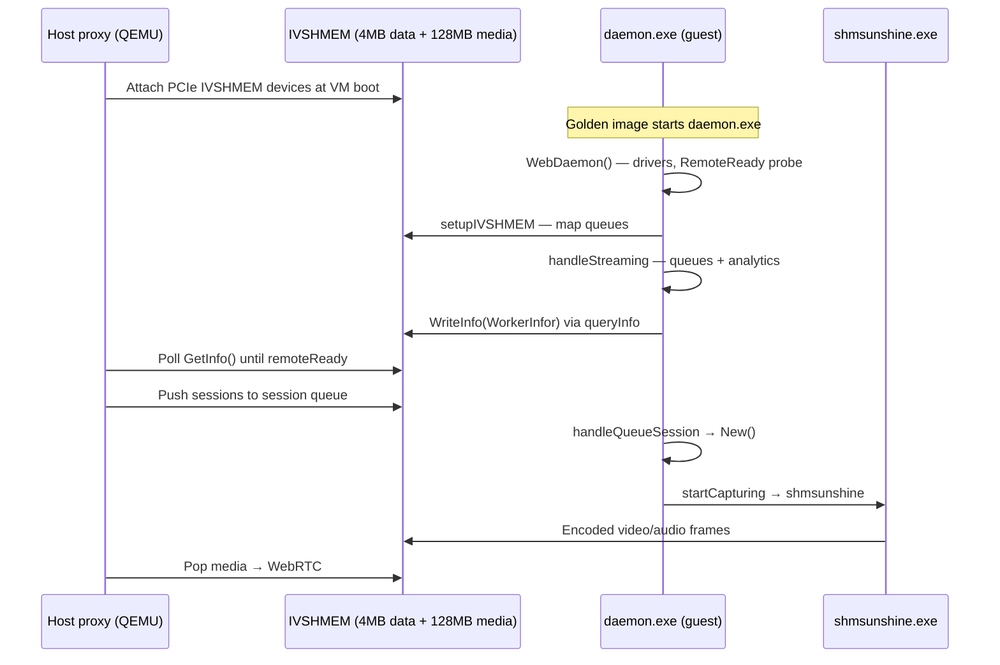
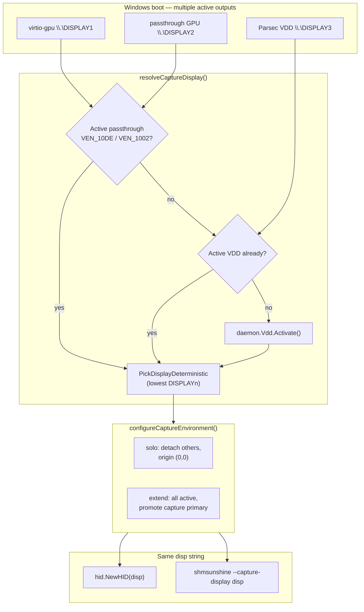

# Windows Guest `daemon.exe` Bootup Process

This document describes how `daemon.exe` starts inside a Thinkmay CloudPC **Windows 11 guest VM**, from process entry through the streaming pipeline. The guest daemon is distinct from the **Linux worker daemon** (`virtdaemon`), which runs on host nodes for cluster orchestration, VM deployment, and PocketBase integration.

**Related docs**

- [Technical architecture](./technical_doc.md) — end-to-end streaming, IVSHMEM doorbells, proxy ↔ guest bridge
- [Windows bundle](./windows_bundle.md) — installer layout and CI artifact paths
- [Windows display & capture](./windows_display_capture.md) — capture display selection inside `handleStreaming`
- [Client protocol contract](./client_protocol_contract.md) — HID and signaling protocols

## Role in the system

`daemon.exe` is the **guest-side agent**. It does not run WebRTC or QEMU. Its job is to:

1. Map IVSHMEM segments the host proxy attaches via PCIe passthrough
2. Bridge HID input, microphone audio, and session commands between shared memory and Windows APIs
3. Resolve a capture display, configure desktop topology, and launch `shmsunshine.exe` (Sunshine)
4. Publish `WorkerInfor` (including `remoteReady`) into the 4 MB data IVSHMEM block so the host proxy can proceed with deployment

The host proxy (`worker/proxy`) blocks on that `remoteReady` flag before pushing session commands and opening the WebRTC path. See `worker/proxy/internal.go`.



## Install layout and autostart

The NSIS installer (`windows_installer.nsi`) copies the runtime bundle to `$DESKTOP\thinkmay` (or an equivalent path such as `D:\binary`). `daemon.exe` resolves its asset root from `os.Executable()` (`worker/daemon/utils/path/path.go`):

| Path variable | Example |
|---------------|---------|
| `path.Base` | Directory containing `daemon.exe` |
| `path.ShmSunshine` | `{Base}/shmsunshine.exe` |
| `path.Manifest` | `{Base}/cluster.yaml` |
| `path.WorkerInfo` | `{Base}/workerinfo.json` |
| `path.Log` | `{Base}/thinkmay.log` |

Subdirectories (`display/`, `ivshmem/`, `audio/`, `microphone/`, `gamepad/`, `storage/`, etc.) are installed beside the executable per [windows_bundle.md](./windows_bundle.md).

**Autostart** is not implemented in this repository's Go sources. The golden Windows image is expected to launch `daemon.exe` at user logon or via a scheduled task so it is running when the host attaches IVSHMEM and the user session becomes interactive. The installer also registers the `thinkmay://` URL protocol to invoke `daemon.exe %1` for encrypted CLI sessions (local tooling, not the normal CloudPC boot path).

## Phase 1: Process entry (`cmd/setup.go`)

`main()` wraps the full daemon lifecycle in a supervised goroutine:

1. **Logging** — Appends structured lines to `thinkmay.log` via a log callback.
2. **pprof** — An `init()` hook starts `http.ListenAndServe("localhost:5050", nil)` for runtime profiling.
3. **`Start(stop)`** — Runs the boot sequence (Phase 2).
4. **Memory watchdog** — Every 5 minutes, runs `runtime.GC()` and logs allocation deltas. If heap exceeds 1 GB, sends `stop` and exits.
5. **Shutdown** — Handles `SIGTERM` / `Ctrl+C`, drains sessions, calls `dm.Stop()`.

## Phase 2: `Start()` prelude (`cmd/main.go`)

```text
ExecuteCli()           → normal VM boot unless thinkmay:// encrypted args present
cluster.yaml           → create empty file if missing
media.InstallFUSE()    → silent winfsp.msi install (storage / rclone mounts)
ActivateVirtualDriver  → skipped in CLI mode; see Phase 3
WebDaemon()            → core initialization
gRPC server            → 127.0.0.1:50000 (persistent.Daemon service)
Auto streaming session → if ≥2 IVSHMEM PCI devices and not CLI mode
```

### CLI mode (`thinkmay://`)

`cli.ExecuteCli()` scans `os.Args` for AES-GCM–encrypted payloads. When found, the console is hidden and the daemon enters **CLI mode**: it does not call `ActivateVirtualDriver()`, does not auto-create a streaming session, and instead executes decrypted `WorkerSession` objects from the URL before serving an HTTP translation mux on `127.0.0.1:60000`.

Normal CloudPC guests never hit this path.

### `ActivateVirtualDriver()` (production boot)

Runs synchronously before `WebDaemon()` on Windows (`utils/media/tools_windows.go`):

| Step | Action |
|------|--------|
| GPU wait | `WaitForGPUDriver()` — up to 90s for NVIDIA/AMD/Intel display adapters in the registry |
| Display cache | Clears `GraphicsDrivers\{Configuration,Connectivity,ScaleFactors}` registry keys |
| Virtual audio | Installs VB-Audio Cable in `audio/` and `microphone/` |
| IVSHMEM driver | `pnputil /add-driver ivshmem.inf /install` under `ivshmem/` |
| VDD install | `display/vdd.exe /S` — installs Parsec VDD (migration target: Thinkmay VDD fork) |
| Display cleanup | `display/remove.ps1` |
| USB/IP | Certificate import + `usbip_vhci.inf` under `usbip/` |
| Time sync | Background `net start w32time` + `w32tm /resync` |

These steps prepare the PCIe IVSHMEM devices and fallback virtual display stack before shared memory mapping.

## Phase 3: `WebDaemon()` (`daemon.go`)

`WebDaemon(cluster_path, climode)` constructs the `Daemon` struct and performs one-time setup.

### Worker identity

1. Try `workerinfo.json` + `validateWorkerinfo()` (BIOS, CPU, hostname, RAM required).
2. On failure, call `system.GetInfor()` to probe hardware and write fresh identity.

### `RemoteReady` probe (critical gate)

On non-CLI Windows boots, the daemon **spawns `shmsunshine.exe` briefly**:

```go
if id, err := daemon.childprocess.NewChildProcess(path.ShmSunshine); err != nil {
    daemon.RemoteReady = false
} else {
    daemon.RemoteReady = true
    daemon.childprocess.CloseID(id)
}
```

`RemoteReady` proves the Sunshine binary is present and launchable. `handleStreaming` refuses to start if this flag is false (`ecode.ErrRemoteNotReady`). The host proxy polls the same flag via IVSHMEM `worker_info` JSON before continuing deployment.

### Other initialization

| Component | Windows guest behavior |
|-----------|------------------------|
| VDD backend | `media.ActivateParsecIDD()` — opens Parsec VDD handle for later `Activate()` |
| Child factory | Logs subprocess output; toggles `deployBlock` on DMA-BUF errors from children |
| `cluster.yaml` | Parsed via `cluster.NewClusterConfig` (mostly empty on guest; pools unused) |
| Steam initiator | Registered for `App` sessions with type `steam` |
| Disk resize | Optional async `disk.ResizeWindow()` when `ResizeDisk()` is set in cluster config |
| Metrics | Starts `exporter.exe` on `127.0.0.1:50002` and `node_exporter` analytics |
| Hypervisor | **Not connected** on Windows — `daemon.hypervisor` stays nil |
| Background jobs | Linux-only loops (session timeout, sync, PCI watch) are **not** started |

`VirtReady` is false on the guest because there is no local QEMU/proxy gRPC client.

## Phase 4: gRPC server and auto-session

`Start()` registers the daemon as a gRPC `persistent.DaemonServer` on `127.0.0.1:50000` and serves it in a background thread.

For production guests (not CLI mode), it then probes IVSHMEM:

```go
if pcies, err := ivshmem.ListDevices(); err != nil || len(pcies) < 2 {
    log.PushLog("ivshmem device not found")
} else {
    dm.New(ctx, &persistent.WorkerSession{
        Id:       uuid.NewString(),
        Thinkmay: &persistent.ThinkmaySession{},
    })
}
```

Two PCI devices are expected: **4 MB data** and **128 MB media**. If fewer are present (early boot, driver not loaded), the daemon stays up without a streaming session until IVSHMEM appears or the host pushes a session through the session queue later.

`Daemon.New()` routes sessions by protobuf sub-message:

| Session field | Handler |
|---------------|---------|
| `Thinkmay` | **`handleStreaming`** |
| `Assistant` | `handleAssistant` |
| `App` | `handleApp` |
| `S3Bucket` | `handleRClone` |
| `Portfw` | `handlePortforward` |
| `Ndisk` | `handleNetworkDisk` |

The auto-boot path always supplies `Thinkmay`, so it always enters `handleStreaming`.

## Phase 5: `handleStreaming` — detailed walkthrough

Source: `worker/daemon/routing.go`. This is the heart of guest streaming setup.

### Design intent

`handleStreaming` splits work into:

1. **Synchronous IVSHMEM setup** — must finish before any capture goroutine runs
2. **Long-lived queue loops** — microphone, session commands, analytics/logs
3. **Async capture pipeline** — `startCapturing` in its own goroutine

```text
handleStreaming (sync)
├── RemoteReady check
├── setupIVSHMEM
├── configureDataDoorbell × (mic, session)
├── microphoneShm          [goroutine]
├── handleAnalytics        [goroutine]
├── handleQueueSession     [loop 100ms]
└── startCapturing         [goroutine]  ← display + Sunshine

startCapturing (async, strict order)
├── WaitForExplorer (≤3 min)
├── resolveCaptureDisplay
├── configureCaptureEnvironment
├── hid.NewHID + hidShm
└── shmsunshine --ivshmem|--shm + --capture-display
```

### Step 5.1 — `RemoteReady` gate

```go
if !daemon.RemoteReady {
    return nil, ecode.Error(ecode.ErrRemoteNotReady)
}
```

Without a successful Sunshine probe in `WebDaemon()`, streaming never starts.

### Step 5.2 — `setupIVSHMEM`

Enumerates IVSHMEM PCI devices via the Windows ivshmem.sys driver (`utils/ivshmem/guest_windows.go`). Devices are sorted by PCI BDF for deterministic mapping.

**Hardware path** (`memtype = "ivshmem"`):

| Segment size | Mapped as | Notes |
|--------------|-----------|-------|
| 4 MB | `daemon.DataMemory` | HID, mic, session queues; doorbell handle stored in `daemon.dataDoorbell` |
| 128 MB | Media metadata only | Reads codec (H.264/H.265/AV1) and `ExtendDisplay` from queue 0 metadata; records `devpath` for Sunshine; segment is unmapped after metadata read |

**Fallback path** (`memtype = "shared"`): If no PCI devices are found, maps Win32 named files `Local\ThinkmayData` (4 MB) and `Local\ThinkmayMedia` (128 MB). Used for local dev without VFIO IVSHMEM.

After mapping data memory, `daemon.queryInfo()` runs and `backupManifest()` writes JSON `WorkerInfor` into IVSHMEM via `DataMemory.WriteInfo()`. This is how the host learns `hostname`, `os`, `remoteReady`, and GPU list.

### Step 5.3 — Data queue wiring

Three queues live in the 4 MB `DataMemory` struct (`utils/memory/cgo.go`):

| Queue | Direction (guest perspective) | Consumer / producer |
|-------|------------------------------|---------------------|
| `audio` | Proxy → guest | `microphoneShm` → VB-Audio virtual mic |
| `session` | Proxy → guest | `handleQueueSession` — JSON `WorkerSession` commands |
| `data` (HID) | Bidirectional | `hidShm` ↔ `hid.HIDAdapter` (started later in `startCapturing`) |

**Doorbells** (`configureDataDoorbell`): When the IVSHMEM device exposes interrupt vectors, the daemon registers Windows event handles per vector and replaces polling sleeps with `event.Wait()`. Push paths ring the peer doorbell so the host proxy wakes promptly. Vector assignments match [technical_doc.md § Shared-memory doorbell protocol](./technical_doc.md):

| Vector | Direction | Queue |
|--------|-----------|-------|
| 0 | proxy → daemon | microphone |
| 1 | proxy → daemon | HID input |
| 2 | proxy → daemon | session commands |
| 3 | daemon → proxy | microphone reverse |
| 4 | daemon → proxy | HID feedback |
| 5 | daemon → proxy | session logs / analytics |

If doorbell registration fails, queues fall back to timed polling (1–50 ms per queue type).

### Step 5.4 — Background loops (started before capture)

**`microphoneShm`** — Initializes the guest microphone bridge, `WriterPop`s Opus packets from the proxy, and pushes them into the virtual audio device.

**`handleAnalytics`** — Forwards `node_exporter` events and daemon log lines into the session queue as `event:...` and `log:...` prefixed packets. The host proxy surfaces these on the deployment WebSocket (`/broadcasters/websocket`).

**`handleQueueSession`** — Polls the session queue every 100 ms. Each JSON payload deserializes to a `WorkerSession`. If the ID already exists, it closes the old session first, then calls `daemon.New()` to spawn the appropriate handler (RClone mount, port forward, assistant, etc.). This is how the **host proxy injects work** after `remoteReady`:

```go
// worker/proxy/internal.go — after polling GetInfo()
for _, ss := range launch.Sessions {
    ssq.Push(ss)
}
```

### Step 5.5 — `startCapturing` (async goroutine)

Runs only after `handleStreaming` returns the `internalWorkerSession` to the session table.

#### 5.5.1 — Wait for interactive desktop

`childprocess.WaitForExplorer(ctx, 3*time.Minute)` blocks until `explorer.exe` exists in the active console session. Sunshine and DXGI capture require a logged-on user desktop.

#### 5.5.2 — Display layout, selection, topology, HID, and capture

`startCapturing` resolves **one GDI display name** (`\\.\DISPLAYn`) and threads it through topology setup, HID coordinate mapping, and Sunshine DXGI capture. All three must agree on the same monitor or the user sees video on one surface while mouse clicks land elsewhere.

See also [windows_display_capture.md](./windows_display_capture.md).

##### The two display stacks in every VM

CloudPC VMs always have two independent GPU outputs:

| Stack | Hardware | Typical GDI name | User-facing? |
|-------|----------|------------------|-------------|
| **Debug** | QEMU `virtio-gpu` (`VEN_1AF4&DEV_1050`) | `\\.\DISPLAY1` (boot order varies) | No — localhost VNC only |
| **Production** | VFIO passthrough NVIDIA/AMD, or VDD fallback | `\\.\DISPLAY2+` | Yes — WebRTC stream |

At cold boot Windows may enumerate both as active desktops. `EnumAdapters1` order is **not stable across reboots**, so the daemon never relies on DXGI index 0 or `DisplaySwitch.exe` alone. Instead it picks a display by **PCI vendor ID** (passthrough) or **device string** (VDD), then pins Sunshine and HID to that GDI name.



##### Display mode: solo vs extend (from IVSHMEM)

Before `startCapturing` runs, `setupIVSHMEM` reads queue-0 metadata from the 128 MB media segment. If `ExtendDisplay != 0`, `displaymode` is set to `"extend"`; otherwise it stays `"external"` which `effectiveDisplayMode()` maps to **solo**.

| Mode | Set by | Desktop layout after `PrepareCaptureTopology` | HID coordinate origin |
|------|--------|-----------------------------------------------|------------------------|
| **solo** (default) | IVSHMEM metadata `ExtendDisplay == 0` | Capture display is the **only** active monitor at **(0,0)**; virtio/debug outputs are **detached** | Virtual screen `(0,0)` — client normalized coords map 1:1 to capture pixels |
| **extend** | Client requests multi-monitor (`ExtendDisplay != 0`) | Capture display promoted to **primary** at (0,0); other outputs stay active and are repositioned to the right | Capture display offset within the virtual desktop; mouse/touch mapped relative to full `SM_CXVIRTUALSCREEN` |

Solo mode is the critical invariant for mobile portrait and touch: `VerifyCaptureSolo` asserts the capture display is primary, at origin `(0,0)`, and that `otherActiveDisplays()` is empty. Without this, `SM_XVIRTUALSCREEN` / `SM_YVIRTUALSCREEN` can be non-zero and client `(0,0)` clicks miss the streamed desktop.

##### `resolveCaptureDisplay()` — which monitor to capture

Implementation: `worker/daemon/routing.go` → `media.ResolvePassthroughDisplay`, `ActiveVirtualDisplayNames`, `daemon.Activate`.

```text
1. ResolvePassthroughDisplay()
       Scan GDI devices where:
         - DisplayDeviceActive
         - NOT virtio-gpu (VEN_1AF4 & DEV_1050)
         - NOT virtual display driver string ("Virtual Display Driver", "Parsec Virtual Display Adapter")
         - PCI vendor is VEN_10DE (NVIDIA) or VEN_1002 (AMD)
       → 1 match: use it
       → 0 matches: fall through
       → 2+ matches: PickDisplayDeterministic (lowest \\.\DISPLAYn index)

2. ActiveVirtualDisplayNames()
       If any Parsec/Thinkmay VDD output is already active → PickDisplayDeterministic

3. daemon.Vdd.Activate()  (up to 3 minutes, 1s retry)
       IOCTL adds a synthetic monitor via Parsec VDD backend
       → vddOwned=true (deactivated on session Close)

4. disp="" if all paths fail
       Sunshine falls back to DXGI enumeration (unpinned — risky with virtio present)
```

`HasPassthroughGPUPresent()` (PCI registry scan) is logged for diagnostics but **does not block** on waiting for a dongle — if the passthrough GPU has no connected EDID, step 1 fails immediately and the VDD fallback runs.

**Deterministic tie-breaking:** `PickDisplayDeterministic` sorts `\\.\DISPLAYn` names by numeric suffix so `DISPLAY2` wins over `DISPLAY5` regardless of enumeration order from `GetAllDisplayDevices`.

##### `configureCaptureEnvironment()` — desktop layout

Runs **after** display selection, **before** `hid.NewHID` and Sunshine. Default session mode applies **1920×1080 @ 240 Hz** (`defaultCaptureWidth/Height/Refresh` in `display_windows.go`), snapping to the nearest EDID-supported mode via `findBestMode`.

**Solo path** (`displayMode != "extend"`):

1. `SetDisplayMode(captureDisplay, 1920, 1080, 240)`
2. `setCaptureDisplaySolo(captureDisplay)`:
   - Move capture display to `(0,0)` with `CDS_SET_PRIMARY`
   - For every other active display, call `ChangeDisplaySettingsEx` with **width=0, height=0** to detach it from the desktop
   - Global `ChangeDisplaySettingsEx("", nil, 0)` to apply
3. `VerifyCaptureSolo` — primary, sole active, origin `(0,0)`

**Extend path** (`displayMode == "extend"`):

1. `DisplaySwitch.exe /extend`
2. `SetDisplayMode` on capture display
3. `setCaptureDisplayPrimary` — moves capture to `(0,0)` and repositions siblings; if virtio already holds `(0,0)`, pushes it to `(captureWidth, 0)`. Falls back to `SetDisplayConfig` API when `ChangeDisplaySettingsEx` alone cannot win primary.

On failure, topology is retried once. `primaryRestore` records the pre-session primary for `RestoreDisplayPrimary` on `Close`.

##### HID display selection and coordinate mapping

`hid.NewHID(disp)` stores the **same GDI name** chosen in `resolveCaptureDisplay`. The adapter does not re-enumerate monitors at runtime; it trusts `disp` and refreshes geometry from Win32.

**Metadata model** (`HIDAdapter.metadata`, updated every second and on `RefreshMetadata()`):

| Field | Source | Purpose |
|-------|--------|---------|
| `Width`, `Height` | `GetDisplayBounds(disp)` × DPI scale | Capture monitor pixel size |
| `OffsetX`, `OffsetY` | Display position minus `SM_XVIRTUALSCREEN/YVIRTUALSCREEN` | Where the capture monitor sits in the virtual desktop |
| `Env_width`, `Env_height` | `SM_CXVIRTUALSCREEN` / `SM_CYVIRTUALSCREEN` × scale | Full multi-monitor canvas size (equals capture size in solo mode) |

Bounds are read via `EnumDisplaySettingsW` (`media.GetDisplayBounds`) rather than `EnumDisplayMonitors` because `dmPosition` updates immediately after `ChangeDisplaySettingsEx` topology changes.

**Client → guest input (normalized 0..1 coordinates):**

Mouse absolute (`mma`) and touch (`td`/`tm`/`tu`) packets carry uint32 fractions of the **client viewport**. On Windows, `convert_pos_win` maps them into virtual-desktop-normalized coords before `SendInput`:

```text
X = (OffsetX + Width  × (clientX / 65535)) / Env_width
Y = (OffsetY + Height × (clientY / 65535)) / Env_height
```

Then `SendMouseAbsolute` multiplies by 65535 with `MOUSEEVENTF_VIRTUALDESK | MOUSEEVENTF_ABSOLUTE`.

Touch injection uses `SM_XVIRTUALSCREEN`, `SM_YVIRTUALSCREEN`, `SM_CXVIRTUALSCREEN`, `SM_CYVIRTUALSCREEN` directly (already virtual-desktop-relative), so touch alignment also depends on solo topology zeroing the virtual screen origin.

**Guest → client feedback (cursor):**

`getCursorPos` reads cursor in virtual-screen coords; `cursorDisplayCoords` inverts the capture-display mapping:

```text
relX = (cursorX - OffsetX) / Width
relY = (cursorY - OffsetY) / Height
```

If the cursor is outside `[0,1]` on the capture display, position packets are sent with `visible=0` (cursor is on a detached monitor). After topology or resolution changes, `RefreshMetadata()` clears the cursor PNG cache.

**Ordering guarantee in `startCapturing`:**

```text
resolveCaptureDisplay()          → disp
configureCaptureEnvironment()    → topology committed
hid.NewHID(disp)                   → metadata locked to final layout
shmsunshine --capture-display disp → DXGI pins to same GDI name
```

If Sunshine exits and the retry loop runs, `configureCaptureEnvironment` and `hidAdapter.RefreshMetadata()` run again before relaunch so a drifted desktop does not leave stale offsets.

##### Sunshine capture selection

`shmsunshine.exe` receives the daemon-resolved GDI name via `--capture-display` (`worker/sunshine/src/main.cpp`):

```cpp
if (!capture_display.empty()) {
    displays.emplace_back(capture_display);   // single pinned thread
} else {
    displays = platf::display_names(dxgi);    // enumerate all AttachedToDesktop outputs
}
```

**Pinned path (normal production):** One `video_capture` thread targets exactly `disp`. DXGI duplication is opened on that adapter/output only.

**Unpinned fallback (`disp == ""`):** `display_names()` walks `IDXGIFactory1::EnumAdapters1` → `EnumOutputs`, includes outputs where `AttachedToDesktop && test_dxgi_duplication()`. Order follows DXGI adapter enumeration — **virtio-gpu can appear first** and steal the stream. This is why `resolveCaptureDisplay` + `--capture-display` exist.

Sunshine does **not** re-filter by vendor ID internally when pinned; the daemon's GDI-level passthrough/VDD filtering is the authoritative selection. Vendor filtering in `display_base.cpp` is defense-in-depth for the unpinned path only.

**Media IVSHMEM metadata** (written by host proxy before guest daemon reads it) also sets encoder codec and `ExtendDisplay` flag; resolution changes during the session flow through IVSHMEM control queues to Sunshine's encoder and may trigger daemon-side `SetDisplayMode` on the same `disp` (see [thinkmay_vdd_fork_spec.md §6.5](./thinkmay_vdd_fork_spec.md)).

##### End-to-end alignment checklist

For a correctly aligned session in solo mode:

1. `resolveCaptureDisplay` returns e.g. `\\.\DISPLAY2` (passthrough or VDD)
2. `VerifyCaptureSolo` confirms `\\.\DISPLAY2` is primary, sole active, at `(0,0)`
3. HID metadata: `OffsetX=0`, `OffsetY=0`, `Env_width=Width`, `Env_height=Height`
4. Client click at normalized `(0.5, 0.5)` → guest pixel `(Width/2, Height/2)` on `\\.\DISPLAY2`
5. Sunshine DXGI captures `\\.\DISPLAY2` → IVSHMEM `video[0]` → WebRTC

If any step diverges (e.g. virtio still active, or HID metadata stale after topology change), symptoms are black/wrong-monitor video or pointer offset.

#### 5.5.3 — HID IVSHMEM bridge

`hidShm` runs two high-priority loops after `hid.NewHID(disp)`:

- **Read path** — `WriterPop` from IVSHMEM HID queue → `HIDAdapter.HandleBatch` (keyboard, mouse, touch, gamepad via ViGEm)
- **Write path** — `HIDAdapter.Send()` → `WriterPush` (cursor position/image, rumble, notifications)

Doorbell vectors 1 (proxy→guest) and 4 (guest→proxy) are configured here. See [technical_doc.md § HID polling cadence](./technical_doc.md) for fallback wait intervals.

#### 5.5.4 — Sunshine launch and retry

Builds arguments and starts `shmsunshine.exe` in the interactive user session:

```text
--ivshmem <devpath>   (PCI device path; or --shm for named-file fallback)
--force-hw              (hardware NVENC/AMF encoder)
--capture-display \\.\DISPLAYn   (same disp as HID; omitted only on resolve failure)
```

Stdout/stderr lines are tailed into `thinkmay.log`. On process exit, unless `*iws.stop`:

1. `configureCaptureEnvironment(disp, display_mode)` reconciles topology
2. `hidAdapter.RefreshMetadata()` reloads bounds
3. **`goto retry`** — Sunshine is expected to stay running for the whole session and auto-restarts on crash

## Phase 6: Host handshake and streaming go-live

After `handleStreaming` maps IVSHMEM and writes `WorkerInfor`, the host proxy deployment loop (`worker/proxy/internal.go`) polls once per second:

```go
for data.OS == "" || data.Hostname == "" || !data.RemoteReady {
    json.Unmarshal(datam.GetInfo(), &data)
}
```

When all three fields are satisfied:

1. GPU passthrough is validated against guest-reported GPUs
2. Session protobufs are pushed into the IVSHMEM session queue
3. `handleQueueSession` on the guest creates ancillary sessions (port forwards, S3 mounts, etc.)
4. Media listeners on the host pop encoded frames from the 128 MB media IVSHMEM segment and forward to WebRTC

Until `startCapturing` launches Sunshine and DXGI capture succeeds, video queues may be empty; the health machinery in the proxy distinguishes encoder stall from network issues ([technical_doc.md § Stream health](./technical_doc.md)).

## Session teardown

`Daemon.Close()` for a `Thinkmay` session (`session.go`):

1. Closes child processes (Sunshine)
2. Cancels `iws.ctx` (stops Explorer wait, HID, mic loops)
3. Restores primary display if `primaryRestore` was saved
4. Deactivates VDD if `vddOwned`
5. Unmaps IVSHMEM segments
6. Sets `*iws.stop = true` to exit `startCapturing` retry loop

## Boot timeline (typical CloudPC guest)

| Elapsed | Event |
|---------|-------|
| T+0s | Windows boot; golden image starts `daemon.exe` |
| T+0–30s | `ActivateVirtualDriver` — GPU drivers, ivshmem.sys, VDD install |
| T+1s | `WebDaemon` — identity, `RemoteReady` probe, exporter |
| T+1s | gRPC listening; IVSHMEM PCI devices enumerated |
| T+1s | `handleStreaming` — map 4 MB + read 128 MB metadata |
| T+1s | `WorkerInfor` visible to host; **`remoteReady: true`** |
| T+1–120s | Host proxy sees ready; pushes sessions; waits for Explorer |
| T+30–180s | User auto-logon / Explorer ready |
| T+30–180s | Capture display resolved; topology applied |
| T+30–180s | `shmsunshine.exe` starts; video flows to IVSHMEM |
| T+30–180s | Client WebRTC connects via edge proxy |

Provisioning and OS boot commonly take 2–5 minutes end-to-end ([technical_doc.md](./technical_doc.md)); the table above covers only the guest daemon phases.

## Failure modes

| Symptom | Likely cause | Where to look |
|---------|--------------|---------------|
| Host stuck on "waiting for vm response" | `remoteReady` false — Sunshine missing or failed probe | `WebDaemon` probe; `path.ShmSunshine` exists |
| `ivshmem device not found` | ivshmem.sys not installed or PCIe passthrough not ready | `ActivateVirtualDriver`; QEMU IVSHMEM config |
| `ErrRemoteNotReady` in logs | Probe failed before `handleStreaming` | Same as above |
| Explorer wait timeout | No interactive logon | Golden image autologon policy |
| Black stream, GPU OK | Wrong display captured (virtio won DXGI enum) | `resolveCaptureDisplay`, `--capture-display` pin |
| HID offset / wrong coords | Solo topology failed or metadata stale after Sunshine restart | `VerifyCaptureSolo`, `HID metadata` log lines, `RefreshMetadata` |
| Clicks land on wrong monitor | `disp` mismatch between HID and Sunshine, or extend mode offset wrong | Confirm same `--capture-display` and `hid.NewHID(disp)` |
| Touch misaligned on mobile | Virtual screen origin non-zero (solo verify failed) | `SM_XVIRTUALSCREEN`, `VerifyCaptureSolo` |
| Sunshine restart loop | Encoder or DXGI failure | `shmsunshine` lines in `thinkmay.log` |

## Key source files

| File | Responsibility |
|------|----------------|
| `worker/daemon/cmd/setup.go` | `main()`, signals, OOM guard |
| `worker/daemon/cmd/main.go` | `Start()`, auto-session creation |
| `worker/daemon/daemon.go` | `WebDaemon()`, `RemoteReady`, `Stop()` |
| `worker/daemon/session.go` | `New()` session routing |
| `worker/daemon/routing.go` | **`handleStreaming`**, `startCapturing`, IVSHMEM setup |
| `worker/daemon/utils/media/display_windows.go` | Display selection, solo/extend topology, `PrepareCaptureTopology` |
| `worker/daemon/utils/hid/hid.go` | `NewHID`, `convert_pos_win`, cursor coordinate mapping |
| `worker/daemon/utils/hid/adapter_windows.go` | `updateMetadata`, touch/mouse injection, `GetDisplayCoordinates` |
| `worker/sunshine/src/main.cpp` | `--capture-display` CLI, pinned vs enumerate capture |
| `worker/sunshine/src/platform/windows/display_base.cpp` | DXGI `display_names()` enumeration |
| `worker/daemon/utils/media/tools_windows.go` | `ActivateVirtualDriver()` |
| `worker/daemon/utils/ivshmem/guest_windows.go` | PCI IVSHMEM map + doorbells |
| `worker/proxy/internal.go` | Host-side `remoteReady` poll + session push |

## Linux worker daemon (contrast)

The **same Go module** builds both `daemon.exe` (Windows guest) and the Linux `daemon` / `virtdaemon` binary. On Linux workers, `WebDaemon()` additionally:

- Dials the local proxy gRPC hypervisor
- Manages volume pools (MFS, unified, qcow2)
- Runs cron-style session hygiene and cluster sync loops

That binary never runs `handleStreaming` in production — streaming capture happens inside the Windows guest. The Linux daemon instead calls `deployVM` / `NewStream` to launch QEMU with IVSHMEM devices pointing at the guest's `daemon.exe`.
