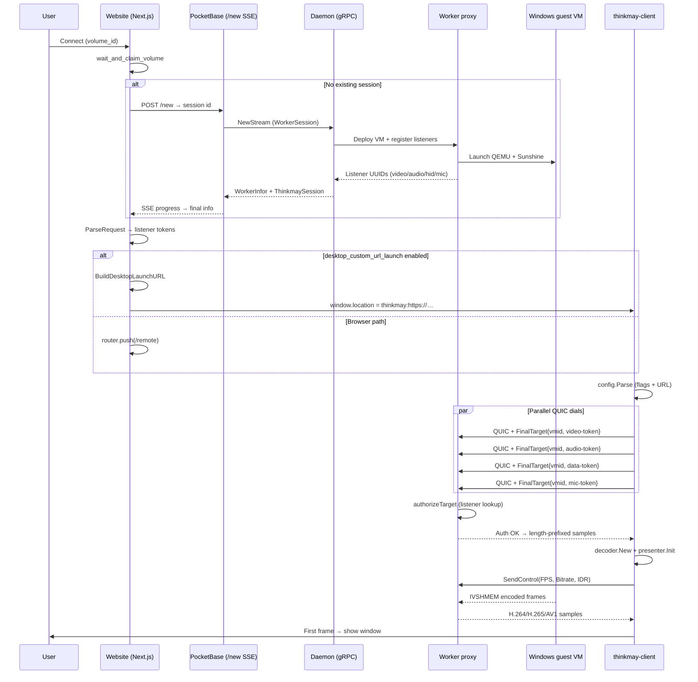
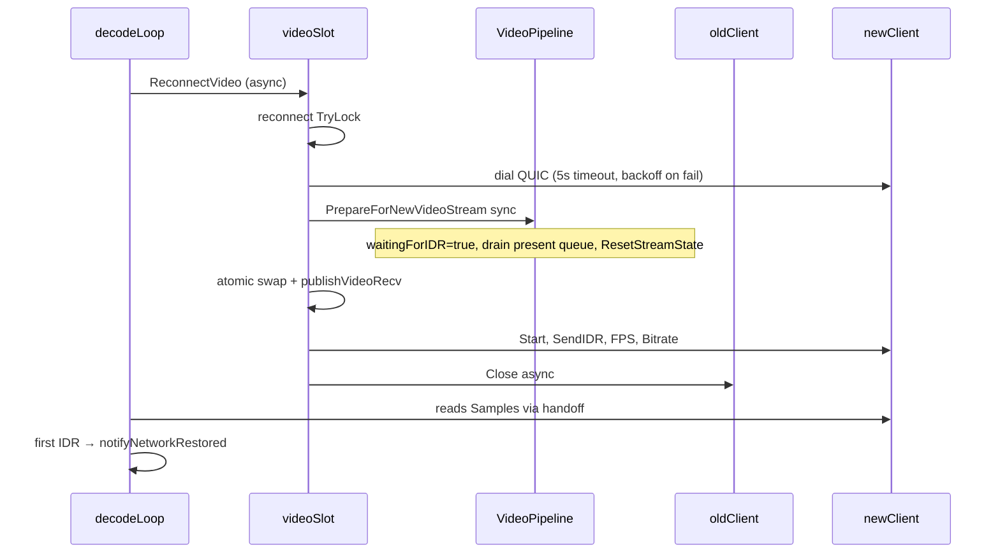

# Desktop app connection initialization flow

Research report on how the Thinkmay native desktop client (`thinkmay-client`) gets from a dashboard **Connect** click to a live streaming session. This document traces the full path: backend session provisioning, website URL handoff, client config parsing, QUIC authentication, local decode/present setup, and the first visible frame.

**Related docs**

| Document | Scope |
| --- | --- |
| [Desktop client architecture](../../../desktop_client_architecture.md) | Runtime architecture, pipeline, reconnect |
| [Desktop client URL handler](./desktop_client_url_handler.md) | `thinkmay:` scheme registration and parsing |
| [Desktop client launch arguments](./desktop_client_launch_arguments.md) | CLI flags and URL search-parameter contract |
| [Technical architecture](./technical_doc.md) | Full CloudPC stack |
| [Native app (Flutter) feasibility](./native_app.md) | Browser WebRTC protocol (contrast) |

---

## Summary

The desktop client does **not** use WebRTC signaling. It is a **QUIC relay consumer** that dials the worker proxy directly with short-lived listener UUIDs issued during VM deployment.

```text
User clicks Connect
  → Website claims volume + starts/resumes VM session (SSE)
  → Backend registers IVSHMEM listeners (video/audio/hid/mic) on proxy
  → Website builds thinkmay: launch URL with listener tokens
  → OS opens thinkmay-client
  → Client parses config, dials QUIC channels in parallel
  → Client initializes FFmpeg decoder + SDL presenter
  → Client starts decode/present loops, sends FPS/bitrate/IDR controls
  → First decoded frame → window shown → session ready
  → [On network failure] async QUIC re-dial with same listener tokens → pipeline reset → IDR → resume
```

Browser clients follow the same backend session step but connect via four independent WebSocket/WebRTC paths instead of QUIC.

---

## End-to-end flow



---

## Phase 1 — Website session provisioning

### Trigger

The play dashboard [`GetStarted`](../../../website/components/dashboard/index.tsx) component calls `connect(volume_id)` when the user opens a VM.

### Claim and deploy

1. **`wait_and_claim_volume`** ([`worker.ts`](../../../website/backend/reducers/worker.ts)) — reserves the volume on the current worker node.
2. **`GetInfo()`** — fetches current node state from PocketBase `/info`.
3. If no session exists for the volume (`getVmSession`), **`StartThinkmay()`** runs:
   - POST body: `{ id, vm: { Volumes }, thinkmay: { requestedCodec } }`.
   - Opens SSE on `GET /new/sse?id=<pending-id>`.
   - Streams deployment status (`broadcasters/websocket`, `broadcasters/vnc`, queue position, etc.).
   - Final SSE event includes `WorkerInfor` with session metadata.

### PocketBase → daemon

[`newauth`](../../../worker/daemon/pocketbase/db.go) validates the authenticated user, filters volumes, persists a user session, and returns a pending stream ID. [`newstreamauth`](../../../worker/daemon/pocketbase/db.go) forwards the `WorkerSession` to the daemon via gRPC `NewStream`, relaying progress events over SSE until `WorkerInfor` is returned.

### Listener creation on the proxy

During VM deployment, the proxy registers listeners in `vmTargets[vmid].listeners` keyed by random UUIDs ([`internal.go`](../../../worker/proxy/internal.go)):

| Content | Source | Codec |
| --- | --- | --- |
| `video` | IVSHMEM media queue (one per display) | session codec (`h264`/`h265`/`av1`) |
| `audio` | IVSHMEM media queue | `opus` |
| `hid` | IVSHMEM data queue | — |
| `microphone` | IVSHMEM data queue | — |

The daemon copies these into `ThinkmaySession.listener[]` when querying the hypervisor ([`hypervisor.go`](../../../worker/daemon/hypervisor.go) `querySession`).

Each listener entry has `{ id, content, codec, proto }` per [`persistent.proto`](../../../worker/daemon/persistent/persistent.proto).

### Credential construction

After deployment (or when reusing an existing session), the website calls **`ParseRequest(vmid, thinkmay, options)`** ([`api/index.ts`](../../../website/core/api/index.ts)):

- Iterates `thinkmay.listener[]`.
- Builds **WebRTC WebSocket URLs** for browser use (`wss://{host}:444/broadcasters/webrtc/...?token={id}&vmid=...`).
- Returns a `RemoteCredential`: `{ vmid, videoUrl, audioUrl, hidUrl, microUrl, logUrl, vncUrl }`.

The **`token`** query parameter in each URL is the listener UUID. This same UUID is what the desktop client sends as `ListenerID` in the QUIC handshake.

Results are stored via `save_reference` and `remote_connect` in Redux.

---

## Phase 2 — Desktop launch URL handoff

When the user has enabled **Open sessions in the Thinkmay desktop app** (`desktop_custom_url_launch` in remote settings), the website skips `/remote` and opens a custom URL instead.

### URL builder

[`BuildDesktopLaunchURL`](../../../website/core/api/index.ts):

1. Extracts listener tokens from `RemoteCredential` WebSocket URLs (`listenerToken()` parses the `token` query param).
2. Builds a normal HTTPS remote page URL with desktop-specific search params:
   - Required: `vmid`, `video`
   - Optional: `audio`, `data`, `mic`, `server`, `codec`, `vsync`, `fps`, `bitrate`, `width`, `height`
3. Prefixes with `thinkmay:` → e.g. `thinkmay:https://thinkmay.net/en/remote/?vmid=…&video=…&server=…`

Settings migration rules are documented in [Desktop client launch arguments](./desktop_client_launch_arguments.md#website-setting-migration).

### OS dispatch

| Platform | Mechanism |
| --- | --- |
| Windows | Registry `HKCU\Software\Classes\thinkmay` → `thinkmay-client.exe -url "%1"` |
| macOS | `CFBundleURLSchemes: thinkmay` + AppleEvent `kAEGetURL` on cold start |
| Linux | `.desktop` `MimeType=x-scheme-handler/thinkmay` → `thinkmay-client -url %u` |

See [Desktop client URL handler](./desktop_client_url_handler.md) for registration details.

---

## Phase 3 — Client entry and config parse

**Entry:** [`worker/proxy/cmd/client/main.go`](../../../worker/proxy/cmd/client/main.go)

### Startup order

1. `runtime.LockOSThread()` — SDL main thread ownership.
2. macOS: poll for URL via AppleEvent if no CLI args.
3. **`config.Parse(args)`** — merge CLI flags + `thinkmay:` URL search params (CLI overrides URL).
4. Optional Windows update check (`update.Start`).
5. Optional connect UI HTTP server at `127.0.0.1:8766` (default on).
6. Wait for update gate if applicable.
7. **`app.NewApp(cfg)`** — blocking initialization.
8. **`app.Run()`** — SDL event loop.

### Required config fields

| Field | Source |
| --- | --- |
| `Addr` | `-addr`, URL `server`/`addr`, or URL host (`:50005` for explicit server, `:443` for host fallback) |
| `VMID` | `-vmid` or URL `vmid` |
| `Token` | `-token`, URL `video`, or URL `token` |

Optional channels: `AudioToken`, `MicToken`, `DataToken` — each enables a parallel QUIC dial when present.

Parser implementation: [`client/config/config.go`](../../../worker/proxy/client/config/config.go).

---

## Phase 4 — QUIC connection initialization

**Core logic:** [`client/app/connect_streams.go`](../../../worker/proxy/client/connect_streams.go), [`client/stream/quic_client.go`](../../../worker/proxy/client/stream/quic_client.go), [`forwarder/quic/dialer.go`](../../../worker/proxy/forwarder/quic/dialer.go)

### Parallel dial

`dialMediaStreams` launches one goroutine per requested channel:

| Channel | Config token | Sample buffer | Required |
| --- | --- | --- | --- |
| Video | `Token` | 8 | Yes |
| Audio | `AudioToken` | 8 | No |
| Microphone | `MicToken` | 64 | No |
| HID/data | `DataToken` | 8 | No |

Each dial calls `stream.NewWithLabel(ctx, addr, &FinalTarget{VmID, ListenerID}, buffer, label, metrics)`.

Connect UI progress steps are updated per channel: `video` → `audio` → `mic` → `hid`.

### Wire protocol (per channel)

Each media lane is an **independent QUIC connection**:

1. **TLS dial** to `{Addr}` with ALPN `thinkmay-quic`, datagrams enabled, `InsecureSkipVerify: true`.
2. **Auth stream** — client opens a unidirectional stream, writes JSON `{"VmID":"…","ListenerID":"…"}`, closes stream.
3. **Auth settle** — client waits 200 ms (`ConfirmConnectionAuth`); if connection stays open, auth succeeds. If proxy rejects (unknown listener), connection closes with unauthorized error.
4. **Control stream** — client opens uni stream with control header for IVSHMEM commands (IDR, FPS, bitrate, etc.).
5. **Sample streams** — server accepts bidirectional streams; payload format: `[4-byte BE length][sample bytes]`.
6. **Datagrams** — JSON status envelopes and binary control messages.

### Server-side authorization

[`proxy.authorizeTarget`](../../../worker/proxy/proxy_relay_auth.go):

- **Local VM:** listener UUID must exist in `vmTargets[vmid].listeners`.
- **Routed VM:** VM ID must appear in proxy routing table (relay to peer worker).

Auth failure closes the QUIC connection; the client surfaces `auth_failed` through connect UI and exits without a fatal log spam.

### Result handling

`applyInitialConnectResults`:

- Auth failure on any channel → fail entire startup, close all partial dials.
- Required video failure → fail startup.
- Optional channel failure → log, mark connect UI step as skipped, continue without that channel.

During `NewApp`, the video QUIC client starts immediately after dial (`Start(ctx)` + `SendIDR()`) so samples can arrive while decoder/SDL init runs.

---

## Phase 5 — Local subsystem initialization

**Core logic:** [`client/app/app_new.go`](../../../worker/proxy/client/app/app_new.go)

After QUIC dials succeed, initialization proceeds **sequentially**:

| Step | Connect UI ID | Action |
| --- | --- | --- |
| 1 | `decoder` | `decoder.New({Codec, HWAccel, Present})` — FFmpeg HW decode open |
| 2 | `display` | SDL init (video, events, gamecontroller, audio) |
| 3 | `display` | Create hidden resizable window (fullscreen desktop if configured) |
| 4 | `display` | `presenter.New(cfg.Present).Init(window, …)` — D3D11/Metal/VAAPI/SDL |
| 5 | — | Optional stats HTTP server (`127.0.0.1:8765`) |
| 6 | — | Optional SDL audio player (if audio token connected) |
| 7 | — | Optional mic capture (if mic token connected) |
| 8 | — | Optional USB forwarder (requires data token + `-usb`) |

Failure at decoder or display steps aborts startup and reports through connect UI. Optional subsystems degrade gracefully (audio/mic disabled on init error).

---

## Phase 6 — Run loop and first frame

**Core logic:** [`client/app/run.go`](../../../worker/proxy/client/app/run.go), [`client/pipeline/`](../../../worker/proxy/client/pipeline/)

### Stream startup (`Run`)

1. Connect UI: activate `streams` step.
2. Start/restart QUIC clients and client monitors.
3. Start audio loop, mic loop, data receiver, HID writer, gamepad poll.
4. Connect UI: activate `first_frame` step; start 45 s first-connect timeout.
5. Create `pipeline.New(app).Start()`:
   - **Decode thread** (time-critical priority): QUIC samples → sample envelope parse → FFmpeg decode → frame channel.
   - **Presentation thread** (highest priority): pacer → GPU present → window show request.
6. Send initial controls: `FPS`, `Bitrate`, pointer mode.
7. Start cursor compositing loop.
8. Enter SDL event loop (HID capture, window events, hotkeys).

### Initial encoder controls

After connect, the client sends IVSHMEM control messages on the video QUIC control stream:

- `ivshmem.FPS(cfg.Fps)` — default 120
- `ivshmem.Bitrate(cfg.Bitrate)` — default 10000 (Kbps)
- `SendIDR()` — force keyframe

These propagate through the proxy to Sunshine via IVSHMEM, same as browser WebRTC control messages but over QUIC datagrams/uni streams instead of WebSocket binary frames.

### First visible frame

1. Presentation thread receives first decoded frame.
2. Calls `EnsureStreamWindowShown()` → sends on `showWindowReq`.
3. Main SDL thread handles request → `showStreamWindow()` → window becomes visible.
4. Connect UI transitions to **ready** phase (`connectui.Ready()`).

Until the first frame, the window stays hidden; the connect UI browser page shows progress.

---

## Connect UI progress model

Local HTTP server (default `127.0.0.1:8766`) tracks these steps ([`connectui/progress.go`](../../../worker/proxy/client/connectui/progress.go)):

| Step ID | Label (VI) | When |
| --- | --- | --- |
| `video` | Kết nối luồng video | QUIC video dial |
| `audio` | Kết nối âm thanh | QUIC audio dial (skipped if no token) |
| `mic` | Kết nối microphone | QUIC mic dial (skipped if no token) |
| `hid` | Kết nối bàn phím và chuột | QUIC data dial (skipped if no token) |
| `decoder` | Khởi tạo bộ giải mã video | FFmpeg decoder open |
| `display` | Chuẩn bị màn hình | SDL window + presenter init |
| `streams` | Khởi động luồng media | Audio/mic/HID loops started |
| `first_frame` | Chờ khung hình video đầu tiên | Until first present |

Timeouts:

- **First connect timeout:** 45 s waiting for first frame.
- **Fatal error display:** 10 s before process exit on non-auth failures.

User can abort from the connect UI page; abort is checked between major init steps via `connectui.ErrIfAborted()`.

---

## Security model

| Aspect | Behavior |
| --- | --- |
| User authentication | PocketBase session cookie during `/new`; not part of desktop URL |
| Stream authorization | Listener UUIDs act as bearer credentials (short TTL, ~5 s pending window on `/new`) |
| QUIC auth | `{vmid, listenerID}` must match a live proxy listener |
| TLS | Client uses `InsecureSkipVerify` (internal/trusted network assumption) |
| Logging | Full launch URLs must not be logged — they contain bearer tokens |

The `thinkmay:` URL does not authenticate the user to PocketBase. It only authorizes access to an already-provisioned streaming listener. If tokens expire or the VM shuts down, QUIC auth fails with `auth_failed`.

---

## Desktop vs browser initialization

| Stage | Browser (`/remote`) | Desktop (`thinkmay-client`) |
| --- | --- | --- |
| Session start | Same `StartThinkmay` + `ParseRequest` | Same |
| Credential form | WebSocket URLs with `token` param | Listener UUIDs in URL search params |
| Transport | 4× WebRTC (WS signaling + RTP) | 4× independent QUIC connections |
| Signaling | SDP offer/answer, ICE, TURN | JSON `FinalTarget` on auth uni stream |
| Decode | Browser HW decode (WebCodecs/MediaStream) | FFmpeg HW decode (astiav) |
| Present | `<video>` element or insertable streams | D3D11 / Metal / VAAPI / SDL |
| Congestion control | GCC/FlexFEC via WebRTC | Fixed FPS/bitrate IVSHMEM controls |
| Progress UI | In-page deployment watch + remote loader | Local connect UI HTTP page |

Both paths share the same backend listener registry and IVSHMEM media path on the proxy. The proxy multiplexes each listener to either WebRTC forwarders (browser) or QUIC forwarders (desktop) via `handleLocalFwd`.

---

## Connection reinitialization after network failure

After the initial connection succeeds, the desktop client keeps the SDL window and decode/present threads running while **automatically re-dialing QUIC** on transient failures. Reconnection is a mid-session variant of Phase 4–6: same `{vmid, listenerID}` credentials, same parallel dial pattern, but without restarting the process, SDL window, or FFmpeg decoder instance.

Design constraint: **reconnect I/O never blocks the SDL main thread or the decode/present loops**. All dials run in a background goroutine; the decode loop detects failure, schedules reconnect asynchronously, and continues polling for a handoff to the new stream.

See also [Desktop client architecture — Reconnection](../../../desktop_client_architecture.md#reconnection) for the same flow with additional implementation notes.

### What the user sees

| State | Window title | Connect UI |
| --- | --- | --- |
| Connected | `Thinkmay Remote Desktop` | Phase `ready` (unchanged) |
| Reconnecting | `Thinkmay Remote Desktop — Đang kết nối lại…` | Stays in `ready`; no step regression |
| Restored | Default title restored | Unchanged |
| Auth failed | Window hidden via shutdown | `auth_failed` error code |

The window **stays visible** during reconnect (unless the user closes it). Video may freeze until a new IDR arrives on the reconnected stream.

### Triggers

Each QUIC channel has independent failure detection and reconnect scheduling. Video, audio, mic, and data use separate **`clientSlot`** instances ([`channel.go`](../../../worker/proxy/client/app/channel.go)): lock-free reads via `atomic.Value`, per-channel `reconnect` mutex, 400 ms debounce, and exponential backoff (1 s → 2 s → … cap 30 s + jitter).

| Trigger | Source | Channel | Action |
| --- | --- | --- | --- |
| **Video stream close** | `decodeLoop` ([`decode_stage.go`](../../../worker/proxy/client/pipeline/decode_stage.go)) | Video | `ReconnectVideo()` → make-before-break dial |
| **Decode stall** | `decodeLoop` stall timer | Video | No QUIC samples for **15 s** after first frame, or **20 s** before → `ReconnectVideo()` |
| **Video status** | [`status.go`](../../../worker/proxy/client/app/status.go) | Video | `video_stalled`, `encoder_stalled` → debounced video reconnect; `waiting_for_keyframe` → local pipeline prep + IDR only (forwarder already sent `VideoReset`) |
| **Audio stream close** | [`stream_watch.go`](../../../worker/proxy/client/app/stream_watch.go) `onClientDone` | Audio | `scheduleReconnectAudio` (if audio was active) |
| **Audio status** | [`status.go`](../../../worker/proxy/client/app/status.go) | Audio | `audio_stalled` → debounced audio reconnect |
| **Mic / data close** | `onClientDone` | Mic / Data | Per-channel reconnect only |
| **Backend disconnected** | QUIC status datagram | Matched by `ListenerID` / content | Routes to the affected channel only |
| **Control path blocked** | QUIC status datagram | Data | `scheduleReconnectData` |

`StatusBackendReconnected` **does not** restore the window title. Title restore happens on the first post-reconnect video keyframe ([`onVideoKeyframeAfterReconnect`](../../../worker/proxy/client/app/video.go)).

Each active QUIC client has a **done watcher** that checks `CloseCause()` for auth failures when `client.Done()` fires. Auth failure aborts the session; a normal close schedules reconnect for that channel only.

### Reconnect sequence (video — make-before-break)



Audio, mic, and data use **close-then-dial**: swap in the new client, close the old one async, then run channel-specific recovery (audio player reset, loop respawn, HID/gamepad resync for data).

### Guard: when reconnect is allowed

[`canReconnect()`](../../../worker/proxy/client/app/shutdown.go) must be true at every step:

```go
func (a *App) canReconnect() bool {
    return a != nil && !a.authFailed.Load() && !a.shuttingDown()
}
```

Reconnect stops permanently when the user closes the window, listener tokens are rejected, or the app context is cancelled. Per-channel `reconnect.TryLock()` coalesces duplicate triggers for that channel only — video reconnect does **not** lock or close audio/mic/data slots.

### Per-channel recovery

| Channel | Swap strategy | Recovery steps |
| --- | --- | --- |
| **Video** | Make-before-break | `PrepareForNewVideoStream()` → swap → `publishVideoRecv` → `Start`, FPS, Bitrate, IDR; arm 90 s keyframe stall timer |
| **Audio** | Close-then-dial | `audioPlayer.Reset()`, new `audioLoop`, monitors |
| **Microphone** | Close-then-dial | New `micLoop` with stable session UUID from `NewApp` |
| **Data/HID** | Close-then-dial | Cancel old data receiver, `applyDataClient()` (USB recreate if enabled, stuck-input release, gamepad resync) |

Listener UUIDs and VM ID are **not re-fetched** during reconnect. Dials reuse `cfg.Token`, `cfg.AudioToken`, etc. from the original launch URL.

### Video pipeline reset

[`PrepareForNewVideoStream()`](../../../worker/proxy/client/pipeline/recovery.go) runs **synchronously before** `publishVideoRecv`:

1. Set `waitingForIDR = true` — drop non-keyframes until a fresh IDR.
2. `DrainFrames()` — empty presentation queue and decoded frame channel.
3. `dec.ResetStreamState()` — clear bitstream parameter-set cache and decode unit queue (no full decoder teardown, no `Flush()` on reconnect).

The decode loop requests IDR for non-keyframe samples until the first keyframe of the new stream is decoded. `NoteVideoKeyframeAfterReconnect()` clears the reconnecting title via `notifyNetworkRestored()`.

### Stream handoff (avoid duplicate reconnects)

While `reconnectVideo` dials and swaps, the decode loop may see the old stream's `Done` fire. [`videoStreamHandedOff()`](../../../worker/proxy/client/pipeline/decode_stage.go) checks whether `videoQuicRecv` already points at a **different, still-open** stream:

- If yes → log handoff, reset stall timer, continue reading (no second reconnect).
- If no → schedule reconnect, poll every 50 ms until handoff or shutdown.

### Auth failure during reconnect (terminal)

Auth errors do **not** retry: dial unauthorized, `CloseCause()` unauthorized, or status datagram with unauthorized details → `authFailed`, connect UI `FailAuth()`, `requestShutdown()`.

### Timing reference

| Constant | Value | Purpose |
| --- | --- | --- |
| Stall interval (after first frame) | 15 s | No QUIC samples → video reconnect |
| Stall interval (before first frame) | 20 s | Cold start / post-reconnect keyframe wait |
| Dial timeout per attempt | 5 s | `context.WithTimeout` on each dial |
| Reconnect debounce | 400 ms | Coalesce status + duplicate `Done` events per channel |
| Reconnect backoff | 1 s → 30 s + jitter | Per-channel exponential backoff on dial failure |
| Video keyframe stall timer | 90 s | Log if no post-reconnect IDR |
| Decode error backoff | 50 ms | After decode error, skip non-IDR frames briefly |
| IDR rate limit (post-connect) | 2 s | Minimum interval for `requestIDR()` |

### Thread model during reconnect

| Thread | Behavior during reconnect |
| --- | --- |
| **Main (SDL)** | Continues event loop; HID may no-op briefly if data channel is down |
| **Decode** | Lock-free `videoQuicRecv` read; schedules video reconnect via goroutine only |
| **Presentation** | May show last frame while waiting for IDR |
| **Per-channel reconnect goroutine** | Owns dial I/O and swap; never holds reconnect mutex during network I/O |

The FFmpeg decoder and GPU presenter objects are **not** recreated on reconnect — only QUIC transport endpoints are replaced per channel.

---

## Error paths and recovery

| Failure | Client behavior |
| --- | --- |
| Invalid/missing config | Exit at `config.Parse` with bootlog failure |
| Auth failure (bad/expired token) | Connect UI `auth_failed`; exit without fatal log |
| Video QUIC dial failure | Startup abort; connect UI error |
| Optional channel dial failure | Channel disabled; session continues |
| Decoder init failure | Startup abort |
| First frame timeout (45 s) | Connect UI error |
| Mid-session network failure | Automatic reconnect — see [Connection reinitialization after network failure](#connection-reinitialization-after-network-failure) |
| Auth failure during reconnect | Terminal — no retry; session shutdown |

---

## Source map

| Concern | Primary files |
| --- | --- |
| Website connect button | `website/components/dashboard/index.tsx` |
| Session deploy + claim | `website/backend/reducers/worker.ts` |
| Credential + desktop URL | `website/core/api/index.ts` |
| PocketBase session API | `worker/daemon/pocketbase/db.go` |
| Listener registration | `worker/proxy/internal.go` |
| Proxy auth | `worker/proxy/proxy_relay_auth.go` |
| Client entry | `worker/proxy/cmd/client/main.go` |
| Config parse | `worker/proxy/client/config/config.go` |
| QUIC dial orchestration | `worker/proxy/client/app/connect_streams.go` |
| QUIC wire protocol | `worker/proxy/forwarder/quic/dialer.go` |
| App init | `worker/proxy/client/app/app_new.go` |
| Run loop | `worker/proxy/client/app/run.go` |
| Video pipeline | `worker/proxy/client/pipeline/` |
| Connect UI | `worker/proxy/client/connectui/` |
| Boot logging | `worker/proxy/client/bootlog/` |
| Reconnect orchestration | `worker/proxy/client/app/channel.go`, `video.go`, `loops.go` |
| Reconnect triggers + handoff | `worker/proxy/client/pipeline/decode_stage.go`, `recovery.go` |
| Network UI + status | `worker/proxy/client/app/connection_notify.go`, `status.go`, `stream_watch.go` |
| Shutdown / reconnect guards | `worker/proxy/client/app/shutdown.go` |

---

## Open questions / caveats

1. **macOS warm handoff** — A second `thinkmay:` URL while the client is already running is not yet supported; only cold-start AppleEvent polling is implemented.
2. **Listener TTL** — Tokens are short-lived bearer credentials; delayed launches (user waits before OS opens client) may hit auth failures.
3. **Address defaults** — URL host fallback uses port `443`; explicit `server`/`addr` uses `50005`. Producers should include `server=` when the QUIC port differs from 443.
4. **No WebRTC fallback in desktop client** — If QUIC is unreachable, the desktop client cannot fall back to the browser WebRTC path; user must use `/remote` in browser.
5. **Status datagrams** — QUIC JSON status envelopes are received but not yet surfaced in desktop UI (same as noted in desktop architecture doc).

---

*Generated from codebase research, May 2026. Cross-check implementation files if behavior changes.*
