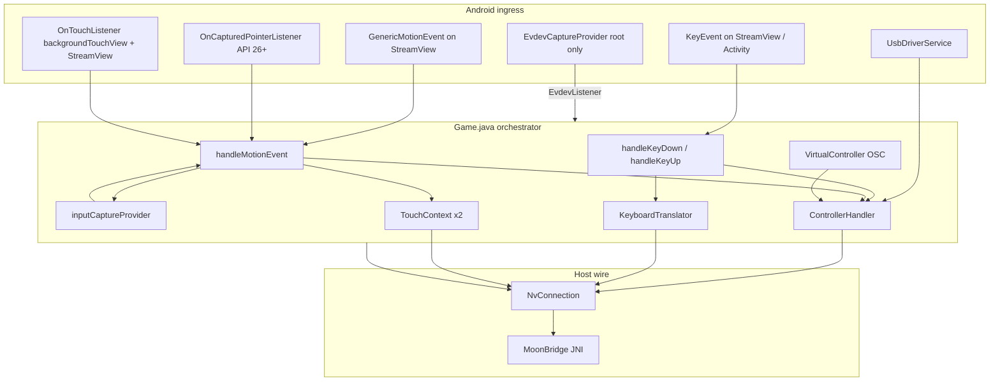

# Moonlight Android HID Capture Architecture

Reference analysis of how [moonlight-android](https://github.com/moonlight-stream/moonlight-android) captures and forwards **all HID-class input** (keyboard, mouse, touch, gamepad, stylus, USB controllers) to the remote host. Source tree reviewed: `~/moonlight-android` (Limelight / Moonlight Android client).

This document is a **capture-and-routing** study, not a wire-protocol spec. Moonlight uses NVIDIA GameStream / Sunshine input packets via `MoonBridge` JNI; Thinkmay uses its own HID batch protocol over WebRTC DataChannel. The value here is Android platform input plumbing patterns.

---

## Executive summary

Moonlight Android centralizes HID in a single `Activity` (`Game.java`) that:

1. **Registers listeners** on `StreamView` (video surface) and a full-screen `backgroundTouchView` for touch, generic motion, and keys.
2. **Selects a mouse-capture backend** at runtime via `InputCaptureManager` (Android O+ pointer capture → NVIDIA Shield extension → root evdev → pointer hiding fallback).
3. **Routes each event** in `handleMotionEvent()` / `handleKeyDown()` / `handleKeyUp()` by `InputDevice` source class and device capabilities.
4. **Serializes to host** through `NvConnection` → `MoonBridge` (native moonlight-common-c).

There is no Flutter layer; all capture is native Android `View` / `Activity` callbacks plus optional root USB/evdev side channels.

---

## High-level data flow



---

## Core files

| Role | Path |
|------|------|
| Session + routing hub | `app/src/main/java/com/limelight/Game.java` |
| Mouse capture selection | `app/src/main/java/com/limelight/binding/input/capture/InputCaptureManager.java` |
| Gamepad / joystick | `app/src/main/java/com/limelight/binding/input/ControllerHandler.java` |
| Android → Windows VK keys | `app/src/main/java/com/limelight/binding/input/KeyboardTranslator.java` |
| Finger → mouse emulation | `app/src/main/java/com/limelight/binding/input/touch/RelativeTouchContext.java` |
| Finger → absolute cursor | `app/src/main/java/com/limelight/binding/input/touch/AbsoluteTouchContext.java` |
| On-screen gamepad | `app/src/main/java/com/limelight/binding/input/virtual_controller/VirtualController.java` |
| USB Xbox controllers | `app/src/main/java/com/limelight/binding/input/driver/UsbDriverService.java` |
| Root evdev mouse/keyboard | `app/src/root/java/com.limelight/binding/input/evdev/EvdevCaptureProvider.java` |
| Video surface + key hook | `app/src/main/java/com/limelight/ui/StreamView.java` |
| Host send API | `app/src/main/java/com/limelight/nvstream/NvConnection.java` |

---

## Session setup (capture wiring)

In `Game.onCreate()`:

```java
streamView.setOnGenericMotionListener(this);
streamView.setOnKeyListener(this);
streamView.setInputCallbacks(this);  // onKeyPreIme for IME bypass

backgroundTouchView.setOnTouchListener(this);

inputCaptureProvider = InputCaptureManager.getInputCaptureProvider(this, this);

// API 26+: captured Bluetooth/USB mouse events
streamView.setOnCapturedPointerListener((view, motionEvent) ->
    handleMotionEvent(view, motionEvent));

// API 30+: disable VSync-aligned input buffering
streamView.requestUnbufferedDispatch(SOURCE_CLASS_BUTTON | SOURCE_CLASS_JOYSTICK |
    SOURCE_CLASS_POINTER | SOURCE_CLASS_POSITION | SOURCE_CLASS_TRACKBALL);
```

Handlers created per session:

- `ControllerHandler` — gamepads, USB drivers, rumble/LED/sensors, DS4 touchpad-as-controller
- `KeyboardTranslator` — maps `KeyEvent` → Windows virtual-key codes (`0x80` prefix for GFE)
- `TouchContext[2]` — one context per finger slot (max 2 simultaneous touch streams)
- `VirtualController` (optional) — on-screen buttons/sticks
- `UsbDriverService` (optional) — claims Xbox 360/One USB devices the kernel mishandles

Default state: **`grabbedInput = true`** — events are consumed and forwarded, not passed to the OS.

---

## Input grab and mouse capture

### Grab toggle

`setInputGrabState(boolean grab)`:

- `inputCaptureProvider.enableCapture()` / `disableCapture()`
- `setMetaKeyCaptureState(grab)` — Samsung-only reflection hook for Meta key capture
- Sets `grabbedInput`

User can toggle grab via **Ctrl+Shift+Z** (special key combo). When `grabbedInput` is false, keyboard and motion handlers return early and events pass through.

### Mouse capture provider priority

`InputCaptureManager.getInputCaptureProvider()` picks **one** backend:

| Priority | Class | Requirement | Behavior |
|----------|-------|-------------|----------|
| 1 | `AndroidNativePointerCaptureProvider` | API 26+ | `View.requestPointerCapture()`; relative axes from `SOURCE_MOUSE_RELATIVE` or `AXIS_RELATIVE_X/Y` on touchpad |
| 2 | `ShieldCaptureProvider` | NVIDIA `AXIS_RELATIVE_X/Y` + `InputManager.setCursorVisibility()` | Non-root Shield/Tegra extension; skipped on `ROOT_BUILD` (LineageOS bug) |
| 3 | `EvdevCaptureProvider` | Root + `libevdev_reader.so` | Reads `/dev/input/*` via su; full mouse + keyboard |
| 4 | `AndroidPointerIconCaptureProvider` | API 24+ | Hides cursor with `PointerIcon.TYPE_NULL` only (no relative capture) |
| 5 | `NullCaptureProvider` | Fallback | No capture; mouse ignored unless absolute position from view |

`AndroidNativePointerCaptureProvider` additionally:

- Registers `InputManager.InputDeviceListener` to re-request capture on device hotplug
- Skips touchscreen-only devices when deciding compatibility (Samsung `sec_touchpad` quirk)
- Re-captures on window focus after 500 ms delay (Android Q+ focus race)

### Relative vs absolute mouse in `handleMotionEvent`

For `SOURCE_CLASS_POINTER`, `SOURCE_CLASS_POSITION`, or `SOURCE_MOUSE_RELATIVE`:

1. If `inputCaptureProvider.eventHasRelativeMouseAxes(event)` → `sendMouseMove(deltaX, deltaY)` or `sendMouseMoveAsMousePosition()` when `absoluteMouseMode` pref is on.
2. Else if touchpad without capture → `sendMousePosition(x, y, xMax, yMax)` using device axis ranges.
3. Else if stylus with host pen support → `sendPenEvent()` (normalized 0–1 coords).
4. Else → `updateMousePosition(view, event)` — map to `StreamView` letterbox and `sendMousePosition`.

Wheel: `ACTION_SCROLL` → `sendMouseHighResScroll` / `sendMouseHighResHScroll` (axis × 120).

Buttons: diff `buttonState` vs `lastButtonState` → `sendMouseButtonDown/Up` for left/right/middle/X1/X2.

**Important gate:** if `!inputCaptureProvider.isCapturingActive()`, mouse pointer events are swallowed (return true) to avoid Android synthesizing spurious d-pad events.

---

## Keyboard capture

### Ingress

- `Game.onKeyDown` / `onKeyUp` / `onKeyMultiple`
- `StreamView.onKeyPreIme` — intercepts before IME (Samsung Shift+Space fix)
- `Game.onKey` on `StreamView` (same handlers)
- Root: `EvdevCaptureProvider` → `Game.keyboardEvent()` for evdev key codes

### Routing (`handleKeyDown` / `handleKeyUp`)

```
KeyEvent
  ├─ FLAG_VIRTUAL_HARD_KEY → pass through (false)
  ├─ SOURCE_MOUSE + KEYCODE_BACK → synthetic right-click (unless mouseNavButtons pref)
  ├─ ControllerHandler.isGameControllerDevice(device)?
  │     └─ handleButtonDown/Up (gamepad buttons on keyboard-class devices)
  └─ Keyboard path (if !handled):
        ├─ handleSpecialKeys (Ctrl+Shift+Z/Q/C combos)
        ├─ if !grabbedInput → pass through
        ├─ keyboardTranslator.translate(keyCode, deviceId) → short VK
        │     ├─ 0 + printable unicode → sendUtf8Text()
        │     └─ non-zero → sendKeyboardInput(VK, DOWN/UP, modifiers, flags)
        └─ eat KEY_DOWN repeats
```

`KeyboardTranslator` (API 33+): per-device QWERTY normalization via `InputDevice.getKeyCodeForKeyLocation()` so AZERTY/etc. map to Windows VK positions GFE expects.

Modifiers tracked locally in `modifierFlags` and merged per-event in `getModifierState(KeyEvent)`.

---

## Gamepad / controller capture

### Device discovery

`ControllerHandler` on construction:

- Enumerates `InputDevice.getDeviceIds()` for `SOURCE_JOYSTICK` / `SOURCE_GAMEPAD` with X/Y axes
- Registers `InputManager.InputDeviceListener` for hotplug
- Builds `initialControllers` mask sent in stream config (`attachedGamepadMask`)

`isGameControllerDevice(device)` returns true if:

- Has joystick axes or gamepad buttons, **or**
- Android R virtual device id -1 hack when any gamepad connected, **or**
- Device is any non-alphabetic keyboard (catches odd controller HID keyboards)

Alphabetic USB keyboards are **not** treated as gamepads so d-pad keys still reach `KeyboardTranslator`.

### Motion path

`handleMotionEvent` branch for `SOURCE_CLASS_JOYSTICK`:

```
controllerHandler.handleMotionEvent(event)
  → per-device InputDeviceContext (axis mapping, deadzone, controller slot 0–15)
  → sendControllerInput(controllerNumber, buttonFlags, sticks, triggers)
```

Also handles:

- **Emulated mouse/scroll** from sticks when user holds Start+Select etc. (`sendEmulatedMouseMove`)
- **Touchpad on DS4/DualSense** via `tryHandleTouchpadEvent` — either `sendControllerTouchEvent` or touchpad-as-mouse per pref
- **Sensors** (gyro/accel) when host requests `sendControllerMotionEvent`
- **Rumble / trigger rumble / LED / battery** callbacks from host → `ControllerHandler`

### USB driver path

When `prefConfig.usbDriver` enabled:

- `UsbDriverService` claims Xbox 360 wired/wireless and Xbox One controllers Android kernel does not expose correctly
- Reports state via `UsbDriverListener.reportControllerState()` into same `ControllerHandler` slot model
- Permission prompt delays attachment 1 s to avoid racing kernel input node creation

### Virtual on-screen controller

`VirtualController` draws overlays and injects button/stick events into `ControllerHandler` as if they were physical gamepad slot 0.

---

## Touchscreen capture (finger input)

Two modes selected by `prefConfig.touchscreenTrackpad`:

| Mode | Class | Remote behavior |
|------|-------|-----------------|
| `touchscreenTrackpad = false` | `AbsoluteTouchContext` | Maps finger to absolute cursor position on stream view; tap = click; long-press = right click; 2nd finger = scroll |
| `touchscreenTrackpad = true` | `RelativeTouchContext` | Trackpad: relative `sendMouseMove`; tap = click; hold 650 ms = drag; 2-finger = scroll |

Both support **max 2 fingers** (`touchContextMap[2]`). Events arrive via `onTouch` on `backgroundTouchView` (letterbox outside video) and `handleMotionEvent` for `SOURCE_CLASS_POINTER` finger tool types.

Coordinate normalization:

- Subtract `streamView` origin when event is on parent view
- Clamp to `[0, width] × [0, height]`, divide by dimensions for host packets

**Native multi-touch to host** (`sendTouchEvent` / `sendPenEvent`) is implemented but **commented out** in the finger branch due to Android gesture conflicts (3-finger keyboard shortcut, cancelled touches).

### Gestures layered on touch

- **3-finger tap** → cancel touch contexts, later opens software keyboard (`toggleKeyboard`)
- **Stylus dead zones** — suppress hover/down noise for double-click precision
- **Virtual controller edit mode** — ignores touches while repositioning OSC buttons

---

## Root-only evdev capture

`EvdevCaptureProvider` (root build flavor):

1. `su -c libevdev_reader.so <port>` attaches to evdev nodes
2. Socket protocol streams `EvdevEvent` structs
3. On `EV_SYN`: flush accumulated `REL_X/Y`, wheel deltas → `EvdevListener` on `Game`
4. On `EV_KEY`: mouse buttons → `mouseButtonEvent`; other keys → `EvdevTranslator` → `keyboardEvent`

`Game` implements `EvdevListener` (`mouseMove`, `mouseButtonEvent`, `mouseVScroll`, `mouseHScroll`, `keyboardEvent`).

Grab/ungrab sends byte commands on evdev socket (`UNGRAB_REQUEST` / `REGRAB_REQUEST`) so system UI can receive input when capture disabled.

---

## Host egress (`NvConnection` → `MoonBridge`)

All device classes converge on JNI:

| Input | API |
|-------|-----|
| Relative mouse | `sendMouseMove(dx, dy)` |
| Absolute mouse | `sendMousePosition(x, y, refW, refH)` |
| Absolute + relative blend | `sendMouseMoveAsMousePosition` |
| Buttons | `sendMouseButtonDown/Up` |
| Wheel | `sendMouseHighResScroll/HScroll` |
| Keyboard | `sendKeyboardInput(vk, direction, modifier, flags)` |
| UTF-8 text | `sendUtf8Text` |
| Gamepad | `sendControllerInput`, `sendControllerTouchEvent`, `sendControllerMotionEvent`, … |
| Touch (optional) | `sendTouchEvent` normalized 0–1 |
| Pen (optional) | `sendPenEvent` |

Stream config advertises `attachedGamepadMask` at connect time so host pre-creates virtual Xbox slots.

---

## Latency-oriented platform details

1. **`requestUnbufferedDispatch`** (API 30+) on stream and background views — avoids buffering input to VBlank (~1 frame extra latency).
2. **`view.requestUnbufferedDispatch(event)`** on each `ACTION_DOWN` — per-gesture unbuffered path.
3. **Pointer capture** delivers `SOURCE_MOUSE_RELATIVE` with batched historical axis accumulation in `getRelativeAxisX/Y`.
4. **ControllerHandler** intentionally ignores `MotionEvent` historical samples for sticks (user preference: snappier feel).

---

## Comparison notes for Thinkmay mobile

| Topic | Moonlight Android | Thinkmay mobile (current) |
|-------|-------------------|---------------------------|
| UI stack | Pure Android `Activity` + `SurfaceView` | Flutter + platform channels + native Kotlin/Swift serializers |
| Protocol | GameStream / Sunshine via `MoonBridge` | Custom HID batch (`mma`, `mmr`, `td`, `kb`, …) over WebRTC DataChannel |
| Mouse capture | `InputCaptureManager` chain ending in `requestPointerCapture` | Android `requestPointerCapture` + iOS `GCMouse`; trackpad via Flutter `TouchLayer` forward |
| Touch | In-activity `onTouch` + `TouchContext` state machines | `TouchLayer` → `forwardPointerEvent` (normal) or `dispatchTouchEvent` (gaming lock) |
| Keyboard | `KeyEvent` on views + `KeyboardTranslator` → VK | Native `KeyboardNative` + Dart gaming lock |
| Gamepad | `ControllerHandler` + optional USB service | `GamepadPollNative` / `GamepadHandler` |
| Position encoding | Short coords vs reference dimensions (host-side) | Normalized `uint32(x * (2^32-1))` per daemon `hid.go` |
| Root evdev | Full system capture | Not used |

**Patterns worth borrowing:**

- **Single orchestrator** with explicit `grabbedInput` gate and special-key combos
- **Capture provider abstraction** with runtime fallback chain
- **Separate touch contexts per pointer index** (clean tap/drag/scroll state machines)
- **Device-class routing order**: joystick → gamepad touchpad → pointer/mouse → finger
- **`requestUnbufferedDispatch`** on streaming surfaces
- **Hotplug listeners** on `InputManager` for pointer re-capture and keyboard layout maps
- **USB claim service** for controllers the Android stack splits across broken nodes

**Intentional differences:** Thinkmay must keep letterboxed `contentRect`, gaming-mode pointer lock, and daemon HID encoding — none of which map 1:1 to Moonlight's GameStream packets.

---

## References

- Moonlight Android repo: `~/moonlight-android`
- NVIDIA Shield mouse extension notes (referenced in `ShieldCaptureProvider.java`): [Game Controller Handling — Mouse](https://docs.nvidia.com/gameworks/index.html#technologies/mobile/game_controller_handling_mouse.htm)
- Android pointer capture: [View.requestPointerCapture()](https://developer.android.com/reference/android/view/View#requestPointerCapture())
- Related Thinkmay docs: [input_mode_controls.md](./input_mode_controls.md), [mobile_architecture.md](./mobile_architecture.md), [client_protocol_contract.md](./client_protocol_contract.md)
