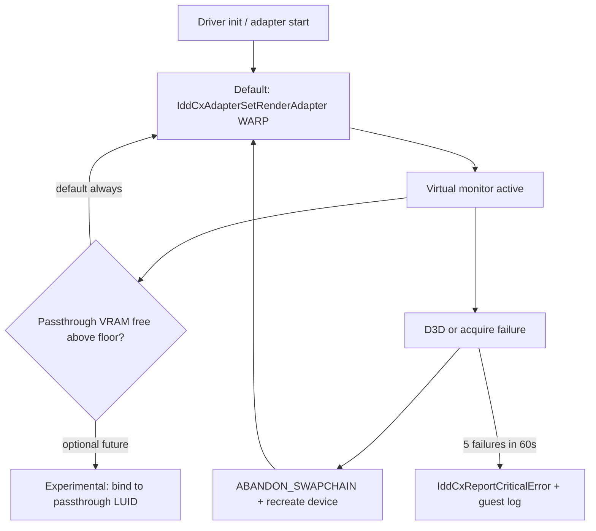
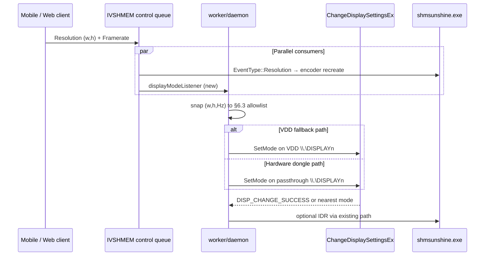

# Thinkmay VDD Fork Specification

Fork of [VirtualDrivers/Virtual-Display-Driver](https://github.com/VirtualDrivers/Virtual-Display-Driver) (MttVDD) for Thinkmay CloudPC guest fallback capture.

**Requirements source:** [vdd.md](./vdd.md)  
**Capture context:** [windows_display_capture.md](./windows_display_capture.md)  
**Upstream pin (initial):** `Virtual-Display-Driver` release **25.7.23** (adjust after golden-image validation)

---

## 1. Executive summary

Thinkmay’s primary capture path is **passthrough GPU + EDID dongle**. The VDD fork exists only as a **software fallback** when no passthrough output is detected, replacing **Parsec VDD** with a driver we control.

**Design priority:** absolute highest **stability** over feature breadth. Every upstream feature that increases crash surface (HDR, multi-monitor defaults, passthrough-GPU swap chains under VRAM load) is disabled or removed in the Thinkmay fork.

**Control plane:** retain upstream **MttVDD named pipe** (`\\.\pipe\MTTVirtualDisplayPipe`) for monitor plug/unplug. **Runtime resolution and refresh** are applied by **daemon via Win32 `ChangeDisplaySettingsEx`** against pre-declared EDID modes (§6.5), not by editing XML or calling `RELOAD_DRIVER`.

---

## 2. Goals and non-goals

### Goals

| ID | Goal |
|----|------|
| G1 | Highest stability on VFIO gaming VMs (no TDR / display-stack crash attributable to VDD under high passthrough VRAM) |
| G2 | Satisfy [vdd.md](./vdd.md): refresh rates, aspect ratios, up to 4K@240 Hz |
| G3 | Operational compatibility with today’s Parsec VDD session model (activate → capture → deactivate) |
| G4 | Fleet-deployable: signed driver, silent install, no VDC tray app in guest |
| G5 | Integrate with existing capture pinning (`--capture-display`, `resolveCaptureDisplay`) |
| G6 | **Runtime desktop mode control** — daemon changes resolution + refresh on the fly from client IVSHMEM events (VDD and hardware capture paths) |

### Non-goals

| ID | Non-goal |
|----|----------|
| NG1 | HDR10 / 12-bit / HDRPlus (disabled; historical Code 31 risk on Win11 builds) |
| NG2 | Multi-monitor product feature (`MaxDisplay = 1`; one virtual monitor max) |
| NG3 | 8K modes, floating refresh &gt; 240 Hz, ARM64 guest (x64 only for v1) |
| NG4 | VDC GUI / winget / user-facing display tweaking in guest |
| NG5 | Virtual audio driver (VAD) bundled with VDD |
| NG6 | Replacing EDID dongle as primary path |

---

## 3. Requirements traceability

| [vdd.md](./vdd.md) requirement | Spec section | Implementation |
|-------------------------------|--------------|----------------|
| 1. Compatible with Parsec VDD operation model | §7, §8 | Dual control: pipe (primary) + optional Parsec IOCTL shim; same `Vdd` interface, `DisplaySwitch /external`, session `vddOwned` cleanup |
| 2. 60–75–90–120–144–240 Hz | §6 | `thinkmay_vdd_settings.xml` global refresh list |
| 3. Broad aspect ratio range | §6 | Curated resolution table: desktop + **mobile portrait / tall-phone / tablet** |
| 4. Up to 4K@240 Hz max | §6 | Cap at 3840×2160 @ 240 Hz; reject/add no modes above |
| 5. Daemon runtime resolution + refresh | §6.5, §8 | IVSHMEM listener in daemon; `Vdd.SetMode()`; Win32 `ChangeDisplaySettingsEx`; fork `SETMODE` optional |

Additional stability requirements (from capture architecture):

| Requirement | Spec section |
|-------------|--------------|
| No 100 ms ping watchdog | §7.2 — pipe model; no `VDD_IOCTL_UPDATE` dependency |
| WARP render adapter under VRAM pressure | §5.2 |
| Single capture monitor | §6.1 `monitors/count = 1` |
| virtio-gpu disabled before Sunshine (hardware path) | Unchanged — [`routing.go`](../../../worker/daemon/routing.go) |
| `--capture-display` on hardware path only | §8.3 |

---

## 4. Upstream baseline and fork policy

### 4.1 Repository layout

```text
worker/vdd/                       # fork submodule (github.com/thinkonmay/vdd)
  Virtual Display Driver (HDR)/
    MttVDD/                       # UMDF IddCx driver (Driver.cpp, MttVDD.inf)
  config/
    thinkmay_vdd_settings.xml     # fleet canonical mode table
  docs/
    THINKMAY_CUSTOMIZATION_PLAN.md
    UPSTREAM.md
  scripts/
    generate_vdd_settings.ps1     # optional mode table generator
    install.ps1                   # guest install (also synced to assets/display/)
```

**Implementation plan:** [worker/vdd/docs/THINKMAY_CUSTOMIZATION_PLAN.md](../../../worker/vdd/docs/THINKMAY_CUSTOMIZATION_PLAN.md)  
**Task checklist:** [worker/vdd/docs/TASK_CHECKLIST.md](../../../worker/vdd/docs/TASK_CHECKLIST.md)

### 4.2 Fork rules

1. **Pin** upstream tag; document every cherry-pick in `UPSTREAM.md`.
2. **Minimal diff** — prefer `#ifdef THINKMAY` or separate source files over editing upstream files in place when possible.
3. **Delete** upstream paths not in §5.3 removal list rather than `#if 0` dead code.
4. **No direct edits** in guest to `vdd_settings.xml` at runtime; ship a fixed fleet config. **Runtime mode switches use Win32 display APIs** (§6.5), not XML rewrites.
5. Rebase quarterly; security fixes cherry-picked out of band.

### 4.3 Upstream components to remove or disable

| Upstream component | Action |
|--------------------|--------|
| HDR / HDRPlus / SDR10bit / EdidCeaOverride | **Remove** from Thinkmay build |
| VDC tray application | **Exclude** from NSIS bundle |
| Virtual Audio Driver | **Exclude** |
| GPU “friendlyname auto” on passthrough PCI | **Override** → WARP (§5.2) |
| Default multi-monitor count &gt; 1 | **Force** 1 |
| debuglogging in production config | **Off** |
| User-editable resolution hot-plug via GUI | **Disable**; daemon pipe + Win32 mode API only |

### 4.4 Upstream components to keep

| Component | Reason |
|-----------|--------|
| IddCx 1.10 swap-chain processor | Modern recovery APIs |
| `MTTVirtualDisplayPipe` + `SETDISPLAYCOUNT` | Already wired in daemon |
| EDID / mode table from XML | Meets vdd.md mode requirements |
| SignPath signing pipeline (adapt for Thinkmay cert) | Fleet install |
| Dedicated UMDF `DeviceGroupId` | Process isolation |
| Hardware cursor support | Avoid double-cursor in streaming (keep enabled) |

---

## 5. Stability architecture

Stability is the **primary design constraint**. Feature requirements from [vdd.md](./vdd.md) are implemented only where they do not compromise §5.

### 5.1 Render adapter policy (critical)



| Policy | Value |
|--------|-------|
| Default render adapter | **WARP** (Microsoft Basic Render Driver) |
| Passthrough NVIDIA/AMD as swap-chain GPU | **Disabled in v1** |
| VRAM floor (future v2) | Do not move swap chain to discrete unless ≥ 512 MiB free |
| Rationale | Passthrough GPU holds game + NVENC; IDD must not compete for VRAM |

**Capture note:** With WARP-backed VDD, the fallback desktop is composited on software render. Sunshine still encodes on passthrough GPU via DXGI duplication of the virtual monitor. This matches today’s Parsec `/external` topology and is acceptable because fallback is rare when dongles are deployed.

### 5.2 Swap-chain processing

Follow [Microsoft IddCx assign-swapchain error handling](https://learn.microsoft.com/en-us/windows-hardware/drivers/display/idd-evtiddcxmonitorassignswapchain-error-handling):

| Rule | Implementation |
|------|----------------|
| Frame loop | Acquire → **immediate release** (IddSample discard pattern); no GPU readback |
| Thread | Dedicated swap-chain thread with MMCSS `DisplayPostProcessing` |
| D3D device error | Destroy device; recreate; never reuse poisoned device |
| Assign failure | `WdfObjectDelete(SwapChain)` or `STATUS_GRAPHICS_INDIRECT_DISPLAY_ABANDON_SWAPCHAIN` |
| Retry storm | After **5 failures in 60 s**: stay on WARP, report critical error, do not bugcheck |
| System-memory path | Use `IddCxSwapChainInSystemMemory` + `ReleaseAndAcquireSystemBuffer` when on WARP (IddCx 1.5+) |

### 5.3 Process and resource isolation

| Item | Requirement |
|------|-------------|
| INF `DeviceGroupId` | Unique `Thinkmay.VDD` — dedicated UMDF host process |
| Max virtual monitors | **1** (hard cap in driver + config) |
| Pool leaks | Zero growth over 24 h stream test (PoolMon) |
| IOCTL / pipe handler | Non-blocking; no heavy work on assign callback |

### 5.4 No Parsec-style keepalive

| Parsec VDD | Thinkmay fork |
|------------|---------------|
| `VDD_IOCTL_UPDATE` every ~100 ms or monitors drop | **Not required** |
| Daemon background ping thread | **Removed** when on pipe-only path |
| Monitor lifetime | Until `SETDISPLAYCOUNT` decrement or session `Deactivate` |

Optional: slow health IOCTL/pipe `PING` (≥ 5 s) for telemetry only — **must not** unplug monitors on missed ping.

### 5.5 Interaction with passthrough GPU / dongle path

| Scenario | VDD role |
|----------|----------|
| Dongle present, passthrough output active | VDD **not activated**; driver idle |
| Dongle missing / GPU output timeout | Daemon activates VDD via pipe |
| Both dongle output + VDD exist | **Prevent** — daemon must not activate VDD if `ResolvePassthroughDisplay()` succeeds |

### 5.6 Runtime mode change stability

| Rule | Rationale |
|------|-----------|
| Never `SETDISPLAYCOUNT` / `RELOAD_DRIVER` for resolution-only changes | Full adapter reinit; upstream warns of crash on rapid reload |
| Debounce ≥ 2 s between applies | Avoid DWM / IddCx mode-set storms from client resize loops |
| Win32 API first; pipe `SETMODE` fallback only | Keeps hot path out of driver |
| Failed mode set is non-fatal | Log + continue; Sunshine encoder scaling still works |
| Same `\\.\DISPLAYn` for session lifetime | No plug/unplug on rotate / resize |

---

## 6. Display capabilities ([vdd.md](./vdd.md) §2–4)

### 6.1 Monitor count

```xml
<monitors><count>1</count></monitors>
```

Daemon `SETDISPLAYCOUNT` only uses `0` or `1` in production. Driver rejects `SETDISPLAYCOUNT > 1`.

### 6.2 Refresh rates (Hz)

Required global refresh rates (must appear in EDID/mode list for **all** bundled resolutions):

`60`, `75`, `90`, `120`, `144`, `240`

Optional (upstream supported, include if EDID size allows): `165`

**Not in v1:** 244 Hz (legacy bundle typo), 360 Hz, 500 Hz.

### 6.3 Resolution and aspect ratio table

Canonical fleet config `worker/idd/thinkmay-vdd/config/thinkmay_vdd_settings.xml`. All listed modes must be present in EDID so **runtime mode switches never require `RELOAD_DRIVER`** (§6.5).

#### Desktop and ultrawide

| Aspect | Resolution | Max refresh | Priority |
|--------|------------|-------------|----------|
| 4:3 | 800×600 | 240 | Low (compat) |
| 16:9 | 1366×768 | 240 | Medium |
| 16:9 | 1920×1080 | 240 | **Default desktop session mode** |
| 16:10 | 1920×1200 | 240 | Medium |
| 16:9 | 2560×1440 | 240 | High (Performance tier) |
| 16:10 | 2560×1600 | 240 | Medium |
| 21:9 | 2560×1080 | 240 | Medium (ultrawide) |
| 21:9 | 3440×1440 | 240 | Medium |
| 16:9 | 3840×2160 | **240** | **Hard cap per vdd.md** |

#### Mobile — portrait phone (primary for Flutter / phone clients)

| Aspect | Resolution | Max refresh | Notes |
|--------|------------|-------------|-------|
| 9:16 | 720×1280 | 120 | Low-end portrait |
| 9:16 | 1080×1920 | 120 | **Default mobile portrait mode** |
| 9:16 | 1440×2560 | 120 | QHD+ portrait |
| 9:16 | 2160×3840 | 240 | 4K portrait (same pixel budget as 4K landscape) |
| 9:19.5 | 1170×2532 | 120 | iPhone 14 Pro class |
| 9:19.5 | 1284×2778 | 120 | iPhone 14 Pro Max class |
| 9:19.5 | 1080×2340 | 120 | Common Android tall |
| 9:20 | 1080×2400 | 120 | Android 20:9 |
| 9:21 | 1080×2460 | 120 | Android 21:9 |
| 9:20 | 1440×3200 | 120 | QHD+ tall (Samsung class) |

#### Mobile — landscape phone (client rotated / forced landscape)

| Aspect | Resolution | Max refresh | Notes |
|--------|------------|-------------|-------|
| 19.5:9 | 2532×1170 | 120 | iPhone landscape |
| 19.5:9 | 2340×1080 | 120 | Android landscape |
| 20:9 | 2400×1080 | 120 | |
| 21:9 | 2460×1080 | 120 | |

#### Tablet — portrait

| Aspect | Resolution | Max refresh | Notes |
|--------|------------|-------------|-------|
| 3:4 | 768×1024 | 120 | Classic tablet |
| 3:4 | 1200×1600 | 120 | |
| 3:4 | 1536×2048 | 120 | iPad-class |
| 2:3 | 800×1200 | 120 | |
| 10:16 | 800×1280 | 120 | Narrow tablet |
| 10:16 | 1600×2560 | 120 | |

Rules:

- **Maximum mode:** 3840×2160 @ 240 Hz (landscape) or **2160×3840 @ 240 Hz** (portrait) — same pixel-clock budget; driver rejects anything above.
- **Default at activate:** 1920×1080 @ 120 Hz (desktop fallback) or **1080×1920 @ 60 Hz** when session metadata indicates mobile client (future volume flag; until then client `ChangeResolution` on connect).
- **Portrait vs landscape:** Windows reports orientation via mode width/height; daemon sets `width < height` for portrait requests. No driver rotation API — correct dimensions in the mode table.
- **CustomEdid:** `false` in production; fleet uses built-in table only.
- **SDR 8-bit only** in v1 (`SDR10bit=false`, HDR off).
- **EDID size:** if the combined mode list exceeds EDID block limits, drop low-priority desktop compat modes (800×600) before dropping mobile portrait modes.

### 6.4 Pixel-clock and refresh policy

Global refresh rates from §6.2 apply to desktop modes. For **mobile portrait modes ≤ 1440×3200**, cap default max refresh at **120 Hz** unless the mode fits within the 4K240 pixel-clock budget.

Daemon **snaps** client-requested refresh to the nearest supported rate: `60`, `75`, `90`, `120`, `144`, `240`.

### 6.5 Runtime mode change (daemon on-the-fly)

**Requirement ([vdd.md](./vdd.md) §5):** `worker/daemon` must change capture display **resolution and refresh rate during an active session** without deactivating VDD or calling upstream `RELOAD_DRIVER` / `SETDISPLAYCOUNT` (those reinitialize the adapter and are stability hazards — §7.2).

Today, client `ChangeResolution` only reaches Sunshine via IVSHMEM and rescales the **encoder** ([`main.cpp`](../../../worker/sunshine/src/main.cpp) `EventType::Resolution`). On VDD fallback — and for mobile portrait — **desktop mode must match** or letterboxing breaks touch mapping and wastes encode quality.

#### 6.5.1 Architecture



#### 6.5.2 Extended `Vdd` interface

Extend [`tools.go`](../../../worker/daemon/utils/media/tools.go):

```go
type DisplayMode struct {
    Width       int
    Height      int
    RefreshHz   int
}

type Vdd interface {
    Activate() (string, error)
    Deactivate(string) error
    Close()
    // SetMode switches the active virtual monitor to a pre-declared EDID mode.
    // Must not call SETDISPLAYCOUNT or RELOAD_DRIVER.
    SetMode(display string, mode DisplayMode) error
    CurrentMode(display string) (DisplayMode, error)
}
```

**Hardware path (no VDD):** implement the same helpers in `tools_windows.go` as `SetCaptureDisplayMode(displayName string, mode DisplayMode) error` — used when `resolveCaptureDisplay()` returned a passthrough GDI name.

#### 6.5.3 Win32 implementation (daemon)

Primary implementation — no driver fork required for v1:

1. `EnumDisplaySettingsExW` on `\\.\DISPLAYn` to list modes.
2. Pick exact match on `(width, height, refresh)` or **nearest** refresh at same resolution.
3. `ChangeDisplaySettingsExW` with `CDS_FULLSCREEN` on the device name; `DM_PELSWIDTH | DM_PELSHEIGHT | DM_DISPLAYFREQUENCY`.
4. Poll until `EnumDisplaySettings` reports the new mode (timeout 5 s).
5. **Debounce:** ignore duplicate requests; minimum **2 s** between applies (stability).
6. **Serialize:** one mode-change mutex per session.

If no matching mode exists in EDID, log `thinkmay-vdd: mode not in table WxH@Hz` and return error — Sunshine encoder scaling remains the fallback.

#### 6.5.4 IVSHMEM integration (daemon)

Add a **display mode listener** in the session goroutine ([`session.go`](../../../worker/daemon/session.go) or [`routing.go`](../../../worker/daemon/routing.go)):

| IVSHMEM event | Daemon action |
|---------------|---------------|
| `EventType::Resolution` | `SetMode` / `SetCaptureDisplayMode` with snapped `(w,h)` |
| `EventType::Framerate` | Map to nearest refresh Hz (§6.4); re-apply current resolution at new Hz |

**Implementation options** (pick one in P1):

| Option | Pros | Cons |
|--------|------|------|
| **A. Shared IVSHMEM read in daemon** | Same events as Sunshine; no Sunshine change | Duplicate queue consumer — must not steal Sunshine's index |
| **B. New IVSHMEM vector / side queue for daemon** | Clean separation | QEMU / proxy change |
| **C. Sunshine forwards mode intent to daemon via second IVSHMEM write** | Minimal daemon IVSHMEM work | Sunshine change + coupling |

**Recommended: Option A** — daemon reads the **same outgoing control queue** with its own `outindex` cursor (mirror Sunshine's loop in [`main.cpp`](../../../worker/sunshine/src/main.cpp)). Document that both processes map the same IVSHMEM region; index is per-process.

Optional protocol extension (v2): extend `EventType::Resolution` payload to include refresh Hz in `buffer[3]` so clients can request mode and refresh atomically. Until then, combine latest Resolution + Framerate events within 500 ms.

#### 6.5.5 Fork pipe command (optional, stability backup)

Add Thinkmay-only pipe command (does **not** replace Win32 path):

```text
SETMODE <width> <height> <refreshHz>
```

Behavior:

- Validate against in-memory allowlist (loaded from fleet XML at driver init).
- Call internal mode switch via `ChangeDisplaySettings` on the virtual adapter **without** `RELOAD_DRIVER`.
- Response: UTF-8 `OK` or `ERR <reason>`.

Use when Win32 API fails on IddCx edge cases. **Never** chain `SETMODE` → `RELOAD_DRIVER`.

#### 6.5.6 Hardware dongle path caveats

Passthrough output modes are limited by **physical EDID** on the dongle. Daemon:

1. Attempts exact mode via `ChangeDisplaySettingsEx`.
2. On failure, picks **nearest** mode from EDID (same aspect, closest pixel count).
3. Logs `display mode clamped: requested WxH@Hz → actual WxH@Hz`.

Encoder scaling in Sunshine still applies if desktop cannot match client request.

#### 6.5.7 Interaction with `DisplaySwitch`

Mode changes apply to the **active capture display** only (`iws.display` GDI name). Do not call `DisplaySwitch` on each mode change — topology stays `/external` or `/extend` for the session lifetime.

### 6.6 Client ↔ desktop mode mapping (mobile)

| Client signal | Daemon desktop target (VDD path) |
|---------------|----------------------------------|
| Phone portrait connect | 1080×1920 @ 60 (or client native if in §6.3) |
| `ChangeResolution(1080, 1920)` | 1080×1920 @ snapped refresh |
| Tablet portrait | 1200×1600 or 1536×2048 |
| Always 1080p (landscape) | 1920×1080 @ 120 |
| High refresh toggle (120 fps stream) | Same resolution @ 120 Hz (if in EDID) |

Touch/HID coordinates use the **desktop** resolution after `SetMode`; keeping desktop aligned with client viewport avoids coordinate transform bugs.

---

## 7. Parsec VDD operation model compatibility ([vdd.md](./vdd.md) §1)

“Compatible” means **Thinkmay platform behavior** remains the same for session lifecycle, capture, and HID — not that we ship Parsec’s proprietary driver.

### 7.1 Behavioral parity matrix

| Behavior | Parsec VDD today | Thinkmay fork |
|----------|------------------|---------------|
| Boot-time driver install | `vdd.exe /S` | `pnputil` / `devcon` + Thinkmay INF (§9) |
| Fallback when no passthrough output | `daemon.Vdd.Activate()` | Same via `ActivateIddVDD()` |
| Display topology | `DisplaySwitch /external` (or `/extend`) | Unchanged in [`routing.go`](../../../worker/daemon/routing.go) |
| GDI name for HID | `\\.\DISPLAYn` from activate poll | Same poll in `IddVDD.Activate()` |
| Sunshine capture | All displays enumerated (VDD path) | Same; no `--capture-display` on VDD path |
| Session cleanup | `Deactivate` if `vddOwned` | Same |
| Error 408 handle claim | Parsec-specific | **Eliminated** (no handle claim) |

### 7.2 Control plane — primary (MttVDD pipe)

Already implemented:

```text
\\.\pipe\MTTVirtualDisplayPipe
SETDISPLAYCOUNT <n>    # UTF-16 command
```

Thinkmay fork **must preserve** this pipe name and command grammar for [`idd_vdd_windows.go`](../../../worker/daemon/utils/media/idd_vdd_windows.go).

Extensions (backward compatible):

| Command | Purpose |
|---------|---------|
| `PING` | Health check; returns `OK` (no side effect) |
| `GETSTATUS` | JSON: `{ "count": 1, "renderAdapter": "WARP", "driverVersion": "...", "mode": "1920x1080@120" }` |
| `SETRENDERADAPTER WARP` | Force WARP (default at install) |
| `SETMODE W H Hz` | Thinkmay-only: switch mode without `RELOAD_DRIVER` (§6.5.5); fallback if Win32 path fails |

> **Stability:** never use `SETDISPLAYCOUNT` or `RELOAD_DRIVER` for runtime resolution changes. Those tear down the IddCx adapter (§7.2 upstream warning).

### 7.3 Control plane — Parsec IOCTL compatibility (migration)

To avoid dual driver installs during migration, ship **`thinkmay-vdd-control.exe`** (user-mode) OR embed in `daemon.exe`:

| Parsec IOCTL | Thinkmay action |
|--------------|-----------------|
| `VDD_IOCTL_ADD` (0x0022e004) | Pipe: `SETDISPLAYCOUNT 1` (if 0 active) |
| `VDD_IOCTL_REMOVE` (0x0022a008) | Pipe: `SETDISPLAYCOUNT 0` |
| `VDD_IOCTL_UPDATE` (0x0022a00c) | **No-op success** (stability: no watchdog) |
| `VDD_IOCTL_VERSION` (0x0022e010) | Return Thinkmay fork version |

Open device by adapter GUID:

- **v1 migration:** register Thinkmay adapter GUID **or** document that daemon switches to `ActivateIddVDD()` and Parsec CGO is deprecated.
- **Recommended:** switch daemon to pipe path; keep Parsec CGO behind build tag `parsec_vdd_legacy` for one release.

### 7.4 GDI detection strings

Update [`tools_windows.go`](../../../worker/daemon/utils/media/tools_windows.go) `VDNames`:

```go
var VDNames = []string{
    "Virtual Display Driver",           // legacy MttVDD string
    "Thinkmay Virtual Display Adapter", // new friendly name
    // Remove "Parsec Virtual Display Adapter" after migration
}
```

---

## 8. Daemon and Sunshine integration

### 8.1 `daemon.go` wiring

```go
// Target state after fork ships:
if vdd, err := media.ActivateIddVDD(); err == nil {
    daemon.Vdd = vdd
}
// Remove ActivateParsecIDD() from default build
```

### 8.2 `resolveCaptureDisplay()` (unchanged logic, new backend)

```text
Explorer ready
  → HasPassthroughGPUPresent && WaitForPassthroughOutput(30s) → hardware path
  → else VDD fallback via daemon.Vdd.Activate() (pipe)
```

Log line rename: `"falling back to Thinkmay VDD"` (not Parsec).

### 8.3 Sunshine arguments

| Path | Args |
|------|------|
| Hardware (dongle) | `--ivshmem <path> --capture-display \\.\DISPLAYn` |
| VDD fallback | `--ivshmem <path>` only |

### 8.4 HID

`hid.NewHID(disp)` uses GDI name from `Activate()`. After `SetMode`, HID continues using the same `\\.\DISPLAYn`; coordinates match the new desktop resolution automatically.

### 8.5 Runtime display mode listener (new)

| Component | Change |
|-----------|--------|
| [`session.go`](../../../worker/daemon/session.go) | Start `displayModeListener` goroutine when streaming session active |
| [`tools_windows.go`](../../../worker/daemon/utils/media/tools_windows.go) | `SetCaptureDisplayMode`, `SetMode` on `IddVDD`, `SnapDisplayMode(w,h,hz)` |
| [`idd_vdd_windows.go`](../../../worker/daemon/utils/media/idd_vdd_windows.go) | Implement `SetMode` / `CurrentMode` |
| [`tools.go`](../../../worker/daemon/utils/media/tools.go) | Extend `Vdd` interface (§6.5.2) |
| IVSHMEM | Daemon reads `Resolution` + `Framerate` events (§6.5.4) |

On each mode apply success, log `thinkmay-display: mode set \\.\DISPLAYn → WxH@Hz`. On failure, log warning; Sunshine encoder path unchanged.

---

## 9. Installation and Windows bundle

### 9.1 Hardware ID and INF

| Field | Parsec (legacy) | Thinkmay fork (target) |
|-------|-----------------|------------------------|
| Hardware ID | `Root\Parsec\VDA` | `Root\Thinkmay\VDA` (new INF) **or** retain `Root\MttVDD` for pipe compat |
| Friendly name | Parsec Virtual Display Adapter | Thinkmay Virtual Display Adapter |
| DeviceGroupId | — | `Thinkmay.VDD.Group` |

**Recommendation:** retain `Root\MttVDD` + `MttVDD.sys` binary name in v1 to minimize pipe/INF churn; rebrand friendly strings only. Migrate HW ID in v2 if needed.

### 9.2 `ActivateVirtualDriver()` changes

Replace:

```go
execute("display", "./vdd.exe", "/S")
execute("display", "powershell.exe", "./remove.ps1")
```

With:

```go
execute("display", "pnputil", "/add-driver", "ThinkmayVDD.inf", "/install")
// Or devcon per install.ps1 pattern
```

Remove Parsec `vdd.exe`. Remove `remove.ps1` MttVDD cleanup unless upgrading from legacy images.

### 9.3 NSIS / assets

| Asset | Action |
|-------|--------|
| `assets/display/MttVDD.dll` | Replace with signed Thinkmay build |
| `assets/display/MttVDD.inf` | Fork INF |
| `assets/display/vdd.exe` (Parsec) | **Remove** |
| `assets/display/vdd_settings.xml` | Replace with `thinkmay_vdd_settings.xml` |
| `assets/display/remove.ps1` | Update or remove |

Ship **`thinkmay_vdd_settings.xml`** read-only next to driver; pipe `SETDISPLAYCOUNT` does not rewrite XML at runtime.

### 9.4 Signing

- Follow upstream SignPath / EV attestation workflow under **Thinkmay org cert**.
- CI: build driver on Windows runner with WDK; artifact = `.sys` + `.cat` + `.inf`.
- Golden image test before OTA via existing PocketBase binary pipeline.

---

## 10. Observability and failure handling

### 10.1 Guest logs (daemon)

| Event | Log prefix |
|-------|------------|
| Pipe command sent | `thinkmay-vdd:` |
| Activate success | `activated Thinkmay VDD display: \\.\DISPLAYn` |
| WARP render adapter | `thinkmay-vdd: renderAdapter=WARP` |
| Swap-chain recovery | Forward from driver ETW → optional `gpu_corrupted:` style feedback |

### 10.2 Critical errors

Driver calls `IddCxReportCriticalError` with Thinkmay major codes ≥ `0x100`:

| Major | Meaning |
|-------|---------|
| 0x100 | Swap-chain abandon loop |
| 0x101 | D3D device create failed on WARP |
| 0x102 | Invalid `SETDISPLAYCOUNT` |

### 10.3 Support triage

| Symptom | Check |
|---------|-------|
| Code 31 on driver | Win11 build ≥ 23H2; HDR disabled; reinstall signed cat |
| Black stream, VDD path | Wrong DXGI adapter; verify not using `--capture-display` on VDD path |
| Monitor disappears mid-stream | **Should not happen** (no ping watchdog); if it does, driver bug — check critical error log |
| High VRAM + crash | Confirm WARP policy; passthrough must not be render adapter |

---

## 11. Test plan and acceptance criteria

### 11.1 Stability (must pass — blocking release)

| ID | Test | Pass criteria |
|----|------|---------------|
| S1 | 24 h loop: activate → Sunshine 2 h → deactivate → idle | No monitor leak; PoolMon flat |
| S2 | FurMark on passthrough + VDD fallback active | No TDR; VDD monitor stays |
| S3 | Passthrough VRAM &gt; 95% | VDD still stable (WARP path) |
| S4 | Daemon restart mid-session | Clean `SETDISPLAYCOUNT 0`; no orphan DISPLAY |
| S5 | Sunshine crash loop (10 restarts) | VDD survives; session recoverable |
| S6 | 100 session boots (dongle absent) | ≥ 99% VDD activate within 3 min |
| S7 | virtio-gpu disabled (`DEV_1050`) + VDD | Single capturable output on VDD |
| S8 | Mode change every 5 min during 4 h stream | No TDR; no monitor drop; WARP stable |

### 11.2 [vdd.md](./vdd.md) functional (must pass)

| ID | Test | Pass criteria |
|----|------|---------------|
| F1 | Each required refresh rate | Mode visible in Advanced display for 1920×1080 |
| F2 | Each resolution in §6.3 | Appears in mode list |
| F3 | 3840×2160 @ 240 Hz | Available and settable; stable 15 min encode |
| F4 | 3840×2160 @ 360 Hz | **Rejected** / not listed |
| F5 | Ultrawide 3440×1440 | Available |
| F6 | Parsec-compat shim (if shipped) | ADD/REMOVE/UPDATE no-op ping without drop |
| F7 | Mobile portrait 1080×1920 @ 60 | Mode listed; settable; stream + touch aligned |
| F8 | Tall phone 1080×2400 @ 60 | Available |
| F9 | Runtime `ChangeResolution` mid-session | Desktop mode changes within 5 s; no VDD unplug |
| F10 | Runtime refresh 60 → 120 Hz | Desktop refresh updates; no `RELOAD_DRIVER` in ETW |
| F11 | 10 rapid mode changes (debounced) | Driver stable; no adapter reload storm |

### 11.3 Integration (must pass)

| ID | Test | Pass criteria |
|----|------|---------------|
| I1 | Dongle present | VDD never activated; stream from passthrough |
| I2 | Dongle absent | VDD fallback; stream non-black |
| I3 | `vddOwned` session close | Monitor removed; no Deactivate error |
| I4 | OTA from Parsec image | Upgrade install succeeds once |

---

## 12. Phased delivery

| Phase | Deliverable | Parsec dependency |
|-------|-------------|-------------------|
| **P0** | Pin upstream; WARP-only patch; strip HDR/VDC | Parallel run on canary |
| **P1** | `thinkmay_vdd_settings.xml` per §6; signed build in NSIS; **daemon `SetMode` + IVSHMEM listener** | Daemon → `ActivateIddVDD()` |
| **P2** | Fleet OTA; remove Parsec `vdd.exe` | `parsec_vdd_windows.go` behind legacy tag |
| **P3** | Delete Parsec CGO + legacy assets | None |

---

## 13. Open decisions

| # | Decision | Recommendation |
|---|----------|----------------|
| D1 | Keep `Root\MttVDD` vs new `Root\Thinkmay\VDA` | Keep MttVDD v1 for pipe/INF continuity |
| D2 | Parsec IOCTL shim vs pipe-only | Pipe-only + daemon switch; shim only if zero-downtime migration required |
| D3 | Default mode 1080p120 vs 1440p120 | 1080p120 desktop; 1080×1920@60 mobile on first connect |
| D4 | Re-enable discrete GPU render in v2 | Only with VRAM floor + autodetect |
| D5 | IVSHMEM Option A vs B for daemon mode events | Option A (shared queue, separate cursor) unless index races observed |
| D6 | Extend Resolution IVSHMEM packet with refresh byte | v2; until then pair Resolution + Framerate events |

---

## 14. Related files (implementation index)

| Area | Path |
|------|------|
| Requirements | [vdd.md](./vdd.md) |
| Capture architecture | [windows_display_capture.md](./windows_display_capture.md) |
| Pipe VDD client | [`worker/daemon/utils/media/idd_vdd_windows.go`](../../../worker/daemon/utils/media/idd_vdd_windows.go) |
| Parsec legacy | [`worker/daemon/utils/media/parsec_vdd_windows.go`](../../../worker/daemon/utils/media/parsec_vdd_windows.go) |
| Capture routing | [`worker/daemon/routing.go`](../../../worker/daemon/routing.go) |
| Legacy config | [`assets/display/vdd_settings.xml`](../../../assets/display/vdd_settings.xml) |
| Windows bundle | [windows_bundle.md](./windows_bundle.md) |
