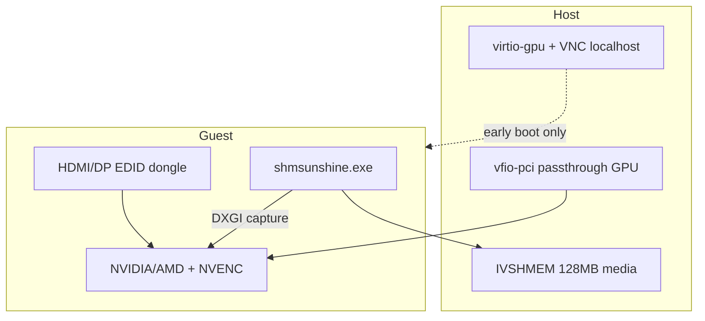

# Windows Display & Capture Architecture

## Overview

Thinkmay CloudPC streams video from a Windows 11 guest via **Sunshine** (`shmsunshine.exe`) → **IVSHMEM** → proxy → WebRTC. Capture requires an active DXGI desktop on the **passthrough GPU** (NVIDIA/AMD via VFIO). A separate **QEMU virtio-gpu + VNC** path exists for boot-time debugging only.

## Current approach (being replaced): Parsec VDD

Today a software virtual display driver (Parsec VDD) creates a synthetic monitor at session start:

| Component | Role |
|-----------|------|
| `display/vdd.exe /S` | Installs virtual display driver at boot |
| `daemon.Vdd.Activate()` | IOCTL adds virtual monitor before Sunshine starts |
| `DisplaySwitch /external` | Routes Windows desktop to the virtual monitor |
| Sunshine | Captures the virtual monitor via DXGI; encodes on passthrough GPU (NVENC) |

**Problems:** driver boot failures, mid-stream TDR/crashes, `VddUpdate()` IOCTL dependency, handle-claim errors (408), non-deterministic display topology.

Implementation: [`worker/daemon/utils/media/parsec_vdd_windows.go`](../../../worker/daemon/utils/media/parsec_vdd_windows.go), [`worker/daemon/routing.go`](../../../worker/daemon/routing.go).

## Target approach: hardware EDID dongle

Replace Parsec VDD with a **physical HDMI/DP EDID dongle** on each passthrough GPU. The GPU sees a real connected monitor; Windows renders the desktop natively on the passthrough adapter.



### Two independent display stacks

| Stack | Purpose | User-facing? |
|-------|---------|--------------|
| **Passthrough GPU + dongle** | Production capture + NVENC | Yes — WebRTC stream |
| **virtio-gpu + VNC** | Boot/early-stage debug | No — localhost + PWA Debug / deploy watch (Technical mode) |

QEMU config (unchanged): [`worker/proxy/qemu/monitor.go`](../../../worker/proxy/qemu/monitor.go) attaches `-vga virtio -display vnc=localhost:...`.

Once Windows loads the passthrough driver, VNC goes blank — **expected**. Active session desktop lives only on the passthrough GPU.

## Deterministic capture pinning

`DisplaySwitch.exe` is **not** used for capture control. It only changes Windows desktop topology; Sunshine selects capture targets independently via DXGI enumeration.

Today `shmsunshine.exe` enumerates **all** `AttachedToDesktop` outputs and maps index 0 → `video[0]` → user stream (`MaxDisplay = 1`). If virtio-gpu is also active, the wrong monitor may be captured. Enumeration order from `EnumAdapters1` is not stable across boots.

### Three-layer defense

1. **Disable virtio GPU in guest** — `devcon disable "PCI\VEN_1AF4&DEV_1050"` before Sunshine starts.

   **WARNING — never use a `VEN_1AF4*` wildcard.** Red Hat vendor ID `1AF4` covers all virtio devices: virtio-net (`DEV_1000/1041`), virtio-blk (`DEV_1001/1042`, the boot disk), and IVSHMEM (`DEV_1110`, the streaming path itself). Only `DEV_1050` is the virtio GPU.

   Notes:
   - Host VNC is unaffected (QEMU `vnc_worker` reads the host-side framebuffer). After Windows PnP disables the device, the VNC framebuffer freezes at the last boot image — consistent with boot-only debug scope.
   - The disable persists across reboots; early firmware/boot output still appears on VNC because it predates Windows driver attach.
   - Disable at device level, not driver level: even without the viogpudo driver, Microsoft Basic Display Adapter can attach an active desktop output to virtio-gpu.

2. **Daemon resolves passthrough output** — `ResolvePassthroughDisplay()` scans GDI for active outputs matching `VEN_10DE` (NVIDIA) or `VEN_1002` (AMD). Refuse to start Sunshine unless exactly one match. Pass the result to `hid.NewHID(disp)` for coordinate mapping.

3. **Pin Sunshine capture** — new CLI flag:
   ```text
   shmsunshine.exe --ivshmem <path> --capture-display \\.\DISPLAYn
   ```
   Start a single capture thread only. Filter `display_names()` by passthrough VendorId (`0x10DE`, `0x1002`) as defense-in-depth inside [`display_base.cpp`](../../../worker/sunshine/src/platform/windows/display_base.cpp).

### What not to rely on

| Approach | Why insufficient |
|----------|------------------|
| `DisplaySwitch /internal` | Does not change DXGI enumeration or queue[0] mapping |
| Dummy plug only | Ensures passthrough has an output, not that Sunshine picks it |
| NVENC on passthrough GPU | Encoder can run on NVIDIA while capture reads a virtio framebuffer |

## Fleet requirements

| Item | Spec |
|------|------|
| Dongle | One per passthrough GPU, plugged before VM boot |
| Port | Standardize (e.g. DP1) per GPU SKU |
| EDID | Match tier: 1080p/1440p/4K — fixes desktop render resolution only (see below) |
| Validation | Passthrough output active within 90s; no Parsec VDD; stream non-black |

**Resolution note:** On the **hardware (dongle) path**, dongle EDID sets the baseline desktop mode; daemon may still call `ChangeDisplaySettingsEx` on the passthrough display when the client requests a new size ([fork spec §6.5](./thinkmay_vdd_fork_spec.md)). Sunshine also rescales the encoder via IVSHMEM `ChangeResolution`. On the **VDD fallback path**, daemon **must** apply desktop mode changes (not encoder-only scaling) so mobile portrait and touch coordinates stay aligned — see [thinkmay_vdd_fork_spec.md §6.5](./thinkmay_vdd_fork_spec.md).

### Failure triage

| Symptom | Likely cause | Action |
|---------|--------------|--------|
| GPU driver loads but no output | Missing/disconnected dongle | Reseat dongle; check port |
| Wrong resolution / refresh | Dongle EDID mismatch | Swap dongle EDID profile |
| Code 43 / no GPU | VFIO issue | [gpu_passthrough_analysis.md](../../gpu_passthrough_analysis.md) |
| Stream black, GPU OK | Sunshine capturing wrong adapter | Verify `--capture-display` pin |
| VNC blank after boot | Expected behavior | Use for pre-logon debug only |

## Boot UX (VNC visibility)

| User path | Sees VNC? |
|-----------|-----------|
| Normal Connect flow | No — waits for WebRTC stream |
| Deploy watch — Friendly (default) | No — YouTube tutorial |
| Deploy watch — Technical | Partial — early boot only, then blank |

VNC reads virtio-gpu, not the passthrough desktop. This matches the prior Parsec VDD setup where `DisplaySwitch /external` routed the desktop away from virtio.

## Capture path selection (implemented)

At session start [`routing.go`](../../../worker/daemon/routing.go) `resolveCaptureDisplay()` (after Explorer is ready):

```text
HasPassthroughGPUPresent() && WaitForPassthroughOutput(30s) succeeds → hardware path
                                                               fails    → Parsec VDD activation
!HasPassthroughGPUPresent()                                         → Parsec VDD immediately
```

| Path | Display source | Sunshine args | DisplaySwitch |
|------|---------------|---------------|---------------|
| Hardware (dongle) | Passthrough GPU `\\.\DISPLAYn` | `--capture-display <name>` | Not used |
| VDD fallback | Thinkmay VDD (fork of MttVDD; today: Parsec) | (enumerate all displays) | `/external` or `/extend` from IVSHMEM metadata |

Hardware path also calls `DisableVirtioGPU()` (`VEN_1AF4&DEV_1050` only). VDD cleanup on session close runs only when this session called `Vdd.Activate()` (`iws.vddActive`).

## Migration phases

1. **P0** — Install dongles on canary nodes; manual validation
2. **P1** — Guest-side autodetect with VDD fallback (**done** — `routing.go`, `tools_windows.go`, `main.cpp`)
3. **P2** — Ship Thinkmay VDD fork; wire `ActivateIddVDD()`; remove Parsec `vdd.exe` from NSIS ([fork spec](./thinkmay_vdd_fork_spec.md))
4. **P3** — Delete Parsec VDD CGO and legacy assets

Nodes without dongles keep working unchanged via the VDD fallback. No volume flag or DB change required.

## Related docs

- [Technical architecture](./technical_doc.md) — end-to-end streaming pipeline
- [VDD requirements](./vdd.md) — fallback product requirements
- [Thinkmay VDD fork spec](./thinkmay_vdd_fork_spec.md) — Virtual-Display-Driver fork implementation spec
- [Windows bundle](./windows_bundle.md) — guest installer layout
- [QEMU VM thread reference](./qemu_vm_threads.md) — VNC thread (`vnc_worker`)
- [GPU passthrough analysis](../../gpu_passthrough_analysis.md) — VFIO/GPU driver failures (separate from VDD)
