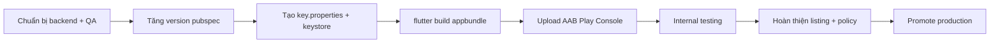

# 20 — App Release & Store Publishing

## Tổng quan

Quy trình **build, ký, và phát hành** app Flutter Thinkmay CloudPC lên cửa hàng ứng dụng.

Spec này được soạn dựa trên workflow [Anything — Submit to Play Store](https://www.anything.com/docs/apps/mobile/publishing-android.md), rồi **ánh xạ sang repo thực tế** (`thinkmay_app`): build thủ công / CI, không có bước upload tự động lên Play Console.

| Nền tảng | Trạng thái trong repo |
|----------|------------------------|
| **Android (Google Play)** | CI release AAB (`.github/workflows/release.yml`) + script local `build_release.ps1` |
| **iOS (App Store)** | Có project `ios/`; chưa có spec CI / TestFlight trong repo |

**Nguồn sự thật kỹ thuật:** `pubspec.yaml`, `android/app/build.gradle.kts`, `android/app/src/main/AndroidManifest.xml`, `.github/workflows/debug.yml`, `README.md`.

---

## Trạng thái hiện tại (repo)

| Hạng mục | Giá trị / ghi chú |
|----------|-------------------|
| Package name (Android) | `com.thinkmay.thinkmay_app` — **không đổi sau khi publish** |
| Display name | `Thinkmay Cloud PC` (Android `strings.xml`, iOS `Info.plist`) |
| Version hiện tại | `1.2.1+2` (`pubspec.yaml`; `versionCode` / `versionName` lấy từ đây) |
| Backend production | `Endpoint.baseUrl = https://saigon2.thinkmay.net` (hardcoded) |
| Signing release | `android/key.properties` + keystore (gitignored); `build.gradle.kts` đọc khi file tồn tại |
| CI debug | `.github/workflows/debug.yml` — push `develop` → debug APK artifact |
| CI release | `.github/workflows/release.yml` — tag `v*` hoặc manual → signed AAB artifact |
| Play upload tự động | **Tuỳ chọn** — `workflow_dispatch` + `upload_play` + secret `PLAY_STORE_SERVICE_ACCOUNT_JSON` |
| Flavor `dev` | Được nhắc trong `CLAUDE.md` (`flutter run --flavor dev`) nhưng **chưa cấu hình** `productFlavors` trong Gradle |

---

## Trước khi release

### Backend & hạ tầng

Giống Anything: nếu release có thay đổi API / schema / RPC, **deploy backend trước** khi submit store.

| Thành phần | Kiểm tra |
|------------|----------|
| PocketBase / worker | `/info`, session SSE, volumes hoạt động trên `saigon2.thinkmay.net` |
| NextJS RPC | `https://thinkmay.net/api/global_rpc` — payment, subscription, gamification |
| Supabase | Auth + queries realtime (`saigon2.thinkmay.net:445`) |
| Deep link auth | `thinkmay://confirm-reset-password`, `thinkmay://confirm-verification` khớp email template |

### App & QA

- Chạy checklist auth: [auth/03-authentication-test-cases.md](./auth/03-authentication-test-cases.md) mục **Checklist QA trước release**.
- Smoke test luồng chính: login → dashboard → power on VM → remote stream → logout.
- Tăng `version` trong `pubspec.yaml` (`version: x.y.z+buildNumber`); Play Store **từ chối** nếu `versionCode` trùng bản đã upload.

### Tài sản store (chuẩn bị ngoài repo)

| Mục | Ghi chú |
|-----|---------|
| Tên app thương mại | VD: Thinkmay Cloud PC |
| Icon 512×512 | Play Console; hiện dùng `@mipmap/ic_launcher` |
| Feature graphic | 1024×500 (Play) |
| Screenshot | Phone + tablet (landscape quan trọng vì RemoteScreen) |
| Mô tả ngắn / đầy đủ | VI + EN (app hỗ trợ `vi`, `en`) |
| Privacy policy URL | Bắt buộc Play; app có màn `/terms` nhưng cần **URL công khai** cho form |
| Data safety form | Khai báo: account, network, usage analytics (Rybbit), v.v. |
| Content rating | IARC questionnaire |
| Target audience | Tuổi, quốc gia phân phối |

---

## Android — Google Play

Workflow tham chiếu Anything, **thực hiện thủ công** trong repo Thinkmay.



### Bước 1 — Tạo app listing (lần đầu)

1. Vào [Google Play Console](https://play.google.com/console).
2. **Create app** → nhập **Package name** chính xác: `com.thinkmay.thinkmay_app`.
   - Package name **không đổi** sau khi publish — phải khớp `applicationId` trong `android/app/build.gradle.kts`.
3. Điền thông tin cơ bản (ngôn ngữ mặc định, loại app/game, free/paid).

### Bước 2 — Signing (local)

Tạo file `android/key.properties` (gitignored) — mẫu: `android/key.properties.example`:

```properties
storePassword=<password>
keyPassword=<password>
keyAlias=<alias>
storeFile=upload-keystore.jks
```

`storeFile` relative tới `android/app/`. Hoặc chạy `.\build_release.ps1` (script kiểm tra file trước khi build).

`android/app/build.gradle.kts` đã wire `signingConfigs.release` khi file tồn tại.

**Play App Signing:** Google khuyến nghị bật Play App Signing — upload key có thể khác app signing key Google giữ.

### Bước 3 — Build Android App Bundle (AAB)

Từ root repo:

```powershell
cd d:/thinkmay/mobile
.\build_release.ps1
# hoặc thủ công:
flutter pub get
dart run build_runner build --delete-conflicting-outputs   # nếu đổi @freezed / @injectable
flutter build appbundle --release
```

**Output:** `build/app/outputs/bundle/release/app-release.aab`

Tuỳ chọn override version:

```powershell
flutter build appbundle --release --build-name=1.2.2 --build-number=42
```

### Bước 4 — Upload lên Play Console

Anything upload lên **Internal testing** dạng draft qua service account. Thinkmay hiện **upload thủ công**:

1. Play Console → app → **Testing** → **Internal testing** (hoặc Closed/Open).
2. **Create new release** → upload `app-release.aab`.
3. Thêm release notes → **Review release** → **Start rollout to Internal testing**.

Google có thể mất vài phút xử lý AAB trước khi build hiện trong track.

### Bước 5 — Hoàn thiện yêu cầu Google Play

Anything liệt kê các mục team vẫn phải làm trên Console (build/upload là phần app; policy là phần store):

| Yêu cầu | Trạng thái Thinkmay |
|---------|---------------------|
| App details & short description | Cần soạn |
| Store listing (mô tả đầy đủ) | Cần soạn |
| Icon, feature graphic, screenshots | Cần asset; chụp Remote landscape |
| Privacy policy URL | Cần URL public (ngoài in-app terms) |
| Data safety | Khai báo theo SDK: PocketBase auth, Supabase, Dio, WebRTC, Rybbit |
| Content rating | Chưa làm trong repo |
| Target audience | Chưa làm trong repo |
| Testing track + testers | Internal testers (email list / Google Group) |
| Release notes | Mỗi bản upload |

### Bước 6 — Promote lên Production

Sau khi internal/closed test ổn:

1. Hoàn thành **Pre-launch report** (nếu bật).
2. Đảm bảo không còn policy warning.
3. **Promote release** từ testing track → **Production** (hoặc tạo production release cùng AAB).
4. Chọn % rollout (staged) hoặc full.

---

## Quyền & khai báo Android (Data safety)

Permissions hiện tại (`AndroidManifest.xml`):

| Permission / query | Mục đích app |
|--------------------|--------------|
| `INTERNET` | API, WebRTC streaming |
| `ACCESS_NETWORK_STATE` | Network check / connectivity |
| `<queries>` http/https/tel/sms/mailto | Mở link, dialer, share (plugin / intent) |

**Chưa khai báo trong manifest (có thể cần khi bật tính năng):** camera, mic (WebRTC mic), location — kiểm tra plugin `flutter_webrtc` và permission runtime trước khi submit.

Deep links (`thinkmay://`) — không cần Digital Asset Links trừ khi dùng App Links `https://`.

---

## CI/CD

### Debug (develop)

`.github/workflows/debug.yml` — push `develop` → `flutter build apk --debug` → artifact.

### Release (Play)

`.github/workflows/release.yml`:

| Trigger | Output |
|---------|--------|
| Git tag `v1.2.2` | Signed AAB artifact; `versionName` lấy từ tag |
| Manual dispatch | AAB artifact; optional upload Play Internal draft |

**GitHub Secrets:** `ANDROID_KEYSTORE_BASE64`, `ANDROID_KEYSTORE_PASSWORD`, `ANDROID_KEY_PASSWORD`, `ANDROID_KEY_ALIAS`, `PLAY_STORE_SERVICE_ACCOUNT_JSON` (upload).

### Gap còn lại

| Hạng mục | Trạng thái |
|----------|------------|
| Flavor dev/prod + `dart-define` cho `baseUrl` | Chưa làm |
| Privacy policy URL + Data safety (Play Console) | Thủ công ngoài repo |
| Spec iOS / TestFlight | Chưa làm |
| Pre-launch report + ProGuard/R8 | Chưa làm |

---

## iOS — App Store (tóm tắt)

Chưa có workflow tương đương trong repo. Checklist tối thiểu khi làm iOS:

| Bước | Ghi chú |
|------|---------|
| Apple Developer account | Team ID, certificates, provisioning |
| Bundle ID | Khớp `PRODUCT_BUNDLE_IDENTIFIER` trong Xcode |
| `flutter build ipa` | Hoặc archive qua Xcode |
| TestFlight | Internal → external testers |
| App Store Connect listing | Screenshot, privacy nutrition labels, review notes (WebRTC background) |
| URL schemes | `thinkmay` deep link trong `Info.plist` |

Anything có doc riêng [Submit to App Store](https://www.anything.com/docs/apps/mobile/publishing-ios.md) — tham khảo khi viết spec iOS chi tiết.

---

## Troubleshooting

| Triệu chứng | Nguyên nhân thường gặp | Cách xử lý |
|-------------|------------------------|------------|
| **Package name already exists** | Trùng app khác trên Play | Dùng đúng `com.thinkmay.thinkmay_app` hoặc tạo listing mới; không đổi sau publish |
| **Version code đã dùng** | Quên tăng build number | Tăng số sau `+` trong `pubspec.yaml` hoặc `--build-number` |
| **Upload lỗi signing** | Thiếu / sai `key.properties` | Kiểm tra keystore path, alias, password; build local trước |
| **Build không hiện trên Console** | Google đang process | Đợi 5–15 phút, refresh Internal testing |
| **Permission / Data safety reject** | Khai báo thiếu SDK | Rà soát Supabase, WebRTC, analytics; cập nhật form |
| **App crash khi mở từ store** | Release build khác debug | Test `flutter run --release` / install AAB qua internal track |
| **Auth deep link không mở app** | Intent filter / email link sai | Khớp scheme `thinkmay` + host với template email |

---

## Checklist release (rút gọn)

### Trước build

- [ ] Backend production đã deploy
- [ ] `pubspec.yaml` version + build number mới
- [ ] `flutter analyze` sạch lỗi blocking
- [ ] QA P0 auth + dashboard + remote
- [ ] `key.properties` + keystore hợp lệ

### Build & upload

- [ ] `flutter build appbundle --release`
- [ ] Upload AAB → Internal testing
- [ ] Thêm release notes

### Trước production

- [ ] Store listing + screenshots (có landscape remote)
- [ ] Privacy policy URL
- [ ] Data safety + content rating + target audience
- [ ] Internal testers xác nhận ổn định
- [ ] Promote / production rollout

---

## Gaps & hạng mục nghiên cứu tiếp

| # | Hạng mục | Trạng thái |
|---|----------|------------|
| 1 | Workflow CI build release AAB | ✅ `release.yml` |
| 2 | Play upload internal track (service account) | ✅ Tuỳ chọn qua workflow_dispatch |
| 3 | Script local `build_release.ps1` + `key.properties.example` | ✅ |
| 4 | Display name `Thinkmay Cloud PC` | ✅ |
| 5 | Privacy policy URL + Data safety mapping | 🔴 Play Console — thủ công |
| 6 | Flavor dev/prod + `dart-define` cho `baseUrl` | 🔴 |
| 7 | Spec iOS / TestFlight | 🔴 |
| 8 | Pre-launch report + ProGuard/R8 | 🔴 |

---

## Liên kết

| Tài liệu | URL / path |
|----------|------------|
| Anything — Submit to Play Store | https://www.anything.com/docs/apps/mobile/publishing-android.md |
| Anything — docs index | https://www.anything.com/docs/llms.txt |
| Flutter — Android deployment | https://docs.flutter.dev/deployment/android |
| Play Console | https://play.google.com/console |
| Build local | `README.md` (mục Release app bundle) |
| Auth QA | [auth/03-authentication-test-cases.md](./auth/03-authentication-test-cases.md) |
| Backend | [18-backend-integration.md](./18-backend-integration.md) |

---

Cập nhật: 2026-05-25 — implement release workflow, build script, store display name.
