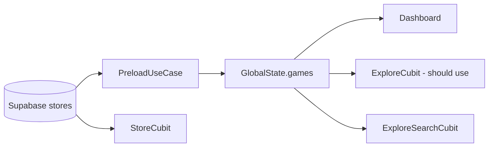

# 12 — Explore, Games & Store

## Tổng quan

Catalog game: tab Explore, màn Store riêng, search, game detail. **Nguồn data thật** đã có ở preload/Store; **Explore tab chưa dùng**.

---

## Trạng thái API

> [API-COVERAGE.md](../API-COVERAGE.md)

| Thành phần | Trạng thái | Backend |
|------------|------------|---------|
| **Explore tab** | ✅ | `FetchStoreUseCase` + AI search (#7); **#22 backlog:** section game theo genre persona |
| **Explore search** | ✅ | Genres: RPC `get_all_app_genres_v1`; catalog + filter name/code_name/genres |
| **Store** `/store` | ✅ | Supabase `stores` + PB `buckets` |
| **Game detail** | 🟡 | Catalog + `StartSessionUseCase`; **#23 backlog:** hiệu suất Thinkmay hardcode FPS |
| **Dashboard games** | ✅ | `GlobalState.games` ← `FetchStoreUseCase` (Supabase) trong preload |

---

## Mobile — chi tiết

### Explore tab (`explore_cubit.dart`)

`init()` ưu tiên `GlobalCubit.games`, fallback `FetchStoreUseCase`. AI search qua `SearchStoresUseCase` (POST `/api/search/` → RPC `search_stores`).

### Explore search (`explore_search_cubit.dart`)

- Catalog: `GlobalCubit.games` hoặc `FetchStoreUseCase`
- Genres: Supabase RPC `get_all_app_genres_v1` (`FetchGenresUseCase`); fallback derive từ `stores.genres`
- Search: client-side match `name`, `code_name`, `genres` (website `AllGamesSection` Fuse keys)
- Category chips: tap lọc theo genre

### Backlog — persona genre sections (#22)

- **Mục tiêu:** Trên tab Explore, thêm section (carousel/list) game gợi ý theo **genre đã có sẵn trong persona** của user đăng nhập.
- **Data:** PocketBase collection `persona` (genre/preferences) + catalog `stores.genres`; có thể tái dùng `FetchRecommendationsUseCase` hoặc filter `GlobalCubit.games` theo genre persona.
- **Website tham chiếu:** `website/components/store/AIRecommendations.tsx` (persona → search_stores → carousel).
- **Trạng thái:** 🔴 chưa wire UI mobile.

### Store (`store_cubit.dart`)

- `fetchStore(email)` → `StoreService` → Supabase `.from('stores').select(...)`
- `fetchBuckets()` → PocketBase collection `buckets`

`store_screen.dart` gọi `fetchStore('')` khi build (email lấy từ `getIt<User>()` trong use case).

### Game detail (`game_detail_cubit.dart`)

- Catalog từ `GameDetailParam` + `GlobalCubit.games`; genres/publisher lookup catalog (#8 follow-up).
- Launch stream: `StartSessionUseCase` khi có volume phù hợp.

### Backlog — hiệu suất Thinkmay (#23)

- **UI:** `[performance_section.dart](../lib/presentation/screen/game_detail/widgets/performance_section.dart)` — section *Trải nghiệm khi chơi trên Thinkmay*.
- **Hiện trạng:** FPS **hardcode** 45 / 60 / 98 (Flexible / Standard / High Performance); `GameDetailViewModel` có `currentFps`, `standardFps`, `highPerformanceFps` nhưng **chưa bind**.
- **Mục tiêu:** Hiển thị benchmark/ước lượng FPS theo **game cụ thể** + **gói Cloud PC** user (plans/subscription metadata hoặc API backend tương đương website AppDetail).
- **Trạng thái:** 🔴 chưa wire data thật.

### Data model `Game`

Supabase trả: `name`, `code_name`, `path_full` (map từ `header_image`), genres, …

---

## Website — đối chiếu

| Mobile | Website |
|--------|---------|
| Explore mock | `/store` SSR + client catalog |
| Store ✅ | `StoreAllGames`, `AppDetail` |
| Dashboard games | `play` page carousel |

---

## Data flow (target)

---

## Liên kết

- [13-banners](../banner/13-banners-marketing.md)
- [04-dashboard](../dashboard/04-dashboard-cloud-pc.md)
- [18-backend-integration](../18-backend-integration.md)
