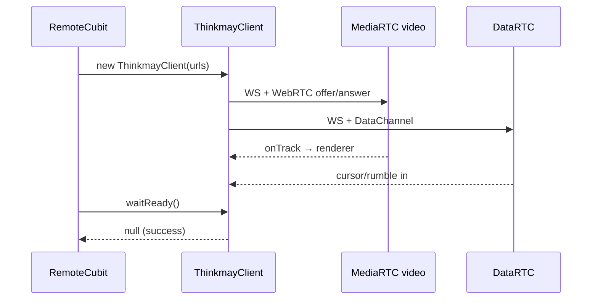

# 05 — Remote Streaming & WebRTC

## Tổng quan

Tính năng cốt lõi: stream **video H.264 + audio Opus** từ Cloud PC, gửi **HID** qua DataChannel, tùy chọn **microphone**. Mobile port trực tiếp từ `website/core/core` (`Thinkmay` → `ThinkmayClient`).

---

## Kiến trúc 4 kết nối WebRTC

| # | Connection | Direction | URL pattern |
|---|------------|-----------|-------------|
| 1 | Video | recv-only | `wss://<host>:444/broadcasters/webrtc/recvonly?token=<vmid>&codec=h264` |
| 2 | Audio | recv-only | `...&codec=opus` |
| 3 | HID | send-only | `wss://<host>:444/broadcasters/webrtc/sendonly?token=<vmid>` |
| 4 | Microphone | send-only | `...sendonly?token=<vmid>` (mic) |

URLs parse từ `session.thinkmay.listener[]` — **File:** `lib/data/network/session/session_service.dart` (`parseRequest`).

---

## Trạng thái API

> Tổng hợp: [API-COVERAGE.md](../API-COVERAGE.md)

| Thành phần | Trạng thái |
|------------|------------|
| Session / WebRTC signaling | ✅ |
| Video / audio / HID | ✅ |
| Microphone uplink | 🟡 Cố ý `microUrl: null` (tránh crash native) |
| Bot captcha (web) | 🔴 Chưa có trên mobile |

**Streaming production-ready**; mic/captcha là gap có chủ đích hoặc chưa làm.

---

## Mobile — core layer

| Class | File | Vai trò |
|-------|------|---------|
| `ThinkmayClient` | `lib/core/thinkmay_client.dart` | Orchestrator — comment "Mirror of website/core/core/index.ts" |
| `MediaRTC` | `lib/core/webrtc/media_rtc.dart` | WS signaling, SDP, ICE, binary `MessageType` |
| `DataRTC` | `lib/core/webrtc/data_rtc.dart` | HID out, cursor/rumble in |
| `MicrophoneRTC` | `lib/core/webrtc/microphone_rtc.dart` | Mic uplink |
| `TouchHandler` | `lib/core/hid/touch_handler.dart` | Touch → HID (`td`/`tm`/`tu`, `mmr` trackpad) |
| `CursorHandler` | `lib/core/cursor/cursor_handler.dart` | Server cursor overlay |
| `StreamingManager` | `lib/core/streaming_manager.dart` | Singleton bridge UI → client |
| `EventCode` / `HIDMsg` | `lib/core/models/event_code.dart` | Wire protocol |
| `Metric` | `lib/core/models/metrics.dart` | Video/audio connection status, FPS, bitrate |

### ThinkmayClient — establishment loops

Constructor khởi chạy vòng lặp tự reconnect (delay ~1s khi connection đóng):

- `_videoEstablishmentLoop()`
- `_audioEstablishmentLoop()`
- `_dataEstablishmentLoop()`
- `_microphoneEstablishmentLoop()` — chỉ nếu `microUrl != null`

**`waitReady()`:** poll đến `metrics.video.status == connected` hoặc timeout 60s / auth failure / user cancel.

**Public API (chọn lọc):**

- `mouseButtonDown/Up`, `mouseWheel`
- `virtualGamepadAxis`, `virtualGamepadButton`
- `setNativeTouch`, `setClientCursor`, `setIdle`
- `changeFramerate`, `changeBitrate`, `requestIDR`
- `setClipboard`
- `close()`

### MediaRTC signaling (giống website)

1. WebSocket connect
2. Message `open` → `{username, password}` → ICE servers (TURN)
3. SDP offer từ server → set codec preferences → answer
4. ICE trickle
5. Binary messages: `[MessageType, ...]` — framerate, bitrate, IDR, resolution

---

## Mobile — presentation layer

### RemoteCubit

**File:** `lib/presentation/screen/remote/cubit/remote_cubit.dart`

**States (`remote_state.dart`):**

- `initial`
- `connecting`
- `connected({Metric? metrics})`
- `error(String message)`

**Init sequence:**

1. `parseRequest(session.id, session.thinkmay!, addrOverride?)`
2. Validate `videoUrl`, `audioUrl`, `hidUrl`
3. `renderer.initialize()` — `RTCVideoRenderer`
4. `ThinkmayClient(..., microUrl: null)` — **cố ý tắt mic** (tránh SIGABRT flutter_webrtc khi chưa có permission)
5. `StreamingManager().assign(_client)`
6. `await _client.waitReady()`
7. `_startInactivityTimer()` — **8 phút** không tương tác → error + dispose
8. `onMetricsUpdate` → re-emit `connected(metrics:)`

### RemoteScreen render

**File:** `lib/presentation/screen/remote/remote_screen.dart`

**Orientation:** force landscape vào, portrait khi dispose.

**Stack (dưới → trên):**

1. `RTCVideoView(renderer)` — video track
2. Loading / error overlay (`BlocBuilder<RemoteCubit>`)
3. Cursor overlay (`CustomPaint` / widget từ `CursorHandler`)
4. `TmVirtualKeyboard` — nếu sidepane show
5. `TmVirtualGamepad`
6. `RemoteTaskbar` — toggle controls, mở control panel
7. GestureDetector — `resetInactivityTimer` on tap

**Control panel:** dialog `ControlPanelVirtualScreen` — bitrate, framerate, touch mode (gọi `StreamingManager`).

---

## Website — đối chiếu

| Mobile | Website |
|--------|---------|
| `ThinkmayClient` | `core/core/index.ts` class `Thinkmay` |
| `RTCVideoRenderer` | `VideoWrapper` → `<video autoPlay>` |
| Audio track | `AudioWrapper` → `<audio>` |
| `StreamingManager` | `core/singleton/index.ts` — `Assign`, `keyboard`, … |
| `RemoteCubit` | `app/[locale]/remote/page.tsx` — `useEffect` setup WebRTC |
| Redux `remote` slice | `RemoteState` trong cubit + settings từ user metadata |
| Redux `metrics` action | `onMetricsUpdate` callback |
| Inactivity 8 min | `GetLastActive`, HID warning — tương tự logic |
| `microUrl: null` | Website tắt mic nếu không grant permission |
| Bot captcha | `BotDetector` + `CaptchaModal` | **Không có** mobile |
| Pointer lock / fullscreen | Redux `remote` flags | Mobile: system UI landscape only |
| GCC URL params | Query `gcc`, `bitrate` on setup | Một phần qua advanced settings |

### Remote page state (website excerpt)

`useAppSelector` đọc: `auth`, `relative_mouse`, `fullscreen`, `touch`, `native_touch`, `hq`, `framerate`, `pointer_lock`, …

Layers: `<video>` z=0 → overlay z=10: Taskbar, Settings, Specs, Plugin, VirtKeyboard, VirtualGamepad.

---

## Metrics & hiển thị

`Metric` gồm `video`, `audio` sub-metrics: `ConnectionStatus`, frame timing, loss, bitrate estimates.

Website: interval `sync` dispatch `metrics()` → Redux → `SpecsConnectInfo` component.

Mobile: `RemoteState.connected(metrics:)` — có thể bind UI debug (control panel).

---

## Sequence diagram

---

## Gaps parity

| Feature | Website | Mobile |
|---------|---------|--------|
| Microphone | Optional with permission | Always `null` |
| Bot detection | Yes | No |
| Log WebSocket | `logUrl` optional | No |
| Share remote URL | Yes | No |
| `ChangeResolution` | Yes | Check `ThinkmayClient` methods |
| Gamepad physical | `runGamepad()` polling | Virtual gamepad only |

---

## Liên kết

- [06-virtual-controls](06-virtual-controls-sidepane.md)
- [07-worker-api-session](../07-worker-api-session.md)
