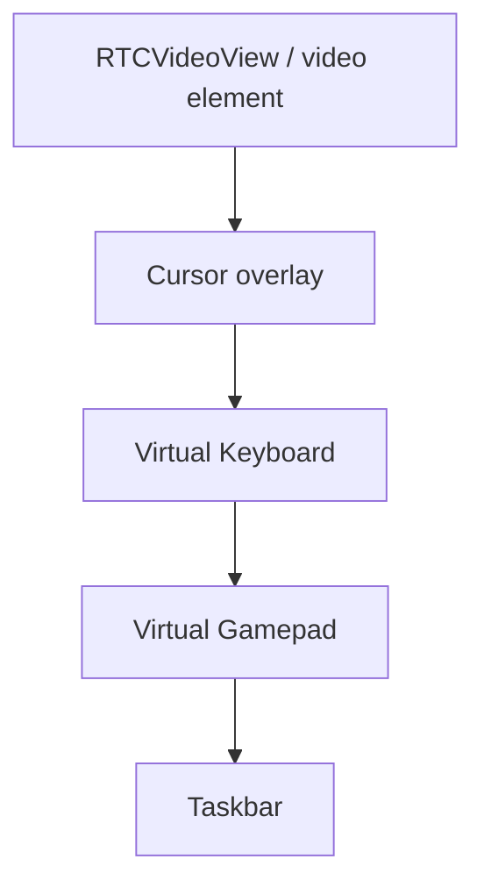

# 06 — Virtual Controls & Sidepane

## Tổng quan

Lớp UI trên Remote: **bàn phím ảo**, **gamepad ảo**, **taskbar**, **control panel** (cài đặt stream). Vị trí và visibility được persist.

Website: `components/control/*` + Redux `sidepane` slice.

---

## Mobile

### Components

| Widget | File |
|--------|------|
| Virtual keyboard | `lib/presentation/components/tm_virtual_keyboard.dart` |
| Virtual gamepad | `lib/presentation/components/tm_virtual_gamepad.dart` |
| Taskbar | `lib/presentation/screen/remote/widgets/remote_taskbar.dart` |
| Control panel | `lib/presentation/screen/control_panel_virtual/control_panel_virtual_screen.dart` |
| Keymap | `lib/core/utils/keymap.dart` — label → Windows VK scancode |

### SidepaneCubit

**Files:**
- `lib/presentation/screen/remote/cubit/sidepane_cubit.dart`
- `sidepane_state.dart`
- `lib/data/repository/sidepane_repository.dart` (SharedPreferences)

**State `SidepaneStateData` (typical fields):**

- `keyboardHide`, `gamepadHide`, `taskbar` position
- Layout gamepad (portrait/landscape offsets)
- Load on init → `SidepaneRepository.loadMobileControl()`
- Save on drag/toggle → `saveMobileControl()`

### HID wiring

UI không gửi HID trực tiếp — gọi **`StreamingManager`**:

```dart
StreamingManager().keyboard(key, isDown);
StreamingManager().gamepadButton(isDown, index);
StreamingManager().gamepadAxis(x, y, isRight: true);
```

`StreamingManager` delegate tới `ThinkmayClient` đã `assign()`.

### Touch modes

- `TouchHandler.native` — absolute touch (`td`/`tm`/`tu`)
- Trackpad mode — relative `mmr`
- Toggle qua control panel → `setNativeTouch()`

### Check screens (diagnostic)

| Screen | Route | Mục đích |
|--------|-------|----------|
| Check keyboard | `/check-keyboard` | Test key press display |
| Gamepad test | `/gamepad-test` | WebView tester |
| Onboarding virtual | (embedded) | Tutorial gestures |

---

## Website — đối chiếu

| Mobile | Website |
|--------|---------|
| `SidepaneCubit` | `backend/reducers/sidepane.ts` |
| `SidepaneRepository` | `sidepaneAsync.cache_position` / `load_position` |
| `TmVirtualKeyboard` | `components/control/keyboard/index.tsx` |
| `TmVirtualGamepad` | `components/control/gamepad/index.tsx` |
| `GamingKeyboard` | `gamingKeyboard/index.tsx` — mobile chưa có bản gaming riêng |
| `RemoteTaskbar` | `components/control/taskbar/index.tsx` |
| `ControlPanelVirtualScreen` | `components/control/setting/index.tsx` |
| `Plugin` overlay | `components/control/plugin/index.tsx` — mobile không mirror |
| HID DOM | `core/core/hid/hid.ts` — mouse/keyboard on video element | Mobile: touch on `GestureDetector` + virtual controls |

### Redux sidepane (website)

```typescript
// state.sidepane.mobileControl
keyboardHide, gamingKeyboardHide, pluginHide, gamepadHide,
taskbar.pos, keyboard.pos, gamepad.pos, ...
```

Remote page đọc:

```typescript
const keyboard = useAppSelector(state => !state.sidepane.mobileControl.keyboardHide);
const gamepad = useAppSelector(state => !state.sidepane.mobileControl.gamepadHide);
```

Render: conditional mount components trên video overlay.

---

## Render layering



Cả hai platform: **không** đưa frame video vào app state — WebRTC render trực tiếp.

---

## Gaps

| Item | Website | Mobile |
|------|---------|--------|
| Gaming keyboard layout | Yes | No |
| Plugin panel | Yes | No |
| Pointer lock mode | Yes | N/A mobile |
| Stats tab in sidepane | Yes | Limited in control panel |

---

## Liên kết

- [05-remote-streaming](05-remote-streaming-webrtc.md)
- [16-network-domain-diagnostics](../setting/16-network-domain-diagnostics.md)
