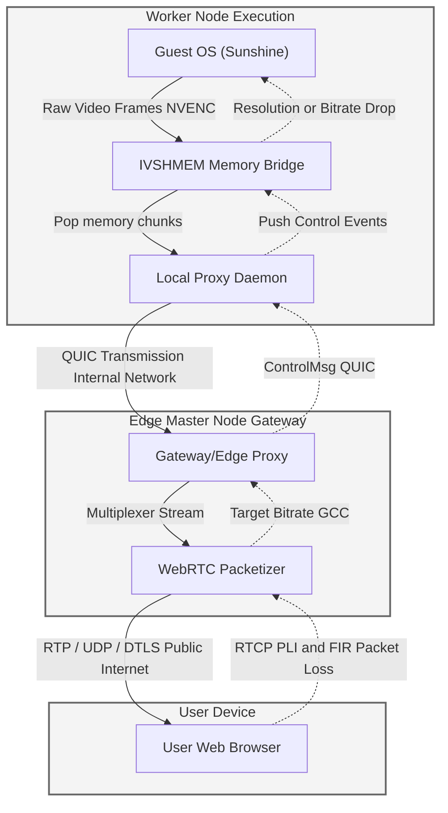
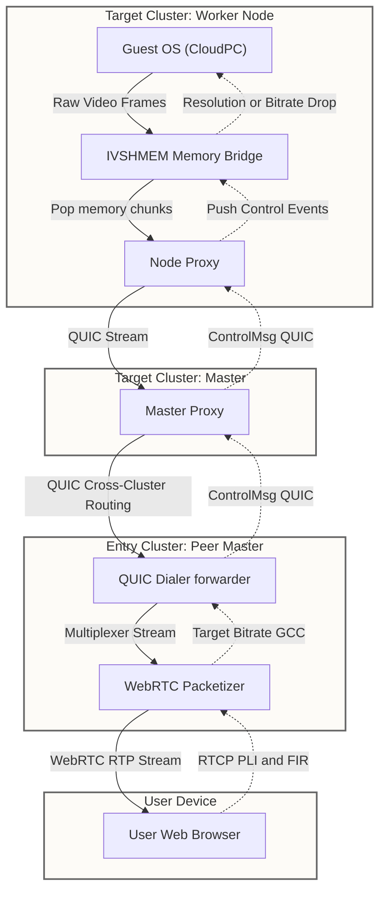

# Thinkmay CloudPC - Developer Documentation

## Overview
Thinkmay CloudPC is a high-performance cloud PC service tailored for gamers and 3D designers, providing low-latency Windows 11 virtual desktop environments. Out of the box, instances support up to 4K resolution at 240fps.

## System Architecture

### Instances & OS
* **Operating System**: Windows 11
* **Hardware Tiers**:
  * **Standard Plan**: EPYC Milan CPU, 1x RTX 5060ti GPU.
  * **Performance Plan**: Intel Xeon CPU, 1x RTX 3060ti GPU.
* **Storage Persistence**:
  * *Trial Plan*: Ephemeral. Data is wiped exactly 3 hours after creation.
  * *Standard/Performance Plans*: Persistent storage. Data is automatically wiped 2 days after the subscription expires.

### Streaming & Network
* **Protocol**: WebRTC is the core streaming protocol, chosen for real-time, low-latency delivery. Supports FlexFEC and NACK + RTX.
* **Congestion Control**: Uses Google Congestion Control (GCC) for adaptive bitrate.
* **Routing Strategy**: Implements multi-routing where users can manually choose their ingress route independently of the server's region. (e.g., A user in Hanoi connecting to a HCM server can route through Hai Phong into our internal backbone). This manual selection doubles as a user-driven failover mechanism.

### Video & Input
* **Codecs & Hardware Acceleration**: GPU accelerated H.264 / H.265 (HEVC).
* **Clipboard Sync**: Text copy/paste between local and remote is supported. File drag-and-drop is currently unsupported.
* **Responsive Inputs**: Full Touch/Multi-Touch, Gamepad, Virtual Gamepad (mobile), and Microphone pass-through. No multi-monitor support.

### Auth & Infrastructure
* **Authentication Services**: Email/Password, Google OAuth2, Email OTP.
* **Edge Locations**: Ho Chi Minh City (HCM) and Hai Phong (HP).
* **Boot lifecycle**: Provisioning and OS boot typically take 2-5 minutes but can vary under high load or due to GPU recovery mechanisms.
* **Client access**: Strictly browser-based. PWA (Add to Homescreen) behavior is the expected path for mobile client native feel.

## Codebase Onboarding Guide (For New Engineers)

Welcome to the Thinkmay CloudPC backend! If you are getting up to speed, focus your attention on the three core pillars of the backend architecture listed below:

### 1. Streaming Logic (`worker\proxy\forwarder\webrtc`)
* **What it does**: This module acts as the WebRTC gateway, responsible for transmitting the actual video and audio data to the client's browser.
* **Key Components**: 
  * `forwarder.go`: Manages the RTP/RTCP packet flow. This is where advanced streaming features live, such as **FlexFEC** (Forward Error Correction) and **Google Congestion Control** (GCC).
  * **Optimization Flow**: GCC adaptively tracks available network bandwidth. When a `bitrate_change` event triggers, the module commands the video encoder to scale down its output to prevent stuttering. If a packet loss reaches an unrecoverable limit, the module catches `PictureLossIndication` or `FullIntraRequest` from the RTCP channel and enforces an `IDR` frame (full frame reset) to unfreeze the client's video.

### 2. Backend & Database Logic (`worker\daemon\pocketbase`)
* **What it does**: Thinkmay uses Pocketbase as a customized backend as a service, extending it heavily via Golang to orchestrate user authorizations, sessions, and machine allocations.
* **Key Components**:
  * `pocketbase.go`: Bootstraps the DB and registers custom REST endpoints (`/new`, `/close`, `/restart`, `/reallocate`). It runs critical **Cron jobs** for reclaiming inactive VM storage, expiring trial buckets, and keeping sessions alive via Ping mechanisms.
  * **Event Hooks**: Pay attention to the `OnRecordCreateRequest` webhooks. When users or operations request a new volume/bucket in the database, these hooks automatically intercept the database write to trigger actual allocation logic in the hypervisor layer.
  * `db.go`: Houses the API endpoints managing active WebRTC stream sessions and tracks live Client states synchronized via Server-Sent Events (SSE).
  * **Dashboard Sync & `/info` API**: The `/info` endpoint explicitly bridges the frontend UI and the physical nodes. It directly queries the hypervisor logic via `client.Info()` for the true, persistent state of the machine (Volumes, Sessions, Uptime). The daemon utilizes `pb.infoauth` to deeply filter this JSON array specifically to the invoker's ID and returns it to be mapped into the Redux store (`state.worker.data`). The React `GetStarted` dashboard directly leverages this payload against the Pocketbase static constraints (`metaMaps`) to accurately render the correct "VM Start", "Server Down", or "Waiting Shutdown" UI bounds.
    * *Support Guideline / Debugging "Server Down"* : When investigating false "Server Down" tickets, look directly at the Redux tree: `state.worker.data[currentAddress]`. If `computer` is completely `undefined`, the fetch loop `worker_refresh` failed network/CORS entirely. If `computer` is present but `volume_status` marks `ServerDownState`, the Pocketbase backend (`pb.infoauth`) intentionally filtered out the VM from the payload. This mathematically guarantees that either the `volumes` table record doesn't exist for that user via `filterVolume`, or the local hypervisor physically failed to mount the PCIe disk payload.
  * **Access Control & Security Models**: Zero-trust policies are rigorously enforced here. Endpoints like `/new` explicitly extract the user's context via `c.Auth.Id`. Functions such as `filterVolume(uid)` bind database queries exclusively to the invoker's ID, structurally preventing users from booting or interfacing with CloudPCs they do not own. Streaming session handshakes emit a randomized UUID (`randid`) mapped cleanly for only a 5-second lifetime intercept, killing the link rapidly to neutralize interception vectors. Internal daemon-to-daemon cluster routes heavily rely on a `p2pcred` pre-shared environment key for secure cluster orchestration.

### 3. Infrastructure Logic (`worker\daemon\hypervisor.go`)
* **What it does**: The Hypervisor module translates instructions from Pocketbase and directly interacts with the cluster nodes to deploy Virtual Machines, assign GPUs, and attach storage.
* **Key Components**:
  * `deployVM` and deployment methods: Orchestrates VM boot sequencing. It parses the hardware limits (vCPU / RAM targets) from incoming configurations. 
  * **Resource Claiming**: Before spinning up a Windows 11 VM, the code claims an available GPU (`ClaimGPU`) using an internal queue system. If a requested storage volume doesn't exist locally, it negotiates adding a "Network Disk" (NDisk) so the remote node can serve the volume via NBD/MFS.

#### Deep Dive: Deployment Queues & Plan Priorities
The platform operates on a two-tier queuing system to manage machine availability correctly and elegantly enforce subscription tiers.
* **Master Node / Global Queue** (`globalQueue` in `daemon/hypervisor.go`): The central master tracks all worker nodes and determines where a deployment occurs based on available GPUs.
  * **Priority Logic**: Subscriptions dictate deployment priority through the `pref_node` parameters. The **Standard Plan** / Trial plans trigger standard deployment, placing the user at the back of the FIFO queue (`queue.AddTail`). The **Performance Plan** configurations specify a preferred node. When `preferred_nodes` exist, the system overrides FIFO by injecting the user directly to the *front* of the global queue (`queue.AddHead`), giving them supreme priority over standard traffic.
* **Worker Node / Local Queue** (`ClaimGPU` in `proxy/qemu/manager.go`): Once routed to the proper node, the deployment enters a worker-specific queue (`LocalDeployQueue`). It uses a strict FIFO structure where users effectively wait for local hardware to safely spin down existing sessions before claiming an available PCI-E GPU for QEMU passthrough (`takeGPU`).

#### Hardware Bridges & Network Isolation
The architecture treats a VM's internet access and its proxy video transmission as two independent, physically isolated pathways to guarantee unmatched resilience.
* **Public Network (Internet)**: Standard internet outbound traffic utilizes paravirtualized network drivers. `EnableQPublicNet` constructs `virtio-net-pci` devices and binds them to local Host `tap` interfaces before adding them to an OpenVSwitch (OVS) bridge spanning the targeted VLAN schema. 
* **Streaming Network (IVSHMEM)**: Critically, the WebRTC streaming agent does **NOT** use TCP/IP inside the guest OS. Instead, it interacts directly with custom Host-to-Guest Shared Memory (IVSHMEM) arrays (`EnableShmem`). The proxy maps a 128MB chunk for video rendering and a 4MB chunk for mouse/keyboard inputs. 
This physical memory bridge inherently bypasses the guest's Windows network stack. Consequently, users can install restrictive VPNs or entirely mangle their virtual IP routing tables without disrupting or locking themselves out of the video feed.

#### The End-to-End Streaming Pipeline (Capture to Browser)
To understand how video reaches the client, here is the exact data path from the guest OS to the browser WebRTC socket:
1. **Video Capture (Guest OS)**: Inside the Windows instance, the `sunshine` binary (`worker/sunshine/src/main.cpp`) hooks into the desktop session. It captures frames and encodes them (e.g., using NVENC for H.264/H.265).
2. **IVSHMEM Delivery**: Sunshine bypasses the guest network stack. It copies the raw encoded payloads, along with frame indices and timestamps, directly into the `MediaMemory` struct bound to the IVSHMEM (Inter-VM Shared Memory) segment (`worker/proxy/util/memory/cgo.go`).
3. **Proxy Ingestion (Host OS)**: On the host, the Go-based proxy constantly polls (`Pop()`) this shared memory block. As video chunks arrive, they are wrapped as `multiplexer.Sample` streams and pushed over channels to the WebRTC layer.
4. **Packetization & WebRTC Transmission**: Inside `worker/proxy/forwarder/webrtc/forwarder.go` (`readLoopRTP`), the WebRTC Forwarder decodes the C-struct byte array to extract the timestamp and data payload. It then runs this payload through a Pion `Packetizer` (segmenting it into MTU-compliant RTP units) and executes `track.WriteRTP()` to transmit the packets across the UDP internet socket to the end-user browser.
5. **Reverse Telemetry (RTCP -> IVSHMEM)**: If the browser's Google Congestion Control (GCC) detects jitter, or if packet loss triggers an RTCP PLI/FIR (Picture Loss Indication), the Forwarder writes control frames (`1` for Bitrate, `3` for IDR) directly back into the IVSHMEM `ctrlChann`. Sunshine polls this memory in reverse and actively downscales the video encoder bitrate or forces an IDR keyframe reset instantly.

##### Clustered Environment Packet Flow
In a multi-node cluster, users don't always connect directly to the worker node running their application. Clients typically hit an **Edge Gateway Proxy**. The proxy leverages the synchronized routing database to pipe the IVSHMEM packets seamlessly across the internal datacenter network (via QUIC backend dialers) before executing the final WebRTC packetization at the public edge.



##### Multi-Route Environment Packet Flow (Cross-Cluster / Peer Routing)
In a multi-route environment, a user might actively change their ingest route (e.g., connecting their WebRTC socket to a gateway in Ho Chi Minh City) while their deployment physically lives on a remote Peer cluster (e.g., in Hai Phong). The physical flow navigates through three distinct proxy hops using the `worker/proxy/forwarder/quic/dialer.go` module which powers this peer dial routing:



### 4. Volume Configurations API
The VM's hardware limits and features are controlled by a JSON payload stored in the `configuration` column of the `volumes` collection in Pocketbase. 

When a volume boots, Pocketbase parses this JSON string into a `configuration` struct overriding default values:
* `Template` / `Transient`: Base OS image, and whether disk writes are ephemeral (discarded on shutdown).
* `TPM` / `Extend`: Virtual hardware toggles for Windows 11 compatibility and secondary displays.
* `DisableGPU` / `Headless` / `MCP`: Bypasses GPU allocation, disables remote VNC UI listeners, or exposes Model Context Protocol external ports.
* `PrefNodes` / `Vlans` / `Ports` / `MAC`: Controls Node-priority Queue overrides (`queue.AddHead`), VLAN routing, and network bridging settings.

To apply these programmatically via your backend clients, simply pass a stringified JSON object containing these keys into the `configuration` property when creating or updating a `volumes` record through the Pocketbase REST API.

### 5. Database Schema Structure (Pocketbase)
The system models its data using Pocketbase's collection architecture. Development revolves around interacting with these distinct categories:

**Core & Auth**
* `users`: The standard auth collection. Enhanced with custom `metadata` (JSON) and OTP settings.
* `_authOrigins`, `_externalAuths`, `_mfas`, `_otps`: Internal collections managing Google OAuth2 logic, multi-factor, and One-Time-Password handshakes.

**Infrastructure Provisioning**
* `volumes`: Links a `user` relation to a generic VM disk's `local_id` and the JSON `configuration` struct highlighted above.
* `buckets`: Network storage bounds linked to users, complete with a strict `size` quota.
* `template`: Defines the base Machine images. Combines a string `name` (e.g., "win11.template") with baseline default `configuration` JSONs limits.
* `binaries`: Capable of hosting up to 5GB files. Distributes core utilities and heavy OS patches directly to decentralized nodes.

**Application & User State**
* `sessions`: Stores transient streaming statuses under `internal` (JSON) to track active P2P/WebRTC handshakes and connections.
* `setting` & `persona`: Syncs client-side user UI preferences (`setting`) alongside background-computed User Profiles and behavior Recommendations (`persona`).
* `app_access` & `llmModels`: Usage metering records heavily tracking how a `user` leverages integrated internal apps or LLM tools (`model`, `prompt`, `history`, `usage`). 
* `mail`: A centralized backend ledger storing system-generated payloads. Contains columns like `finalHTML`, `cta`, `errors`, and `sents`, enabling a robust historical audit of system notifications.

### 6. Hypervisor Architecture Deep Dive (QEMU/KVM)
The cluster utilizes a highly modified QEMU/KVM stack natively integrated using Go wrappers to guarantee maximum cloud gaming performance.
* **TPM & Anti-Cheat Evasion (VM Hiding)**: Standard enterprise VMs are rapidly flagged and banned by gaming anti-cheat engines (e.g., Vanguard, BattlEye). To bypass architectural detection, the `vm.go` configuration acts to heavily spoof the hardware. The code strips KVM virtualization flags (`hypervisor=off`, `kvm=off`) and injects counterfeit SMBIOS hardware signatures masking the machine strictly as a physical generic Gigabyte rack server (`vendor=GIGABYTE, product=G292-Z20-00`). A software TPM 2.0 object is attached to ensure strict Windows 11 compliance.
* **GPU VFIO Passthrough**: Found in `pcie.go`, graphic cards bypass OS virtualization completely via PCI-E passthrough (`vfio-pci`). The system iterates through the Host's `/sys/bus/pci/drivers/vfio-pci` directory to map physical graphical nodes (and their internal consumers like GPU audio interfaces) dynamically into the Windows OS.
* **Hardware CPU & NUMA Pinning**: To eliminate cache-level micro-stutters during heavy gaming, the hypervisor queries the Host physical topology to locate the exact NUMA node the claimed GPU belongs to (`numa_node`). It then actively pins the guest's `vCPUs` to align precisely parallel with the physical CPU threads handling that PCI-E lane using `cputune`.
* **Dynamic Storage Pools**: Traced within `disk.go`, user data sets aren't mapped as standard virtual SATA drives. Instead, they are paravirtualized utilizing `virtio-blk-pci` and `io_uring`. Depending on network layouts, routing attaches either via localized Network Block Devices (`nbd`), distributed MooseFS mounts (`mfsmount`), or localized layered `qcow2` clone images.

### 7. Cluster Configuration Manifest (`cluster.yaml`)

The `cluster.yaml` file is the **central infrastructure manifest** that defines the entire topology of a Thinkmay worker cluster. Every daemon process (`virtdaemon`, `mgmt`, `proxy`) reads this file on startup from `~/assets/cluster.yaml` to discover nodes, configure networking interfaces, connect to peer clusters, establish monitoring, and set VM hardware defaults.

The manifest is parsed in `worker/daemon/cluster/impl.go` via `NewClusterConfig()`. On load, the daemon syncs live gRPC connections to all declared nodes, peers, comasters, and routers. **Changes to `cluster.yaml` require a daemon restart** (`systemctl restart virtdaemon`) to take effect.

#### Full Schema Reference

```yaml
# ─── Network Interfaces ───────────────────────────────
interface:
  gateway: "10.30.30.1"            # Default gateway IP for VM internet routing
  public:                           # Interface for VM public internet
    name: "eth0"                    # OS interface name (match via name, ip, or mac)
    ip: "103.x.x.x"
    subnet: "255.255.255.0"
    mac: "AA:BB:CC:DD:EE:FF"
  turn:                             # Interface for TURN/relay traffic
    name: "eth1"
    ip: "10.10.10.5"
  api:                              # Interface the daemon API binds to 
    ip: "10.30.30.41"              # Can identify by ip, mac, or name

# ─── Proxy Service Addresses ──────────────────────────
proxy:
  http: ":443"                      # HTTPS listener for web traffic
  grpc: ":60000"                    # gRPC API for inter-node communication
  quic: ":443"                      # QUIC/HTTP3 listener
  srt:  ":9000"                     # SRT streaming fallback
  turn: ":3478"                     # TURN relay server bind address
  app:  "/path/to/app"              # Path to frontend static files
  qemu: "/usr/bin/qemu-system-x86_64"  # QEMU binary path
  rom:  "/usr/share/OVMF/OVMF_CODE.fd" # UEFI firmware ROM
  vars: "/usr/share/OVMF/OVMF_VARS.fd" # UEFI NVRAM template

# ─── VM Hardware Defaults ─────────────────────────────
ram: 16                             # Default RAM (GB) for VMs
vcpu: 12                            # Default vCPU count for VMs
forcehw: false                      # Force default HW even if config overrides
resize: true                        # Auto-resize user disk volumes

# ─── Credentials & External Services ──────────────────
storj: "1abc...grant"               # Storj DCS access grant for backup storage
gemini: "AIza..."                   # Gemini API key for AI features
p2pcred: "shared-secret-key"        # Pre-shared key for peer-to-peer auth

# ─── Global Database ──────────────────────────────────
global:
  url: "https://supabase.thinkmay.net"  # Global Supabase endpoint
  cred: "service-role-key"              # Service role API key

# ─── Analytics / Monitoring ───────────────────────────
rybbit:
  url: "https://analytics.example.com"
  cred: "api-key"
  site: "site-id"

monitors:
  - url: "https://monitor.example.com/push"    # Prometheus push endpoint
    secret: "push-secret"

# ─── Domains & Routing ────────────────────────────────
domains:                            # Public-facing domain names for this cluster
  - "saigon2.thinkmay.net"

default_vlans: [100, 200]           # VLANs assigned to new VMs by default
skip_updates: ["proxy"]             # Components excluded from OTA updates

# ─── Storage Pools ────────────────────────────────────
pools:
  - type: "user_data"               # Pool type: "user_data" or "unified_data"
    path: "/data/user"              # Local filesystem mount path
    name: "ssd-pool-1"             # Human-readable pool identifier
    ip: "10.30.30.42"              # Optional: remote node IP (for network pools)

# ─── Auth Grantors ────────────────────────────────────
grantor:
  - type: "supabase"                # Grantor type
    url: "https://supabase.thinkmay.net"
    cred: "anon-key"

# ─── Cluster Topology ────────────────────────────────
nodes:                              # Worker nodes in this cluster
  - ip: "10.30.30.42"              # Node IP (connects via gRPC on port 60000)
    inactive: false                 # Set true to exclude from deployment queue
  - ip: "10.30.30.43"

peers:                              # Peer cluster domains (cross-cluster awareness)
  - "haiphong.thinkmay.net"         # Resolved via DNS, queried via HTTPS /vms

comasters:                          # Co-master nodes for routing DB sync
  - "10.30.30.40:60000"            # gRPC address for SyncRouting stream

routers:                            # External router nodes for DNAT port forwarding
  - address: "10.30.30.1:60000"    # gRPC address
    vlan: 100                       # VLAN this router manages
```

#### How Configuration Is Applied

1. **File Location**: The daemon reads `~/assets/cluster.yaml` (Linux home of the daemon user). The proxy also reads it from its own configured base path.
2. **Startup Parsing**: `NewClusterConfig(path, sync_nodes)` unmarshals the YAML into `ClusterConfigManifest`. When `sync_nodes=true` (production mode), it immediately establishes gRPC connections to all declared `nodes`, DNS-resolves and HTTP-queries all `peers`, opens gRPC streaming to `comasters`, and connects to `routers`.
3. **Node Discovery**: Each `nodes` entry spawns a gRPC client connecting to `<ip>:60000`. The daemon calls `node.Query()` → `node.Info()` to fetch live hardware state (GPUs, pools, volumes, sessions).
4. **Peer Federation**: Each `peers` domain is DNS-resolved via Google DNS (`8.8.8.8`). The daemon queries `GET https://<domain>/vms` with the `p2pcred` authorization header to discover VMs running on remote clusters.
5. **Applying Changes**: Edit the YAML file, then restart the daemon service: `systemctl restart virtdaemon`. No hot-reload is supported — the manifest is read once at startup.

### 8. Multi-Node Cluster Architecture

The Thinkmay platform runs a **distributed multi-node architecture** where physical servers collaborate to share GPUs, storage, and network routes. The system defines four distinct node roles, all communicating over gRPC (`port 60000`):

#### Node Roles

| Role | Binary | Purpose |
|---|---|---|
| **Master** | `virtdaemon` | Central orchestrator. Owns the deployment queue, aggregates state from all workers, runs Pocketbase. Has no GPU of its own (by design, but not required). |
| **Worker** | `virtdaemon` | Runs QEMU/KVM VMs with GPU passthrough. Receives deployment instructions from the master via gRPC `NewStream`. Reports hardware state via `Info()`. |
| **Peer** | Any cluster master | An entirely separate cluster. Peers are discovered via DNS (`8.8.8.8`) and queried via `HTTPS GET /vms` with the `p2pcred` header. Used for cross-cluster WebRTC routing awareness. |
| **Router** | `proxy` | Manages DNAT port-forwarding rules for VLAN-isolated VMs. Receives `StartDNAT`/`StopDNAT` gRPC calls from the master to expose VM services publicly. |

A single `virtdaemon` process determines its own role dynamically: if `cluster.yaml` contains `nodes:` entries, the daemon acts as a **master**. If no nodes are declared, it acts as a **standalone** or **worker** (receiving gRPC commands from a remote master).

#### The VM Deployment Decision Tree (`deployVMwithVolume`)

When Pocketbase receives a VM creation request, the master daemon resolves *where* to deploy through a 5-branch priority tree in `hypervisor.go`:

```
1. Network Disk specified?
   └─ YES → Deploy VM on THIS node (worker), volume served via NDisk
2. No nodes declared? (standalone mode)
   └─ Volume exists locally → Deploy locally
   └─ Volume missing → ERROR
3. This node has free GPUs?
   └─ Volume exists locally → Deploy locally (master acting as worker)
   └─ Volume missing → Fall through to cross-node
4. Master has volume but no GPU?
   └─ Expose volume as NDisk (NBD or MFS) on master
   └─ globalQueue() picks best GPU node → Deploy VM remotely
5. Volume exists on a remote worker?
   └─ Worker has free GPUs → Deploy on that worker directly
   └─ No GPUs on volume node → NDisk from worker + globalQueue() → Deploy on different GPU node
```

#### Network Disk Bridging (NDisk)

When a user's volume lives on a different physical server than the available GPU, the system transparently creates a **Network Block Device** bridge:
* **NBD (Network Block Device)**: The storage node starts a local `qemu-nbd` export via `DeployNDisk()`. The GPU node connects to `<storage_ip>:<random_port>` and mounts the volume over TCP. This is the default for regular `user_data` pools.
* **MFS (MooseFS)**: For distributed filesystem pools, the storage node returns a MooseFS mount address. The GPU node accesses the file directly via the shared MooseFS cluster without block-level export.

After the VM shuts down, the daemon garbage-collects orphaned NDisk sessions via `terminateNetworkDisk()` (runs every 10 seconds).

#### Global GPU Scheduling Queue (`globalQueue`)

The master maintains a FIFO-based `DeployQueue` to serialize GPU claims across the entire cluster:
1. **Standard Plan users** → `queue.AddTail(id)` — back of the line.
2. **Performance Plan users** (`pref_nodes` set) → `queue.AddHead(id)` — front of the line (VIP bypass).
3. When a user reaches the head, the master calls `sortNodebyGPU()` which sorts all worker nodes by free GPU count (descending). If `pref_nodes` is set, the preferred node gets priority *only if* it has free GPUs.
4. If no GPUs are free anywhere, the master polls (`node.Query()` every second) until a GPU becomes available, continuously reporting queue position to the user via SSE.

#### Routing Database Synchronization (`syncDatabase`)

Every second, the master daemon runs `syncDatabase()` in `job.go` to keep the WebRTC proxy's routing table synchronized:
1. **Collect routing records**: For each worker node → list all VM sessions and map `{session_id → worker_ip}`. For each peer cluster → query `/vms` and map `{session_id → peer_ip}`. Also include in-flight deployments from `stickys`.
2. **Push to local proxy**: Send the full routing DB via gRPC `SyncRouting` stream to the proxy process. The proxy uses this to route incoming WebRTC signaling to the correct worker node.
3. **Replicate to comasters**: Simultaneously push the same routing DB to all `comasters` via their gRPC `SyncRouting` streams, ensuring routing tables are consistent across master nodes.
4. **Bidirectional sync**: The proxy can also request a refresh (via `Recv()`), triggering an immediate re-fetch of the full routing state.

#### DNAT Port Forwarding (Routers)

VMs inside the cluster are VLAN-isolated and have no direct public connectivity. External services (like MCP or HTTPS) are exposed via **DNAT port forwarding** through router nodes:
1. The master receives a port-forward session request specifying a VLAN, destination port, protocol, and VM MAC address.
2. It looks up the `Router` bound to that VLAN from `cluster.yaml`.
3. It calls `router.StartDNAT()` via gRPC, which creates an iptables DNAT rule on the router mapping a public `<router_ip>:<port>` → `<vm_mac>` inside the VLAN.
4. For HTTPS endpoints, the daemon immediately issues a GET request to trigger TLS certificate provisioning (e.g., via ACME/Let's Encrypt on the router).
5. When the VM shuts down, `terminatePortforward()` automatically cleans up stale DNAT rules by cross-referencing active volumes.

#### State Aggregation (`mergeNodeInfo` / `queryInfo`)

The master builds a **unified cluster view** via `queryInfo()` in `query.go`:
1. **Parallel queries**: Concurrently queries all worker nodes (`node.Query()`) and the local hypervisor.
2. **Merge**: `mergeNodeInfo()` aggregates GPUs, volumes, pools, and sessions from all nodes into a single `WorkerInfor` struct. It also cross-references NDisk export IDs to volume names across nodes.
3. **Expose**: The merged info is served via the gRPC `Info()` endpoint, which Pocketbase's `/info` API calls to render the dashboard.

This means Pocketbase sees a **flat list** of all GPUs, volumes, and sessions regardless of which physical node they reside on, enabling seamless user-facing transparency.

### 9. Over-The-Air (OTA) Software Updates (`local_version_control_v1`)
The daemon utilizes a self-updating mechanism in `job.go` (`checkForSoftwareUpdates`) that ensures worker nodes stay synchronized with the global cluster version without requiring manual intervention.
* **Component Versioning**: Updates are structured across four independent core layers: the frontend `App`, the `Pocketbase` database backend, the core `virtdaemon` orchestrator, and the WebRTC `proxy` stream layer.
* **RPC Fetching & Hash Validation**: The daemon securely pings the Global Supabase backend using the `local_version_control_v1` Remote Procedure Call (RPC) to pull authoritative binary URLs and expected MD5 validation hashes. If the local hash differentiates, the payload is downloaded to a hidden temporary partition and MD5 validated before an atomic binary `mv` swap occurs, physically eliminating risks of corrupted or intercepted OS package deployments.
* **Zero-Downtime Strategy**: Software patching aggressively respects currently live sessions (`has_session()` flags). The updater loops forcefully pause their `systemctl restart` executions if an active user CloudPC session or queued hardware deployment is detected, ensuring strict service uptime and prioritizing active gaming experiences until the local hardware spins down fully.

### 10. Deployment & CI/CD Pipelines
The software relies on extreme end-to-end continuous integration entirely managed within GitHub Actions (`.github/workflows/`), pushing code from repository commits directly into node orchestration clusters.
* **Linux Worker Pipeline (`linux.yml`)**: On pushes to `master`, the runner compiles Go applications natively (`proxy`, `virtdaemon`, `mgmt`, `pb`) and runs customized localized Docker builds simulating hypervisor configurations (`Dockerfile.qemu22` & `Dockerfile.qemu24`).
* **Windows Pipeline (`window.yml`)**: Uses an `msys2` Ninja build loop to compile native Windows dependencies like the display-capture elements (`sunshine.exe`). All packages and external firmware arrays (`ivshmem` setups) are zipped before being statically pushed through a PowerShell NSIS installer builder (`makensis`).
* **Direct Database Injection**: The absolute magic of the project unfolds at the "Publish" GitHub stages. Once CI compilers generate `.exe` or `linux.zip` artifacts, the GitHub runner calculates a local MD5 Checksum. Using automated cURLs, the runner dynamically POSTs the artifact package and the `md5sum` directly into the live production Pocketbase database `binaries` collection. This single action inherently triggers the `local_version_control_v1` OTA hooks (mentioned above) on all nodes across the world simultaneously rolling out the update instantly.

### 11. Advanced Streaming Variables & WebRTC Configs
Under the hood, the CloudPC engine exposes several deep-level frontend WebRTC flags (`setting/index.tsx`) that directly hook into the Go-based WebRTC Session interceptors (`worker/proxy/forwarder/webrtc/forwarder.go`).
* **Google Congestion Control (GCC) & Bitrate**: The frontend provides a `min_bitrate` and `max_bitrate` array. When configured, the Go WebRTC stack initializes `cc.NewInterceptor` defining the `BandwidthEstimator`. The backend dynamically sweeps the backend video encoder (NVENC or x264) bitrate on the fly based on realtime network packet conditions bounded perfectly by the limits the user explicitly set.
* **Forward Error Correction (FlexFEC-03)**: Handled deeply in `webrtc.ConfigureFlexFEC03`, the stream injects redundant parity packets alongside the video payloads. This allows browsers to recover lost `h264` chunks immediately upon corruption without forcing costly Network Acknowledgment (NACK) re-transmission delays, keeping streams smooth on unstable Wifi.
* **HQ Mode Presets**: The frontend React app features a single-click "HQ vs High Stability" toggle. Technically, this toggle merely manipulates the local UI `framerate` state, pushing the hardware cap to 120 FPS vs dropping to 60 FPS natively.
* **Codec Enforcement**: When the user switches between `H264`, `H265`, or `AV1`, the WebRTC server destructs and restarts the internal payloaders (`&codecs.H265Payloader{}`) routing traffic utilizing explicitly modified SDP parameters.

### 12. Global Storage & Orchestration (Supabase)
While local compute nodes rely entirely on isolated Pocketbase instances, the entire Thinkmay ecosystem is governed centrally by a **Global Supabase (PostgreSQL) Database** (`global.sql`). This database acts as the architectural Control Plane and Financial Orchestrator. 

It fundamentally manages the cross-cluster ecosystem through the following mechanisms:
* **The Global Ledger (Billing)**: It holds tables like `pockets`, `subscriptions`, and `payment_request`. Supabase actively interfaces and generates signatures dynamically for regional payment gateways (`PAYOS`, `STRIPE`, `PAYERMAX`, `PAYSSION`). It tracks daily quota allocations, applying automatic expirations or renewals.
* **HTTP SQL Triggers (Cross-Cluster Outbound)**: Utilizing the `pg_net`/`http` database extensions, PostgreSQL manages resources locally on worker nodes. When a payment completes, a SQL trigger automatically fires a web request out directly to the active cluster's Pocketbase (`/api/collections/volumes/records`), initiating the QEMU Virtual Machine build!
* **Asynchronous Web Hooks (pg_cron)**: To prevent blocking DB queries awaiting long network responses, jobs like Volume Management or Deletions are mapped identically to a localized `job` queue table and pinged externally by the automated `execute_job_v6` procedure.
* **Search Optimization Vectors**: Powering the Game/App catalog endpoints (`stores`), Supabase utilizes `pg_trgm` extensions generating robust NLP-driven full-text `ts_rank` mapping enabling sub-millisecond game availability lookups globally.

### 13. Payment Gateway & Ledger Architecture
Unlike traditional backend payment API wrappers, Thinkmay natively embeds payment orchestrations entirely inside Supabase PostgreSQL triggers (`global.sql`):
* **The "Pocket" Ledger Strategy**: The platform does not allow direct subscription credit-card transactions. Instead, users top-up standardized Wallets (`pockets`) exchanging disparate regional fiat currencies for normalized "System Credits" natively scaling via configurable `distcounts` tables.
* **Trigger-Driven API Gateways**: The exact moment an unverified deposit is instantiated, a SQL trigger (`on_transaction_driver_v2`) negates backend Python/Node servers by natively capturing the row, generating HMAC SHA256 checksums, and firing a synchronous `extensions.http` POST request directly against the provider (Stripe, PayOS, PayerMax, Payssion). The resulting tracking `checkoutUrl` is fed instantly into the transaction record for the client to route to.
* **Automated Clearing & Subscriptions**: Dedicated background polling functions asynchronously ping Gateway endpoints verifying authentic signatures (`verify_all_transactions_v2`). Once marked genuinely `PAID`, credits finalize into the user's generic `pockets` wallet. The system then evaluates active `payment_request` queues matching their specific `plans` against their credit balance, and strictly upon sufficient ledger clearance, fires an asynchronous sequence directly into the `job` queue pushing hardware cluster initialization.

### 14. OS Volume Lifecycle (qcow2 Deployment Pipeline)
The Thinkmay ecosystem strictly automates bare-metal Virtual Machine disk generation across geographically isolated clusters without any manual interaction. The complete physical creation sequence functions as follows:
1. **Global Initiation (`global.sql`)**: Supabase ultimately delegates workloads. It fires a targeted `extensions.http` POST webhook carrying the UUID directly into the destination cluster's Pocketbase `/api/collections/volumes/records` endpoint.
2. **Pocketbase Webhook Interception**: Residing natively on the local hardware, Pocketbase actively overrides the default insertion using `pb.OnRecordCreateRequest("volumes")` within `pocketbase.go`. It instantly parses the specific `configuration` (verifying whether it needs a `win11.template` or a transient boot) and fires it directly into the Go Daemon memory using `pb.volumeAllocate`.
3. **Hardware Pool Node Routing**: In `jobs.go`, the localized daemon scans physical storage arrays categorizing them into `unified_data` or `user_data` pools. It autonomously evaluates which specific node physically hosts the requested OS `template`, pushing the initialization command dynamically toward the optimal destination guaranteeing instantaneous NVMe clones.
4. **Dual-Disk Topology (`app.qcow2` & `.raw`)**: The daemon does precisely separate User Data from the bare-metal Operating System! It launches an ephemeral OS layer utilizing lightweight delta clones (`app.qcow2`) via `qemu-img` to stage the core Windows binaries. This ephemeral segregation uniquely empowers the Auto Update system. The actual user's storage volume containing their downloads/games binds independently underneath utilizing physical `.raw` formatting (e.g., `data.raw`).

### 15. Data Management & Transient Volumes
The Thinkmay storage layer dynamically restricts user data persistence using a `transient` binary flag configured natively on their Subscription `plans.configuration`:
* **Transient Plans (Short-Term/Free)**: Hourly gaming tiers or trials pass `transient: true` all the way down to the local daemon. During initialization, `jobs.go` strictly restricts these volumes allocating exclusively inside the `unified_data` NVMe clusters. The filesystem driver specifically invokes `MarkAsTransient()` dropping a lockfile into the directory. Over the next cycle after the user closes their browser, the garbage collector instantly shreds their temporary `.raw` User Volume disk. No game saves or data are preserved.
* **Persistent Plans (Premium PC)**: Monthly plans pass `transient: false`. This unlocks the heavily guarded `user_data` cluster arrays. Because the volume lacks the transient file lock, it natively ignores the deletion protocol upon user logout. The individual `.raw` volume stays permanently saved, preserving every single file, game, and configuration state identically between boot routines while continuing to safely toss away the temporary `app.qcow2` OS shell!

### 16. Volume Lock Protection (Data Safety)
To inherently prevent catastrophic data corruption or accidental wipe commands while a session is actively running, the Proxy Daemon orchestrates a heavily robust fail-safe file loop utilizing native OS lock states:
* **The Heartbeat Lockfile**: Engineered explicitly inside `disk.go:AttachMfsNdisk`, whenever a CloudPC successfully mounts a persistent `.raw` user volume, the hardware cluster immediately drops a `lock` file containing the current Unix timestamp right alongside the data directory.
* **Continuous Active Refresh**: As long as the QEMU machine survives, a background `SafeLoop` thread concurrently refreshes this lockfile timestamp every single **second**.
* **Accidental Reset Guard**: Whenever a user clicks "Reset CloudPC" on their dashboard, the backend violently attempts to override and clear their data directories. The orchestrator inherently steps in running `os.Stat(lockPath)`. Because it locates the actively ticking lockfile, the daemon thoroughly rejects the formatting command with an error! This permanently prevents the user from accidentally resetting and wiping their entire volume infrastructure while the background hardware is still processing live reads and writes.

### 17. The App Store & Volume Templating (/reallocate API)
Thinkmay's App Store allows users to instantly play massive AAA titles without waiting through brutal 100GB+ download queues. This magic is orchestrated identically through the Volume Template System mapped physically inside `jobs.go` via the `/reallocate` HTTP API endpoints.
* **Pre-Downloaded Source Pools**: Instead of holding solely a default `win11.template` master disk, the array nodes host massive libraries of distinct, localized game templates (e.g. `black-myth-wukong.template`) with all standard game files and caches already physically written to the array storage!
* **The `/reallocate` Override Injection**: When a user selects to install a game on the App Store, the frontend executes a POST payload to Pocketbase carrying `{ "id": "user-uuid", "source": "target-game.template" }`.
* **Instant Clone Streaming (SSE)**: `volumeReallocate` seamlessly binds the physical master `hassource` game template directly against the `hasdest` User `.raw` volume configuring the critical sequence flag `Override: true`. Simultaneously, it opens a Server-Sent Events (SSE) session (`/reallocate/sse`) polling the `pb.client.Allocate` backend function. The frontend subscribes to this native stream to actively render a precise loading bar while the cluster literally clones an entire 100GB customized game directory directly underneath their active session instantly!

### 18. Frontend Streaming UI & Programmatic Switching (Mobile vs Desktop)
The Thinkmay React frontend (`website/app/[locale]/remote/page.tsx`) effortlessly transitions the UI/UX over the streaming wrapper based on the user's browsing hardware. This highly programmatic logic heavily centers on the `isMobile()` UI constraint (`core/utils/platform.ts`), which actively parses the `userAgent`:

* **Mobile Adaptability (`isMobile() === true`)**:
  * **Overlay Injection**: React actively mounts touch-specific gamepads, virtual keyboards, and plugin control overlays seamlessly over the canvas video player.
  * **Programmatic Server Cursor**: Because a touchscreen possesses no native hardware mouse pointer, the frontend dynamically evaluates `native_cursor_hidden = true`. Instead of relying on a missing desktop mouse, the engine programmatically forces the internal `server_cursor` flag, manually drawing the remote Windows mouse exactly where the user taps via a relative local `` tag.
* **Desktop UX (`isMobile() === false`)**:
  * **Overlay Hiding**: Touch controllers naturally evaluate to `false` and disappear to prevent clutter on massive monitors.
  * **Hardware Cursors**: The desktop browser implicitly trusts the local Windows/Mac physical mouse pointer. The frontend actively suppresses the internal `server_cursor` image, yielding the UI natively to the host OS unhindered, until the user explicitly engages `pointer_lock` during 3D gaming (at which point relative mouse movement and server-rendered crosshairs take over).
* **The "Desktop Mode" Spoofing Bug**: If a mobile user incorrectly forces "Request Desktop Site" in Safari or Chrome, the `userAgent` mathematically tricks `isMobile()` into returning `false`, wrongly engaging the Desktop UX branch. This critically breaks the stream: the system violently hides all touch overlays, and permanently disables the `server_cursor` expecting a physical hardware mouse that the mobile phone doesn't possess, intentionally leaving the user with an invisible cursor!

### 19. Addons & Extra Storage Overage Charging (The Allowance Engine)
The Thinkmay PostgreSQL schema (`docs/db/global.sql`) institutes a heavily dynamic hybrid billing layer tracking explicit Subscriptions against Base Allowances and Service Overages.

*   **The Baseline Allowance (Privileges)**: Every User Subscription connects to a Base Plan. Within the `plans` table, the `price: allowances` JSON mapping natively declares the "Addon Privileges" explicitly allotted. For instance, the **Standard Plan** (`month1`) inherently grants 200GB Disk Space, 100k LLM tokens, and 10GB S3 Buckets. The **Pro Plan** (`month2`) bumps this to 400GB Disk Space and 300k LLM tokens safely.
*   **Metric Incrementing**: As users actively burn system resources (e.g. querying AI models or expanding storage pools), external daemons push metric updates driving up counters embedded securely in the `addon_subscriptions` table (`unit_count`) and the `subscriptions` table (`total_data_credit` tracking raw Volume sizes over time).
*   **The Debt Calculus**: The native `list_addon_charges_v2` PostgreSQL function constantly reconciles this: it extracts `GREATEST(usage_units - plan_allowances, 0)`. Thus, it calculates Billable Units only when a user successfully overwhelms their baseline limits, computing the financial debt offset by comparing it to the addon's intrinsic `unit_price`.
*   **Deferred Debt Collection (`pay_all_addon_charges`)**: Critically, Thinkmay does **not** dynamically drain user wallets mid-session. Overages accrue as tracked debt mathematically. When the Subscription formally expires and triggers a **renewal cycle**, this engine explicitly sweeps the collective total debt from `list_addon_charges_v2`, deducts it rigidly from their `pockets` wallet alongside the renewal fee, and radically resets tracked counters (`unit_count`, `total_data_credit`) back to exactly `0` starting a fresh cycle.
