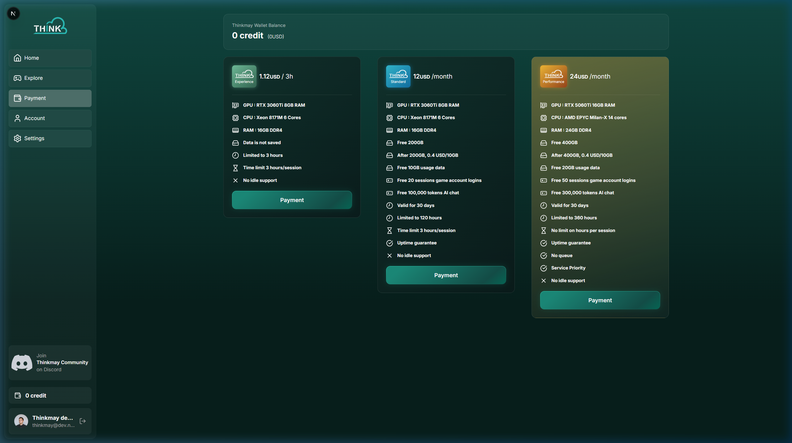
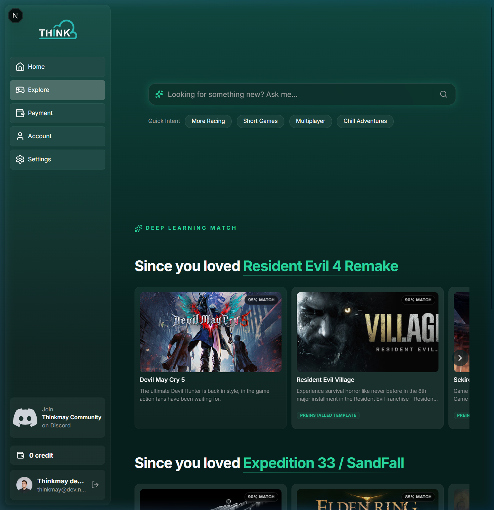
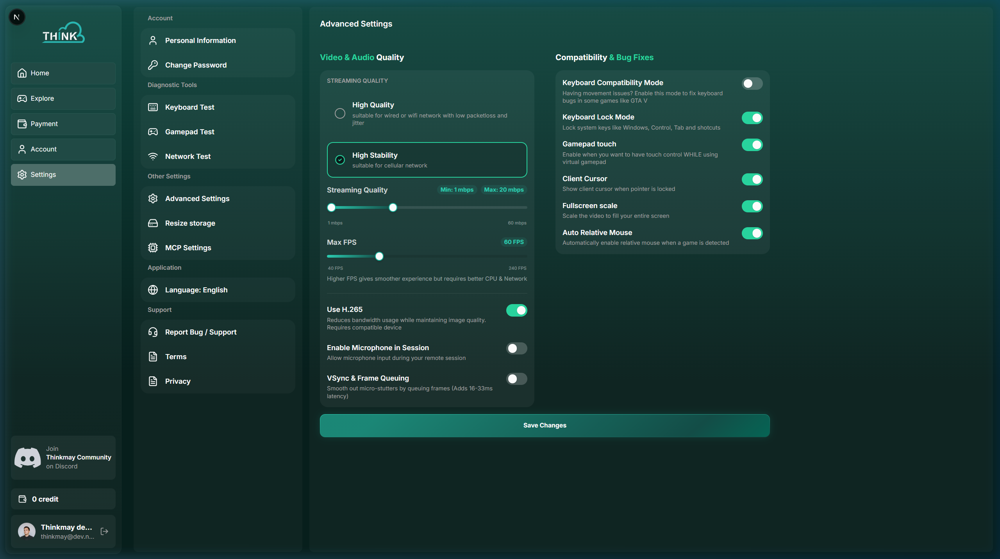
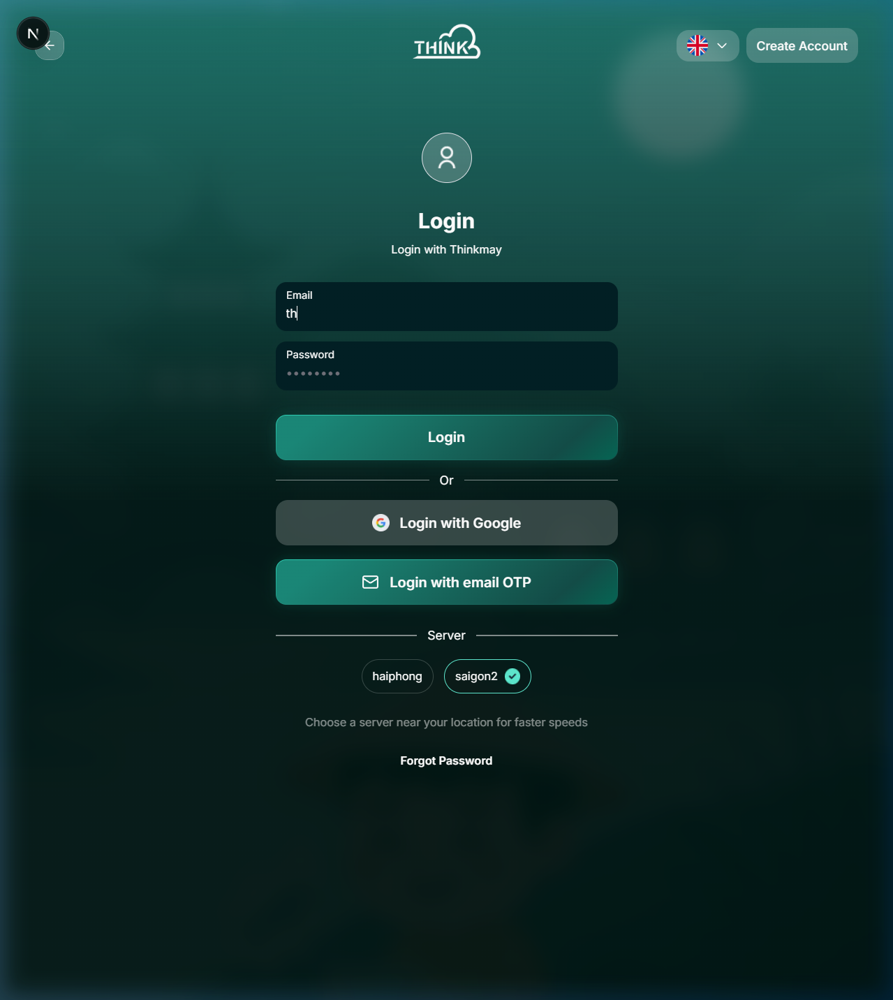

# Getting Started with Thinkmay CloudPC

## Welcome to Thinkmay CloudPC!

Thinkmay CloudPC transforms your ordinary device into a powerhouse Windows 11 workstation. Built heavily for Gamers and 3D Designers, your CloudPC is ready to handle intense workloads and stream at up to 4K resolution at 240fps!

## Accessing Your CloudPC

No downloads required!

1. Log in using your Google Account, Email & Password, or an Email OTP.
2. **Browsers**: We officially support Chrome and Safari.
3. **Mobile Users**: For an app-like experience, open the website on your phone and tap "Add to Home Screen".

## Step-by-Step Platform Guide

### 1. Pay and Subscribe for a Plan
You do not purchase subscriptions directly via credit card. Instead, your account operates on a "Wallet" system.

1. Navigate to the **Payment** page from the sidebar (shown above).
2. Your current **Wallet Balance** is displayed prominently at the top.
3. Choose your preferred Gateway (Stripe, PayOS, Dana, or OVO) to top up "System Credits".
4. Once your Wallet balance updates, select your desired subscription tier. Your credits will be deducted automatically!

### 2. Install a Game from Pre-installed Templates
You can completely skip huge download times using Thinkmay's internal Game Templates!

1. Click **Explore** in the sidebar to open the App Store (shown above).
2. Use the **AI search bar** or browse the **Quick Intent** tags (Racing, Multiplayer, etc.) to find your game.
3. Look for titles marked with the **"Preinstalled Template"** badge — these are ready for instant play!
4. Click the game card and select **"Set up your PC"**. The system will hot-swap your cloud storage with the pre-downloaded template (a loading bar tracks progress). Once it hits 100%, boot your CloudPC and play!

### 3. Change Video Stream Settings
If your stream is lagging, blurry, or you wish to unlock maximum 120FPS performance, you can tweak the WebRTC engine:

1. Click **Settings** → **Advanced Settings** in the sidebar (shown above).
2. Under **Streaming Quality**, choose **High Quality** (for fast Wi-Fi) or **High Stability** (for cellular/unstable networks).
3. Drag the **Streaming Quality** slider to set your Min/Max Bitrate (1–60 mbps). Higher = sharper visuals, lower = more stable.
4. Adjust the **Max FPS** slider (40–240 FPS) based on your monitor's refresh rate.
5. Toggle **Use H.265** ON for better image quality at lower bandwidth, or OFF if your device overheats.
6. Toggle **VSync & Frame Queuing** ON if you see screen tearing (adds 16–33ms latency).

### 4. Renew Your Plan
Remember, user data on Paid Persistent plans is strictly wiped 2 days after plan expiration!
1. Keep an eye on your **Profile Dashboard** which displays your remaining days prominently.
2. Ensure your Wallet has enough System Credits by topping up via the **Payment** tab.
3. Once financially funded, click **Renew Plan** to instantly extend your hardware time and safely lock your data array.

### 5. Open and Connect to Your CloudPC

1. Open your browser and navigate to the Thinkmay website. Log in using your **Email & Password**, **Google**, or **Email OTP** (shown above). Select the server nearest to you (**haiphong** or **saigon2**).
2. Once logged in, click **Home** in the sidebar to reach the Play dashboard.
3. Your CloudPC machine card will display its name, storage size, and status. Click **Power On** to boot it.
4. Wait 2–5 minutes for the machine to initialize (Premium Performance users skip the queue!).
5. Once ready, click **Connect** — the full-screen video stream canvas will appear with your mouse, keyboard, and touch inputs actively linked to the remote Windows 11 hardware.

## Subscription Details & Hardware Privileges

* **Free Hourly Trial (`hour1`)**: Perfect for testing! You receive 3 total hours of ephemeral access powered by a 6-Core Xeon CPU, 16GB of DDR4 RAM, and an NVIDIA RTX 3060Ti (8GB RAM). 
  * *AFK Warning*: This plan enforces a strict 30-minute inactivity timeout. Upon completion or disconnect, your storage drive is completely wiped!
* **Standard Monthly (`month1`)**: Extremely solid performance offering 120 hours per month! You receive a dedicated 200GB Persistent SSD ensuring your games survive securely between sessions. This tier runs natively on a 6-Core Xeon and RTX 3060Ti.
* **Premium Performance (`month2`)**: Our flagship workstation upgrade granting a massive 360 hours of total playtime! Powered by a massive 14-Core AMD EPYC Milan-X CPU, an elite RTX 5060Ti (16GB RAM), 24GB of DDR4 RAM, and an enormous 400GB persistent Disk allowance! 
  * **VIP Queue Priority**: Your startup commands uniquely bypass the generalized cluster routers entirely. Using `pref_nodes`, your machine routes to private priority hardware queues drastically multiplying your startup times during peak volume hours!

*Note: For all paid persistent plans, if your subscription runs out, please renew quickly—we permanently clear your localized data 2 days after expiration!*

### Where do I install my games? And what is the D: Drive?
**CRITICAL WARNING:** Your session includes multiple hard drives. You may freely install games, software, and documents anywhere on your primary **User Volume (usually `C:` Drive)**, as it is dynamically mapped to your personal CloudPC. 

However, you will notice a **`D:` folder**! You must **NEVER** modify, delete, or touch anything inside the `D:` drive. This is not user storage! It is an explicit mounting mechanism mapping background Thinkmay Executables (binaries used for auto-updates and system streaming orchestration). Altering the `D:` drive will critically corrupt your session connection!

## Frequently Asked Questions

* **Why did my "Reset CloudPC" button fail with a Lock Error?**
Your CloudPC utilizes an invisible native Operating System lock layer to aggressively protect your personal files! If you attempt to mash the Reset hardware buttons while your gaming session is currently active or still shutting down in the background, the servers actively reject and block that overriding command to rigidly prevent your games from magically corrupting. Simply wait around 3 to 5 minutes for the data-center machines to turn off fully, letting the lock expire, before resetting safely!
* **Do I have to wait to download games from Steam?** No! The Thinkmay storefront uses a powerful `Volume Templating` engine utilizing our local datacenter storage arrays. When you select massive AAA games directly from our internal App Store, the system instantly hot-swaps your cloud network drive to a hyper-specialized pre-downloaded game template bypassing typical Steam download wait times flawlessly!
* **Can I play high-end games?** Yes! Our machines utilize RTX GPUs capable of 4K/240FPS limits if your local monitor and network support it!
* **Will I get banned by anti-cheats for playing on a CloudPC?** No! We execute specialized hardware spoofing that makes your CloudPC natively appear as a physical rack server from Gigabyte, effectively hiding the virtualization environment. You can safely play games with strict hypervisor anti-cheats (like Vanguard) without getting hardware banned.
* **Does it work on mobile?** Yes! You can use your mobile browser to connect. Furthermore, we feature complete "Virtual Mobile Gamepad" overlays allowing you to customize touchscreen controllers on-the-fly.
* **How long does it take for my PC to be ready?** Normally 2-5 minutes, depending on the queue size and GPU recovery mechanics.

## Security & Privacy (Who can see my CloudPC?)

Your data is exclusively yours! Our backend servers orchestrate CloudPCs using strict **zero-trust authentication architecture**.

* **Complete Isolation**: When you start your CloudPC, our server maps the request exclusively against your securely signed database ID. It is structurally impossible for another user to view, access, hijack, or boot up your CloudPC machine!
* **Anti-Hijacking Links**: The streaming handshakes built between our backbone servers and your browser expire intelligently. Network traffic is sealed tight, actively repelling third parties from piggybacking onto your hardware sessions.
* **Isolated "VPN Safe" Networks**: The network powering your display stream is structurally isolated from your CloudPC's internal internet connection! This ultra-secure architecture means you can install corporate VPNs, tweak Windows Firewall settings, or do deep networking work without *ever* having to worry about locking yourself out of your machine or losing your display stream.

**My connection feels laggy. What can I do?**
We offer a unique "Multi-Routing" feature. Even if your server is in HCM, you can manually select a different data route (like HP) in the settings. This lets your connection hop on our fast internal network, bypassing potential local internet bottlenecks!

**Can I transfer files to the CloudPC?**
While you cannot drag-and-drop files directly into the browser window, your text clipboard is synchronized! You can freely copy text on your local machine and paste it into the CloudPC, and vice versa.

**Does my gamepad or microphone work?**
Yes! You can plug in a microphone or gamepad. We don't perform cheap keyboard replacements either. Your controller connects via a deeply emulated virtual Xbox 360 controller straight into your CloudPC, granting you full support for analog triggers, thumbsticks, and Force-Feedback (Rumble) vibrations natively! If you are gaming on a mobile phone, we even provide a built-in virtual on-screen gamepad. *Note that we currently support a single monitor setup per CloudPC.*

**How do mouse and touch controls translate over the cloud?**
Seamlessly! Your CloudPC uses highly optimized hardware integration schemas to ensure everything works flawlessly:
* **FPS & 3D Gaming**: The moment you lock your mouse into a 3D game natively (like Minecraft or Valorant), the system automatically flips into **Relative Pointer Lock** directly streaming raw movement deltas into the OS—meaning you won't get stuck hitting the edges of your browser!
* **Lag-Free Cursors**: Instead of sending your clicks and waiting for a picture to come back, our engines capture the remote Windows mouse icon and display it completely locally on top of your browser! The cursor is synced and smoothed natively, dropping UI latency dramatically.
* **Mobile Touch vs Trackpad**: You have options! You can configure your phone screen to act as a **Native Windows Touchscreen** where your finger presses correlate identically over the cloud OS. Alternatively, you can use the screenspace like a generic **Laptop Trackpad**, swinging the mouse pointer around and tapping the edges for Left/Right clicks.

## Need Help?

Our servers are located in Ho Chi Minh City (HCM) and Hai Phong (HP).
If you run into any issues, our support team is ready to help via **Email** or on our official **Discord** server!

## Streaming Optimization & Troubleshooting

Thinkmay CloudPC utilizes advanced streaming features like Google Congestion Control (GCC) and Forward Error Correction (FlexFEC) to dynamically handle network fluctuations. However, you might still run into performance issues due to device limitations or unstable Wi-Fi.

We provide a **"Show stats"** setting that allows you to see real-time streaming metrics. Here is exactly what those numbers mean on your display:
* **Route**: The specific regional server node your connection is hitting.
* **Decoder**: The hardware decoding engine your browser is natively leveraging (e.g. H264).
* **FPS**: Actual Frames Per Second rendering smoothly on your monitor.
* **Ping**: Your one-way latency to our servers in milliseconds. Lower (under 40ms) is better!
* **Buf/Dec/Proc**: Measures how many milliseconds your browser spends Buffering, Decoding, and Processing video frames natively. If these numbers spike heavily, your local PC/Laptop CPU is struggling to draw the stream frame!
* **Bitrate**: The current data bandwidth consumed (e.g. `10.5mbps`). Huge bitrates look extremely beautiful but require heavily stable Wi-fi!
* **PL/IDR**: Packet Loss and IDR frames. If Packet Loss is high, your Local Router connection is dropping data! IDR spikes occur when the stream is forced to "hard refresh" the entire screen due to extreme network instability.
* **Jt/Avg (Jitter)**: Network Jitter measures exactly how inconsistently internet packets arrive. Massive jitter spikes cause heavily noticeable visual stuttering.
* **Freeze/Drop**: How many times the video completely froze, or frames had to be rigidly discarded because they arrived over the network too late.

Here is a quick diagnostic guide linking these metrics to common symptoms:

| Symptom                                               | Metric to Look At                                                          | How to Solve It                                                                                                                                                                                                                                                                                                                         |
| :---------------------------------------------------- | :------------------------------------------------------------------------- | :-------------------------------------------------------------------------------------------------------------------------------------------------------------------------------------------------------------------------------------------------------------------------------------------------------------------------------------- |
| **Blurry/pixelated stream**                     | **`packetloss`**, **`realbitrate`**, **`realfps`** | Your network is struggling, so the server adaptively lowered the video quality (GCC). Try lowering the `max_bitrate` limit in your settings. If using Wi-Fi, ensure you are on a 5GHz band or switch to a wired Ethernet connection.                                                                                                  |
| **Video freezing for a few seconds frequently** | **`idrcount`**, **`realfreezecount`**                      | When packets are excessively lost, the server sends an "IDR" frame to reset the video, causing a freeze. Disable the "HQ" mode to lower the framerate (back to 60fps) or change your Data Route in settings.                                                                                                                            |
| **High input latency / Delay**                  | **`realdelay`**, **`realdecodetime`**                      | If `realdelay` is high, switch your data route to avoid ISP bottlenecks. If `realdecodetime` is high, your device is struggling to decode the video. Try switching your `preferred_codec` from H.265 to H.264 (or vice-versa), and check the `realdecodername` metric to ensure your browser has Hardware Acceleration enabled. |

### Guide to Advanced Video Settings
Inside your **Settings Panel**, you will find several advanced toggles that drastically alter your gaming or browsing visual quality:
* **Quality Setup ("High Quality" vs "High Stability")**: Turn on **High Quality** if you have great internet and an amazing monitor (this tells the hardware to unlock up to 120FPS to make everything buttery smooth). Use **High Stability** if you are playing on unstable 4G/LTE or spotty Wi-fi; it hard-caps your framerate to 60FPS to conserve bandwidth.
* **Max & Min Bitrates**: Turn the caps higher (e.g. 50+ mbps) when you are playing intense colorful video games with rapid visual motion. Turn them lower (< 15mbps) if you are getting "pixelated smudges" due to your router being choked with too much data.
* **Use H.265 (HEVC)**: Turn this ON if you want the most beautiful image possible at half the internet bandwidth cost. However, turn this OFF (use H.264 instead) if you are playing on an older smartphone, an older Macbook, or a weak Chromebook without dedicated hardware decoders (otherwise your device will overheat quickly!).
* **VSync Mode**: Turn this ON if you notice horizontal "tearing" or slashing across the display when moving the camera quickly. Note that VSync will add a slight few milliseconds of input latency waiting for the frames to align.
